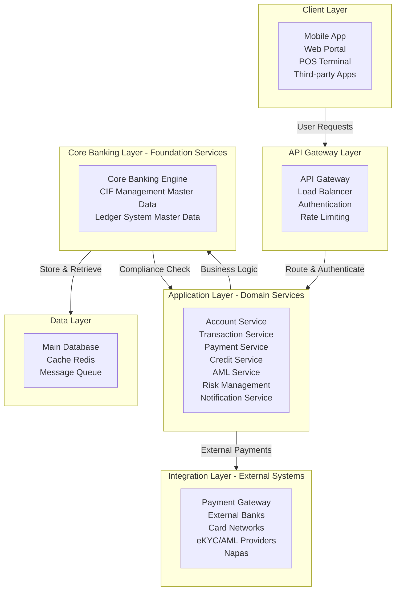
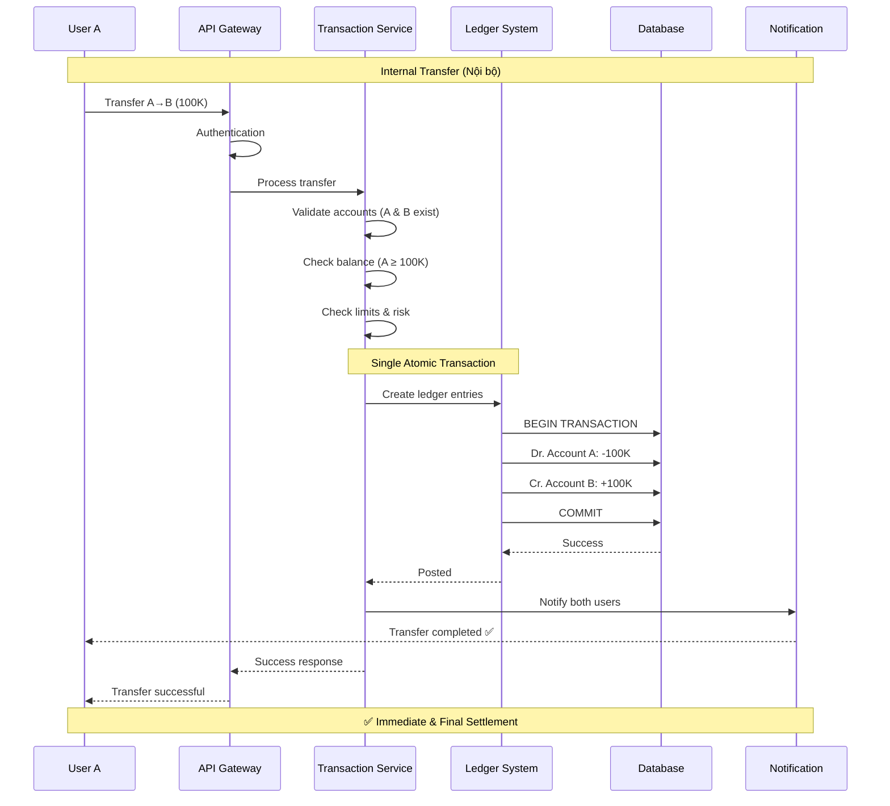
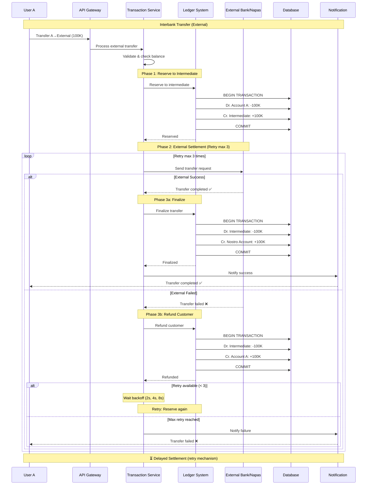
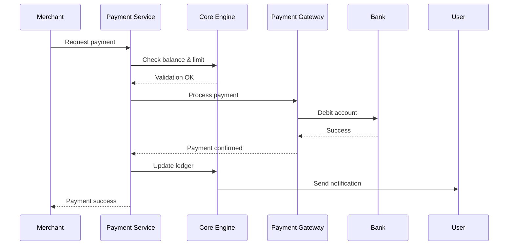
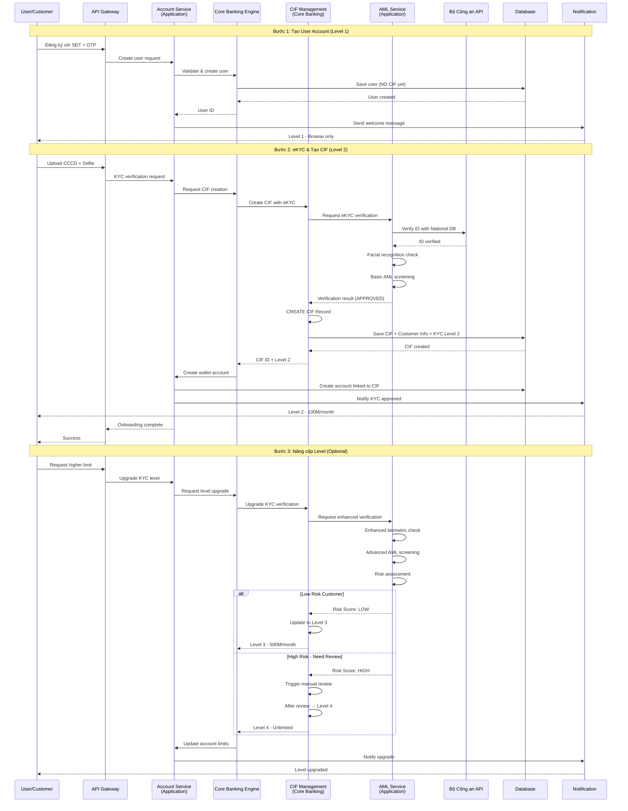
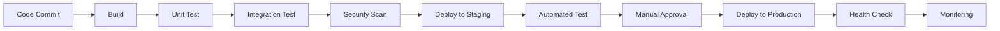

# II. Kiến trúc hệ thống Core Banking SDK.Finance

## Tổng quan kiến trúc

SDK.Finance là giải pháp core banking được xây dựng theo kiến trúc microservices, cho phép mở rộng linh hoạt và tích hợp dễ dàng với các hệ thống bên ngoài. Hệ thống được thiết kế để đáp ứng các yêu cầu về:

- **Hiệu năng cao**: Xử lý hàng nghìn giao dịch đồng thời
- **Tính sẵn sàng**: Uptime 99.9%
- **Bảo mật**: Tuân thủ các tiêu chuẩn bảo mật tài chính quốc tế
- **Khả năng mở rộng**: Scale horizontal và vertical

## Kiến trúc tổng thể



## Các lớp kiến trúc chính

### 1. Client Layer (Lớp ứng dụng khách hàng)

Lớp này bao gồm các ứng dụng và kênh tương tác với người dùng cuối:

- **Mobile App**: Ứng dụng di động cho iOS/Android
- **Web Portal**: Cổng quản trị web
- **POS Terminal**: Thiết bị thanh toán tại điểm bán
- **Third-party Integration**: Tích hợp với các hệ thống bên thứ ba

### 2. API Gateway

- **Chức năng**: Điểm vào duy nhất cho tất cả các request
- **Nhiệm vụ**:
  - Authentication & Authorization
  - Rate limiting
  - Load balancing
  - Request routing
  - API versioning
  - Logging & monitoring

### 3. Application Layer (Lớp ứng dụng - Domain Services)

**Đặc điểm:** Layer này bao gồm các microservices xử lý các use case nghiệp vụ cụ thể. Các services này **CONSUME** dữ liệu từ Core Banking Layer và không sở hữu master data.

#### Account Service (Dịch vụ tài khoản)
- Tạo, cập nhật, đóng tài khoản
- Phân loại tài khoản (retail, business, VIP)
- Quản lý hạn mức giao dịch
- **Phụ thuộc**: CIF Management (lấy thông tin khách hàng)

#### Transaction Service (Dịch vụ giao dịch)
- Xử lý giao dịch chuyển tiền
- Lịch sử giao dịch
- Reconciliation (đối soát)
- Transaction monitoring
- **Phụ thuộc**: CIF Management (verify customer), Ledger System

#### Payment Service (Dịch vụ thanh toán)
- Tích hợp payment gateway
- Xử lý thanh toán QR code
- Thanh toán hóa đơn
- Nạp/rút tiền
- **Phụ thuộc**: CIF Management (check KYC level), Ledger System

#### Credit Service (Dịch vụ tín dụng)
- Quản lý hạn mức tín dụng
- Credit scoring
- Quản lý khoản vay
- Tính lãi và phí
- **Phụ thuộc**: CIF Management (credit profile, risk rating)

#### AML Service (Dịch vụ Anti-Money Laundering)

**Vai trò:** Service chuyên biệt cho AML/KYC screening và compliance checking

**Chức năng chính:**
- **eKYC Verification**: Xác thực danh tính với Bộ Công an
  - CCCD/Passport verification
  - Facial recognition validation
  - National ID database lookup
- **AML Screening**: Kiểm tra chống rửa tiền
  - Sanction list screening (UN, EU, US sanctions)
  - PEP (Politically Exposed Persons) checking
  - Watchlist monitoring
  - Adverse media screening
- **Risk Assessment**: Đánh giá rủi ro khách hàng
  - Transaction pattern analysis
  - Geographic risk scoring
  - Occupation-based risk
  - Source of funds verification
- **Ongoing Monitoring**: Giám sát liên tục
  - Periodic re-screening
  - Alert generation for suspicious activities
  - Regulatory reporting
- **Compliance Reporting**: Báo cáo tuân thủ
  - STR (Suspicious Transaction Report)
  - CTR (Currency Transaction Report)
  - Audit trail for regulators

**Integration:**
- **Upstream**: Được gọi bởi CIF Management, Risk Management
- **Downstream**: Kết nối với Bộ Công an API, AML screening providers
- **Phụ thuộc**: Core Banking Engine, CIF Management

**Tại sao AML Service ở Application Layer?**
1. ✅ Xử lý business logic cụ thể (AML screening workflows)
2. ✅ Integration-heavy service (nhiều external APIs)
3. ✅ Domain-specific rules và regulations
4. ✅ Có thể scale độc lập theo nhu cầu screening
5. ✅ Dễ dàng update khi quy định thay đổi

#### Risk Management (Quản lý rủi ro)

**Vai trò:** Service chuyên biệt cho risk assessment, fraud detection và monitoring

**Chức năng chính:**
- **Fraud Detection**: Phát hiện gian lận
  - Transaction pattern analysis
  - Anomaly detection
  - Behavioral analysis
  - Device fingerprinting
- **Transaction Risk Scoring**: Đánh giá rủi ro giao dịch
  - Real-time risk calculation
  - Rule-based scoring
  - ML-based risk models
  - Velocity checks
- **Limit Control & Monitoring**: Kiểm soát hạn mức
  - Transaction limits (daily, monthly)
  - Velocity limits
  - Geographic restrictions
  - Merchant category restrictions
- **Suspicious Activity Monitoring**: Giám sát hoạt động đáng ngờ
  - Alert generation
  - Case management
  - Investigation workflow
  - Regulatory reporting
- **AML/CFT Compliance**: Tuân thủ chống rửa tiền
  - Transaction monitoring rules
  - Threshold monitoring
  - Pattern detection
  - CTR/STR reporting

**Integration:**
- **Upstream**: Được gọi bởi Transaction Service, Payment Service, Credit Service
- **Downstream**: Gọi CIF Management (customer data), AML Service (screening)
- **Phụ thuộc**: Core Banking Engine, CIF Management, AML Service

**Tại sao Risk Management ở Application Layer?**
1. ✅ Business logic & rule-based processing
2. ✅ Frequently changing rules and thresholds
3. ✅ Integration-heavy (nhiều data sources)
4. ✅ Có thể scale độc lập khi transaction volume tăng
5. ✅ Separate concern từ master data management

#### Notification Service (Dịch vụ thông báo)
- Push notification
- SMS/Email
- In-app notification
- Transaction alerts

### 4. Core Banking Layer (Lớp xử lý nghiệp vụ core - Foundation Services)

**Đặc điểm:** Đây là trái tim của hệ thống, quản lý **MASTER DATA** và cung cấp foundation services cho tất cả Application Layer services. Layer này đảm bảo data consistency, business rules enforcement, và compliance.

#### CIF Management (Customer Information File - Master Data)

**📌 Vị trí:** Core Banking Layer (theo industry best practice: Temenos T24, Oracle FLEXCUBE, Finacle)

**Vai trò:** Single Source of Truth về thông tin khách hàng

**Chức năng chính:**

**Master Data Management:**
- **Customer CRUD**: Tạo, đọc, cập nhật, xóa thông tin khách hàng
- **Customer Profile**: Quản lý hồ sơ khách hàng toàn diện
- **Relationship Hierarchy**: Quản lý quan hệ khách hàng (cá nhân, doanh nghiệp, beneficial owners)
- **Document Repository**: Lưu trữ và quản lý giấy tờ khách hàng

**KYC/KYB & Compliance:**
- **Customer Onboarding**: Tiếp nhận và xác minh khách hàng mới
- **KYC Level Management**: Quản lý cấp độ xác thực (5 cấp độ theo TT 40/2024/TT-NHNN)
  - Level 1: User Account (không CIF)
  - Level 2: eKYC cơ bản (tạo CIF, 100M/tháng)
  - Level 3: eKYC nâng cao (500M/tháng)
  - Level 4: Xác thực đầy đủ (không giới hạn)
  - Level 5: Enhanced Merchant (NPP, NBL)
- **Compliance Orchestration**: Điều phối các quy trình compliance
  - Gọi AML Service để screening
  - Lưu trữ kết quả verification
  - Quản lý compliance status
- **Periodic Review**: Xem xét định kỳ theo quy định
- **Risk Rating Storage**: Lưu trữ xếp hạng rủi ro từ AML Service

**Lifecycle Management:**
- **Active/Dormant**: Quản lý trạng thái hoạt động
- **Reactivation**: Kích hoạt lại khách hàng
- **Closure**: Đóng hồ sơ khách hàng
- **Data Retention**: Lưu trữ theo quy định pháp luật

**Customer 360° View:**
- **Aggregated Data**: Tổng hợp dữ liệu từ tất cả sources
- **Transaction History**: Lịch sử giao dịch
- **Product Holdings**: Sản phẩm đang sử dụng
- **Relationships**: Mối quan hệ với khách hàng khác

**Tại sao CIF ở Core Banking Layer?**
1. ✅ CIF là Master Data (giống Ledger System)
2. ✅ Tất cả Application Services phụ thuộc vào CIF
3. ✅ Single Source of Truth cần centralized control
4. ✅ Compliance & Security cần tập trung quản lý
5. ✅ Industry best practice (T24, FLEXCUBE, Finacle)

#### Core Banking Engine
- Xử lý logic nghiệp vụ cốt lõi
- Quản lý workflow
- Business rule engine
- Event sourcing
- Orchestration giữa CIF và Ledger
- Cung cấp APIs cho Application Services

#### Ledger System (Hệ thống sổ cái - Master Data)
- Double-entry bookkeeping
- Real-time balance calculation
- GL (General Ledger) management
- Account statement generation
- **Master Data**: Chart of Accounts (COA)
- Transaction posting và reconciliation

### 5. Data Layer (Lớp dữ liệu)

#### Main Database
- **Technology**: PostgreSQL (primary), với khả năng replicate
- **Chức năng**: Lưu trữ dữ liệu chính
- **Features**:
  - Master-slave replication
  - Automatic failover
  - Point-in-time recovery
  - Encryption at rest

#### Cache Layer
- **Technology**: Redis Cluster
- **Chức năng**: 
  - Cache dữ liệu thường xuyên truy cập
  - Session management
  - Rate limiting counters
  - Real-time balance caching

#### Message Queue
- **Technology**: RabbitMQ / Apache Kafka
- **Chức năng**:
  - Asynchronous communication giữa các services
  - Event streaming
  - Transaction log
  - Retry mechanism

### 6. Integration Layer (Lớp tích hợp)

Kết nối với các hệ thống bên ngoài:

- **Payment Gateway**: Napas, Visa, Mastercard
- **External Banks**: Ngân hàng đối tác
- **Card Networks**: Mạng lưới thẻ
- **Government Systems**: 
  - **Bộ Công an API**: eKYC verification, national ID database
  - **AML/Sanctions Lists**: Sanction screening, PEP lists, watchlists
  - **Credit Bureaus**: Credit history (nếu cần)

## Luồng dữ liệu chính

### Luồng chuyển tiền (Money Transfer)

#### 3.1. Chuyển tiền Nội bộ (Internal Transfer)

**Áp dụng cho:** Chuyển tiền giữa các tài khoản trong cùng hệ thống ví/ngân hàng



#### 3.2. Chuyển tiền Liên ngân hàng (Interbank Transfer)

**Áp dụng cho:** Chuyển tiền ra ngoài hệ thống (External Wallet/Bank, Napas)



### Luồng thanh toán (Payment)



### Luồng Onboarding Khách hàng (Customer Onboarding với CIF)

**📌 Lưu ý:** 
- CIF Management nằm ở **Core Banking Layer** (quản lý master data)
- AML Service nằm ở **Application Layer** (xử lý screening logic và kết nối external APIs)



**Giải thích Call Flow:**

```
User Request
  ↓
API Gateway (Authentication/Authorization)
  ↓
Account Service (Application Layer)
  ↓
Core Banking Engine                    
  ↓
CIF Management (Core Banking Layer) ───┐
  │                                     │
  │ Calls AML Service for screening    │
  └──────────────────────────────►      │
                                        ▼
            AML Service (Application Layer) ◄── Integration-heavy
                        │
                        └──────► Bộ Công an API
                                 (External Integration)

✅ CORRECT Architecture:
  - CIF Management: Master Data at Core Banking Layer
  - AML Service: Business Logic & Integration at Application Layer
  - Separation of Concerns: Data management vs Screening logic
  - CIF calls AML for verification, stores results
  - AML handles all external API integrations
```

## Bảo mật

### Authentication & Authorization

- **Multi-factor Authentication (MFA)**
- **JWT Token** với expiration time ngắn
- **OAuth 2.0** cho third-party integration
- **Role-Based Access Control (RBAC)**

### Data Security

- **Encryption in transit**: TLS 1.3
- **Encryption at rest**: AES-256
- **PCI-DSS compliance** cho dữ liệu thẻ
- **Data masking** cho PII (Personal Identifiable Information)
- **CIF Data Protection** (theo TT 40/2024 & Luật An ninh mạng):
  - Mã hóa dữ liệu khách hàng nhạy cảm (CCCD, Passport, sinh trắc học)
  - Phân quyền truy cập CIF theo role (RBAC)
  - Audit trail cho mọi truy cập/thay đổi CIF
  - Data retention policy (lưu trữ tối thiểu theo quy định pháp luật)
  - Right to be forgotten (quyền xóa dữ liệu cá nhân)
  - GDPR/PDPA compliance cho dữ liệu cá nhân
- **KYC Document Security**:
  - Encrypted storage cho ảnh CCCD, selfie, documents
  - Watermarking cho documents
  - Access logging và monitoring
  - Automatic expiration cho documents hết hạn

### Network Security

- **Firewall** và network segmentation
- **DDoS protection**
- **API rate limiting**
- **IP whitelisting** cho các kết nối nhạy cảm

## Monitoring & Logging

### Logging

- **Centralized logging**: ELK Stack (Elasticsearch, Logstash, Kibana)
- **Structured logging** với JSON format
- **Log levels**: ERROR, WARN, INFO, DEBUG
- **Audit trail** cho tất cả giao dịch

### Monitoring

- **Application monitoring**: New Relic / Datadog
- **Infrastructure monitoring**: Prometheus + Grafana
- **Real-time alerting**: PagerDuty
- **Health checks**: Endpoint monitoring mỗi 30s

### Metrics quan trọng

- Transaction Per Second (TPS)
- API Response Time
- Error Rate
- Database Connection Pool
- Cache Hit Ratio
- Queue Length

## Disaster Recovery & High Availability

### Backup Strategy

- **Full backup**: Daily
- **Incremental backup**: Hourly
- **Transaction log backup**: Real-time
- **Backup retention**: 90 days
- **Off-site backup**: Geo-redundant storage

### High Availability

- **Multi-zone deployment**: Triển khai trên nhiều availability zones
- **Auto-scaling**: Scale based on CPU/Memory/Request count
- **Circuit breaker**: Ngăn cascade failure
- **Graceful degradation**: Hệ thống vẫn hoạt động với chức năng giảm khi có sự cố

### Disaster Recovery

- **RTO (Recovery Time Objective)**: < 1 hour
- **RPO (Recovery Point Objective)**: < 5 minutes
- **Regular DR drills**: Quarterly
- **Failover automation**: Automated failover process

## Scalability

### Horizontal Scaling

- **Stateless services**: Dễ dàng scale out
- **Load balancing**: Round-robin, least connection
- **Auto-scaling groups**: Based on metrics

### Vertical Scaling

- **Database scaling**: Read replicas
- **Cache scaling**: Redis cluster with sharding
- **Resource optimization**: Regular performance tuning

### Performance Optimization

- **Database indexing**: Optimize query performance
- **Query optimization**: Slow query analysis
- **Connection pooling**: Reuse database connections
- **Caching strategy**: Cache frequently accessed data
- **CDN**: Static content delivery

## Deployment Architecture

### Environment

- **Development**: Môi trường phát triển
- **Staging**: Môi trường test
- **UAT**: User Acceptance Testing
- **Production**: Môi trường production

### CI/CD Pipeline



### Deployment Strategy

- **Blue-Green Deployment**: Zero downtime deployment
- **Canary Release**: Gradual rollout để giảm rủi ro
- **Rollback capability**: Khả năng rollback nhanh chóng khi có vấn đề

## Tích hợp với hệ thống Masan

### Integration Points

1. **Wallet Application**: Ứng dụng ví điện tử Masan
2. **Retail System**: Hệ thống bán lẻ (NBL)
3. **DMS**: Distribution Management System (NPP)
4. **CRM**: Customer Relationship Management
   - Đồng bộ thông tin khách hàng từ CIF
   - Customer 360° view
   - Marketing campaigns based on segmentation
5. **Payment Gateway**: Cổng thanh toán Masan
6. **National Database API**: 
   - Bộ Công an (eKYC verification)
   - Sanction lists, PEP lists
   - AML screening services
7. **WinLife System**: 
   - Tích hợp dữ liệu thành viên WinLife
   - Loyalty points và benefits
   - Customer lifecycle events

### API Integration

- **RESTful API**: Standard HTTP/HTTPS
- **Webhook**: Real-time notification
- **Batch Processing**: End-of-day settlement
- **Data Synchronization**: Master data sync

## Kết luận

Kiến trúc SDK.Finance được thiết kế theo nguyên tắc **Layered Architecture** với sự phân tách rõ ràng giữa các tầng:

### Nguyên tắc Kiến trúc

**1. Application Layer (Domain Services)**
- ✅ Xử lý use cases nghiệp vụ cụ thể
- ✅ CONSUME data từ Core Banking Layer
- ✅ Stateless và dễ scale
- ✅ Không sở hữu master data
- ✅ **AML Service**: Chuyên biệt cho screening & external integration
  - Kết nối Bộ Công an API (eKYC)
  - AML/sanction screening
  - Customer risk assessment
  - Compliance reporting
- ✅ **Risk Management**: Chuyên biệt cho fraud detection & monitoring
  - Transaction risk scoring
  - Fraud detection
  - Limit control & monitoring
  - Suspicious activity monitoring

**2. Core Banking Layer (Foundation Services & Master Data)**
- ✅ Quản lý Master Data (CIF, Ledger/COA)
- ✅ PROVIDE foundation services cho Application Layer
- ✅ Single Source of Truth
- ✅ Centralized compliance & security control

**3. CIF Management - Architectural Decision**
- 🏆 **CIF được đặt ở Core Banking Layer** (không phải Application Layer)
- 📌 **Lý do**:
  1. CIF là Master Data (giống Ledger System)
  2. Tất cả Application Services phụ thuộc vào CIF
  3. Industry best practice (Temenos T24, Oracle FLEXCUBE, Finacle)
  4. Compliance & Security cần centralized control
  5. Loại bỏ circular dependencies
- 🔄 **Interaction với AML Service**:
  - CIF Management orchestrates compliance workflow
  - Gọi AML Service để thực hiện verification & screening
  - Lưu trữ kết quả verification vào master data
  - AML Service xử lý integration với external APIs
- 📄 **Chi tiết phân tích**: `reference-docs/cif-architecture-analysis.md`

### Lợi ích Kiến trúc

- ✅ **Proper Layered Architecture**: Dependencies flow downward (App → Core)
- ✅ **No Circular Dependencies**: Application services không phụ thuộc lẫn nhau
- ✅ **Single Source of Truth**: CIF và Ledger là authoritative sources
- ✅ **Separation of Concerns**: 
  - CIF Management (Core): Master data & orchestration
  - AML Service (App): Screening logic & external integration
  - Clear responsibility boundaries
- ✅ **Hiệu năng cao**: Xử lý hàng nghìn giao dịch đồng thời
- ✅ **Tính sẵn sàng**: Uptime 99.9%
- ✅ **Bảo mật**: Tuân thủ các tiêu chuẩn bảo mật tài chính quốc tế
- ✅ **Khả năng mở rộng**: 
  - Scale horizontal và vertical
  - AML Service có thể scale độc lập khi nhu cầu screening tăng
- ✅ **Dễ dàng bảo trì**: 
  - Clear separation of concerns
  - AML Service dễ update khi quy định thay đổi
- ✅ **Tích hợp linh hoạt**: 
  - Dễ dàng tích hợp với các hệ thống khác
  - AML Service centralize tất cả external compliance APIs
- ✅ **Disaster Recovery & High Availability**: Comprehensive backup and failover

### Regulatory Compliance

- ✅ **CIF Management tuân thủ đầy đủ**:
  - Thông tư 40/2024/TT-NHNN về KYC/AML
  - Nghị định 52/2024/NĐ-CP về thanh toán không dùng tiền mặt
  - Luật An ninh mạng về bảo vệ dữ liệu cá nhân
  - 5 cấp độ KYC linh hoạt phù hợp với nhu cầu business

### Customer-Centric Approach

- ✅ **Customer 360° View**: Góc nhìn toàn diện về khách hàng
- ✅ **Lifecycle Management**: Quản lý vòng đời khách hàng
- ✅ **Seamless Onboarding**: Trải nghiệm onboarding mượt mà
- ✅ **Regulatory Compliance by Design**: Tuân thủ được thiết kế từ đầu

### Tài liệu Tham khảo

- 📄 **Phân tích Kiến trúc CIF**: `reference-docs/cif-architecture-analysis.md` (774 lines)
- 📄 **Quy định KYC/AML**: `reference-docs/regulations-context.md`
- 📄 **Quy định Thanh toán**: `reference-docs/vietnam-payment-regulations.md`

