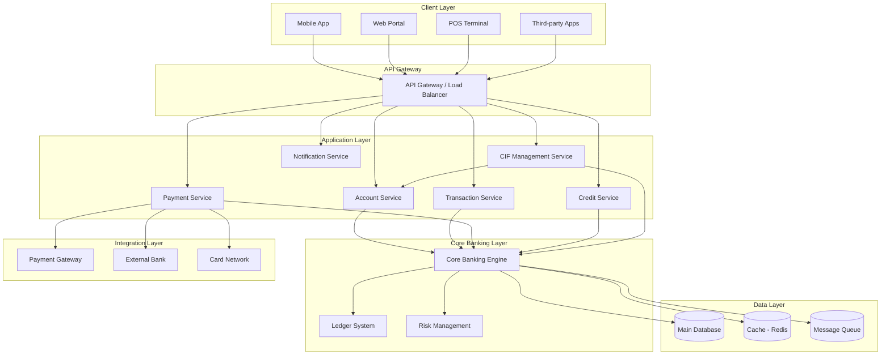
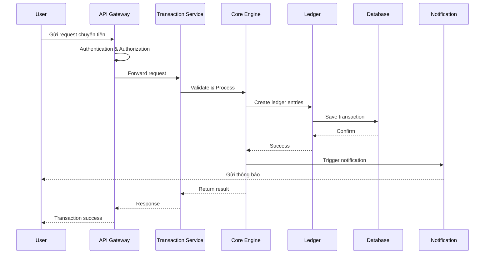
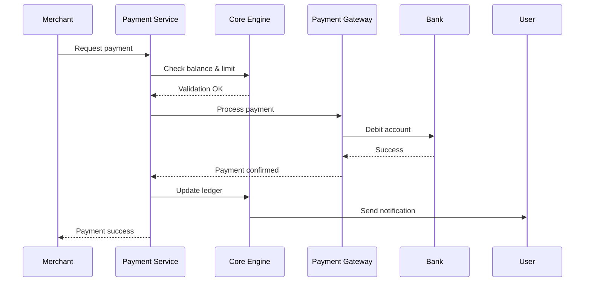
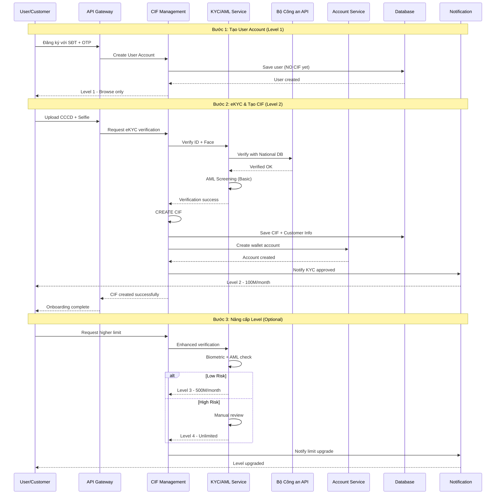
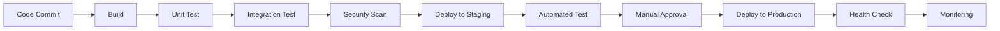

# II. Kiến trúc hệ thống Core Banking SDK.Finance

## Tổng quan kiến trúc

SDK.Finance là giải pháp core banking được xây dựng theo kiến trúc microservices, cho phép mở rộng linh hoạt và tích hợp dễ dàng với các hệ thống bên ngoài. Hệ thống được thiết kế để đáp ứng các yêu cầu về:

- **Hiệu năng cao**: Xử lý hàng nghìn giao dịch đồng thời
- **Tính sẵn sàng**: Uptime 99.9%
- **Bảo mật**: Tuân thủ các tiêu chuẩn bảo mật tài chính quốc tế
- **Khả năng mở rộng**: Scale horizontal và vertical

## Kiến trúc tổng thể

## Các lớp kiến trúc chính

### 1. Client Layer (Lớp ứng dụng khách hàng)

Lớp này bao gồm các ứng dụng và kênh tương tác với người dùng cuối:

- **Mobile App**: Ứng dụng di động cho iOS/Android
- **Web Portal**: Cổng quản trị web
- **POS Terminal**: Thiết bị thanh toán tại điểm bán
- **Third-party Integration**: Tích hợp với các hệ thống bên thứ ba

### 2. API Gateway

- **Chức năng**: Điểm vào duy nhất cho tất cả các request
- **Nhiệm vụ**:
  - Authentication & Authorization
  - Rate limiting
  - Load balancing
  - Request routing
  - API versioning
  - Logging & monitoring

### 3. Application Layer (Lớp ứng dụng)

Bao gồm các microservices độc lập, mỗi service chịu tr책nhiệm một domain cụ thể:

#### Account Service (Dịch vụ tài khoản)
- Tạo, cập nhật, đóng tài khoản
- Quản lý thông tin khách hàng (KYC)
- Phân loại tài khoản (retail, business, VIP)
- Quản lý hạn mức giao dịch

#### Transaction Service (Dịch vụ giao dịch)
- Xử lý giao dịch chuyển tiền
- Lịch sử giao dịch
- Reconciliation (đối soát)
- Transaction monitoring

#### Payment Service (Dịch vụ thanh toán)
- Tích hợp payment gateway
- Xử lý thanh toán QR code
- Thanh toán hóa đơn
- Nạp/rút tiền

#### Credit Service (Dịch vụ tín dụng)
- Quản lý hạn mức tín dụng
- Credit scoring
- Quản lý khoản vay
- Tính lãi và phí

#### CIF Management Service (Dịch vụ quản lý thông tin khách hàng)
- **Customer Onboarding**: Tiếp nhận và xác minh khách hàng mới
- **KYC/KYB Verification**: Xác thực danh tính (5 cấp độ theo TT 40/2024/TT-NHNN)
  - Level 1: User Account (không CIF)
  - Level 2: eKYC cơ bản (tạo CIF, 100M/tháng)
  - Level 3: eKYC nâng cao (500M/tháng)
  - Level 4: Xác thực đầy đủ (không giới hạn)
  - Level 5: Enhanced Merchant (NPP, NBL)
- **Customer Profile Management**: Quản lý hồ sơ khách hàng toàn diện
- **Relationship Management**: Quản lý quan hệ khách hàng (cá nhân, doanh nghiệp)
- **Customer Segmentation**: Phân loại và phân khúc khách hàng
- **Lifecycle Management**: Quản lý vòng đời khách hàng
- **Document Management**: Quản lý tài liệu, giấy tờ khách hàng
- **Customer 360° View**: Góc nhìn toàn diện về khách hàng
- **AML Screening**: Kiểm tra danh sách trừng phạt, PEP, watchlist
- **Compliance Management**: Đảm bảo tuân thủ quy định KYC/AML

#### Notification Service (Dịch vụ thông báo)
- Push notification
- SMS/Email
- In-app notification
- Transaction alerts

### 4. Core Banking Layer (Lớp xử lý nghiệp vụ core)

Đây là trái tim của hệ thống:

#### Core Banking Engine
- Xử lý logic nghiệp vụ cốt lõi
- Quản lý workflow
- Business rule engine
- Event sourcing

#### Ledger System (Hệ thống sổ cái)
- Double-entry bookkeeping
- Real-time balance calculation
- GL (General Ledger) management
- Account statement generation

#### Risk Management (Quản lý rủi ro)
- Fraud detection
- AML (Anti-Money Laundering)
- Transaction limit control
- Suspicious activity monitoring

### 5. Data Layer (Lớp dữ liệu)

#### Main Database
- **Technology**: PostgreSQL (primary), với khả năng replicate
- **Chức năng**: Lưu trữ dữ liệu chính
- **Features**:
  - Master-slave replication
  - Automatic failover
  - Point-in-time recovery
  - Encryption at rest

#### Cache Layer
- **Technology**: Redis Cluster
- **Chức năng**: 
  - Cache dữ liệu thường xuyên truy cập
  - Session management
  - Rate limiting counters
  - Real-time balance caching

#### Message Queue
- **Technology**: RabbitMQ / Apache Kafka
- **Chức năng**:
  - Asynchronous communication giữa các services
  - Event streaming
  - Transaction log
  - Retry mechanism

### 6. Integration Layer (Lớp tích hợp)

Kết nối với các hệ thống bên ngoài:

- **Payment Gateway**: Napas, Visa, Mastercard
- **External Banks**: Ngân hàng đối tác
- **Card Networks**: Mạng lưới thẻ
- **Government Systems**: Kết nối cơ quan nhà nước (nếu cần)

## Luồng dữ liệu chính

### Luồng chuyển tiền (Money Transfer)

### Luồng thanh toán (Payment)

### Luồng Onboarding Khách hàng (Customer Onboarding với CIF)

## Bảo mật

### Authentication & Authorization

- **Multi-factor Authentication (MFA)**
- **JWT Token** với expiration time ngắn
- **OAuth 2.0** cho third-party integration
- **Role-Based Access Control (RBAC)**

### Data Security

- **Encryption in transit**: TLS 1.3
- **Encryption at rest**: AES-256
- **PCI-DSS compliance** cho dữ liệu thẻ
- **Data masking** cho PII (Personal Identifiable Information)
- **CIF Data Protection** (theo TT 40/2024 & Luật An ninh mạng):
  - Mã hóa dữ liệu khách hàng nhạy cảm (CCCD, Passport, sinh trắc học)
  - Phân quyền truy cập CIF theo role (RBAC)
  - Audit trail cho mọi truy cập/thay đổi CIF
  - Data retention policy (lưu trữ tối thiểu theo quy định pháp luật)
  - Right to be forgotten (quyền xóa dữ liệu cá nhân)
  - GDPR/PDPA compliance cho dữ liệu cá nhân
- **KYC Document Security**:
  - Encrypted storage cho ảnh CCCD, selfie, documents
  - Watermarking cho documents
  - Access logging và monitoring
  - Automatic expiration cho documents hết hạn

### Network Security

- **Firewall** và network segmentation
- **DDoS protection**
- **API rate limiting**
- **IP whitelisting** cho các kết nối nhạy cảm

## Monitoring & Logging

### Logging

- **Centralized logging**: ELK Stack (Elasticsearch, Logstash, Kibana)
- **Structured logging** với JSON format
- **Log levels**: ERROR, WARN, INFO, DEBUG
- **Audit trail** cho tất cả giao dịch

### Monitoring

- **Application monitoring**: New Relic / Datadog
- **Infrastructure monitoring**: Prometheus + Grafana
- **Real-time alerting**: PagerDuty
- **Health checks**: Endpoint monitoring mỗi 30s

### Metrics quan trọng

- Transaction Per Second (TPS)
- API Response Time
- Error Rate
- Database Connection Pool
- Cache Hit Ratio
- Queue Length

## Disaster Recovery & High Availability

### Backup Strategy

- **Full backup**: Daily
- **Incremental backup**: Hourly
- **Transaction log backup**: Real-time
- **Backup retention**: 90 days
- **Off-site backup**: Geo-redundant storage

### High Availability

- **Multi-zone deployment**: Triển khai trên nhiều availability zones
- **Auto-scaling**: Scale based on CPU/Memory/Request count
- **Circuit breaker**: Ngăn cascade failure
- **Graceful degradation**: Hệ thống vẫn hoạt động với chức năng giảm khi có sự cố

### Disaster Recovery

- **RTO (Recovery Time Objective)**: < 1 hour
- **RPO (Recovery Point Objective)**: < 5 minutes
- **Regular DR drills**: Quarterly
- **Failover automation**: Automated failover process

## Scalability

### Horizontal Scaling

- **Stateless services**: Dễ dàng scale out
- **Load balancing**: Round-robin, least connection
- **Auto-scaling groups**: Based on metrics

### Vertical Scaling

- **Database scaling**: Read replicas
- **Cache scaling**: Redis cluster with sharding
- **Resource optimization**: Regular performance tuning

### Performance Optimization

- **Database indexing**: Optimize query performance
- **Query optimization**: Slow query analysis
- **Connection pooling**: Reuse database connections
- **Caching strategy**: Cache frequently accessed data
- **CDN**: Static content delivery

## Deployment Architecture

### Environment

- **Development**: Môi trường phát triển
- **Staging**: Môi trường test
- **UAT**: User Acceptance Testing
- **Production**: Môi trường production

### CI/CD Pipeline

### Deployment Strategy

- **Blue-Green Deployment**: Zero downtime deployment
- **Canary Release**: Gradual rollout để giảm rủi ro
- **Rollback capability**: Khả năng rollback nhanh chóng khi có vấn đề

## Tích hợp với hệ thống Masan

### Integration Points

1. **Wallet Application**: Ứng dụng ví điện tử Masan
2. **Retail System**: Hệ thống bán lẻ (NBL)
3. **DMS**: Distribution Management System (NPP)
4. **CRM**: Customer Relationship Management
   - Đồng bộ thông tin khách hàng từ CIF
   - Customer 360° view
   - Marketing campaigns based on segmentation
5. **Payment Gateway**: Cổng thanh toán Masan
6. **National Database API**: 
   - Bộ Công an (eKYC verification)
   - Sanction lists, PEP lists
   - AML screening services
7. **WinLife System**: 
   - Tích hợp dữ liệu thành viên WinLife
   - Loyalty points và benefits
   - Customer lifecycle events

### API Integration

- **RESTful API**: Standard HTTP/HTTPS
- **Webhook**: Real-time notification
- **Batch Processing**: End-of-day settlement
- **Data Synchronization**: Master data sync

## Kết luận

Kiến trúc SDK.Finance được thiết kế để:

- ✅ Đáp ứng yêu cầu về hiệu năng và độ tin cậy cao
- ✅ Dễ dàng mở rộng và bảo trì
- ✅ Bảo mật và tuân thủ các quy định
- ✅ Tích hợp linh hoạt với các hệ thống khác
- ✅ Hỗ trợ disaster recovery và high availability
- ✅ **Quản lý thông tin khách hàng (CIF) tuân thủ đầy đủ**:
  - Thông tư 40/2024/TT-NHNN về KYC/AML
  - Nghị định 52/2024/NĐ-CP về thanh toán không dùng tiền mặt
  - Luật An ninh mạng về bảo vệ dữ liệu cá nhân
  - 5 cấp độ KYC linh hoạt phù hợp với nhu cầu business
- ✅ **Customer-centric approach**:
  - Customer 360° view
  - Lifecycle management
  - Seamless onboarding experience
  - Regulatory compliance by design

