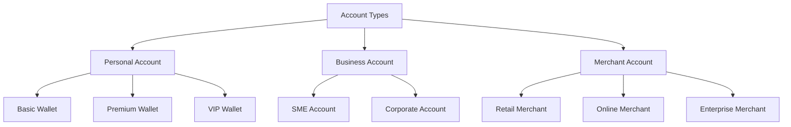
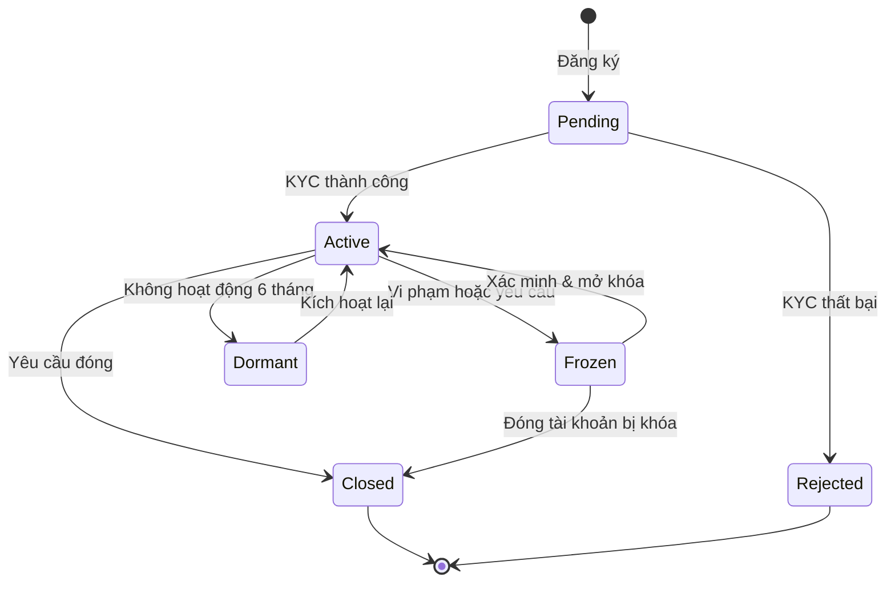
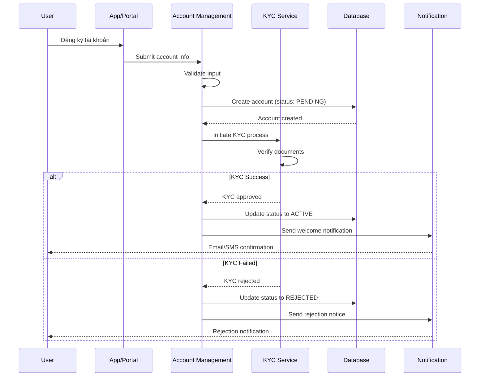
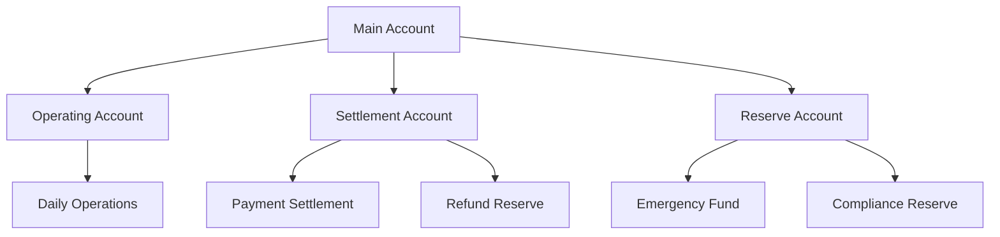
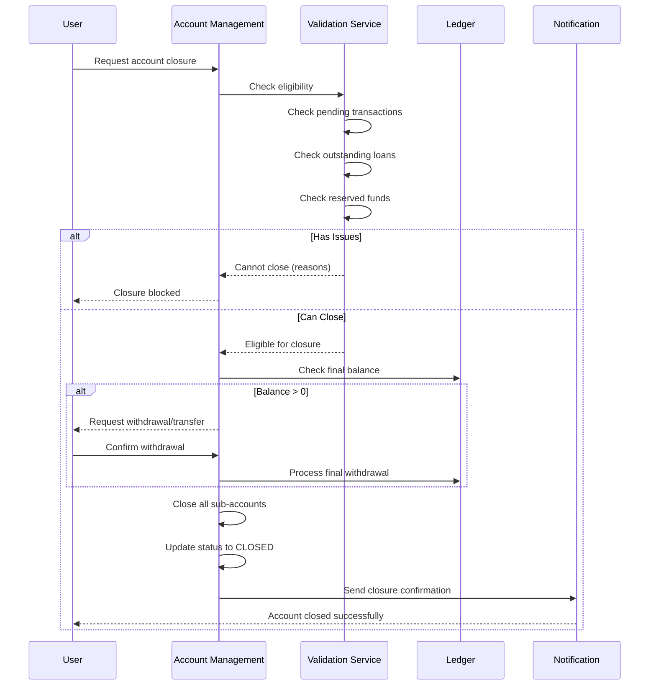

# III. Account Management - Quản lý Tài khoản

## Tổng quan

Module Account Management là nền tảng của hệ thống Core Banking, chịu trách nhiệm quản lý toàn bộ vòng đời của tài khoản khách hàng từ khi tạo mới cho đến khi đóng tài khoản. Module này đảm bảo tính nhất quán, bảo mật và chính xác của dữ liệu tài khoản.

## Các loại tài khoản

### 1. Theo đối tượng khách hàng



#### Personal Account (Tài khoản cá nhân)
- **Basic Wallet**: Ví cơ bản cho người dùng thông thường
  - Hạn mức giao dịch: 50 triệu VND/ngày
  - Số dư tối đa: 100 triệu VND
  - KYC level: 1 (Đơn giản)

- **Premium Wallet**: Ví nâng cao cho Winlife members
  - Hạn mức giao dịch: 200 triệu VND/ngày
  - Số dư tối đa: 500 triệu VND
  - KYC level: 2 (Đầy đủ)
  - Tính năng thêm: Tích điểm, cashback

- **VIP Wallet**: Ví cao cấp
  - Hạn mức giao dịch: Không giới hạn
  - Số dư tối đa: Không giới hạn
  - KYC level: 3 (Nâng cao)
  - Tính năng thêm: Ưu đãi đặc biệt, hỗ trợ ưu tiên

#### Business Account (Tài khoản doanh nghiệp)
- **SME Account**: Doanh nghiệp vừa và nhỏ
  - Hạn mức: 500 triệu VND/ngày
  - Multi-user access
  - Báo cáo tài chính cơ bản

- **Corporate Account**: Doanh nghiệp lớn
  - Hạn mức: Custom
  - Advanced multi-user với phân quyền
  - Báo cáo tài chính nâng cao
  - API integration

#### Merchant Account (Tài khoản thương nhân)
- Tài khoản dành cho NBL, NPP
- Tích hợp POS
- Quản lý settlement
- Báo cáo doanh thu

### 2. Theo loại tiền tệ

```typescript
interface CurrencyAccount {
  accountId: string;
  currency: 'VND' | 'USD' | 'EUR' | 'JPY';
  accountType: 'CURRENT' | 'SAVINGS' | 'SETTLEMENT';
  balance: {
    available: number;      // Số dư khả dụng
    pending: number;        // Số dư chờ xử lý
    reserved: number;       // Số dư bị phong tỏa/giữ
    total: number;          // Tổng số dư
  };
  interestRate?: number;    // Lãi suất (nếu là tài khoản tiết kiệm)
  minBalance?: number;      // Số dư tối thiểu
  maxBalance?: number;      // Số dư tối đa
}
```

## Vòng đời tài khoản



### Các trạng thái tài khoản

1. **Pending** (Chờ xử lý)
   - Tài khoản mới tạo, chưa hoàn tất KYC
   - Chưa thể thực hiện giao dịch
   - Chỉ xem thông tin

2. **Active** (Hoạt động)
   - Tài khoản đã xác thực đầy đủ
   - Có thể thực hiện tất cả giao dịch
   - Tuân theo hạn mức được thiết lập

3. **Frozen** (Đóng băng)
   - Tạm thời không thể giao dịch
   - Lý do: Nghi ngờ gian lận, yêu cầu cơ quan chức năng, vi phạm điều khoản
   - Vẫn giữ nguyên số dư

4. **Dormant** (Ngủ đông)
   - Không có giao dịch trong 6 tháng
   - Có thể kích hoạt lại
   - Một số tính năng bị hạn chế

5. **Closed** (Đã đóng)
   - Tài khoản đã đóng vĩnh viễn
   - Không thể kích hoạt lại
   - Số dư = 0

## Chức năng chính

### 1. Tạo tài khoản (Account Creation)

#### Flow tạo tài khoản



#### API Example

```typescript
// POST /api/v1/accounts
interface CreateAccountRequest {
  accountType: 'PERSONAL' | 'BUSINESS' | 'MERCHANT';
  tier?: 'BASIC' | 'PREMIUM' | 'VIP';
  
  personalInfo?: {
    firstName: string;
    lastName: string;
    dateOfBirth: string;
    nationalId: string;
    phoneNumber: string;
    email: string;
    address: Address;
  };
  
  businessInfo?: {
    companyName: string;
    registrationNumber: string;
    taxId: string;
    businessType: string;
    address: Address;
    representative: PersonalInfo;
  };
  
  currency: string;
  referralCode?: string;
}

interface CreateAccountResponse {
  accountId: string;
  accountNumber: string;
  status: AccountStatus;
  kycRequired: boolean;
  nextSteps: string[];
  createdAt: string;
}
```

### 2. Quản lý số dư (Balance Management)

#### Cấu trúc số dư

```typescript
interface Balance {
  accountId: string;
  currency: string;
  
  // Các loại số dư
  available: number;        // Có thể sử dụng ngay
  pending: number;          // Đang chờ xử lý
  reserved: number;         // Bị giữ/phong tỏa
  
  // Tính toán
  total: number;            // = available + pending + reserved
  
  // Giới hạn
  minBalance: number;       // Số dư tối thiểu phải duy trì
  maxBalance: number;       // Số dư tối đa cho phép
  
  // Lịch sử
  lastUpdated: string;
  lastTransactionId: string;
}
```

#### Operations trên số dư

```typescript
// Hold/Reserve funds (Giữ tiền)
// Dùng khi cần đảm bảo có đủ tiền cho giao dịch
interface HoldFundsRequest {
  accountId: string;
  amount: number;
  reason: string;
  expiryTime?: string;      // Tự động release sau thời gian này
  referenceId: string;      // Transaction ID hoặc order ID
}

// Release held funds (Giải phóng tiền đã giữ)
interface ReleaseFundsRequest {
  accountId: string;
  holdId: string;
  amount?: number;          // Partial release
}

// Adjust balance (Điều chỉnh số dư)
// Chỉ admin mới có quyền
interface AdjustBalanceRequest {
  accountId: string;
  amount: number;           // Positive = credit, Negative = debit
  reason: string;
  approvedBy: string;
  notes: string;
}
```

### 3. Giới hạn tài khoản (Account Limits)

```typescript
interface AccountLimits {
  accountId: string;
  
  // Transaction limits
  transactionLimits: {
    single: {
      min: number;
      max: number;
    };
    daily: {
      amount: number;
      count: number;
    };
    monthly: {
      amount: number;
      count: number;
    };
  };
  
  // Balance limits
  balanceLimits: {
    min: number;
    max: number;
  };
  
  // Withdrawal limits
  withdrawalLimits: {
    daily: number;
    monthly: number;
  };
  
  // Transfer limits
  transferLimits: {
    internal: {
      daily: number;
    };
    external: {
      daily: number;
    };
  };
}
```

### 4. Phân cấp tài khoản (Account Hierarchy)

Hỗ trợ tạo sub-accounts để quản lý tài chính tốt hơn:



```typescript
interface AccountHierarchy {
  mainAccount: {
    accountId: string;
    accountNumber: string;
    totalBalance: number;
  };
  
  subAccounts: Array<{
    accountId: string;
    accountNumber: string;
    accountType: 'OPERATING' | 'SETTLEMENT' | 'RESERVE';
    purpose: string;
    balance: number;
    parentAccountId: string;
  }>;
  
  // Transfer rules giữa các accounts
  transferRules: {
    autoSweep?: {
      from: string;
      to: string;
      trigger: 'DAILY' | 'BALANCE_THRESHOLD';
      threshold?: number;
    };
  };
}
```

### 5. Đóng băng tài khoản (Account Freezing)

```typescript
interface FreezeAccountRequest {
  accountId: string;
  reason: 'FRAUD_SUSPECTED' | 'REGULATORY_HOLD' | 'CUSTOMER_REQUEST' | 'AML_CHECK';
  notes: string;
  freezeType: 'FULL' | 'PARTIAL';
  
  // Nếu PARTIAL freeze
  restrictions?: {
    allowedOperations: ('VIEW' | 'DEPOSIT')[];
    blockedOperations: ('WITHDRAWAL' | 'TRANSFER' | 'PAYMENT')[];
  };
  
  duration?: {
    temporary: boolean;
    expiryDate?: string;
  };
  
  approvedBy: string;
}

interface UnfreezeAccountRequest {
  accountId: string;
  reason: string;
  verificationCompleted: boolean;
  approvedBy: string;
}
```

### 6. Đóng tài khoản (Account Closure)



#### Điều kiện đóng tài khoản

```typescript
interface ClosureEligibility {
  canClose: boolean;
  reasons: string[];
  requirements: Array<{
    type: 'BALANCE' | 'PENDING_TXN' | 'LOAN' | 'DISPUTE';
    status: 'SATISFIED' | 'PENDING';
    details: string;
  }>;
  
  finalBalance: {
    amount: number;
    requiresWithdrawal: boolean;
  };
}
```

### 7. Sao kê tài khoản (Account Statement)

```typescript
interface AccountStatementRequest {
  accountId: string;
  period: {
    from: string;
    to: string;
  };
  format: 'PDF' | 'CSV' | 'EXCEL';
  includeDetails: boolean;
  language: 'vi' | 'en';
}

interface AccountStatementResponse {
  accountId: string;
  accountNumber: string;
  accountHolder: string;
  statementPeriod: {
    from: string;
    to: string;
  };
  
  openingBalance: number;
  closingBalance: number;
  
  summary: {
    totalCredits: number;
    totalDebits: number;
    transactionCount: number;
    totalFees: number;
  };
  
  transactions: Array<{
    date: string;
    description: string;
    reference: string;
    debit: number;
    credit: number;
    balance: number;
  }>;
  
  downloadUrl: string;
}
```

## Tính năng nâng cao

### 1. Multi-currency Management

```typescript
interface MultiCurrencyAccount {
  primaryAccountId: string;
  currencies: Array<{
    currency: string;
    accountId: string;
    balance: Balance;
    isActive: boolean;
  }>;
  
  // Auto-conversion settings
  autoConversion: {
    enabled: boolean;
    baseCurrency: string;
    rules: Array<{
      fromCurrency: string;
      toCurrency: string;
      trigger: 'IMMEDIATE' | 'DAILY' | 'THRESHOLD';
      threshold?: number;
    }>;
  };
}
```

### 2. Virtual Accounts (Tài khoản ảo)

Tạo tài khoản ảo tạm thời cho các mục đích cụ thể:

```typescript
interface VirtualAccount {
  virtualAccountId: string;
  parentAccountId: string;
  purpose: 'ESCROW' | 'COLLECTION' | 'DISBURSEMENT';
  
  validity: {
    createdAt: string;
    expiresAt: string;
    autoClose: boolean;
  };
  
  balance: number;
  
  // Rules
  rules: {
    maxBalance?: number;
    allowedOperations: string[];
    autoSweepToParent: boolean;
  };
}
```

### 3. Interest Calculation (Tính lãi)

Cho savings accounts hoặc reserve accounts:

```typescript
interface InterestConfiguration {
  accountId: string;
  interestRate: number;        // Annual rate
  calculationMethod: 'SIMPLE' | 'COMPOUND';
  compoundingFrequency?: 'DAILY' | 'MONTHLY' | 'QUARTERLY' | 'YEARLY';
  
  accrual: {
    frequency: 'DAILY' | 'MONTHLY';
    lastAccrualDate: string;
    accruedAmount: number;
  };
  
  payout: {
    frequency: 'MONTHLY' | 'QUARTERLY' | 'YEARLY';
    nextPayoutDate: string;
    method: 'CREDIT_TO_ACCOUNT' | 'SEPARATE_ACCOUNT';
  };
}
```

## Bảo mật & Tuân thủ

### 1. Access Control

```typescript
interface AccountAccessControl {
  accountId: string;
  
  // Owner
  owner: {
    userId: string;
    fullAccess: boolean;
  };
  
  // Authorized users
  authorizedUsers: Array<{
    userId: string;
    role: 'ADMIN' | 'OPERATOR' | 'VIEWER';
    permissions: string[];
    expiresAt?: string;
  }>;
  
  // IP whitelist
  ipWhitelist?: string[];
  
  // Device binding
  trustedDevices: Array<{
    deviceId: string;
    deviceName: string;
    addedAt: string;
  }>;
}
```

### 2. Audit Trail

Mọi thay đổi đều được ghi log:

```typescript
interface AccountAuditLog {
  logId: string;
  accountId: string;
  timestamp: string;
  
  action: 'CREATE' | 'UPDATE' | 'FREEZE' | 'UNFREEZE' | 'CLOSE' | 'BALANCE_ADJUST';
  
  performedBy: {
    userId: string;
    userType: 'CUSTOMER' | 'ADMIN' | 'SYSTEM';
    ipAddress: string;
  };
  
  changes: {
    field: string;
    oldValue: any;
    newValue: any;
  }[];
  
  reason?: string;
  approvalRequired: boolean;
  approvedBy?: string;
}
```

## API Reference

### Core APIs

```typescript
// 1. Get account details
GET /api/v1/accounts/{accountId}

// 2. Get account balance
GET /api/v1/accounts/{accountId}/balance

// 3. Get account statement
GET /api/v1/accounts/{accountId}/statement?from={date}&to={date}

// 4. Update account info
PATCH /api/v1/accounts/{accountId}

// 5. Freeze account
POST /api/v1/accounts/{accountId}/freeze

// 6. Unfreeze account
POST /api/v1/accounts/{accountId}/unfreeze

// 7. Close account
POST /api/v1/accounts/{accountId}/close

// 8. Get account limits
GET /api/v1/accounts/{accountId}/limits

// 9. Update account limits
PUT /api/v1/accounts/{accountId}/limits

// 10. Hold funds
POST /api/v1/accounts/{accountId}/holds

// 11. Release held funds
DELETE /api/v1/accounts/{accountId}/holds/{holdId}

// 12. Get audit logs
GET /api/v1/accounts/{accountId}/audit-logs
```

## Use Cases trong hệ thống Masan

### 1. Nhà bán lẻ (Retailers)

```typescript
// Tạo tài khoản merchant cho NBL
const retailerAccount = {
  accountType: 'MERCHANT',
  tier: 'BASIC',
  businessInfo: {
    storeName: 'Tạp hóa Bà Hương',
    ownerName: 'Nguyễn Thị Hương',
    phoneNumber: '0901234567',
    address: {
      street: '123 Nguyễn Văn Linh',
      ward: 'Phường 1',
      district: 'Quận 7',
      city: 'TP.HCM'
    }
  },
  limits: {
    daily: 50_000_000,      // 50 triệu/ngày
    monthly: 1_000_000_000  // 1 tỷ/tháng
  }
};
```

### 2. Winlife Members

```typescript
// Tạo tài khoản premium cho Winlife member
const winlifeAccount = {
  accountType: 'PERSONAL',
  tier: 'PREMIUM',
  personalInfo: {
    firstName: 'Minh',
    lastName: 'Nguyen Van',
    phoneNumber: '0912345678',
    email: 'minh.nv@email.com'
  },
  features: {
    loyaltyPoints: true,
    cashback: true,
    multiCurrency: true
  },
  limits: {
    daily: 200_000_000,     // 200 triệu/ngày
    monthly: 5_000_000_000  // 5 tỷ/tháng
  }
};
```

### 3. Nhà phân phối (Distributors)

```typescript
// Tạo tài khoản corporate cho NPP
const distributorAccount = {
  accountType: 'BUSINESS',
  tier: 'CORPORATE',
  businessInfo: {
    companyName: 'NPP Miền Nam',
    registrationNumber: '0123456789',
    taxId: '0123456789-001'
  },
  subAccounts: [
    { type: 'OPERATING', name: 'Daily Operations' },
    { type: 'SETTLEMENT', name: 'Retailer Payments' },
    { type: 'RESERVE', name: 'Compliance Reserve' }
  ],
  limits: {
    daily: 5_000_000_000,    // 5 tỷ/ngày
    monthly: 100_000_000_000 // 100 tỷ/tháng
  }
};
```

## Best Practices

### Cho Khách hàng

1. **Bảo mật tài khoản**
   - Bật xác thực 2 yếu tố (2FA)
   - Sử dụng mật khẩu mạnh
   - Không chia sẻ thông tin đăng nhập
   - Kiểm tra giao dịch thường xuyên

2. **Quản lý số dư**
   - Duy trì số dư tối thiểu
   - Theo dõi hạn mức giao dịch
   - Thiết lập cảnh báo số dư thấp
   - Đối soát định kỳ

3. **Tuân thủ**
   - Cập nhật KYC khi có thay đổi
   - Báo cáo giao dịch đáng ngờ
   - Tuân thủ hạn mức quy định

### Cho Developers

1. **API Integration**
   - Cache account info để giảm API calls
   - Implement retry logic cho failed requests
   - Handle race conditions khi update balance
   - Validate input thoroughly

2. **Error Handling**
   - Check account status trước khi giao dịch
   - Handle insufficient balance gracefully
   - Provide clear error messages
   - Log all failures for debugging

3. **Performance**
   - Use pagination cho statement queries
   - Implement caching cho frequently accessed data
   - Optimize database queries
   - Monitor API response times

## Monitoring & Alerts

### Key Metrics

```typescript
interface AccountMetrics {
  // Growth metrics
  newAccountsToday: number;
  newAccountsThisMonth: number;
  activeAccounts: number;
  
  // Health metrics
  averageBalance: number;
  totalSystemBalance: number;
  frozenAccountsCount: number;
  dormantAccountsCount: number;
  
  // Activity metrics
  dailyActiveUsers: number;
  monthlyActiveUsers: number;
  averageTransactionPerAccount: number;
  
  // Risk metrics
  accountsNearLimit: number;
  suspiciousAccounts: number;
  kycPendingAccounts: number;
}
```

### Alert Rules

- Tài khoản có nhiều failed login attempts
- Số dư tài khoản vượt quá hạn mức
- Giao dịch bất thường (giá trị, tần suất)
- KYC sắp hết hạn
- Tài khoản sắp chuyển sang dormant

## Kết luận

Module Account Management là nền tảng quan trọng nhất của Core Banking System. Việc thiết kế và triển khai đúng đắn module này đảm bảo:

- ✅ Quản lý tài khoản hiệu quả và an toàn
- ✅ Hỗ trợ đa dạng loại khách hàng và use cases
- ✅ Tuân thủ các quy định pháp lý
- ✅ Mở rộng linh hoạt theo nhu cầu
- ✅ Tích hợp dễ dàng với các module khác

Trong hệ thống Masan, module này đóng vai trò then chốt trong việc quản lý tài khoản cho hàng triệu khách hàng từ NBL, Winlife members đến NPP và các đối tác.

