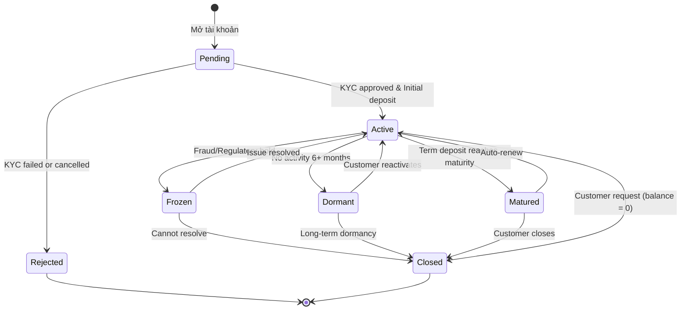
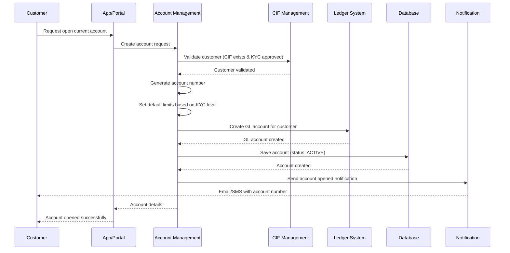
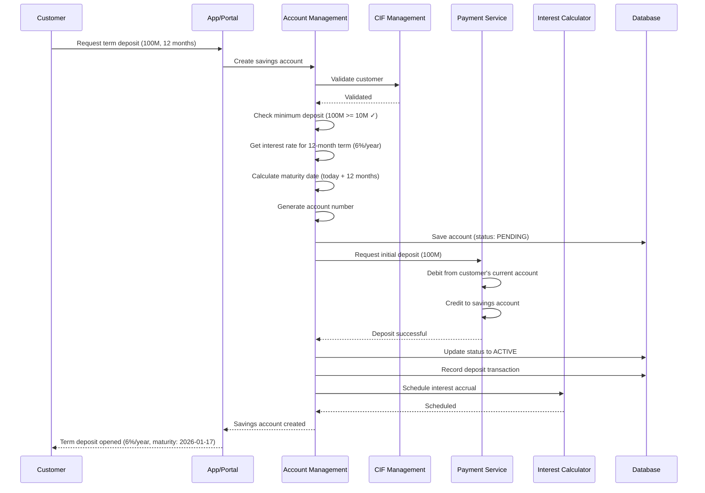
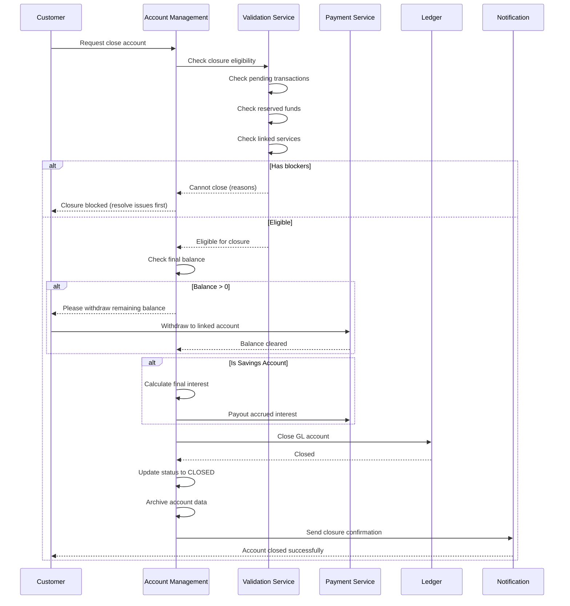
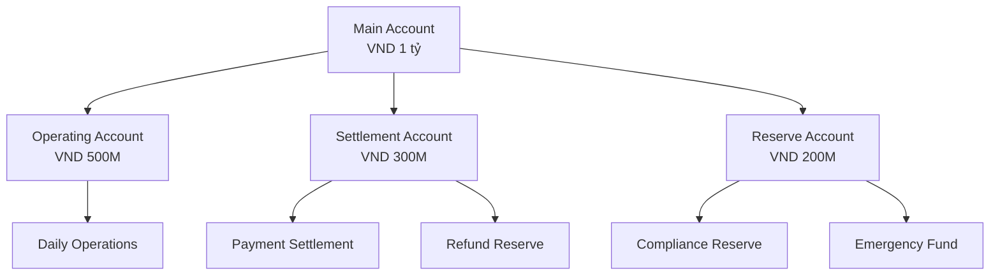

# III. Account Management - Quản lý Tài khoản Tiền gửi

## Tổng quan

Module Account Management trong Core Banking chịu trách nhiệm quản lý **tài khoản tiền gửi** (deposit accounts) của khách hàng. Module này quản lý vòng đời của tài khoản từ khi mở đến khi đóng, bao gồm quản lý số dư, lãi suất, giao dịch và tuân thủ quy định.

### Định nghĩa

**Account (Tài khoản)** trong tài liệu này là **Financial Account / Deposit Account (Tài khoản tiền gửi)**:
- Nơi lưu trữ tiền của khách hàng
- Có số tài khoản (account number)
- Có số dư (balance)
- Được sử dụng để thực hiện giao dịch

**Phân biệt:**
- ✅ Account = Tài khoản tiền gửi (Financial Account)
- ❌ KHÔNG phải User Account (tài khoản đăng nhập/xác thực)
- ❌ KHÔNG phải CIF (Customer Information File - xem module 10-cif-management)

**Quan hệ:**
```
Customer/CIF (1) ────has many───► (N) Accounts
```

Một khách hàng có thể có nhiều tài khoản:
- Tài khoản thanh toán VND
- Tài khoản tiết kiệm VND
- Tài khoản thanh toán USD
- Tài khoản settlement (cho merchant)

---

## Các loại Tài khoản Tiền gửi

### 1. Current Account (Tài khoản Thanh toán/Vãng lai)

**Định nghĩa:** Tài khoản dùng cho giao dịch hàng ngày, không tính lãi hoặc lãi suất rất thấp.

**Đặc điểm:**
- ✅ Rút/nạp tiền không hạn chế
- ✅ Số lần giao dịch không giới hạn
- ❌ Không có hoặc có lãi suất rất thấp (0-0.1%/năm)
- ✅ Có thể overdraft (thấu chi) nếu được phê duyệt
- ✅ Phí duy trì tài khoản (nếu có)

**Use cases:**
- Ví điện tử (e-wallet) của người dùng
- Tài khoản thanh toán của merchant
- Tài khoản vãng lai của doanh nghiệp

**Ví dụ:**
```typescript
interface CurrentAccount {
  accountId: string;
  accountNumber: string;
  accountType: 'CURRENT';
  
  // Linked to customer
  cifNumber: string;
  customerId: string;
  
  // Currency
  currency: 'VND' | 'USD' | 'EUR';
  
  // Balance
  balance: {
    available: number;        // Số dư khả dụng
    pending: number;          // Đang chờ xử lý
    reserved: number;         // Bị giữ/hold
    total: number;            // Tổng số dư
  };
  
  // Current account specific
  overdraft: {
    enabled: boolean;
    limit: number;            // Hạn mức thấu chi
    interestRate: number;     // Lãi suất thấu chi (cao hơn nhiều)
  };
  
  // Fees
  fees: {
    monthlyMaintenance: number;
    transactionFee: number;
  };
  
  // Limits
  limits: {
    dailyTransfer: number;
    monthlyTransfer: number;
  };
  
  // Status
  status: 'ACTIVE' | 'FROZEN' | 'DORMANT' | 'CLOSED';
  
  // Dates
  openedDate: string;
  lastActivityDate: string;
}
```

---

### 2. Savings Account (Tài khoản Tiết kiệm)

**Định nghĩa:** Tài khoản dùng để gửi tiết kiệm, có lãi suất cao hơn current account.

**Đặc điểm:**
- ✅ Có lãi suất (0.5-8%/năm tùy kỳ hạn)
- ✅ Số dư tối thiểu (minimum balance)
- ❌ Số lần rút tiền bị giới hạn (VD: 3-5 lần/tháng)
- ❌ Phạt nếu rút trước hạn
- ✅ Có kỳ hạn (term) hoặc không kỳ hạn

**Các loại Savings Account:**

**2.1. Regular Savings (Tiết kiệm không kỳ hạn)**
- Rút tiền bất cứ lúc nào
- Lãi suất thấp (0.5-2%/năm)
- Không có phạt rút trước hạn

**2.2. Term Deposit/Fixed Deposit (Tiết kiệm có kỳ hạn)**
- Gửi cố định 1, 3, 6, 12, 24 tháng
- Lãi suất cao (4-8%/năm)
- Phạt nếu rút trước hạn (mất lãi hoặc lãi giảm)

**Ví dụ:**
```typescript
interface SavingsAccount {
  accountId: string;
  accountNumber: string;
  accountType: 'SAVINGS';
  
  // Linked to customer
  cifNumber: string;
  customerId: string;
  
  // Currency
  currency: 'VND' | 'USD' | 'EUR';
  
  // Balance
  balance: {
    principal: number;        // Số tiền gốc
    interest: number;         // Lãi đã tích lũy
    total: number;            // Tổng (gốc + lãi)
  };
  
  // Savings account specific
  savingsType: 'REGULAR' | 'TERM_DEPOSIT';
  
  // Interest
  interest: {
    rate: number;             // Lãi suất (%/năm)
    calculationMethod: 'SIMPLE' | 'COMPOUND';
    compoundingFrequency?: 'DAILY' | 'MONTHLY' | 'QUARTERLY';
    
    accrual: {
      frequency: 'DAILY' | 'MONTHLY';
      lastAccrualDate: string;
      accruedAmount: number;  // Lãi đã tích lũy chưa trả
    };
    
    payout: {
      frequency: 'MONTHLY' | 'QUARTERLY' | 'AT_MATURITY';
      nextPayoutDate: string;
      method: 'CREDIT_TO_ACCOUNT' | 'SEPARATE_ACCOUNT';
    };
  };
  
  // Term deposit specific
  term?: {
    depositDate: string;
    maturityDate: string;
    tenorMonths: number;      // Kỳ hạn (tháng)
    
    earlyWithdrawal: {
      allowed: boolean;
      penaltyType: 'LOSE_ALL_INTEREST' | 'REDUCED_RATE';
      penaltyRate?: number;   // Lãi suất giảm xuống (VD: 0.5%)
    };
    
    maturityInstruction: 'AUTO_RENEW' | 'TRANSFER_TO_CURRENT' | 'MANUAL';
  };
  
  // Requirements
  minBalance: number;         // Số dư tối thiểu
  withdrawalLimit: {
    maxPerMonth: number;      // Số lần rút tối đa/tháng
    maxAmount?: number;       // Số tiền rút tối đa mỗi lần
  };
  
  // Status
  status: 'ACTIVE' | 'FROZEN' | 'MATURED' | 'CLOSED';
  
  // Dates
  openedDate: string;
  lastActivityDate: string;
}
```

---

## So sánh Current vs Savings Account

| Tiêu chí | Current Account | Savings Account (Regular) | Savings Account (Term) |
|----------|-----------------|--------------------------|------------------------|
| **Mục đích** | Giao dịch hàng ngày | Tiết kiệm ngắn hạn | Tiết kiệm dài hạn |
| **Lãi suất** | 0-0.1%/năm | 0.5-2%/năm | 4-8%/năm |
| **Số dư tối thiểu** | Thấp hoặc không | 100K-1M VND | 10M+ VND |
| **Rút tiền** | Không giới hạn | Giới hạn 3-5 lần/tháng | Không được (hoặc phạt) |
| **Phí duy trì** | Có thể có | Thường miễn phí | Miễn phí |
| **Overdraft** | Có thể | Không | Không |
| **Kỳ hạn** | Không | Không | Có (1-24 tháng) |
| **Phạt rút sớm** | Không | Không | Có |

---

## Vòng đời Tài khoản



### Trạng thái Tài khoản

**1. PENDING (Chờ xử lý)**
- Tài khoản mới tạo, chưa active
- Chờ KYC approval
- Chờ nạp tiền lần đầu (initial deposit)
- Chưa có account number

**2. ACTIVE (Hoạt động)**
   - Tài khoản đã xác thực đầy đủ
- Có thể giao dịch bình thường
- Tuân theo limits & rules

**3. FROZEN (Đóng băng)**
- Tạm ngưng giao dịch
- Lý do: Fraud, AML alert, regulatory hold, customer request
   - Vẫn giữ nguyên số dư
- Có thể unfreeze nếu giải quyết được

**4. DORMANT (Ngủ đông)**
- Không có giao dịch &gt;6 tháng
- Vẫn tính lãi (nếu là savings)
- Có thể reactivate
   - Một số tính năng bị hạn chế

**5. MATURED (Đáo hạn) - Chỉ cho Term Deposit**
- Đến ngày đáo hạn
- Chờ customer instruction:
  - Auto-renew (tự động gia hạn)
  - Transfer to current account
  - Close account

**6. CLOSED (Đã đóng)**
   - Tài khoản đã đóng vĩnh viễn
   - Số dư = 0
- Không thể reactivate
- Lưu trữ lịch sử giao dịch theo quy định (5-7 năm)

**7. REJECTED (Từ chối)**
- KYC không qua
- Không đáp ứng điều kiện mở tài khoản

---

## Quy trình Mở Tài khoản

### 1. Mở Current Account



**Requirements:**
- Customer must have CIF
- KYC must be approved (Level 2+)
- No initial deposit required for current account
- Automatic account number generation

---

### 2. Mở Savings Account (Term Deposit)



**Requirements:**
- Customer must have CIF & active current account
- Minimum deposit amount (VD: 10M VND)
- Select term (1, 3, 6, 12, 24 months)
- Initial deposit from current account

---

## Quản lý Số dư (Balance Management)

### Cấu trúc Số dư

```typescript
interface AccountBalance {
  accountId: string;
  accountNumber: string;
  currency: string;
  
  // Balance components
  available: number;        // Số dư khả dụng (có thể dùng ngay)
  pending: number;          // Đang chờ xử lý (pending transactions)
  reserved: number;         // Bị giữ/hold (escrow, collateral)
  
  // Calculated
  total: number;            // = available + pending + reserved
  
  // For overdraft (current account only)
  overdraftUsed?: number;   // Số tiền thấu chi đang dùng
  overdraftAvailable?: number; // Hạn mức thấu chi còn lại
  
  // Metadata
  lastUpdated: string;
  lastTransactionId: string;
  lastTransactionType: string;
}
```

### Balance Operations

**1. Hold/Reserve Funds (Giữ tiền)**

Dùng khi cần đảm bảo có đủ tiền cho giao dịch (VD: payment authorization):

```typescript
interface HoldFundsRequest {
  accountId: string;
  amount: number;
  reason: string;
  referenceId: string;      // Transaction/Order ID
  expiryTime?: string;      // Auto-release sau thời gian này
}

async function holdFunds(request: HoldFundsRequest): Promise<HoldResult> {
  const account = await getAccount(request.accountId);
  
  // Validate
  if (account.balance.available < request.amount) {
    throw new Error('Insufficient available balance');
  }
  
  // Create hold
  const hold = {
    holdId: generateHoldId(),
    accountId: request.accountId,
    amount: request.amount,
    reason: request.reason,
    referenceId: request.referenceId,
    status: 'ACTIVE',
    createdAt: new Date(),
    expiresAt: request.expiryTime
  };
  
  // Update balance (atomic)
  await db.transaction(async (trx) => {
    await trx('account_holds').insert(hold);
    
    await trx('accounts')
      .where('accountId', request.accountId)
      .update({
        available: account.balance.available - request.amount,
        reserved: account.balance.reserved + request.amount
      });
  });
  
  return { holdId: hold.holdId, success: true };
}
```

**2. Release Held Funds (Giải phóng tiền đã giữ)**

```typescript
async function releaseFunds(holdId: string, amount?: number): Promise<void> {
  const hold = await getHold(holdId);
  
  if (!hold || hold.status !== 'ACTIVE') {
    throw new Error('Hold not found or already released');
  }
  
  const releaseAmount = amount || hold.amount; // Full or partial
  
  await db.transaction(async (trx) => {
    // Update hold
    await trx('account_holds')
      .where('holdId', holdId)
      .update({
        status: amount && amount < hold.amount ? 'PARTIAL_RELEASED' : 'RELEASED',
        releasedAmount: releaseAmount,
        releasedAt: new Date()
      });
    
    // Update balance
    await trx('accounts')
      .where('accountId', hold.accountId)
      .increment('available', releaseAmount)
      .decrement('reserved', releaseAmount);
  });
}
```

**3. Capture Held Funds (Thu tiền đã giữ)**

Khi giao dịch thành công, capture held funds:

```typescript
async function captureFunds(holdId: string): Promise<void> {
  const hold = await getHold(holdId);
  
  // Move from reserved to completed transaction
  await db.transaction(async (trx) => {
    // Update hold
    await trx('account_holds')
      .where('holdId', holdId)
      .update({ status: 'CAPTURED', capturedAt: new Date() });
    
    // Update balance (reserved → actually deducted)
    await trx('accounts')
      .where('accountId', hold.accountId)
      .decrement('reserved', hold.amount);
    
    // Create transaction record
    await trx('transactions').insert({
      accountId: hold.accountId,
      type: 'DEBIT',
      amount: hold.amount,
      reference: hold.referenceId,
      status: 'COMPLETED'
    });
  });
}
```

---

## Tính Lãi cho Savings Account

### 1. Phương pháp Tính lãi

**Simple Interest (Lãi đơn):**
```
Interest = Principal × Rate × Time / 365
```

**Compound Interest (Lãi kép):**
```
Future Value = Principal × (1 + Rate/n)^(n×Time)
Interest = Future Value - Principal

n = số kỳ ghép lãi trong năm
```

### 2. Interest Accrual (Trích lãi)

```typescript
interface InterestAccrual {
    accountId: string;
  accrualDate: string;
  
  // Principal & Rate
  principalAmount: number;
  annualRate: number;        // %/năm
  dailyRate: number;         // = annualRate / 365
  
  // Period
  lastAccrualDate: string;
  numberOfDays: number;
  
  // Calculated
  interestAmount: number;
  cumulativeInterest: number;
}

// Daily interest accrual job (chạy EOD - End of Day)
async function runDailyInterestAccrual(): Promise<void> {
  const savingsAccounts = await getSavingsAccounts({ status: 'ACTIVE' });
  
  for (const account of savingsAccounts) {
    try {
      // Calculate interest for the day
      const dailyRate = account.interest.rate / 365 / 100;
      const interestAmount = account.balance.principal * dailyRate;
      
      // Create accrual entry
      await createAccrualEntry({
        accountId: account.accountId,
        accrualDate: today(),
        principalAmount: account.balance.principal,
        annualRate: account.interest.rate,
        dailyRate: dailyRate,
        numberOfDays: 1,
        interestAmount: interestAmount,
        cumulativeInterest: account.interest.accrual.accruedAmount + interestAmount
      });
      
      // Update account
      await updateAccount(account.accountId, {
        'interest.accrual.lastAccrualDate': today(),
        'interest.accrual.accruedAmount': account.interest.accrual.accruedAmount + interestAmount
      });
      
      console.log(`Accrued ${interestAmount} for account ${account.accountNumber}`);
      
    } catch (error) {
      console.error(`Failed to accrue interest for ${account.accountId}:`, error);
    }
  }
}
```

### 3. Interest Payout (Trả lãi)

```typescript
async function payoutInterest(accountId: string): Promise<void> {
  const account = await getSavingsAccount(accountId);
  const accruedInterest = account.interest.accrual.accruedAmount;
  
  if (accruedInterest <= 0) {
    return; // No interest to payout
  }
  
  await db.transaction(async (trx) => {
    // Method 1: Credit to same account (Nhập gốc)
    if (account.interest.payout.method === 'CREDIT_TO_ACCOUNT') {
      await trx('accounts')
        .where('accountId', accountId)
        .increment('balance.principal', accruedInterest)
        .update('balance.interest', 0);
      
      // Create transaction
      await trx('transactions').insert({
        accountId: accountId,
        type: 'INTEREST_CREDIT',
        amount: accruedInterest,
        description: 'Interest payout',
        status: 'COMPLETED'
      });
    }
    
    // Method 2: Transfer to separate account
    else if (account.interest.payout.method === 'SEPARATE_ACCOUNT') {
      // Transfer to customer's current account
      const currentAccount = await getCustomerCurrentAccount(account.cifNumber);
      
      await transferFunds({
        fromAccount: accountId,
        toAccount: currentAccount.accountId,
        amount: accruedInterest,
        description: 'Interest payout'
      });
    }
    
    // Reset accrued interest
    await trx('accounts')
      .where('accountId', accountId)
      .update('interest.accrual.accruedAmount', 0);
  });
  
  // Notification
  await sendNotification({
    customerId: account.customerId,
    type: 'INTEREST_PAYOUT',
    data: { amount: accruedInterest, accountNumber: account.accountNumber }
  });
}
```

### 4. Term Deposit Maturity Processing

```typescript
async function processMaturedDeposits(): Promise<void> {
  const maturedAccounts = await getSavingsAccounts({
    savingsType: 'TERM_DEPOSIT',
    status: 'ACTIVE',
    maturityDate: { $lte: today() }
  });
  
  for (const account of maturedAccounts) {
    // Calculate final interest
    await payoutInterest(account.accountId);
    
    const totalAmount = account.balance.principal + account.balance.interest;
    
    // Check maturity instruction
    if (account.term.maturityInstruction === 'AUTO_RENEW') {
      // Renew for same term
      await renewTermDeposit(account.accountId, {
        principal: totalAmount,
        tenorMonths: account.term.tenorMonths
      });
      
    } else if (account.term.maturityInstruction === 'TRANSFER_TO_CURRENT') {
      // Transfer to current account
      const currentAccount = await getCustomerCurrentAccount(account.cifNumber);
      
      await transferFunds({
        fromAccount: account.accountId,
        toAccount: currentAccount.accountId,
        amount: totalAmount,
        description: 'Term deposit maturity transfer'
      });
      
      // Close savings account
      await closeAccount(account.accountId);
      
    } else {
      // Manual - wait for customer instruction
      await updateAccount(account.accountId, {
        status: 'MATURED'
      });
      
      await sendNotification({
        customerId: account.customerId,
        type: 'TERM_DEPOSIT_MATURED',
        data: {
          accountNumber: account.accountNumber,
          totalAmount: totalAmount,
          instruction: 'Please visit branch or contact us for withdrawal'
        }
      });
    }
  }
}
```

---

## Đóng băng Tài khoản (Freeze Account)

```typescript
interface FreezeAccountRequest {
  accountId: string;
  reason: 'FRAUD_SUSPECTED' | 'AML_ALERT' | 'REGULATORY_HOLD' | 'CUSTOMER_REQUEST' | 'COURT_ORDER';
  notes: string;
  freezeType: 'FULL' | 'PARTIAL';
  
  // For partial freeze
  restrictions?: {
    allowedOperations: ('VIEW_BALANCE' | 'DEPOSIT')[];
    blockedOperations: ('WITHDRAWAL' | 'TRANSFER' | 'PAYMENT')[];
  };
  
  // Duration
  duration?: {
    temporary: boolean;
    expiresAt?: string;
  };
  
  // Authorization
  authorizedBy: string;
  authorizationLevel: 'MANAGER' | 'COMPLIANCE' | 'REGULATOR';
}

async function freezeAccount(request: FreezeAccountRequest): Promise<void> {
  const account = await getAccount(request.accountId);
  
  if (account.status === 'CLOSED') {
    throw new Error('Cannot freeze closed account');
  }
  
  // Create freeze record
  const freeze = {
    freezeId: generateFreezeId(),
    accountId: request.accountId,
    reason: request.reason,
    freezeType: request.freezeType,
    restrictions: request.restrictions,
    authorizedBy: request.authorizedBy,
    authorizationLevel: request.authorizationLevel,
    notes: request.notes,
    createdAt: new Date(),
    expiresAt: request.duration?.expiresAt,
    status: 'ACTIVE'
  };
  
  await db.transaction(async (trx) => {
    // Save freeze record
    await trx('account_freezes').insert(freeze);
    
    // Update account status
    await trx('accounts')
      .where('accountId', request.accountId)
      .update({
        status: 'FROZEN',
        frozenAt: new Date(),
        frozenBy: request.authorizedBy
      });
    
    // Create audit log
    await trx('audit_logs').insert({
      accountId: request.accountId,
      action: 'ACCOUNT_FROZEN',
      performedBy: request.authorizedBy,
      reason: request.reason,
      timestamp: new Date()
    });
  });
  
  // Notification
  await sendNotification({
    customerId: account.customerId,
    type: 'ACCOUNT_FROZEN',
    data: {
      accountNumber: account.accountNumber,
      reason: request.reason,
      contactSupport: true
    }
  });
}
```

---

## Đóng Tài khoản (Close Account)



### Điều kiện Đóng tài khoản

```typescript
interface ClosureEligibility {
  canClose: boolean;
  blockers: Array<{
    type: 'BALANCE' | 'PENDING_TXN' | 'RESERVED_FUNDS' | 'LINKED_SERVICES' | 'LOAN_COLLATERAL';
    description: string;
    resolution: string;
  }>;
  
  finalBalance: {
    principal: number;
    interest: number;
    total: number;
  };
  
  requiredActions: string[];
}

async function checkClosureEligibility(accountId: string): Promise<ClosureEligibility> {
  const account = await getAccount(accountId);
  const blockers = [];
  
  // Check pending transactions
  const pendingTxns = await getPendingTransactions(accountId);
  if (pendingTxns.length > 0) {
    blockers.push({
      type: 'PENDING_TXN',
      description: `${pendingTxns.length} pending transactions`,
      resolution: 'Wait for transactions to complete'
    });
  }
  
  // Check reserved funds
  if (account.balance.reserved > 0) {
    blockers.push({
      type: 'RESERVED_FUNDS',
      description: `${account.balance.reserved} VND reserved`,
      resolution: 'Release or capture reserved funds'
    });
  }
  
  // Check linked services (e.g., auto-debit)
  const linkedServices = await getLinkedServices(accountId);
  if (linkedServices.length > 0) {
    blockers.push({
      type: 'LINKED_SERVICES',
      description: `${linkedServices.length} linked services`,
      resolution: 'Unlink services or change payment method'
    });
  }
  
  // Check if used as loan collateral
  const isCollateral = await isAccountUsedAsCollateral(accountId);
  if (isCollateral) {
    blockers.push({
      type: 'LOAN_COLLATERAL',
      description: 'Account is used as loan collateral',
      resolution: 'Repay loan or provide alternative collateral'
    });
  }
  
  // Calculate final balance
  let finalBalance = {
    principal: account.balance.total,
    interest: 0,
    total: account.balance.total
  };
  
  if (account.accountType === 'SAVINGS') {
    finalBalance.interest = account.balance.interest;
    finalBalance.total = account.balance.principal + account.balance.interest;
  }
  
  return {
    canClose: blockers.length === 0 && finalBalance.total === 0,
    blockers,
    finalBalance,
    requiredActions: blockers.map(b => b.resolution)
  };
}
```

---

## Multi-Currency Accounts

Khách hàng có thể mở nhiều tài khoản với các loại tiền tệ khác nhau:

```typescript
interface MultiCurrencyCustomer {
  cifNumber: string;
  customerId: string;
  
  accounts: Array<{
    accountId: string;
    accountNumber: string;
    accountType: 'CURRENT' | 'SAVINGS';
    currency: 'VND' | 'USD' | 'EUR' | 'JPY';
  balance: number;
    status: string;
  }>;
  
  // Primary account (default for transactions)
  primaryAccountId: string;
}

// Example: Customer có 3 tài khoản
const customer = {
  cifNumber: 'CIF001234',
  accounts: [
    {
      accountNumber: '0011234567890',
      accountType: 'CURRENT',
      currency: 'VND',
      balance: 50_000_000  // 50 triệu
    },
    {
      accountNumber: '0011234567891',
      accountType: 'CURRENT',
      currency: 'USD',
      balance: 1_000       // $1,000
    },
    {
      accountNumber: '0011234567892',
      accountType: 'SAVINGS',
      currency: 'VND',
      balance: 100_000_000 // 100 triệu (term deposit)
    }
  ]
};
```

---

## Sub-Accounts (Tài khoản Con)

Doanh nghiệp có thể có sub-accounts để quản lý tài chính tốt hơn:



```typescript
interface AccountHierarchy {
  mainAccount: {
  accountId: string;
    accountNumber: string;
    accountType: 'CURRENT';
    balance: number;
  };
  
  subAccounts: Array<{
    accountId: string;
    accountNumber: string;
    accountType: 'OPERATING' | 'SETTLEMENT' | 'RESERVE';
    purpose: string;
    balance: number;
    parentAccountId: string;
  }>;
  
  // Auto-sweep rules
  sweepRules: Array<{
    from: string;           // Sub-account
    to: string;             // Main account
    trigger: 'DAILY_EOD' | 'BALANCE_THRESHOLD';
    threshold?: number;     // Nếu balance > threshold → sweep
    sweepAmount: 'ALL' | 'EXCESS'; // ALL = toàn bộ, EXCESS = chỉ phần vượt threshold
  }>;
}
```

---

## Sao kê Tài khoản (Statement)

```typescript
interface StatementRequest {
  accountId: string;
  period: {
    from: string;  // YYYY-MM-DD
    to: string;
  };
  format: 'PDF' | 'CSV' | 'EXCEL' | 'JSON';
  includeDetails: boolean;
  language: 'vi' | 'en';
}

interface Statement {
  accountId: string;
  accountNumber: string;
  accountHolder: string;
  accountType: 'CURRENT' | 'SAVINGS';
  currency: string;
  
  period: {
    from: string;
    to: string;
  };
  
  // Balance
  openingBalance: number;
  closingBalance: number;
  
  // Summary
  summary: {
    totalCredits: number;      // Tổng tiền vào
    totalDebits: number;       // Tổng tiền ra
    transactionCount: number;
    totalFees: number;
    interestEarned?: number;   // Lãi thu được (savings)
  };
  
  // Transactions
  transactions: Array<{
    date: string;
    transactionId: string;
    description: string;
    reference: string;
    type: 'DEBIT' | 'CREDIT';
    debit: number;
    credit: number;
    balance: number;
    channel: string;           // ATM, POS, Online, Branch
  }>;
  
  // For savings account
  interestDetails?: {
    interestRate: number;
    accruedInterest: number;
    paidInterest: number;
  };
  
  // Download
  downloadUrl?: string;
  generatedAt: string;
}
```

---

## API Reference

### Account Management APIs

```typescript
// 1. Open account
POST /api/v1/accounts
Body: {
  cifNumber: string;
  accountType: 'CURRENT' | 'SAVINGS';
  currency: string;
  initialDeposit?: number;  // Required for SAVINGS
  savingsType?: 'REGULAR' | 'TERM_DEPOSIT';
  term?: { tenorMonths: number };
}

// 2. Get account details
GET /api/v1/accounts/{accountId}

// 3. Get account balance
GET /api/v1/accounts/{accountId}/balance

// 4. Get account statement
GET /api/v1/accounts/{accountId}/statement
Query: from={date}&to={date}&format={PDF|CSV}

// 5. Hold funds
POST /api/v1/accounts/{accountId}/holds
Body: { amount: number, reason: string, referenceId: string }

// 6. Release held funds
DELETE /api/v1/accounts/{accountId}/holds/{holdId}

// 7. Freeze account
POST /api/v1/accounts/{accountId}/freeze
Body: { reason: string, freezeType: 'FULL'|'PARTIAL' }

// 8. Unfreeze account
POST /api/v1/accounts/{accountId}/unfreeze

// 9. Close account
POST /api/v1/accounts/{accountId}/close

// 10. Get customer accounts
GET /api/v1/customers/{cifNumber}/accounts

// 11. Get interest details (savings only)
GET /api/v1/accounts/{accountId}/interest

// 12. Get accrual history
GET /api/v1/accounts/{accountId}/accruals
```

---

## Use Cases trong Masan

### 1. Ví điện tử Người dùng (Current Account)

```typescript
// Mở ví cho Winlife member
const walletAccount = await openAccount({
  cifNumber: 'CIF123456',
  accountType: 'CURRENT',
  currency: 'VND'
});

// Account properties
{
  accountNumber: '0012345678901',
  accountType: 'CURRENT',
  currency: 'VND',
  balance: {
    available: 0,
    pending: 0,
    reserved: 0,
    total: 0
  },
  limits: {
    dailyTransfer: 100_000_000,    // 100M (based on KYC Level 2)
    monthlyTransfer: 500_000_000   // 500M
  },
  fees: {
    monthlyMaintenance: 0,          // Free for Winlife
    transactionFee: 0
  },
  status: 'ACTIVE'
}
```

### 2. Tài khoản Settlement cho Merchant (Current Account)

```typescript
// Merchant (NBL) settlement account
const merchantAccount = await openAccount({
  cifNumber: 'CIF_NBL_001',
  accountType: 'CURRENT',
  currency: 'VND'
});

// Account với settlement features
{
  accountNumber: '0019876543210',
  accountType: 'CURRENT',
  purpose: 'SETTLEMENT',
  balance: {
    available: 50_000_000,         // 50M ready for withdrawal
    pending: 10_000_000,           // 10M pending settlement (T+1)
    reserved: 5_000_000,           // 5M reserved for refunds
    total: 65_000_000
  },
  settlementSchedule: {
    frequency: 'DAILY',            // T+1
    nextSettlement: '2025-01-18',
    holdbackPercentage: 5          // 5% giữ lại cho refund reserve
  }
}
```

### 3. Tài khoản Tiết kiệm cho NPP (Savings Account)

```typescript
// NPP gửi tiết kiệm dư nợ thừa
const savingsAccount = await openAccount({
  cifNumber: 'CIF_NPP_001',
  accountType: 'SAVINGS',
  savingsType: 'TERM_DEPOSIT',
  currency: 'VND',
  initialDeposit: 500_000_000,    // 500M
  term: {
    tenorMonths: 6,                // 6 tháng
    maturityInstruction: 'AUTO_RENEW'
  }
});

// Account properties
{
  accountNumber: '0015555555555',
  accountType: 'SAVINGS',
  savingsType: 'TERM_DEPOSIT',
  balance: {
    principal: 500_000_000,
    interest: 15_000_000,          // 6 months accrued (estimated)
    total: 515_000_000
  },
  interest: {
    rate: 6.0,                     // 6%/năm
    calculationMethod: 'COMPOUND',
    compoundingFrequency: 'MONTHLY'
  },
  term: {
    depositDate: '2024-07-17',
    maturityDate: '2025-01-17',
    tenorMonths: 6
  }
}
```

---

## Best Practices

### Cho Development Team

1. **Transaction Atomicity**
   - Luôn dùng database transactions cho balance updates
   - Implement optimistic locking để tránh race conditions
   - Validate balance before và after mỗi operation

2. **Interest Calculation**
   - Run daily accrual job vào EOD (End of Day)
   - Store accrual history cho audit trail
   - Validate interest calculations với reconciliation reports

3. **Account Lifecycle**
   - Implement state machine cho account status transitions
   - Validate status trước mỗi operation
   - Auto-detect dormant accounts (cron job monthly)

4. **Performance**
   - Index trên accountNumber, cifNumber, status
   - Cache frequently accessed accounts
   - Paginate large result sets (statements, transaction history)

5. **Security**
   - Encrypt sensitive data (account numbers trong logs)
   - Audit trail cho tất cả balance changes
   - Multi-level authorization cho freeze/close operations

---

## Monitoring & Alerts

### Key Metrics

```typescript
interface AccountMetrics {
  // Growth
  totalAccounts: number;
  newAccountsToday: number;
  newAccountsThisMonth: number;
  
  // By type
  currentAccountsCount: number;
  savingsAccountsCount: number;
  
  // Balance
  totalSystemBalance: number;
  averageAccountBalance: number;
  
  // Health
  activeAccountsCount: number;
  frozenAccountsCount: number;
  dormantAccountsCount: number;
  
  // Savings specific
  totalSavingsBalance: number;
  averageInterestRate: number;
  dailyInterestPayout: number;
  
  // Activity
  dailyActiveAccounts: number;
  transactionsPerAccount: number;
}
```

### Alert Rules

- Account balance < minimum balance
- Suspicious activity (high frequency transactions)
- Account approaching dormancy (5 months no activity)
- Term deposit maturity approaching (7 days before)
- Failed interest accrual
- Negative balance (overdraft exceeded)

---

## Compliance & Regulatory

### 1. Reserve Requirements

Theo quy định NHNN, các tổ chức tín dụng phải duy trì dự trữ bắt buộc:

```typescript
interface ReserveRequirement {
  totalDeposits: number;           // Tổng tiền gửi
  reserveRatio: number;            // Tỷ lệ dự trữ (VD: 3%)
  requiredReserve: number;         // Số tiền phải dự trữ tại NHNN
  actualReserve: number;           // Thực tế đang dự trữ
  compliance: 'MET' | 'BREACH';
}
```

### 2. Deposit Insurance

- Bảo hiểm tiền gửi theo quy định (VD: tối đa 75M VND/khách hàng)
- Phải báo cáo định kỳ cho NHNN

### 3. Interest Rate Regulations

- Lãi suất tiền gửi phải tuân theo quy định của NHNN
- Không được vượt quá biên độ cho phép

---

## Kết luận

Module Account Management là **nền tảng core nhất** của Core Banking System, quản lý tài khoản tiền gửi của khách hàng bao gồm:

### ✅ Current Account (Tài khoản Thanh toán)
- Giao dịch hàng ngày
- Không hoặc lãi suất thấp
- Có thể overdraft
- **Use case**: Ví điện tử, merchant settlement

### ✅ Savings Account (Tài khoản Tiết kiệm)
- Tiết kiệm có lãi
- Regular (không kỳ hạn) hoặc Term Deposit (có kỳ hạn)
- Lãi suất cao hơn current account
- **Use case**: Tiết kiệm cá nhân, doanh nghiệp

### ✅ Chức năng chính
- Balance management (hold, reserve, capture)
- Interest calculation & accrual (daily)
- Interest payout (monthly/at maturity)
- Account lifecycle (open, freeze, close)
- Multi-currency support
- Sub-accounts cho doanh nghiệp
- Statement generation

### ✅ Integration
- **CIF Management**: Customer identity & KYC
- **Transaction Service**: Debit/credit operations
- **Ledger System**: Double-entry bookkeeping
- **Payment Service**: Payment processing
- **Credit Service**: Collateral accounts

Module này đảm bảo quản lý an toàn, chính xác và tuân thủ quy định cho hàng triệu tài khoản trong hệ thống Masan eWallet/Banking.
