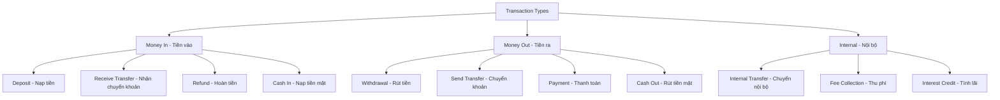
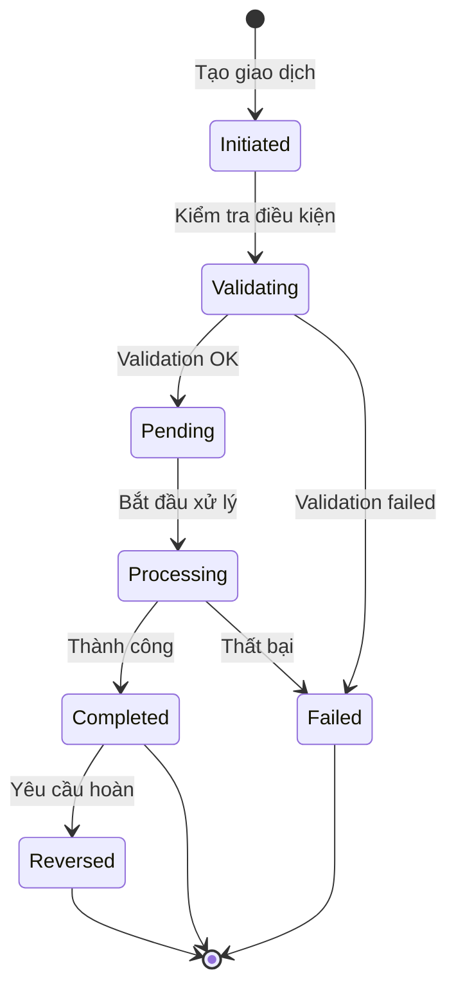
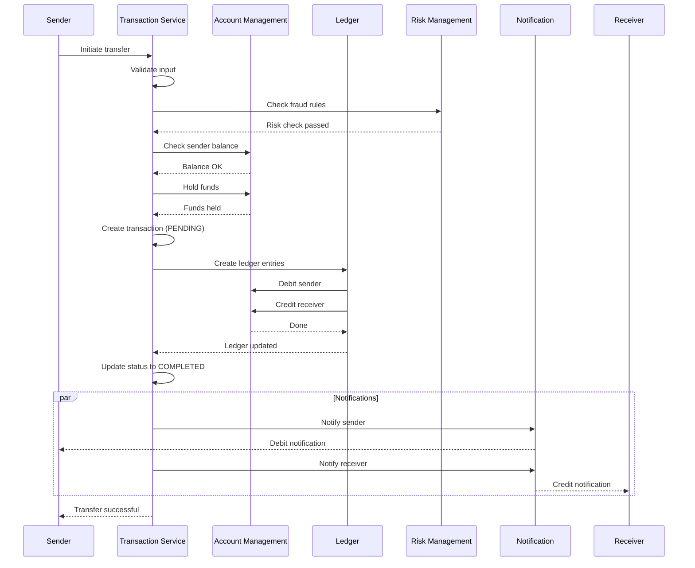
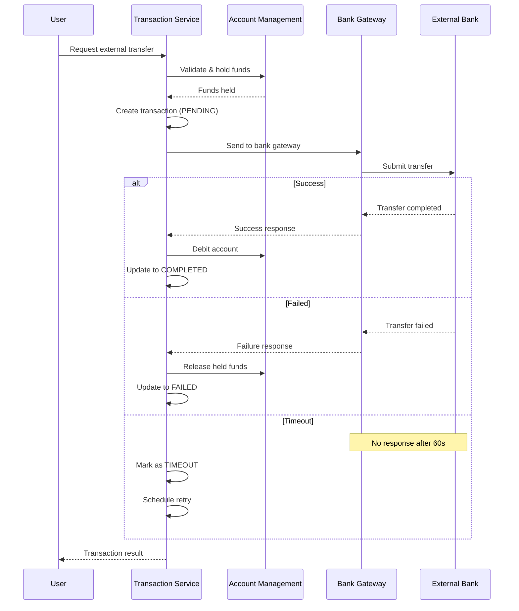
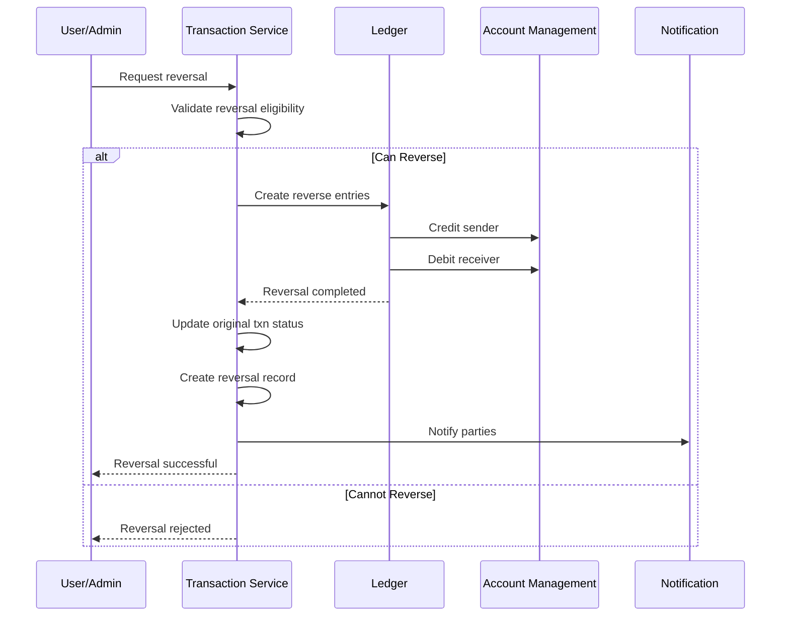

# IV. Transaction Service - Dịch vụ Giao dịch

## Tổng quan

Transaction Service là module xử lý toàn bộ các giao dịch tài chính trong hệ thống, đảm bảo tính toàn vẹn, nhất quán và bảo mật của mọi giao dịch. Module này hoạt động theo nguyên tắc ACID (Atomicity, Consistency, Isolation, Durability) để đảm bảo độ tin cậy tuyệt đối.

## Các loại giao dịch

### 1. Phân loại theo hướng



### 2. Phân loại theo phương thức

```typescript
enum TransactionMethod {
  // Bank transfer
  BANK_TRANSFER = 'BANK_TRANSFER',
  NAPAS = 'NAPAS',
  
  // Card
  CARD_PAYMENT = 'CARD_PAYMENT',
  ATM = 'ATM',
  
  // E-wallet
  WALLET_TRANSFER = 'WALLET_TRANSFER',
  
  // QR Code
  QR_CODE = 'QR_CODE',
  VIETQR = 'VIETQR',
  
  // Cash
  CASH = 'CASH',
  CASH_AGENT = 'CASH_AGENT',
  
  // Other
  DIRECT_DEBIT = 'DIRECT_DEBIT',
  MOBILE_MONEY = 'MOBILE_MONEY'
}
```

## Cấu trúc giao dịch

### Transaction Model

```typescript
interface Transaction {
  // Identification
  transactionId: string;
  transactionRef: string;          // External reference
  parentTransactionId?: string;    // For reversals/refunds
  
  // Type & Status
  type: TransactionType;
  method: TransactionMethod;
  status: TransactionStatus;
  
  // Participants
  sender: {
    accountId: string;
    accountNumber: string;
    name: string;
  };
  
  receiver: {
    accountId: string;
    accountNumber: string;
    name: string;
  };
  
  // Amount
  amount: {
    value: number;
    currency: string;
  };
  
  // Fees
  fees: {
    transactionFee: number;
    processingFee: number;
    totalFees: number;
  };
  
  // Description
  description: string;
  notes?: string;
  metadata?: Record<string, any>;
  
  // Timestamps
  createdAt: string;
  processedAt?: string;
  completedAt?: string;
  
  // Security
  ipAddress: string;
  deviceId: string;
  location?: GeoLocation;
  
  // Reconciliation
  settlementDate?: string;
  reconciled: boolean;
}
```

### Transaction Status Flow



### Transaction Status

```typescript
enum TransactionStatus {
  INITIATED = 'INITIATED',         // Vừa tạo
  VALIDATING = 'VALIDATING',       // Đang kiểm tra
  PENDING = 'PENDING',             // Chờ xử lý
  PROCESSING = 'PROCESSING',       // Đang xử lý
  COMPLETED = 'COMPLETED',         // Hoàn tất
  FAILED = 'FAILED',              // Thất bại
  REVERSED = 'REVERSED',          // Đã hoàn
  CANCELLED = 'CANCELLED',        // Đã hủy
  TIMEOUT = 'TIMEOUT'             // Quá thời gian
}
```

## Luồng xử lý giao dịch

### 1. P2P Transfer (Chuyển tiền nội bộ)



### 2. External Transfer (Chuyển ra ngân hàng)



## Validation Rules

### Pre-transaction Validation

```typescript
interface TransactionValidation {
  // Account validation
  accountChecks: {
    senderAccountActive: boolean;
    receiverAccountActive: boolean;
    senderNotFrozen: boolean;
    receiverCanReceive: boolean;
  };
  
  // Balance validation
  balanceChecks: {
    sufficientBalance: boolean;
    availableBalance: number;
    amountWithFees: number;
  };
  
  // Limit validation
  limitChecks: {
    withinSingleLimit: boolean;
    withinDailyLimit: boolean;
    withinMonthlyLimit: boolean;
    dailyCountOk: boolean;
  };
  
  // Risk validation
  riskChecks: {
    notBlacklisted: boolean;
    passedFraudCheck: boolean;
    velocityCheckPassed: boolean;
  };
  
  // Business rules
  businessRules: {
    minimumAmount: boolean;
    maximumAmount: boolean;
    allowedHours: boolean;
    allowedDays: boolean;
  };
}
```

### Validation Implementation

```typescript
async function validateTransaction(request: TransactionRequest): Promise<ValidationResult> {
  const errors: string[] = [];
  
  // 1. Check accounts
  const sender = await accountService.getAccount(request.senderAccountId);
  if (!sender.isActive) {
    errors.push('Sender account is not active');
  }
  
  const receiver = await accountService.getAccount(request.receiverAccountId);
  if (!receiver.isActive) {
    errors.push('Receiver account is not active');
  }
  
  // 2. Check balance
  const totalAmount = request.amount + calculateFees(request);
  if (sender.balance.available < totalAmount) {
    errors.push('Insufficient balance');
  }
  
  // 3. Check limits
  const limits = await limitService.getAccountLimits(request.senderAccountId);
  const todayTotal = await getTransactionSum(request.senderAccountId, 'today');
  
  if (request.amount > limits.single.max) {
    errors.push('Amount exceeds single transaction limit');
  }
  
  if (todayTotal + request.amount > limits.daily.amount) {
    errors.push('Daily limit exceeded');
  }
  
  // 4. Risk check
  const riskScore = await riskService.assessTransaction(request);
  if (riskScore > RISK_THRESHOLD) {
    errors.push('Transaction blocked by risk management');
  }
  
  return {
    valid: errors.length === 0,
    errors
  };
}
```

## Fee Calculation

### Fee Structure

```typescript
interface FeeConfiguration {
  transactionType: string;
  
  // Fixed fee
  fixedFee?: {
    amount: number;
    currency: string;
  };
  
  // Percentage fee
  percentageFee?: {
    rate: number;              // e.g., 0.015 = 1.5%
    minAmount?: number;
    maxAmount?: number;
  };
  
  // Tiered fee
  tieredFee?: Array<{
    from: number;
    to: number;
    fee: number;
  }>;
  
  // Fee bearer
  feePaidBy: 'SENDER' | 'RECEIVER' | 'SHARED';
  
  // Exemptions
  exemptions?: {
    accountTypes: string[];
    minimumAmount?: number;
    promotionalPeriod?: {
      from: string;
      to: string;
    };
  };
}
```

### Fee Calculation Examples

```typescript
// Example 1: Fixed + Percentage fee
function calculateFee(amount: number, config: FeeConfiguration): number {
  let fee = 0;
  
  // Fixed component
  if (config.fixedFee) {
    fee += config.fixedFee.amount;
  }
  
  // Percentage component
  if (config.percentageFee) {
    let percentFee = amount * config.percentageFee.rate;
    
    // Apply min/max
    if (config.percentageFee.minAmount) {
      percentFee = Math.max(percentFee, config.percentageFee.minAmount);
    }
    if (config.percentageFee.maxAmount) {
      percentFee = Math.min(percentFee, config.percentageFee.maxAmount);
    }
    
    fee += percentFee;
  }
  
  return fee;
}

// Example 2: Tiered fee
const tieredFeeConfig = {
  tieredFee: [
    { from: 0, to: 1_000_000, fee: 0 },                    // Free cho < 1M
    { from: 1_000_000, to: 10_000_000, fee: 5_000 },      // 5K cho 1M-10M
    { from: 10_000_000, to: 100_000_000, fee: 10_000 },   // 10K cho 10M-100M
    { from: 100_000_000, to: Infinity, fee: 50_000 }      // 50K cho > 100M
  ]
};
```

## Transaction Processing

### Idempotency

Đảm bảo giao dịch không bị xử lý trùng lặp:

```typescript
interface IdempotencyKey {
  key: string;                    // Unique key from client
  transactionId?: string;         // Linked transaction
  createdAt: string;
  expiresAt: string;              // 24 hours
  response?: any;                 // Cached response
}

async function processTransactionIdempotent(
  request: TransactionRequest,
  idempotencyKey: string
): Promise<TransactionResponse> {
  // Check if already processed
  const existing = await redis.get(`idempotency:${idempotencyKey}`);
  
  if (existing) {
    // Return cached result
    return JSON.parse(existing);
  }
  
  // Process transaction
  const result = await processTransaction(request);
  
  // Cache result for 24 hours
  await redis.setex(
    `idempotency:${idempotencyKey}`,
    86400,
    JSON.stringify(result)
  );
  
  return result;
}
```

### Transaction Locking

Tránh race condition khi cập nhật balance:

```typescript
async function processTransaction(txn: Transaction): Promise<void> {
  const lockKey = `account:${txn.sender.accountId}:lock`;
  const lockAcquired = await acquireLock(lockKey, 5000); // 5s timeout
  
  if (!lockAcquired) {
    throw new Error('Could not acquire lock');
  }
  
  try {
    // Get current balance
    const balance = await getBalance(txn.sender.accountId);
    
    // Validate sufficient balance
    if (balance < txn.amount) {
      throw new Error('Insufficient balance');
    }
    
    // Deduct balance
    await updateBalance(txn.sender.accountId, -txn.amount);
    
    // Credit receiver
    await updateBalance(txn.receiver.accountId, txn.amount);
    
    // Update transaction status
    await updateTransactionStatus(txn.transactionId, 'COMPLETED');
    
  } finally {
    // Always release lock
    await releaseLock(lockKey);
  }
}
```

### Batch Processing

Xử lý nhiều giao dịch cùng lúc:

```typescript
interface BatchTransaction {
  batchId: string;
  totalCount: number;
  totalAmount: number;
  transactions: Transaction[];
  status: 'PENDING' | 'PROCESSING' | 'COMPLETED' | 'FAILED';
  successCount: number;
  failedCount: number;
}

async function processBatch(batch: BatchTransaction): Promise<void> {
  const results = [];
  
  for (const txn of batch.transactions) {
    try {
      const result = await processTransaction(txn);
      results.push({ transactionId: txn.transactionId, status: 'SUCCESS', result });
      batch.successCount++;
    } catch (error) {
      results.push({ transactionId: txn.transactionId, status: 'FAILED', error });
      batch.failedCount++;
    }
  }
  
  // Update batch status
  batch.status = batch.failedCount === 0 ? 'COMPLETED' : 'PARTIALLY_COMPLETED';
  
  // Generate batch report
  await generateBatchReport(batch, results);
}
```

## Reversal & Refund

### Transaction Reversal



### Reversal Rules

```typescript
interface ReversalEligibility {
  canReverse: boolean;
  reasons: string[];
  
  checks: {
    withinReversalWindow: boolean;    // E.g., within 24 hours
    transactionCompleted: boolean;
    notAlreadyReversed: boolean;
    receiverHasFunds: boolean;
    approvalRequired: boolean;
  };
}

async function checkReversalEligibility(
  transactionId: string
): Promise<ReversalEligibility> {
  const txn = await getTransaction(transactionId);
  const reasons = [];
  
  // Check reversal window (e.g., 24 hours)
  const hoursSince = (Date.now() - new Date(txn.completedAt).getTime()) / 3600000;
  const withinWindow = hoursSince <= 24;
  if (!withinWindow) {
    reasons.push('Reversal window expired');
  }
  
  // Check if already reversed
  if (txn.status === 'REVERSED') {
    reasons.push('Transaction already reversed');
  }
  
  // Check receiver balance
  const receiverBalance = await getBalance(txn.receiver.accountId);
  const hasFunds = receiverBalance >= txn.amount;
  if (!hasFunds) {
    reasons.push('Receiver has insufficient funds');
  }
  
  return {
    canReverse: reasons.length === 0,
    reasons,
    checks: {
      withinReversalWindow: withinWindow,
      transactionCompleted: txn.status === 'COMPLETED',
      notAlreadyReversed: txn.status !== 'REVERSED',
      receiverHasFunds: hasFunds,
      approvalRequired: txn.amount > 10_000_000 // Require approval if > 10M
    }
  };
}
```

## Query & Reporting

### Transaction History

```typescript
interface TransactionHistoryRequest {
  accountId: string;
  
  // Filters
  filters?: {
    dateRange?: {
      from: string;
      to: string;
    };
    types?: TransactionType[];
    statuses?: TransactionStatus[];
    methods?: TransactionMethod[];
    minAmount?: number;
    maxAmount?: number;
    searchKeyword?: string;
  };
  
  // Sorting
  sortBy?: 'date' | 'amount' | 'status';
  sortOrder?: 'asc' | 'desc';
  
  // Pagination
  page: number;
  pageSize: number;
}

interface TransactionHistoryResponse {
  transactions: Transaction[];
  pagination: {
    total: number;
    page: number;
    pageSize: number;
    totalPages: number;
  };
  summary: {
    totalAmount: number;
    totalFees: number;
    transactionCount: number;
  };
}
```

### Real-time Transaction Tracking

```typescript
// WebSocket subscription for real-time updates
interface TransactionUpdate {
  transactionId: string;
  status: TransactionStatus;
  timestamp: string;
  message?: string;
}

// Client subscribes
socket.on('transaction:subscribe', (transactionId: string) => {
  // Join room for this transaction
  socket.join(`transaction:${transactionId}`);
});

// Server emits updates
async function updateTransactionStatus(
  transactionId: string,
  status: TransactionStatus
): Promise<void> {
  // Update database
  await db.transactions.update({ transactionId }, { status });
  
  // Emit real-time update
  io.to(`transaction:${transactionId}`).emit('transaction:update', {
    transactionId,
    status,
    timestamp: new Date().toISOString()
  });
}
```

## Analytics & Reporting

### Transaction Analytics

```typescript
interface TransactionAnalytics {
  period: {
    from: string;
    to: string;
  };
  
  overview: {
    totalVolume: number;
    totalAmount: number;
    averageAmount: number;
    successRate: number;
  };
  
  byType: Record<TransactionType, {
    count: number;
    amount: number;
    percentage: number;
  }>;
  
  byMethod: Record<TransactionMethod, {
    count: number;
    amount: number;
    percentage: number;
  }>;
  
  byStatus: Record<TransactionStatus, {
    count: number;
    percentage: number;
  }>;
  
  peakHours: Array<{
    hour: number;
    count: number;
    amount: number;
  }>;
  
  trends: {
    daily: TimeSeriesData;
    weekly: TimeSeriesData;
    monthly: TimeSeriesData;
  };
}
```

## API Reference

```typescript
// 1. Create transaction
POST /api/v1/transactions
Headers: { Idempotency-Key: string }

// 2. Get transaction details
GET /api/v1/transactions/{transactionId}

// 3. Get transaction history
GET /api/v1/accounts/{accountId}/transactions

// 4. Cancel pending transaction
DELETE /api/v1/transactions/{transactionId}

// 5. Reverse transaction
POST /api/v1/transactions/{transactionId}/reverse

// 6. Get transaction receipt
GET /api/v1/transactions/{transactionId}/receipt

// 7. Export transactions
POST /api/v1/transactions/export

// 8. Get transaction analytics
GET /api/v1/analytics/transactions

// 9. Batch create transactions
POST /api/v1/transactions/batch

// 10. Get batch status
GET /api/v1/transactions/batch/{batchId}
```

## Use Cases trong hệ thống Masan

### 1. NBL nhận thanh toán từ khách hàng

```typescript
const payment: Transaction = {
  type: 'PAYMENT_IN',
  method: 'QR_CODE',
  sender: {
    accountId: 'customer_123',
    name: 'Nguyen Van A'
  },
  receiver: {
    accountId: 'merchant_456',
    name: 'Tap hoa Ba Huong'
  },
  amount: {
    value: 150_000,
    currency: 'VND'
  },
  description: 'Thanh toan hang hoa',
  metadata: {
    orderId: 'ORD-20231111-001',
    items: [
      { name: 'Sua TH', quantity: 2, price: 35_000 },
      { name: 'Mi Omachi', quantity: 5, price: 16_000 }
    ]
  }
};
```

### 2. NPP thanh toán cho retailer

```typescript
const settlement: Transaction = {
  type: 'SETTLEMENT',
  method: 'WALLET_TRANSFER',
  sender: {
    accountId: 'distributor_789',
    name: 'NPP Mien Nam'
  },
  receiver: {
    accountId: 'retailer_456',
    name: 'Tap hoa Ba Huong'
  },
  amount: {
    value: 15_000_000,
    currency: 'VND'
  },
  description: 'Thanh toan hang thang 11/2023',
  metadata: {
    invoiceIds: ['INV-001', 'INV-002', 'INV-003'],
    period: '2023-11'
  }
};
```

### 3. Winlife member chuyển tiền

```typescript
const p2pTransfer: Transaction = {
  type: 'P2P_TRANSFER',
  method: 'WALLET_TRANSFER',
  sender: {
    accountId: 'winlife_111',
    name: 'Tran Thi B'
  },
  receiver: {
    accountId: 'winlife_222',
    name: 'Le Van C'
  },
  amount: {
    value: 500_000,
    currency: 'VND'
  },
  description: 'Chuyen tien an trua',
  fees: {
    transactionFee: 0,  // Free for Winlife members
    processingFee: 0,
    totalFees: 0
  }
};
```

## Best Practices

### Cho Developers

1. **Idempotency**
   - Always include Idempotency-Key header
   - Store and check idempotency keys
   - Return cached response for duplicate requests

2. **Error Handling**
   - Implement comprehensive error codes
   - Provide detailed error messages
   - Log all errors for debugging
   - Implement retry with exponential backoff

3. **Performance**
   - Use database indexing on frequently queried fields
   - Implement caching for read-heavy operations
   - Use async processing for non-critical operations
   - Optimize N+1 queries

4. **Security**
   - Validate all inputs
   - Implement rate limiting
   - Log all transactions
   - Encrypt sensitive data

### Cho Operations

1. **Monitoring**
   - Track success rate
   - Monitor response times
   - Alert on anomalies
   - Track failed transactions

2. **Reconciliation**
   - Daily reconciliation reports
   - Match transactions with ledger
   - Investigate discrepancies
   - Maintain audit trail

## Kết luận

Transaction Service là trái tim của hệ thống thanh toán, xử lý hàng triệu giao dịch mỗi ngày với yêu cầu:

- ✅ Tính chính xác tuyệt đối (ACID compliance)
- ✅ Hiệu năng cao (xử lý hàng nghìn TPS)
- ✅ Bảo mật tối đa
- ✅ Có khả năng theo dõi và audit đầy đủ
- ✅ Hỗ trợ rollback và recovery

Trong hệ thống Masan, module này đảm bảo mọi giao dịch từ thanh toán bán lẻ, chuyển tiền, đến settlement đều được xử lý chính xác và an toàn.

