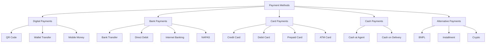
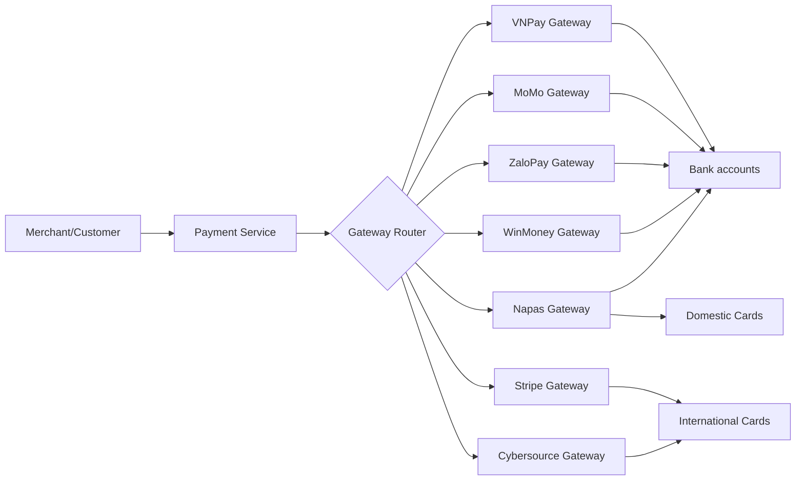
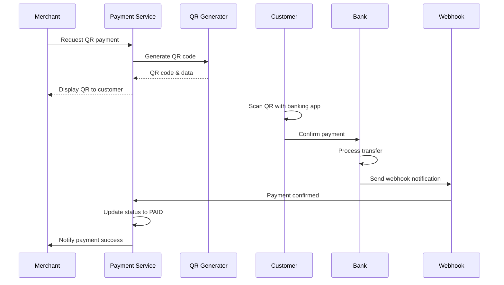
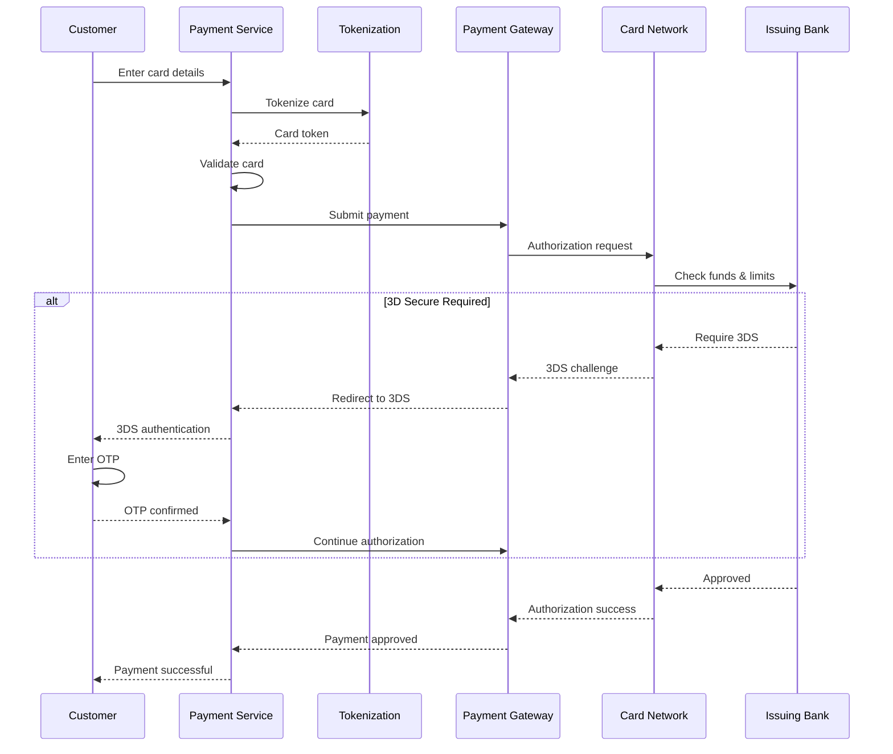

# V. Payment Service - Dịch vụ Thanh toán

## Tổng quan

Payment Service là module chịu trách nhiệm tích hợp và xử lý các phương thức thanh toán đa dạng, kết nối hệ thống với các nhà cung cấp thanh toán bên ngoài (Payment Gateways, Banks, Card Networks). Module này đảm bảo khách hàng có thể thanh toán thuận tiện qua nhiều kênh khác nhau.

## Các phương thức thanh toán



## Payment Gateway Integration

### Kiến trúc tích hợp



### Gateway Configuration

```typescript
interface PaymentGateway {
  gatewayId: string;
  name: string;
  provider: 'VNPAY' | 'MOMO' | 'ZALOPAY' | 'NAPAS' | 'STRIPE' | 'CYBERSOURCE';
  
  // Configuration
  config: {
    apiUrl: string;
    merchantId: string;
    apiKey: string;
    secretKey: string;
    webhookUrl: string;
  };
  
  // Supported features
  capabilities: {
    paymentMethods: PaymentMethod[];
    currencies: string[];
    countries: string[];
    minAmount: number;
    maxAmount: number;
  };
  
  // Routing rules
  routing: {
    priority: number;
    active: boolean;
    loadBalanceWeight?: number;
    fallbackGatewayId?: string;
  };
  
  // Fee structure
  fees: {
    fixedFee: number;
    percentageFee: number;
    internationalFee?: number;
  };
}
```

### Gateway Router

Tự động chọn gateway phù hợp dựa trên nhiều tiêu chí:

```typescript
interface RoutingRule {
  conditions: {
    paymentMethod?: PaymentMethod;
    currency?: string;
    amountRange?: { min: number; max: number };
    customerCountry?: string;
    cardType?: 'DOMESTIC' | 'INTERNATIONAL';
  };
  
  gateway: {
    primary: string;
    fallback: string[];
  };
  
  priority: number;
}

async function selectGateway(
  payment: PaymentRequest
): Promise<PaymentGateway> {
  // Get all applicable rules
  const rules = await getRoutingRules();
  
  // Filter by conditions
  const matchedRules = rules.filter(rule => {
    if (rule.conditions.paymentMethod && 
        rule.conditions.paymentMethod !== payment.method) {
      return false;
    }
    
    if (rule.conditions.currency && 
        rule.conditions.currency !== payment.currency) {
      return false;
    }
    
    if (rule.conditions.amountRange) {
      const { min, max } = rule.conditions.amountRange;
      if (payment.amount < min || payment.amount > max) {
        return false;
      }
    }
    
    return true;
  });
  
  // Sort by priority
  matchedRules.sort((a, b) => b.priority - a.priority);
  
  // Get primary gateway
  const primaryGateway = await getGateway(matchedRules[0].gateway.primary);
  
  // Check gateway health
  if (await isGatewayHealthy(primaryGateway.gatewayId)) {
    return primaryGateway;
  }
  
  // Try fallback gateways
  for (const fallbackId of matchedRules[0].gateway.fallback) {
    const fallback = await getGateway(fallbackId);
    if (await isGatewayHealthy(fallback.gatewayId)) {
      return fallback;
    }
  }
  
  throw new Error('No available gateway');
}
```

## QR Code Payment

### VietQR Standard

```typescript
interface VietQRPayment {
  // QR content
  qrContent: string;
  qrImage: string;          // Base64 encoded
  
  // Payment info
  merchantInfo: {
    merchantId: string;
    merchantName: string;
    bankCode: string;
    accountNumber: string;
  };
  
  amount: number;
  currency: 'VND';
  
  // Additional info
  purpose: string;
  additionalData?: string;
  
  // Expiry
  expiryTime: string;
  
  // Status tracking
  status: 'PENDING' | 'PAID' | 'EXPIRED' | 'CANCELLED';
}
```

### Generate QR Code

```typescript
async function generateQRCode(request: {
  merchantId: string;
  amount: number;
  purpose: string;
  expiryMinutes?: number;
}): Promise<VietQRPayment> {
  // Get merchant bank info
  const merchant = await getMerchantInfo(request.merchantId);
  
  // Generate unique transaction reference
  const txnRef = generateTxnReference();
  
  // Build QR content according to VietQR standard
  const qrContent = buildVietQRContent({
    version: '01',
    initMethod: '11',  // Static QR
    merchantInfo: {
      guid: merchant.guid,
      beneficiaryId: merchant.bankAccount,
      beneficiaryName: merchant.name
    },
    amount: request.amount,
    currency: '704',   // VND
    purpose: request.purpose,
    billNumber: txnRef
  });
  
  // Generate QR image
  const qrImage = await QRCode.toDataURL(qrContent, {
    width: 300,
    margin: 2
  });
  
  // Save to database
  const payment = await db.qrPayments.create({
    qrContent,
    qrImage,
    merchantId: request.merchantId,
    amount: request.amount,
    purpose: request.purpose,
    txnRef,
    status: 'PENDING',
    expiryTime: new Date(Date.now() + (request.expiryMinutes || 15) * 60000)
  });
  
  // Start monitoring for payment
  startPaymentMonitoring(payment.id);
  
  return payment;
}
```

### QR Payment Flow



## Card Payment

### Card Processing Flow



### Card Data Structure

```typescript
interface CardPayment {
  // Tokenized card (PCI compliant)
  cardToken: string;
  
  // Card info (masked)
  cardInfo: {
    brand: 'VISA' | 'MASTERCARD' | 'JCB' | 'AMEX';
    last4Digits: string;
    expiryMonth: number;
    expiryYear: number;
    cardType: 'CREDIT' | 'DEBIT' | 'PREPAID';
    cardCountry: string;
  };
  
  // Payment details
  amount: number;
  currency: string;
  
  // 3D Secure
  threeDSecure: {
    required: boolean;
    version: '1.0' | '2.0';
    authenticationUrl?: string;
    cavv?: string;
    eci?: string;
  };
  
  // Cardholder
  cardholder: {
    name: string;
    email: string;
    phone: string;
    billingAddress: Address;
  };
  
  // Authorization
  authorization: {
    authCode: string;
    arn: string;        // Acquirer Reference Number
    rrn: string;        // Retrieval Reference Number
  };
}
```

### Card Tokenization

```typescript
async function tokenizeCard(cardData: {
  cardNumber: string;
  expiryMonth: number;
  expiryYear: number;
  cvv: string;
}): Promise<string> {
  // Validate card number (Luhn algorithm)
  if (!validateCardNumber(cardData.cardNumber)) {
    throw new Error('Invalid card number');
  }
  
  // Validate expiry
  if (!validateExpiry(cardData.expiryMonth, cardData.expiryYear)) {
    throw new Error('Card expired');
  }
  
  // Send to tokenization service
  const token = await tokenizationService.tokenize({
    cardNumber: cardData.cardNumber,
    expiryMonth: cardData.expiryMonth,
    expiryYear: cardData.expiryYear
  });
  
  // Store token mapping (encrypted)
  await storeToken({
    token,
    last4: cardData.cardNumber.slice(-4),
    brand: detectCardBrand(cardData.cardNumber),
    expiryMonth: cardData.expiryMonth,
    expiryYear: cardData.expiryYear
  });
  
  return token;
}
```

### 3D Secure Implementation

```typescript
interface ThreeDSecureRequest {
  cardToken: string;
  amount: number;
  currency: string;
  merchantInfo: {
    merchantId: string;
    merchantName: string;
    mcc: string;        // Merchant Category Code
  };
  returnUrl: string;
}

async function initiate3DSecure(
  request: ThreeDSecureRequest
): Promise<ThreeDSecureResponse> {
  // Get card info
  const card = await getCardByToken(request.cardToken);
  
  // Check if 3DS required
  const require3DS = await check3DSRequirement({
    cardCountry: card.country,
    amount: request.amount,
    merchantRisk: await getMerchantRiskLevel(request.merchantInfo.merchantId)
  });
  
  if (!require3DS) {
    return { required: false };
  }
  
  // Initiate 3DS with card network
  const response = await cardNetwork.initiate3DS({
    cardToken: request.cardToken,
    amount: request.amount,
    currency: request.currency,
    merchantInfo: request.merchantInfo,
    browserInfo: {
      userAgent: request.userAgent,
      acceptHeader: request.acceptHeader,
      language: request.language
    }
  });
  
  return {
    required: true,
    version: response.version,
    authenticationUrl: response.authUrl,
    transactionId: response.transId
  };
}
```

## Bank Transfer

### Internet Banking Payment

```typescript
interface BankTransferPayment {
  // Bank info
  bank: {
    code: string;
    name: string;
  };
  
  // Beneficiary (merchant)
  beneficiary: {
    accountNumber: string;
    accountName: string;
    bankCode: string;
  };
  
  // Payment info
  amount: number;
  currency: string;
  purpose: string;
  referenceNumber: string;
  
  // Redirect URLs
  returnUrl: string;
  callbackUrl: string;
  
  // Status
  status: 'PENDING' | 'PROCESSING' | 'COMPLETED' | 'FAILED';
  expiryTime: string;
}

async function initiateBankTransfer(
  request: BankTransferRequest
): Promise<BankTransferPayment> {
  // Select payment gateway
  const gateway = await selectGateway({
    method: 'BANK_TRANSFER',
    bankCode: request.bankCode,
    amount: request.amount
  });
  
  // Create payment record
  const payment = await db.payments.create({
    type: 'BANK_TRANSFER',
    gatewayId: gateway.gatewayId,
    ...request,
    status: 'PENDING',
    expiryTime: new Date(Date.now() + 15 * 60000) // 15 minutes
  });
  
  // Get redirect URL from gateway
  const redirectUrl = await gateway.createPaymentUrl({
    amount: request.amount,
    orderId: payment.id,
    bankCode: request.bankCode,
    returnUrl: request.returnUrl
  });
  
  return {
    ...payment,
    redirectUrl
  };
}
```

### NAPAS Integration

```typescript
interface NAPASPayment {
  // NAPAS specific fields
  napas: {
    terminalId: string;
    merchantId: string;
    transactionType: 'PURCHASE' | 'REFUND' | 'VOID';
  };
  
  // Card info (ATM card)
  card: {
    pan: string;         // Masked PAN
    track2: string;      // Encrypted
    pinBlock: string;    // Encrypted PIN
  };
  
  // Amount
  amount: number;
  currency: 'VND';
  
  // Authorization
  authCode?: string;
  rrn: string;
  stan: string;         // System Trace Audit Number
  
  // EMV data (for chip cards)
  emvData?: {
    aid: string;
    tvr: string;
    tsi: string;
    cryptogram: string;
  };
}
```

## Bill Payment

### Utility Bill Payment

```typescript
interface BillPayment {
  // Bill provider
  provider: {
    code: string;
    name: string;
    category: 'ELECTRICITY' | 'WATER' | 'INTERNET' | 'MOBILE' | 'INSURANCE';
  };
  
  // Customer info
  customerCode: string;
  customerName: string;
  
  // Bill details
  billNumber?: string;
  period?: string;
  dueDate?: string;
  amount: number;
  lateFee?: number;
  
  // Payment
  paymentMethod: PaymentMethod;
  paidAmount: number;
  paidAt?: string;
  receiptNumber?: string;
}

async function queryBill(
  providerCode: string,
  customerCode: string
): Promise<BillInfo> {
  // Get bill provider integration
  const provider = await getBillProvider(providerCode);
  
  // Query bill from provider API
  const billInfo = await provider.api.queryBill({
    customerCode
  });
  
  return {
    billNumber: billInfo.billNumber,
    customerName: billInfo.customerName,
    period: billInfo.period,
    dueDate: billInfo.dueDate,
    amount: billInfo.amount,
    lateFee: billInfo.lateFee,
    totalAmount: billInfo.amount + billInfo.lateFee
  };
}

async function payBill(
  payment: BillPayment
): Promise<PaymentResult> {
  // Query bill to get latest info
  const bill = await queryBill(
    payment.provider.code,
    payment.customerCode
  );
  
  // Validate amount
  if (payment.paidAmount < bill.totalAmount) {
    throw new Error('Insufficient payment amount');
  }
  
  // Process payment
  const txn = await processPayment({
    type: 'BILL_PAYMENT',
    amount: payment.paidAmount,
    method: payment.paymentMethod,
    metadata: {
      providerCode: payment.provider.code,
      billNumber: bill.billNumber,
      customerCode: payment.customerCode
    }
  });
  
  // Submit to bill provider
  await payment.provider.api.submitPayment({
    billNumber: bill.billNumber,
    amount: payment.paidAmount,
    transactionRef: txn.transactionId,
    paidAt: new Date().toISOString()
  });
  
  return {
    success: true,
    receiptNumber: txn.transactionId,
    paidAmount: payment.paidAmount
  };
}
```

## Recurring Payment

### Subscription Payment

```typescript
interface RecurringPayment {
  subscriptionId: string;
  
  // Schedule
  schedule: {
    frequency: 'DAILY' | 'WEEKLY' | 'MONTHLY' | 'YEARLY';
    startDate: string;
    endDate?: string;
    nextPaymentDate: string;
  };
  
  // Amount
  amount: number;
  currency: string;
  
  // Payment method
  paymentMethod: {
    type: PaymentMethod;
    token?: string;        // For saved cards
    accountId?: string;    // For wallet
  };
  
  // Status
  status: 'ACTIVE' | 'PAUSED' | 'CANCELLED' | 'EXPIRED';
  
  // Retry logic
  retryPolicy: {
    maxRetries: number;
    retryInterval: number; // in hours
    currentRetries: number;
  };
  
  // History
  payments: Array<{
    paymentDate: string;
    amount: number;
    status: 'SUCCESS' | 'FAILED';
    transactionId?: string;
    failureReason?: string;
  }>;
}

// Cron job to process recurring payments
async function processRecurringPayments(): Promise<void> {
  const today = new Date().toISOString().split('T')[0];
  
  // Get due subscriptions
  const dueSubscriptions = await db.recurringPayments.find({
    'schedule.nextPaymentDate': today,
    status: 'ACTIVE'
  });
  
  for (const subscription of dueSubscriptions) {
    try {
      // Process payment
      const result = await processPayment({
        type: 'RECURRING_PAYMENT',
        subscriptionId: subscription.subscriptionId,
        amount: subscription.amount,
        paymentMethod: subscription.paymentMethod
      });
      
      // Update subscription
      await updateSubscription(subscription.subscriptionId, {
        'schedule.nextPaymentDate': calculateNextDate(
          subscription.schedule.frequency
        ),
        'payments': {
          $push: {
            paymentDate: new Date(),
            amount: subscription.amount,
            status: 'SUCCESS',
            transactionId: result.transactionId
          }
        },
        'retryPolicy.currentRetries': 0
      });
      
      // Notify customer
      await sendNotification({
        userId: subscription.userId,
        type: 'RECURRING_PAYMENT_SUCCESS',
        data: {
          amount: subscription.amount,
          nextPaymentDate: calculateNextDate(subscription.schedule.frequency)
        }
      });
      
    } catch (error) {
      // Handle failed payment
      await handleFailedRecurringPayment(subscription, error);
    }
  }
}
```

## Installment Payment

### BNPL (Buy Now Pay Later)

```typescript
interface InstallmentPayment {
  orderId: string;
  
  // Principal
  principal: number;
  currency: string;
  
  // Terms
  terms: {
    numberOfInstallments: number;
    installmentAmount: number;
    frequency: 'WEEKLY' | 'MONTHLY';
    interestRate: number;
    totalAmount: number;
  };
  
  // Schedule
  schedule: Array<{
    installmentNumber: number;
    dueDate: string;
    amount: number;
    principal: number;
    interest: number;
    status: 'PENDING' | 'PAID' | 'OVERDUE' | 'DEFAULTED';
    paidDate?: string;
    paidAmount?: number;
  }>;
  
  // Payment method
  paymentMethod: {
    type: PaymentMethod;
    token?: string;
  };
  
  // Customer
  customer: {
    userId: string;
    creditScore: number;
    approved: boolean;
  };
  
  // Status
  status: 'ACTIVE' | 'COMPLETED' | 'DEFAULTED' | 'CANCELLED';
}

async function calculateInstallment(
  principal: number,
  numberOfInstallments: number,
  interestRate: number
): Promise<InstallmentTerms> {
  // Monthly interest rate
  const monthlyRate = interestRate / 12 / 100;
  
  // Calculate monthly payment using formula
  // PMT = P * (r(1+r)^n) / ((1+r)^n - 1)
  const installmentAmount = principal * 
    (monthlyRate * Math.pow(1 + monthlyRate, numberOfInstallments)) /
    (Math.pow(1 + monthlyRate, numberOfInstallments) - 1);
  
  const totalAmount = installmentAmount * numberOfInstallments;
  const totalInterest = totalAmount - principal;
  
  // Generate payment schedule
  let remainingPrincipal = principal;
  const schedule = [];
  
  for (let i = 1; i <= numberOfInstallments; i++) {
    const interestPortion = remainingPrincipal * monthlyRate;
    const principalPortion = installmentAmount - interestPortion;
    remainingPrincipal -= principalPortion;
    
    schedule.push({
      installmentNumber: i,
      dueDate: calculateDueDate(i),
      amount: Math.round(installmentAmount),
      principal: Math.round(principalPortion),
      interest: Math.round(interestPortion),
      status: 'PENDING'
    });
  }
  
  return {
    numberOfInstallments,
    installmentAmount: Math.round(installmentAmount),
    frequency: 'MONTHLY',
    interestRate,
    totalAmount: Math.round(totalAmount),
    totalInterest: Math.round(totalInterest),
    schedule
  };
}
```

## Webhook Handling

### Webhook Security

```typescript
interface WebhookPayload {
  event: string;
  timestamp: string;
  data: any;
  signature: string;
}

async function handleWebhook(
  req: Request,
  gatewayId: string
): Promise<void> {
  // Get gateway config
  const gateway = await getGateway(gatewayId);
  
  // Verify signature
  const expectedSignature = createHMAC(
    req.body,
    gateway.config.secretKey
  );
  
  if (req.headers['x-signature'] !== expectedSignature) {
    throw new Error('Invalid webhook signature');
  }
  
  // Parse payload
  const payload: WebhookPayload = JSON.parse(req.body);
  
  // Process event
  switch (payload.event) {
    case 'payment.success':
      await handlePaymentSuccess(payload.data);
      break;
    
    case 'payment.failed':
      await handlePaymentFailed(payload.data);
      break;
    
    case 'refund.completed':
      await handleRefundCompleted(payload.data);
      break;
    
    default:
      console.log('Unknown event:', payload.event);
  }
  
  // Return 200 OK to acknowledge
  return { status: 'received' };
}
```

## API Reference

```typescript
// 1. Create payment
POST /api/v1/payments

// 2. Get payment status
GET /api/v1/payments/{paymentId}

// 3. Cancel payment
DELETE /api/v1/payments/{paymentId}

// 4. Refund payment
POST /api/v1/payments/{paymentId}/refund

// 5. Generate QR code
POST /api/v1/payments/qr-code

// 6. Tokenize card
POST /api/v1/payments/tokenize

// 7. Query bill
GET /api/v1/payments/bills?provider={code}&customer={code}

// 8. Pay bill
POST /api/v1/payments/bills

// 9. Create subscription
POST /api/v1/payments/subscriptions

// 10. Calculate installment
POST /api/v1/payments/installments/calculate

// 11. Webhook endpoint
POST /api/v1/webhooks/{gatewayId}
```

## Use Cases trong hệ thống Masan

### 1. NBL chấp nhận thanh toán QR

```typescript
// Generate static QR for retailer
const qr = await generateQRCode({
  merchantId: 'RETAILER_123',
  amount: 0,  // Dynamic amount
  purpose: 'Thanh toan tai Tap hoa Ba Huong'
});

// Customer scans and pays
// Webhook received from bank
await handleWebhook({
  event: 'payment.success',
  data: {
    qrId: qr.id,
    amount: 150000,
    customerName: 'NGUYEN VAN A'
  }
});
```

### 2. Winlife member thanh toán hóa đơn điện

```typescript
const electricBill = await queryBill('EVN', '123456789');
// Returns: { amount: 500000, lateFee: 25000, dueDate: '2023-11-30' }

const payment = await payBill({
  provider: { code: 'EVN', category: 'ELECTRICITY' },
  customerCode: '123456789',
  paidAmount: 525000,
  paymentMethod: 'WALLET'
});
```

### 3. Thanh toán trả góp

```typescript
const installment = await calculateInstallment(
  10000000,  // 10 triệu
  6,         // 6 tháng
  18         // 18% năm
);
// Returns monthly payment schedule
```

## Best Practices

1. **Security**
   - Always use HTTPS
   - Validate webhook signatures
   - Never log sensitive data
   - Use tokenization for cards
   - Implement 3D Secure

2. **Reliability**
   - Implement retry logic
   - Handle timeouts gracefully
   - Use idempotency keys
   - Monitor gateway health
   - Have fallback gateways

3. **User Experience**
   - Show clear payment status
   - Provide multiple payment options
   - Save payment methods securely
   - Send timely notifications
   - Easy refund process

## Kết luận

Payment Service kết nối hệ thống với toàn bộ hệ sinh thái thanh toán, cho phép:

- ✅ Chấp nhận thanh toán đa dạng
- ✅ Tích hợp với nhiều payment gateways
- ✅ Xử lý thanh toán an toàn và đáng tin cậy
- ✅ Hỗ trợ các mô hình thanh toán mới (BNPL, Recurring)
- ✅ Tối ưu chi phí và tỷ lệ thành công

Trong hệ thống Masan, module này là cầu nối quan trọng giúp NBL, Winlife members và NPP thực hiện thanh toán một cách thuận tiện và an toàn.

