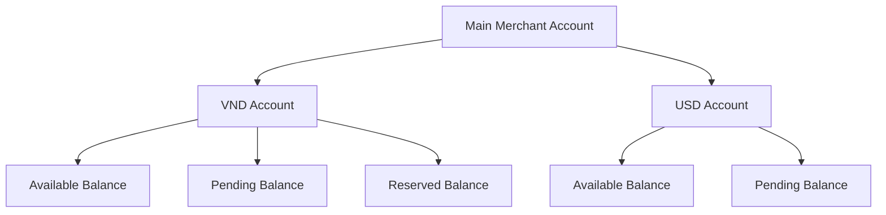
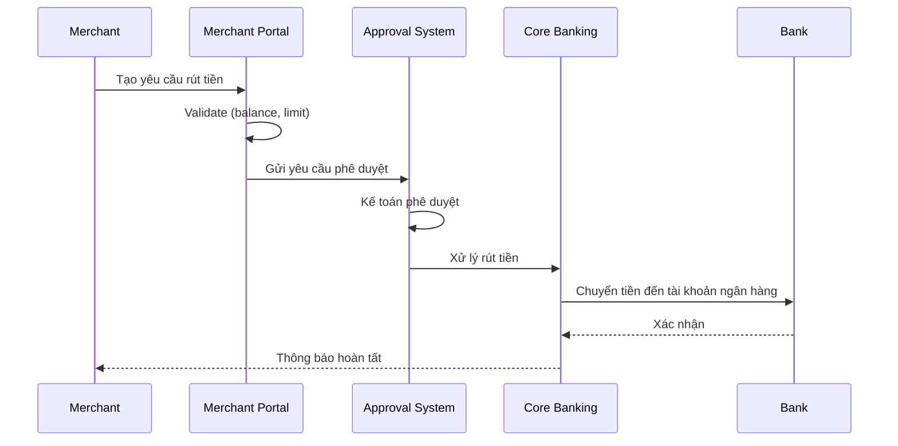
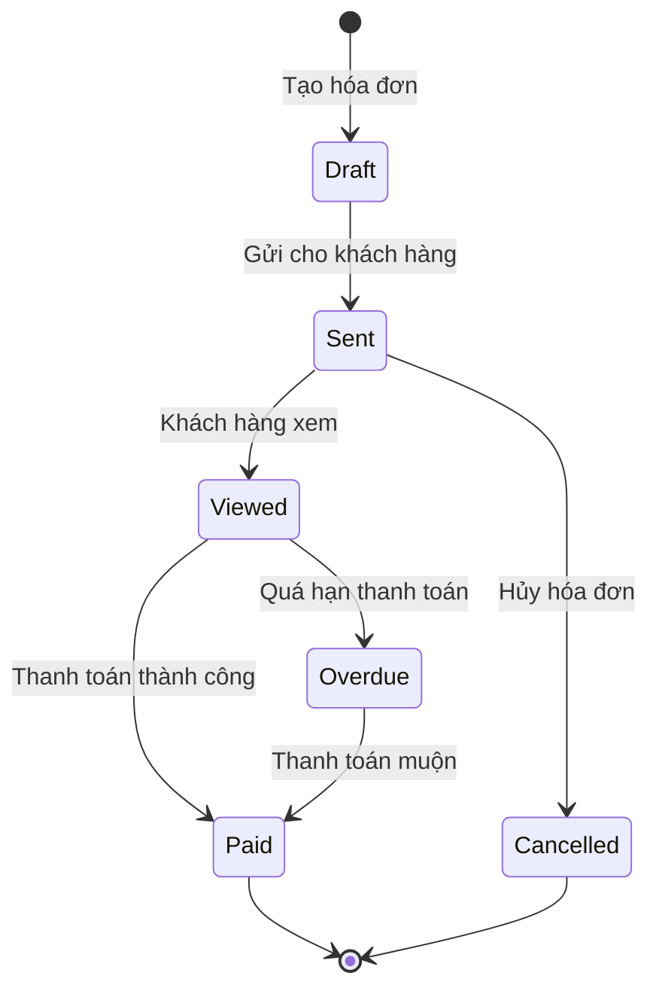
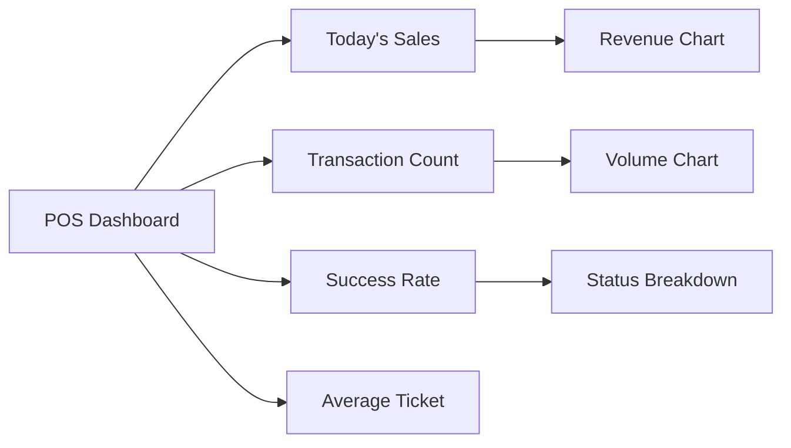
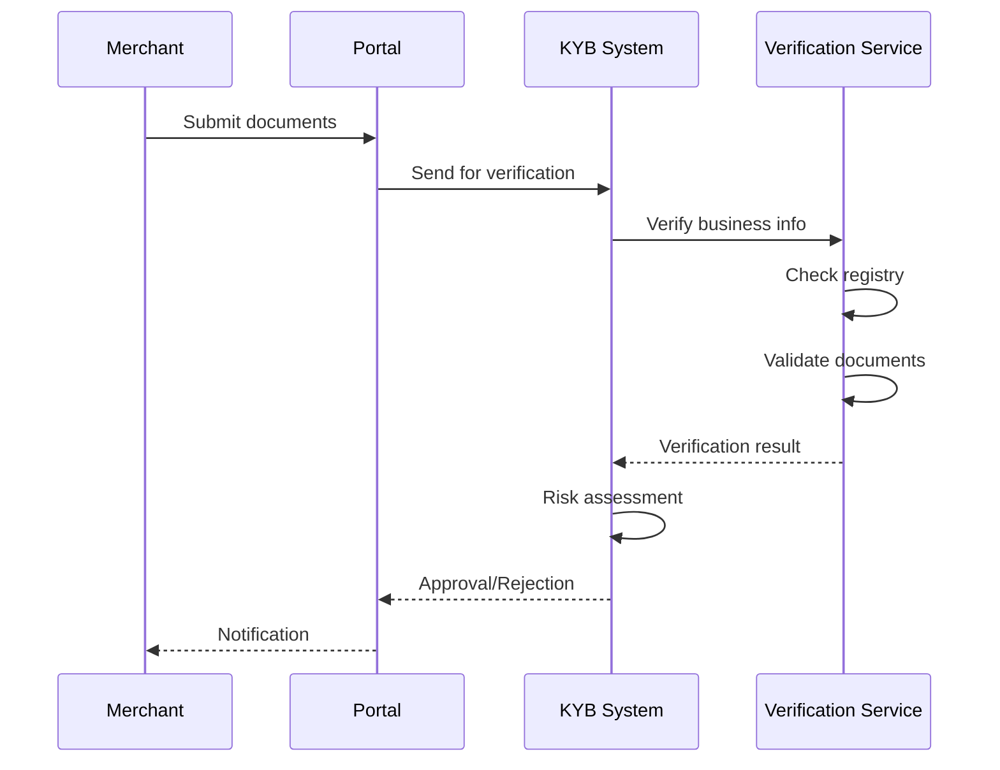

# VI. Merchant Management - Quản lý Thương nhân

## Tổng quan

Module Merchant Management là một thành phần quan trọng trong SDK.Finance, được thiết kế để hỗ trợ các thương nhân (merchants) quản lý toàn bộ hoạt động tài chính và thanh toán của họ. Module này cung cấp một portal web chuyên dụng với đầy đủ các công cụ để thương nhân có thể tự quản lý tài khoản, giao dịch, thanh toán và các dịch vụ tài chính khác.

## Merchant Portal - Cổng thông tin Thương nhân

Merchant Portal là giao diện web trung tâm cho phép thương nhân quản lý mọi hoạt động kinh doanh của mình.

### Đối tượng sử dụng trong hệ thống Masan

1. **Nhà bán lẻ (NBL)**: Các cửa hàng tạp hóa, sạp chợ chấp nhận thanh toán
2. **Merchant lớn**: Chuỗi cửa hàng, siêu thị
3. **Nhà phân phối (NPP)**: Quản lý thanh toán với retailers
4. **Service Providers**: Các đơn vị cung cấp dịch vụ thanh toán

## Chức năng chính

### 1. Quản lý Tài khoản và Số dư (Balance Management)

#### 1.1 Xem số dư tài khoản

- **Multi-currency support**: Hỗ trợ đa loại tiền tệ (VND, USD, EUR, etc.)
- **Real-time balance**: Số dư cập nhật theo thời gian thực
- **Account hierarchy**: Phân cấp tài khoản (Main account, Sub-accounts)
- **Balance breakdown**: Chi tiết số dư (Available, Pending, Reserved)



#### 1.2 Tạo tài khoản mới

- Tạo tài khoản trong các loại tiền tệ được phép
- Phân loại tài khoản theo mục đích (Settlement, Operational, Reserve)
- Thiết lập giới hạn tài khoản
- Gán quyền truy cập cho từng tài khoản

#### 1.3 Rút tiền (Withdrawal)

**Quy trình rút tiền:**



**Thông tin yêu cầu rút tiền:**
- Tài khoản nguồn (Source account)
- Tài khoản đích (Destination bank account)
- Mã SWIFT/BIC
- Tên người nhận
- Số tiền rút
- Mục đích rút tiền
- Tài liệu đính kèm (nếu cần)

**Phê duyệt phân cấp:**
- Dưới 10 triệu VND: Tự động phê duyệt
- 10-100 triệu VND: Kế toán phê duyệt
- Trên 100 triệu VND: Giám đốc tài chính phê duyệt

### 2. Quản lý Giao dịch (Transaction Management)

#### 2.1 Danh sách giao dịch

**Hiển thị thông tin:**
- Transaction ID
- Date & Time
- Transaction Type
- Amount & Currency
- Status (Pending, Completed, Failed, Reversed)
- Counter-party (đối tác giao dịch)
- Payment method
- Fees & Charges

#### 2.2 Bộ lọc nâng cao

```typescript
interface TransactionFilter {
  dateRange: {
    from: Date;
    to: Date;
  };
  transactionType: [
    'PAYMENT_IN',
    'PAYMENT_OUT',
    'TRANSFER',
    'REFUND',
    'WITHDRAWAL',
    'DEPOSIT'
  ];
  status: ['PENDING', 'COMPLETED', 'FAILED', 'REVERSED'];
  currency: string[];
  accountId: string;
  amountRange: {
    min: number;
    max: number;
  };
  searchKeyword: string;
}
```

#### 2.3 Chi tiết giao dịch

Mỗi giao dịch có thể xem đầy đủ thông tin:
- Timeline (lịch sử trạng thái)
- Ledger entries (bút toán kế toán)
- Fee breakdown (chi tiết phí)
- Related transactions (giao dịch liên quan)
- Receipts & Documents (biên lai và tài liệu)
- Dispute history (nếu có tranh chấp)

#### 2.4 Export dữ liệu

- **Format**: CSV, Excel, PDF
- **Scheduled export**: Xuất tự động theo lịch
- **Custom fields**: Tùy chọn các trường cần xuất
- **Email delivery**: Gửi báo cáo qua email

### 3. Quản lý Hóa đơn và Yêu cầu Thanh toán

#### 3.1 Tạo hóa đơn (Invoice)

**Thông tin hóa đơn:**

```typescript
interface Invoice {
  invoiceNumber: string;
  issueDate: Date;
  dueDate: Date;
  customer: {
    id: string;
    name: string;
    email: string;
    phone: string;
  };
  items: Array<{
    productId: string;
    description: string;
    quantity: number;
    unitPrice: number;
    amount: number;
    tax: number;
  }>;
  subtotal: number;
  taxAmount: number;
  totalAmount: number;
  currency: string;
  notes: string;
  attachments: string[];
}
```

#### 3.2 Phương thức gửi hóa đơn

- **Email**: Gửi trực tiếp đến khách hàng
- **SMS**: Gửi link thanh toán qua SMS
- **QR Code**: Tạo mã QR để khách quét thanh toán
- **Payment Link**: Tạo link thanh toán có thể chia sẻ
- **WhatsApp/Zalo**: Tích hợp với messaging apps

#### 3.3 Trạng thái hóa đơn



#### 3.4 Payment Request (Yêu cầu thanh toán)

**Tính năng:**
- **One-time payment**: Thanh toán một lần
- **Recurring payment**: Thanh toán định kỳ
- **Installment**: Trả góp
- **Subscription**: Thanh toán đăng ký

**Cấu hình yêu cầu thanh toán:**

```typescript
interface PaymentRequest {
  type: 'ONE_TIME' | 'RECURRING' | 'INSTALLMENT' | 'SUBSCRIPTION';
  amount: number;
  currency: string;
  description: string;
  customerId: string;
  
  // Cho recurring payment
  frequency?: 'DAILY' | 'WEEKLY' | 'MONTHLY' | 'YEARLY';
  startDate?: Date;
  endDate?: Date;
  
  // Cho installment
  numberOfInstallments?: number;
  installmentAmount?: number;
  
  // Payment methods accepted
  acceptedMethods: ['CARD', 'BANK_TRANSFER', 'QR_CODE', 'WALLET'];
  
  // Notifications
  notifyCustomer: boolean;
  reminderDays: number[];
}
```

### 4. Quản lý Điểm Bán Hàng (POS Management)

#### 4.1 Tổng quan POS

Hệ thống hỗ trợ quản lý nhiều điểm bán hàng (Physical POS hoặc Virtual POS).

**Loại POS:**
- **Physical POS**: Thiết bị vật lý tại cửa hàng
- **Virtual POS**: Terminal online (web-based)
- **Mobile POS**: Ứng dụng di động
- **Self-service Kiosk**: Máy bán hàng tự động

#### 4.2 Thêm/Cấu hình POS

**Thông tin POS:**

```typescript
interface POS {
  posId: string;
  posName: string;
  location: {
    storeName: string;
    address: string;
    city: string;
    coordinates: {
      lat: number;
      lng: number;
    };
  };
  type: 'PHYSICAL' | 'VIRTUAL' | 'MOBILE' | 'KIOSK';
  status: 'ACTIVE' | 'INACTIVE' | 'MAINTENANCE';
  
  // Security
  apiKey: string;
  secretKey: string;
  ipWhitelist: string[];
  
  // Settings
  acceptedPaymentMethods: string[];
  defaultCurrency: string;
  transactionLimit: {
    single: number;
    daily: number;
  };
  
  // Staff assigned
  operators: Array<{
    userId: string;
    name: string;
    role: string;
  }>;
}
```

#### 4.3 Quản lý bảo mật POS

- **Secret key rotation**: Tạo mới secret key định kỳ
- **IP whitelisting**: Chỉ cho phép IP được phê duyệt
- **Two-factor authentication**: Xác thực 2 lớp cho operators
- **Transaction limit**: Giới hạn giao dịch theo POS
- **Activity logging**: Ghi log tất cả hoạt động

#### 4.4 Lịch sử giao dịch theo POS

- Xem tất cả giao dịch của từng POS
- So sánh hiệu suất giữa các POS
- Phân tích theo thời gian (peak hours)
- Báo cáo doanh thu theo POS



### 5. Quản lý Sản phẩm (Product Management)

#### 5.1 Catalog sản phẩm

**Thông tin sản phẩm:**

```typescript
interface Product {
  productId: string;
  sku: string;
  name: string;
  description: string;
  category: string;
  
  pricing: {
    basePrice: number;
    currency: string;
    taxRate: number;
    discounts: Array<{
      type: 'PERCENTAGE' | 'FIXED';
      value: number;
      validFrom: Date;
      validTo: Date;
    }>;
  };
  
  inventory: {
    tracked: boolean;
    quantity: number;
    unit: string;
    lowStockAlert: number;
  };
  
  images: string[];
  tags: string[];
  isActive: boolean;
}
```

#### 5.2 Tính năng sản phẩm

- **Bulk import**: Nhập hàng loạt sản phẩm từ CSV/Excel
- **Variant management**: Quản lý biến thể (size, color, etc.)
- **Bundle products**: Tạo gói sản phẩm combo
- **Dynamic pricing**: Giá linh hoạt theo thời gian/khách hàng
- **Stock tracking**: Theo dõi tồn kho

### 6. Báo cáo và Phân tích (Reports & Analytics)

#### 6.1 Dashboard tổng quan

**Key metrics hiển thị:**

```typescript
interface MerchantDashboard {
  summary: {
    totalRevenue: number;
    transactionCount: number;
    successRate: number;
    averageTicket: number;
    activeCustomers: number;
  };
  
  charts: {
    revenueOverTime: TimeSeriesData;
    paymentMethodBreakdown: PieChartData;
    topProducts: BarChartData;
    customerGrowth: LineChartData;
  };
  
  alerts: Array<{
    type: 'WARNING' | 'ERROR' | 'INFO';
    message: string;
    timestamp: Date;
  }>;
}
```

#### 6.2 Báo cáo chuẩn

**Các loại báo cáo:**

1. **Revenue Report** (Báo cáo doanh thu)
   - Daily/Weekly/Monthly/Yearly
   - By product category
   - By payment method
   - By POS location

2. **Transaction Report** (Báo cáo giao dịch)
   - Successful transactions
   - Failed transactions
   - Refunds and chargebacks
   - Settlement report

3. **Customer Report** (Báo cáo khách hàng)
   - New customers
   - Returning customers
   - Customer lifetime value
   - Customer segmentation

4. **Financial Report** (Báo cáo tài chính)
   - Income statement
   - Fee breakdown
   - Tax summary
   - Reconciliation report

#### 6.3 Custom Reports

- **Report builder**: Tạo báo cáo tùy chỉnh
- **Scheduled reports**: Lên lịch gửi báo cáo định kỳ
- **Data export**: Xuất dữ liệu thô để phân tích
- **API access**: Truy cập dữ liệu qua API

### 7. Quản lý Hồ sơ Tài khoản (Account Profile)

#### 7.1 Thông tin công ty

```typescript
interface MerchantProfile {
  company: {
    legalName: string;
    tradingName: string;
    registrationNumber: string;
    taxId: string;
    businessType: string;
    industryCategory: string;
    website: string;
    
    address: {
      street: string;
      city: string;
      state: string;
      postalCode: string;
      country: string;
    };
    
    contact: {
      phone: string;
      email: string;
      supportEmail: string;
    };
  };
  
  documents: Array<{
    type: 'BUSINESS_LICENSE' | 'TAX_CERT' | 'BANK_STATEMENT';
    fileName: string;
    uploadDate: Date;
    status: 'PENDING' | 'APPROVED' | 'REJECTED';
  }>;
}
```

#### 7.2 KYB (Know Your Business)

**Quy trình xác minh:**



**Tài liệu yêu cầu:**
- Giấy phép kinh doanh
- Giấy chứng nhận đăng ký thuế
- Giấy tờ định danh người đại diện
- Sao kê ngân hàng (3 tháng gần nhất)
- Hợp đồng thuê mặt bằng (nếu có)

#### 7.3 Quản lý tài khoản ngân hàng

- **Add bank account**: Thêm tài khoản ngân hàng để nhận tiền
- **Bank verification**: Xác thực tài khoản ngân hàng
- **Multiple accounts**: Hỗ trợ nhiều tài khoản
- **Default account**: Thiết lập tài khoản mặc định

### 8. Quản lý Người dùng và Phân quyền

#### 8.1 User Roles

```typescript
enum MerchantUserRole {
  OWNER = 'OWNER',              // Toàn quyền
  ADMIN = 'ADMIN',              // Quản trị viên
  ACCOUNTANT = 'ACCOUNTANT',    // Kế toán
  OPERATOR = 'OPERATOR',        // Nhân viên vận hành
  VIEWER = 'VIEWER'             // Chỉ xem
}
```

#### 8.2 Permission Matrix

| Chức năng | Owner | Admin | Accountant | Operator | Viewer |
|-----------|-------|-------|------------|----------|--------|
| Xem dashboard | ✅ | ✅ | ✅ | ✅ | ✅ |
| Xem giao dịch | ✅ | ✅ | ✅ | ✅ | ✅ |
| Tạo hóa đơn | ✅ | ✅ | ✅ | ✅ | ❌ |
| Rút tiền | ✅ | ✅ | ❌ | ❌ | ❌ |
| Phê duyệt rút tiền | ✅ | ✅ | ✅ | ❌ | ❌ |
| Quản lý POS | ✅ | ✅ | ❌ | ✅ | ❌ |
| Quản lý user | ✅ | ✅ | ❌ | ❌ | ❌ |
| Cấu hình hệ thống | ✅ | ✅ | ❌ | ❌ | ❌ |

#### 8.3 Audit Log

Ghi log tất cả hành động của users:
- Login/Logout
- Transaction approvals
- Configuration changes
- Data exports
- Failed access attempts

## Tích hợp với Payment Providers

### 1. Payment Gateway Integration

SDK.Finance hỗ trợ tích hợp với các payment gateway hàng đầu:

- **Cybersource** (Visa)
- **Mastercard Gateway**
- **PayPal**
- **Stripe**
- **Local providers**: Napas, VNPay, MoMo, ZaloPay

### 2. Phương thức thanh toán

```typescript
enum PaymentMethod {
  CARD = 'CARD',                    // Thẻ tín dụng/ghi nợ
  BANK_TRANSFER = 'BANK_TRANSFER',  // Chuyển khoản ngân hàng
  QR_CODE = 'QR_CODE',              // Quét mã QR
  WALLET = 'WALLET',                // Ví điện tử
  CASH = 'CASH',                    // Tiền mặt (POS)
  INSTALLMENT = 'INSTALLMENT'       // Trả góp
}
```

### 3. Card Processing

**Hỗ trợ các loại thẻ:**
- Visa
- Mastercard
- JCB
- American Express
- Domestic cards (ATM nội địa)

**Tính năng:**
- **Tokenization**: Lưu thẻ an toàn
- **3D Secure**: Xác thực 3 lớp
- **Card verification**: CVV check
- **Fraud detection**: Phát hiện gian lận
- **Chargeback management**: Quản lý hoàn tiền tranh chấp

## API Integration cho Developers

### REST API Endpoints

```typescript
// Merchant API Examples

// Get merchant balance
GET /api/v1/merchant/balance

// Get transactions
GET /api/v1/merchant/transactions?from={date}&to={date}&limit={n}

// Create invoice
POST /api/v1/merchant/invoices
{
  "amount": 1000000,
  "currency": "VND",
  "customerId": "cust_123",
  "items": [...]
}

// Create payment request
POST /api/v1/merchant/payment-requests
{
  "type": "ONE_TIME",
  "amount": 500000,
  "currency": "VND",
  "description": "Payment for order #123"
}

// Get POS list
GET /api/v1/merchant/pos

// Create POS transaction
POST /api/v1/merchant/pos/{posId}/transactions
{
  "amount": 100000,
  "currency": "VND",
  "paymentMethod": "QR_CODE"
}
```

### Webhooks

Nhận thông báo real-time về các sự kiện:

```typescript
enum WebhookEvent {
  PAYMENT_COMPLETED = 'payment.completed',
  PAYMENT_FAILED = 'payment.failed',
  INVOICE_PAID = 'invoice.paid',
  WITHDRAWAL_APPROVED = 'withdrawal.approved',
  BALANCE_LOW = 'balance.low',
  CHARGEBACK_RECEIVED = 'chargeback.received'
}

// Webhook payload example
interface WebhookPayload {
  event: WebhookEvent;
  timestamp: string;
  data: {
    transactionId: string;
    amount: number;
    currency: string;
    status: string;
    // ... other relevant data
  };
  signature: string; // HMAC signature for verification
}
```

## Bảo mật và Tuân thủ

### 1. Security Features

- **PCI-DSS Compliance**: Tuân thủ chuẩn bảo mật thẻ thanh toán
- **Data encryption**: Mã hóa dữ liệu nhạy cảm
- **SSL/TLS**: Kết nối bảo mật
- **API authentication**: API key + Secret key
- **Rate limiting**: Giới hạn request để chống DDoS
- **Fraud detection**: Hệ thống phát hiện gian lận

### 2. Compliance

- **AML (Anti-Money Laundering)**: Chống rửa tiền
- **KYC/KYB**: Xác minh danh tính khách hàng/doanh nghiệp
- **GDPR**: Bảo vệ dữ liệu cá nhân (nếu có customer EU)
- **Local regulations**: Tuân thủ quy định Việt Nam

## Ứng dụng trong hệ thống Masan

### Use Cases cụ thể

#### 1. Nhà bán lẻ (Retailers)

**Kịch bản:**
- NBL tạo tài khoản merchant trên hệ thống
- Nhận QR code cố định tại cửa hàng
- Khách hàng quét mã để thanh toán
- NBL theo dõi doanh thu realtime trên app
- Cuối ngày rút tiền về tài khoản ngân hàng

**Lợi ích:**
- Giảm tiền mặt
- Tự động ghi sổ
- Dễ dàng đối soát
- Nhận khuyến mãi từ Masan

#### 2. Nhà phân phối (Distributors)

**Kịch bản:**
- NPP có portal quản lý nhiều retailers
- Tạo hóa đơn gửi cho retailers
- Retailers thanh toán qua ví
- NPP theo dõi công nợ
- Tự động đối soát cuối tháng

**Lợi ích:**
- Quản lý công nợ tốt hơn
- Giảm thời gian đối soát
- Tăng tốc độ thu tiền
- Giảm rủi ro tiền mặt

#### 3. Masan Consumer

**Kịch bản:**
- Chạy chương trình khuyến mãi
- Tích hợp với DMS
- Theo dõi hiệu quả campaign
- Phân tích hành vi mua hàng
- Chăm sóc khách hàng tốt hơn

## Best Practices

### Cho Merchants

1. **Bảo mật:**
   - Không chia sẻ API keys
   - Thay đổi password định kỳ
   - Bật 2FA cho tất cả users
   - Giới hạn quyền truy cập theo vai trò

2. **Vận hành:**
   - Đối soát giao dịch hàng ngày
   - Kiểm tra balance thường xuyên
   - Backup dữ liệu quan trọng
   - Cập nhật thông tin KYB

3. **Customer Experience:**
   - Cung cấp nhiều phương thức thanh toán
   - Gửi receipt sau mỗi giao dịch
   - Xử lý khiếu nại nhanh chóng
   - Hỗ trợ refund khi cần thiết

### Cho Developers

1. **Integration:**
   - Đọc kỹ API documentation
   - Test trên sandbox trước
   - Implement webhook để nhận notification
   - Handle errors properly
   - Implement retry logic

2. **Security:**
   - Lưu credentials an toàn
   - Validate webhook signatures
   - Implement rate limiting
   - Log all API calls
   - Monitor for suspicious activity

## Kết luận

Module Merchant Management của SDK.Finance cung cấp một giải pháp toàn diện cho việc quản lý hoạt động tài chính của thương nhân. Với giao diện thân thiện, tính năng đa dạng và khả năng tích hợp linh hoạt, module này giúp thương nhân:

- ✅ Quản lý tài chính hiệu quả
- ✅ Chấp nhận thanh toán đa dạng
- ✅ Tối ưu hóa quy trình vận hành
- ✅ Tuân thủ các quy định pháp lý
- ✅ Cải thiện trải nghiệm khách hàng
- ✅ Tăng trưởng doanh thu

Đối với hệ thống Masan, module này đóng vai trò then chốt trong việc số hóa quy trình thanh toán và phân phối, giúp giảm tiền mặt và tăng hiệu quả kinh doanh cho toàn bộ chuỗi giá trị.

