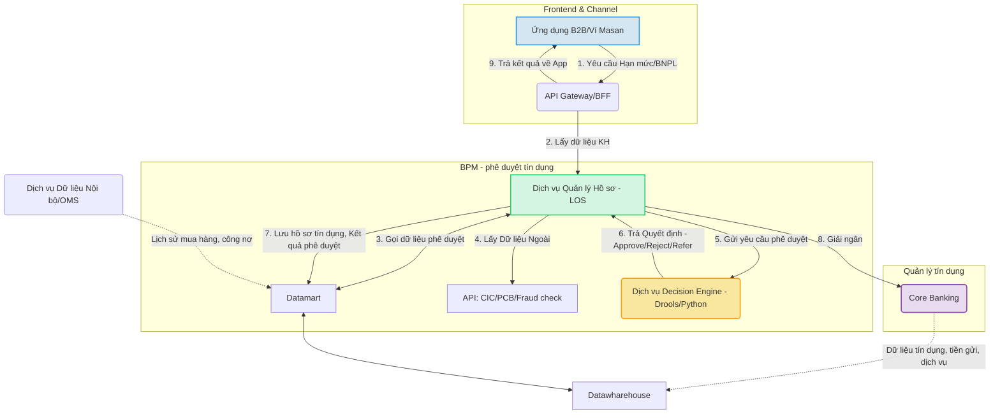
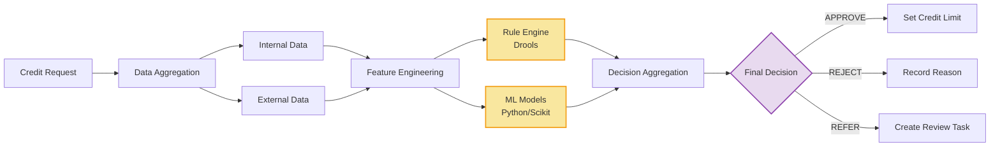
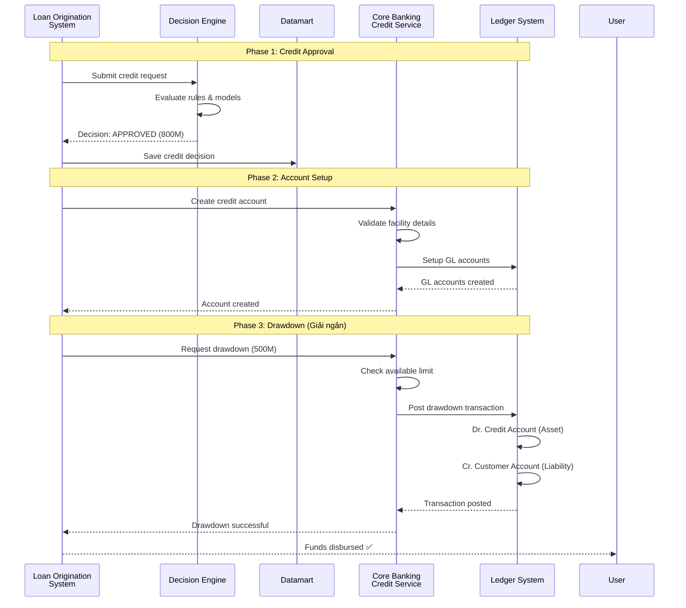
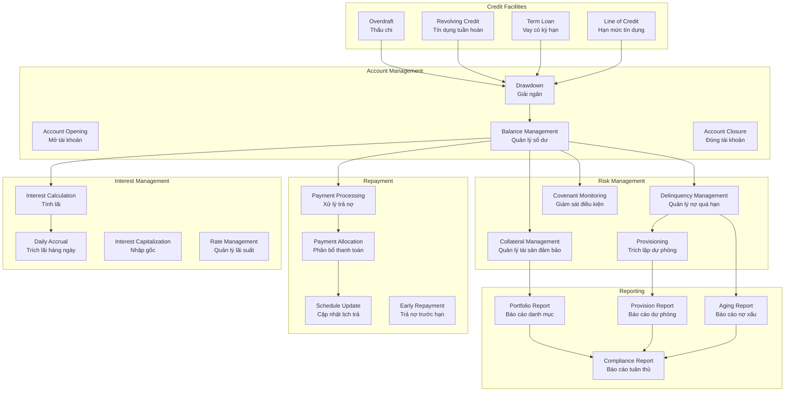
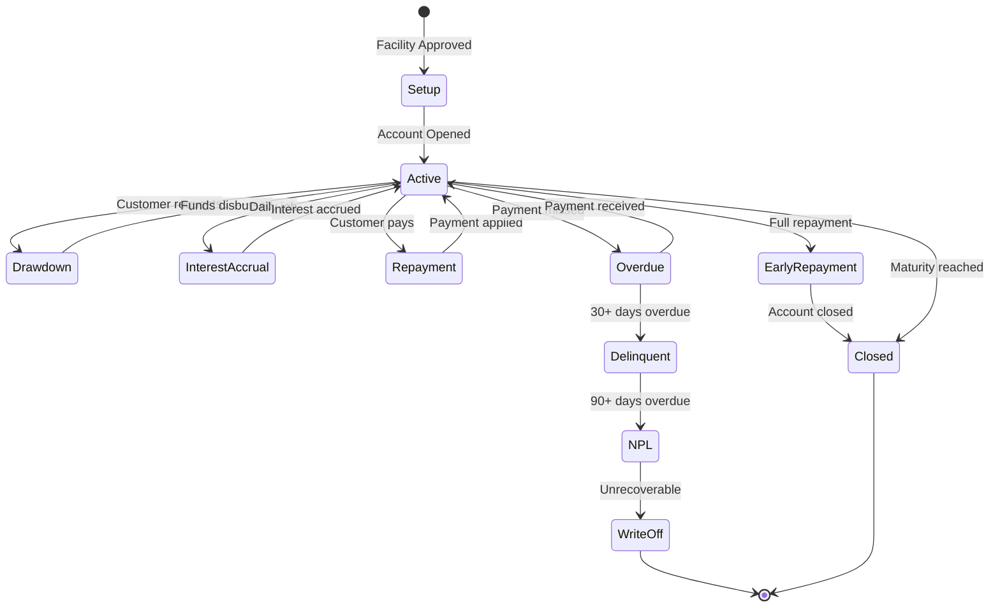
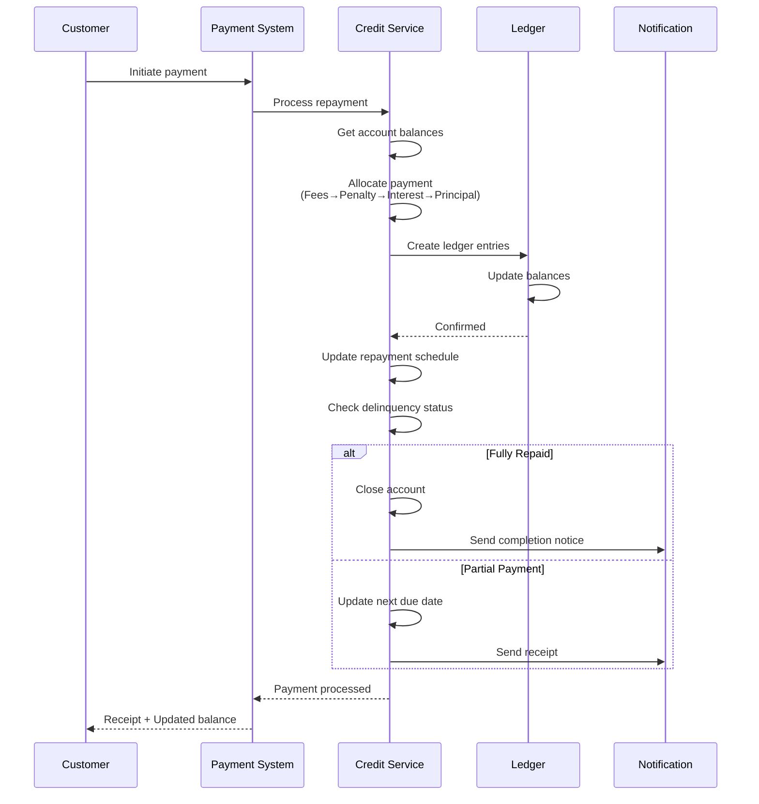
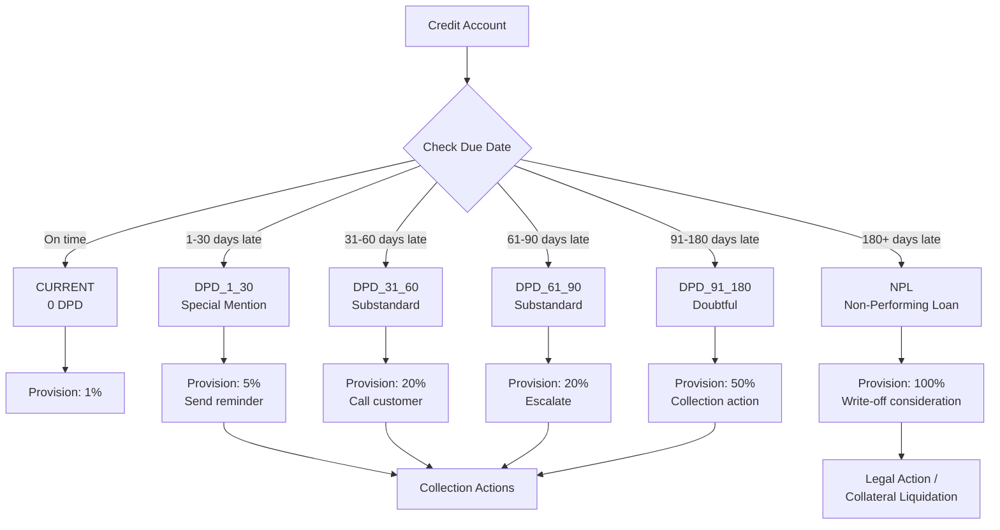
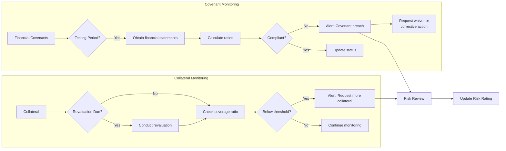

# VII. Credit Service - Dịch vụ Tín dụng

## Tổng quan

Credit Service trong Core Banking quản lý tài khoản tín dụng sau khi đã được phê duyệt, bao gồm quản lý hạn mức, giải ngân, tính lãi, trả nợ, và giám sát các điều kiện tín dụng. Module này đảm bảo tính chính xác và tuân thủ trong quản lý danh mục tín dụng.

## Quy trình Khởi tạo và Phê duyệt Tín dụng

### Luồng tổng thể từ Yêu cầu đến Giải ngân

Trước khi Credit Service quản lý tài khoản tín dụng, cần có quy trình phê duyệt hạn mức qua **Loan Origination System (LOS)** và **Decision Engine**. Sơ đồ dưới đây mô tả luồng từ yêu cầu khách hàng đến giải ngân:



### Giải thích các bước

**1. Yêu cầu từ Khách hàng (Frontend)**
- **Ứng dụng B2B/Ví Masan**: NPP hoặc NBL yêu cầu hạn mức tín dụng hoặc BNPL (Buy Now Pay Later)
- Request được gửi qua **API Gateway/BFF** (Backend for Frontend)

**2-3. Loan Origination System (LOS)**
- **LOS** nhận yêu cầu và thu thập dữ liệu khách hàng:
  - Thông tin CIF từ Core Banking
  - Lịch sử giao dịch từ Datamart
  - Dữ liệu công nợ hiện tại
- LOS truy vấn **Datamart** để lấy dữ liệu lịch sử phê duyệt, hồ sơ tín dụng cũ

**4. Lấy Dữ liệu Ngoài (External Data)**
- **CIC (Credit Information Center)**: Lịch sử tín dụng từ NHNN
- **PCB (Police Clearance Bureau)**: Kiểm tra lý lịch tư pháp
- **Fraud Detection API**: Phát hiện gian lận
- **Financial Data Providers**: Báo cáo tài chính (cho doanh nghiệp)

**5-6. Decision Engine**
- **Decision Engine** (Drools/Python) xử lý quyết định tín dụng:
  - Apply business rules (credit policy)
  - Scoring models (credit score, behavior score)
  - Risk assessment
  - Fraud detection
- **Output**: 
  - ✅ **APPROVE**: Phê duyệt với hạn mức cụ thể
  - ❌ **REJECT**: Từ chối
  - 🔄 **REFER**: Cần review thủ công (manual underwriting)

**7. Lưu trữ Kết quả**
- **Datamart**: Lưu hồ sơ tín dụng, kết quả phê duyệt, điểm số
- Tạo audit trail cho compliance

**8. Giải ngân (Core Banking)**
- Nếu APPROVED → Tạo **Credit Account** trong Core Banking
- Thực hiện giải ngân (drawdown) theo hạn mức đã phê duyệt
- **Credit Service** bắt đầu quản lý account lifecycle

**9. Thông báo Khách hàng**
- Trả kết quả về ứng dụng B2B/Ví Masan
- Khách hàng nhận thông báo về hạn mức đã được phê duyệt

### Tích hợp Data Sources

**Dữ liệu Nội bộ:**
- **OMS (Order Management System)**: Lịch sử mua hàng, tần suất đặt hàng
- **Core Banking**: Số dư tài khoản, lịch sử giao dịch, dịch vụ đang sử dụng
- **Datamart**: Tổng hợp dữ liệu phê duyệt, hành vi khách hàng

**Dữ liệu Ngoài:**
- **CIC**: Credit bureau data
- **PCB**: Background check
- **Fraud Detection**: External fraud databases

### Use Case: NPP yêu cầu Hạn mức Tín dụng

```typescript
// 1. NPP gửi yêu cầu qua Ví Masan
const creditRequest = {
  customerId: 'NPP_001',
  customerType: 'B2B_DISTRIBUTOR',
  requestedAmount: 1_000_000_000,  // 1 tỷ VNĐ
  purpose: 'WORKING_CAPITAL',
  requestDate: '2025-01-17'
};

// 2-3. LOS thu thập dữ liệu
const customerData = await losService.gatherCustomerData({
  customerId: 'NPP_001',
  sources: [
    'CIF',                    // Customer Information File
    'TRANSACTION_HISTORY',    // 12 months history
    'EXISTING_FACILITIES',    // Current credit lines
    'ORDER_HISTORY'           // OMS data
  ]
});

// 4. Lấy dữ liệu external
const externalData = await Promise.all([
  cicService.getCreditReport('NPP_001'),        // CIC credit history
  fraudService.checkFraud('NPP_001'),           // Fraud detection
  pcbService.getBackgroundCheck('NPP_001')      // Police clearance
]);

// 5-6. Decision Engine phê duyệt
const decisionRequest = {
  customer: customerData,
  external: externalData,
  requestedAmount: 1_000_000_000,
  facilityType: 'REVOLVING_CREDIT'
};

const decision = await decisionEngine.evaluate(decisionRequest);

// Decision output
if (decision.status === 'APPROVED') {
  // 7. Lưu kết quả
  await datamart.saveCreditDecision({
    customerId: 'NPP_001',
    decision: 'APPROVED',
    approvedAmount: decision.approvedAmount,  // 800M (might be lower than requested)
    creditScore: decision.creditScore,        // 720/900
    riskGrade: decision.riskGrade,           // 'A-'
    approvalDate: new Date(),
    expiryDate: addMonths(new Date(), 12)
  });
  
  // 8. Giải ngân - Tạo Credit Account trong Core Banking
  const creditAccount = await coreBanking.createCreditAccount({
    customerId: 'NPP_001',
    accountType: 'REVOLVING_CREDIT',
    facility: {
      facilityType: 'TRADE_FINANCE',
      approvedAmount: decision.approvedAmount,
      currency: 'VND',
      approvedDate: new Date().toISOString(),
      expiryDate: addMonths(new Date(), 12).toISOString()
    },
    interest: {
      baseRate: 10,
      spread: 2,
      effectiveRate: 12,
      calculationMethod: 'REDUCING_BALANCE'
    },
    status: 'ACTIVE'
  });
  
  // 9. Thông báo khách hàng
  return {
    status: 'APPROVED',
    message: 'Hạn mức tín dụng đã được phê duyệt',
    approvedAmount: decision.approvedAmount,
    accountNumber: creditAccount.accountNumber,
    availableLimit: decision.approvedAmount,
    interestRate: 12
  };
  
} else if (decision.status === 'REJECT') {
  return {
    status: 'REJECTED',
    reason: decision.rejectReason,
    message: 'Yêu cầu hạn mức không được phê duyệt'
  };
  
} else if (decision.status === 'REFER') {
  // Cần manual review
  await createManualReviewTask({
    customerId: 'NPP_001',
    reason: decision.referReason,
    assignTo: 'CREDIT_TEAM'
  });
  
  return {
    status: 'PENDING',
    message: 'Hồ sơ đang được xem xét thủ công',
    estimatedTime: '24-48 giờ'
  };
}
```

### Decision Engine Rules (Example)

```typescript
// Credit Policy Rules
interface CreditPolicyRule {
  name: string;
  condition: (data: CustomerData) => boolean;
  action: 'APPROVE' | 'REJECT' | 'REFER';
  reason: string;
}

const creditPolicyRules: CreditPolicyRule[] = [
  {
    name: 'MIN_TENURE',
    condition: (data) => data.customerTenure < 6, // < 6 months
    action: 'REJECT',
    reason: 'Khách hàng mới, chưa đủ lịch sử giao dịch'
  },
  {
    name: 'EXISTING_OVERDUE',
    condition: (data) => data.currentOverdue > 0,
    action: 'REJECT',
    reason: 'Có khoản nợ quá hạn chưa thanh toán'
  },
  {
    name: 'CIC_NPL',
    condition: (data) => data.cicData.hasNPL === true,
    action: 'REJECT',
    reason: 'Có nợ xấu tại CIC'
  },
  {
    name: 'HIGH_RISK_FRAUD',
    condition: (data) => data.fraudScore > 70,
    action: 'REJECT',
    reason: 'Nguy cơ gian lận cao'
  },
  {
    name: 'CREDIT_SCORE_LOW',
    condition: (data) => data.creditScore < 500,
    action: 'REFER',
    reason: 'Điểm tín dụng thấp, cần xem xét thủ công'
  },
  {
    name: 'LARGE_AMOUNT',
    condition: (data) => data.requestedAmount > 5_000_000_000, // > 5 tỷ
    action: 'REFER',
    reason: 'Hạn mức lớn, cần phê duyệt cấp cao'
  },
  {
    name: 'AUTO_APPROVE',
    condition: (data) => 
      data.creditScore >= 700 &&
      data.customerTenure >= 12 &&
      data.requestedAmount <= 2_000_000_000 &&
      data.currentOverdue === 0,
    action: 'APPROVE',
    reason: 'Đủ điều kiện phê duyệt tự động'
  }
];

// Apply rules
function evaluateCreditRequest(data: CustomerData): DecisionResult {
  for (const rule of creditPolicyRules) {
    if (rule.condition(data)) {
      return {
        status: rule.action,
        reason: rule.reason,
        ruleName: rule.name
      };
    }
  }
  
  // Default: Refer
  return {
    status: 'REFER',
    reason: 'Không match rule nào, cần manual review'
  };
}
```

### Decision Engine Architecture



**Components:**

1. **Data Aggregation**
   - Collect từ internal & external sources
   - Normalize & validate data

2. **Feature Engineering**
   - Calculate metrics: DTI (Debt-to-Income), utilization rate, payment history
   - Create derived features for ML models

3. **Rule Engine (Drools)**
   - Business rules từ Credit Policy
   - Hard rules (reject ngay nếu vi phạm)
   - Soft rules (ảnh hưởng credit limit)

4. **ML Models (Python)**
   - **Credit Scoring Model**: Dự đoán khả năng trả nợ
   - **Fraud Detection Model**: Phát hiện gian lận
   - **Limit Recommendation Model**: Đề xuất hạn mức phù hợp

5. **Decision Aggregation**
   - Kết hợp kết quả từ rules và models
   - Apply business logic
   - Generate final decision + reason

### Integration với Core Banking

Sau khi Decision Engine phê duyệt, **Credit Account** được tạo trong Core Banking:



### Phân biệt LOS và Credit Service

| Aspect | LOS (Loan Origination) | Credit Service (Core Banking) |
|--------|------------------------|-------------------------------|
| **Scope** | Phê duyệt & setup | Quản lý lifecycle |
| **Input** | Credit application | Approved facility |
| **Process** | Underwriting, scoring, approval | Drawdown, interest, repayment |
| **Output** | Approved facility | Account balances, transactions |
| **Timeline** | 1-3 days (one-time) | Ongoing (daily/monthly) |
| **Users** | Credit team, underwriters | Operations, customers |
| **Data** | CIC, PCB, financial statements | Account balances, payment history |

**LOS**: "Should we lend?" → Decision  
**Credit Service**: "How do we manage the loan?" → Execution

---

## Sơ đồ Tổng quan

### Các chức năng chính của Credit Service



### Vòng đời Credit Account



### Luồng xử lý Repayment (Trả nợ)



### Interest Accrual Process (Quy trình tính lãi)

```mermaid
flowchart TD
    A[Daily Accrual Job] --> B{Get Active<br/>Credit Accounts}
    B --> C[For each account]
    
    C --> D[Get principal outstanding]
    C --> E[Get interest rate]
    C --> F[Get last accrual date]
    
    D --> G[Calculate daily interest]
    E --> G
    F --> G
    
    G --> H{Calculation Method}
    
    H -->|Flat| I[Principal × Rate × Days / 365]
    H -->|Reducing Balance| J[Outstanding × Daily Rate × Days]
    H -->|Compound| K[Outstanding × (1+Rate)^Days - 1]
    
    I --> L[Create accrual entry]
    J --> L
    K --> L
    
    L --> M[Update interest outstanding]
    M --> N[Update last accrual date]
    
    N --> O{More accounts?}
    O -->|Yes| C
    O -->|No| P[Generate accrual report]
    P --> Q[End]
```

### Delinquency Management (Quản lý nợ quá hạn)



### Collateral & Covenant Monitoring



## Credit Account Structure

### Cấu trúc tài khoản tín dụng

```typescript
interface CreditAccount {
  accountId: string;
  accountNumber: string;
  customerId: string;
  
  // Account type
  accountType: 'OVERDRAFT' | 'TERM_LOAN' | 'REVOLVING_CREDIT' | 'LINE_OF_CREDIT';
  
  // Facility details
  facility: {
    facilityId: string;
    facilityType: string;
    approvedAmount: number;
    currency: string;
    approvedDate: string;
    expiryDate?: string;
  };
  
  // Balances
  balances: {
    principalOutstanding: number;    // Gốc còn lại
    interestOutstanding: number;     // Lãi chưa trả
    feesOutstanding: number;         // Phí chưa trả
    totalOutstanding: number;        // Tổng nợ
    
    availableLimit: number;          // Hạn mức khả dụng
    utilizationAmount: number;       // Đã sử dụng
    utilizationRate: number;         // Tỷ lệ sử dụng (%)
  };
  
  // Interest
  interest: {
    baseRate: number;               // Base rate
    spread: number;                 // Spread/margin
    effectiveRate: number;          // Lãi suất hiệu dụng
    calculationMethod: 'FLAT' | 'REDUCING_BALANCE' | 'COMPOUND';
    dayCountConvention: 'ACTUAL_360' | 'ACTUAL_365' | '30_360';
    
    accrualFrequency: 'DAILY' | 'MONTHLY' | 'QUARTERLY';
    paymentFrequency: 'MONTHLY' | 'QUARTERLY' | 'SEMI_ANNUAL' | 'ANNUAL';
  };
  
  // Repayment
  repayment: {
    repaymentType: 'AMORTIZING' | 'BULLET' | 'BALLOON';
    installmentAmount?: number;
    numberOfInstallments?: number;
    nextPaymentDate?: string;
    maturityDate?: string;
  };
  
  // Status
  status: 'ACTIVE' | 'SUSPENDED' | 'CLOSED' | 'WRITTEN_OFF';
  delinquencyStatus?: 'CURRENT' | 'DPD_30' | 'DPD_60' | 'DPD_90' | 'NPL';
  
  // Collateral
  collateral?: Array<{
    collateralId: string;
    type: string;
    value: number;
    coverageRatio: number;
  }>;
  
  // Covenants
  covenants?: Array<{
    covenantId: string;
    type: string;
    threshold: any;
    status: 'COMPLIANT' | 'BREACH';
  }>;
  
  // Dates
  openedDate: string;
  lastTransactionDate?: string;
  closedDate?: string;
}
```

## Credit Facility Types

### 1. Overdraft (Thấu chi)

```typescript
interface OverdraftFacility {
  facilityType: 'OVERDRAFT';
  limit: number;
  
  // Interest charged on daily outstanding balance
  interestRate: number;
  minimumBalance?: number;
  
  // Fees
  fees: {
    setupFee: number;
    maintenanceFee: number;     // Monthly
    overLimitFee?: number;
  };
  
  // Review
  reviewFrequency: 'MONTHLY' | 'QUARTERLY' | 'ANNUAL';
  nextReviewDate: string;
}

async function processOverdraftInterest(
  accountId: string,
  date: string
): Promise<void> {
  const account = await getCreditAccount(accountId);
  
  // Calculate daily interest on outstanding balance
  const dailyRate = account.interest.effectiveRate / 365 / 100;
  const interestAmount = account.balances.principalOutstanding * dailyRate;
  
  // Accrue interest
  await accrueInterest({
    accountId,
    amount: interestAmount,
    date,
    type: 'OVERDRAFT_INTEREST'
  });
}
```

### 2. Revolving Credit (Tín dụng tuần hoàn)

```typescript
interface RevolvingCreditFacility {
  facilityType: 'REVOLVING_CREDIT';
  creditLimit: number;
  
  // Can draw down and repay multiple times within limit
  drawdownMinimum: number;
  repaymentFlexible: boolean;
  
  // Interest only on utilized amount
  interestRate: number;
  commitmentFee?: number;      // Fee on unused portion
  
  // Tenor
  facilityTenor: number;        // months
  expiryDate: string;
}

async function drawdown(
  accountId: string,
  amount: number
): Promise<DrawdownResult> {
  const account = await getCreditAccount(accountId);
  
  // Check available limit
  if (amount > account.balances.availableLimit) {
    throw new Error('Exceeds available limit');
  }
  
  // Check minimum drawdown
  if (amount < account.facility.drawdownMinimum) {
    throw new Error('Below minimum drawdown amount');
  }
  
  // Process drawdown
  await createTransaction({
    accountId,
    type: 'DRAWDOWN',
    amount,
    valueDate: new Date(),
    description: 'Credit drawdown'
  });
  
  // Update balances
  await updateBalances(accountId, {
    principalOutstanding: account.balances.principalOutstanding + amount,
    utilizationAmount: account.balances.utilizationAmount + amount,
    availableLimit: account.balances.availableLimit - amount
  });
  
  return {
    success: true,
    newOutstanding: account.balances.principalOutstanding + amount,
    newAvailable: account.balances.availableLimit - amount
  };
}
```

### 3. Term Loan (Vay có kỳ hạn)

```typescript
interface TermLoanFacility {
  facilityType: 'TERM_LOAN';
  loanAmount: number;
  tenor: number;                  // months
  
  // Repayment schedule
  repaymentSchedule: Array<{
    installmentNumber: number;
    dueDate: string;
    principalAmount: number;
    interestAmount: number;
    totalAmount: number;
    status: 'PENDING' | 'PAID' | 'OVERDUE';
  }>;
  
  // Disbursement
  disbursementSchedule: Array<{
    trancheNumber: number;
    amount: number;
    plannedDate: string;
    actualDate?: string;
    status: 'PENDING' | 'DISBURSED';
  }>;
}

async function generateRepaymentSchedule(
  principal: number,
  annualRate: number,
  tenorMonths: number,
  repaymentType: 'AMORTIZING' | 'BULLET'
): Promise<RepaymentSchedule[]> {
  const schedule: RepaymentSchedule[] = [];
  const monthlyRate = annualRate / 12 / 100;
  
  if (repaymentType === 'AMORTIZING') {
    // Equal monthly installment (EMI)
    const emi = principal * 
      (monthlyRate * Math.pow(1 + monthlyRate, tenorMonths)) /
      (Math.pow(1 + monthlyRate, tenorMonths) - 1);
    
  let remainingPrincipal = principal;
  
    for (let i = 1; i <= tenorMonths; i++) {
      const interestAmount = remainingPrincipal * monthlyRate;
      const principalAmount = emi - interestAmount;
      remainingPrincipal -= principalAmount;
    
    schedule.push({
      installmentNumber: i,
      dueDate: addMonths(new Date(), i).toISOString(),
        principalAmount: Math.round(principalAmount),
        interestAmount: Math.round(interestAmount),
        totalAmount: Math.round(emi),
      remainingBalance: Math.max(0, Math.round(remainingPrincipal)),
      status: 'PENDING'
    });
    }
  } else if (repaymentType === 'BULLET') {
    // Interest only payments, principal at maturity
    for (let i = 1; i <= tenorMonths; i++) {
      const interestAmount = principal * monthlyRate;
      const principalAmount = i === tenorMonths ? principal : 0;
      
      schedule.push({
        installmentNumber: i,
        dueDate: addMonths(new Date(), i).toISOString(),
        principalAmount,
        interestAmount: Math.round(interestAmount),
        totalAmount: Math.round(principalAmount + interestAmount),
        remainingBalance: i === tenorMonths ? 0 : principal,
        status: 'PENDING'
      });
    }
  }
  
  return schedule;
}
```

## Interest Calculation & Accrual

### Interest Calculation Methods

```typescript
enum InterestCalculationMethod {
  FLAT = 'FLAT',                          // Lãi suất cố định trên gốc ban đầu
  REDUCING_BALANCE = 'REDUCING_BALANCE',  // Lãi suất trên số dư giảm dần
  COMPOUND = 'COMPOUND'                   // Lãi kép
}

interface InterestCalculation {
  accountId: string;
  calculationDate: string;
  
  // Principal
  principalAmount: number;
  
  // Rate
  annualRate: number;
  dailyRate: number;
  
  // Days
  dayCountConvention: string;
  numberOfDays: number;
  
  // Interest
  interestAmount: number;
  
  // Accrual
  accruedToDate: number;
}

async function calculateInterest(
  account: CreditAccount,
  fromDate: string,
  toDate: string
): Promise<number> {
  const days = calculateDays(fromDate, toDate, account.interest.dayCountConvention);
  const principal = account.balances.principalOutstanding;
  
  let interest = 0;
  
  switch (account.interest.calculationMethod) {
    case 'FLAT':
      // Simple interest on original principal
      interest = principal * (account.interest.effectiveRate / 100) * (days / 365);
      break;
    
    case 'REDUCING_BALANCE':
      // Interest on reducing balance
      const dailyRate = account.interest.effectiveRate / 365 / 100;
      interest = principal * dailyRate * days;
      break;
    
    case 'COMPOUND':
      // Compound interest
      const periodicRate = account.interest.effectiveRate / 365 / 100;
      interest = principal * (Math.pow(1 + periodicRate, days) - 1);
      break;
  }
  
  return Math.round(interest);
}

// Daily interest accrual job
async function runDailyAccrual(): Promise<void> {
  const activeAccounts = await getCreditAccounts({ status: 'ACTIVE' });
  const today = new Date().toISOString().split('T')[0];
  
  for (const account of activeAccounts) {
    try {
      // Calculate interest for the day
      const interestAmount = await calculateInterest(
        account,
        account.balances.lastAccrualDate,
        today
      );
      
      // Create accrual entry
      await createAccrualEntry({
        accountId: account.accountId,
        amount: interestAmount,
        accrualDate: today,
        type: 'INTEREST_ACCRUAL'
      });
      
      // Update interest outstanding
      await updateBalance(account.accountId, {
        interestOutstanding: account.balances.interestOutstanding + interestAmount,
        lastAccrualDate: today
      });
      
    } catch (error) {
      console.error(`Failed to accrue interest for ${account.accountId}:`, error);
    }
  }
}
```

## Repayment Processing

### Repayment Application

```typescript
interface RepaymentAllocation {
  // Allocation hierarchy
  hierarchy: ['FEES', 'PENALTY', 'INTEREST', 'PRINCIPAL'];
  
  allocation: {
    fees: number;
    penalty: number;
    interest: number;
    principal: number;
    total: number;
  };
}

async function processRepayment(
  accountId: string,
  amount: number,
  valueDate: string
): Promise<RepaymentResult> {
  const account = await getCreditAccount(accountId);
  
  // Allocate payment according to hierarchy
  let remaining = amount;
  const allocation: RepaymentAllocation = {
    hierarchy: ['FEES', 'PENALTY', 'INTEREST', 'PRINCIPAL'],
    allocation: {
      fees: 0,
      penalty: 0,
      interest: 0,
      principal: 0,
      total: 0
    }
  };
  
  // 1. Fees first
  if (remaining > 0 && account.balances.feesOutstanding > 0) {
    const feesPayment = Math.min(remaining, account.balances.feesOutstanding);
    allocation.allocation.fees = feesPayment;
    remaining -= feesPayment;
  }
  
  // 2. Penalty interest
  if (remaining > 0 && account.balances.penaltyOutstanding > 0) {
    const penaltyPayment = Math.min(remaining, account.balances.penaltyOutstanding);
    allocation.allocation.penalty = penaltyPayment;
    remaining -= penaltyPayment;
  }
  
  // 3. Interest
  if (remaining > 0 && account.balances.interestOutstanding > 0) {
    const interestPayment = Math.min(remaining, account.balances.interestOutstanding);
    allocation.allocation.interest = interestPayment;
    remaining -= interestPayment;
  }
  
  // 4. Principal
  if (remaining > 0 && account.balances.principalOutstanding > 0) {
    const principalPayment = Math.min(remaining, account.balances.principalOutstanding);
    allocation.allocation.principal = principalPayment;
    remaining -= principalPayment;
  }
  
  allocation.allocation.total = amount - remaining;
  
  // Create repayment transaction
  await createTransaction({
    accountId,
    type: 'REPAYMENT',
    amount,
    valueDate,
    allocation
  });
  
  // Update balances
  await updateBalances(accountId, {
    feesOutstanding: account.balances.feesOutstanding - allocation.allocation.fees,
    penaltyOutstanding: account.balances.penaltyOutstanding - allocation.allocation.penalty,
    interestOutstanding: account.balances.interestOutstanding - allocation.allocation.interest,
    principalOutstanding: account.balances.principalOutstanding - allocation.allocation.principal
  });
  
  // Update repayment schedule
  await updateRepaymentSchedule(accountId, allocation);
  
  // Check if fully repaid
  if (account.balances.principalOutstanding - allocation.allocation.principal === 0) {
    await closeCreditAccount(accountId, 'FULLY_REPAID');
  }
  
  return {
    success: true,
    allocation,
    newBalances: await getBalances(accountId)
  };
}
```

### Early Repayment

```typescript
interface EarlyRepaymentCalculation {
  accountId: string;
  requestDate: string;
  
  // Outstanding amounts
  principalOutstanding: number;
  interestOutstanding: number;
  feesOutstanding: number;
  
  // Early repayment charges
  earlyRepaymentCharge?: {
    method: 'PERCENTAGE' | 'MONTHS_INTEREST';
    rate?: number;
    months?: number;
    amount: number;
  };
  
  // Total payoff
  totalPayoffAmount: number;
  
  // Interest saved
  interestSaved: number;
}

async function calculateEarlyRepayment(
  accountId: string,
  repaymentDate: string
): Promise<EarlyRepaymentCalculation> {
  const account = await getCreditAccount(accountId);
  
  // Calculate interest up to repayment date
  const interestUpToDate = await calculateInterest(
    account,
    account.balances.lastAccrualDate,
    repaymentDate
  );
  
  // Calculate early repayment charge (if applicable)
  let earlyRepaymentCharge = 0;
  if (account.earlyRepaymentAllowed && account.earlyRepaymentPenalty) {
    if (account.earlyRepaymentPenalty.method === 'PERCENTAGE') {
      earlyRepaymentCharge = account.balances.principalOutstanding * 
        account.earlyRepaymentPenalty.rate / 100;
    } else if (account.earlyRepaymentPenalty.method === 'MONTHS_INTEREST') {
      earlyRepaymentCharge = (account.balances.principalOutstanding * 
        account.interest.effectiveRate / 100) * 
        account.earlyRepaymentPenalty.months / 12;
    }
  }
  
  // Calculate total payoff
  const totalPayoff = 
    account.balances.principalOutstanding +
    account.balances.interestOutstanding +
    interestUpToDate +
    account.balances.feesOutstanding +
    earlyRepaymentCharge;
  
  // Calculate interest saved
  const futureInterest = await calculateFutureInterest(account, repaymentDate);
  const interestSaved = futureInterest - earlyRepaymentCharge;
  
  return {
    accountId,
    requestDate: repaymentDate,
    principalOutstanding: account.balances.principalOutstanding,
    interestOutstanding: account.balances.interestOutstanding + interestUpToDate,
    feesOutstanding: account.balances.feesOutstanding,
    earlyRepaymentCharge: {
      method: account.earlyRepaymentPenalty?.method,
      amount: earlyRepaymentCharge
    },
    totalPayoffAmount: totalPayoff,
    interestSaved
  };
}
```

## Collateral Management

### Collateral Types

```typescript
interface Collateral {
  collateralId: string;
  creditAccountId: string;
  
  // Type
  type: 'REAL_ESTATE' | 'VEHICLE' | 'EQUIPMENT' | 'INVENTORY' | 'RECEIVABLES' | 'SECURITIES' | 'CASH_DEPOSIT';
  
  // Details
  description: string;
  location?: string;
  
  // Valuation
  valuation: {
    originalValue: number;
    currentValue: number;
    valuationDate: string;
    valuationMethod: string;
    nextRevaluationDate: string;
  };
  
  // Coverage
  loanToValue: number;          // %
  coverageRatio: number;        // Collateral value / Loan amount
  
  // Legal
  ownership: {
    ownerName: string;
    ownershipDocument: string;
    registrationNumber?: string;
  };
  
  perfection: {
    isPerfected: boolean;
    perfectionDate?: string;
    perfectionDocument?: string;
  };
  
  // Insurance
  insurance?: {
    policyNumber: string;
    provider: string;
    coverage: number;
    expiryDate: string;
  };
  
  // Status
  status: 'ACTIVE' | 'RELEASED' | 'LIQUIDATED';
}

async function monitorCollateralCoverage(
  accountId: string
): Promise<CoverageAlert[]> {
  const account = await getCreditAccount(accountId);
  const collaterals = await getCollaterals(accountId);
  
  const alerts: CoverageAlert[] = [];
  
  // Calculate total collateral value
  const totalCollateralValue = collaterals.reduce(
    (sum, c) => sum + c.valuation.currentValue,
    0
  );
  
  // Calculate coverage ratio
  const coverageRatio = totalCollateralValue / account.balances.principalOutstanding;
  
  // Alert if coverage below threshold
  if (coverageRatio < account.minimumCoverageRatio) {
    alerts.push({
      type: 'LOW_COLLATERAL_COVERAGE',
      severity: 'HIGH',
      accountId,
      currentCoverage: coverageRatio,
      requiredCoverage: account.minimumCoverageRatio,
      shortfall: (account.minimumCoverageRatio - coverageRatio) * 
                 account.balances.principalOutstanding
    });
  }
  
  // Check for revaluation due
  for (const collateral of collaterals) {
    if (new Date(collateral.valuation.nextRevaluationDate) <= new Date()) {
      alerts.push({
        type: 'REVALUATION_DUE',
        severity: 'MEDIUM',
        collateralId: collateral.collateralId,
        lastValuationDate: collateral.valuation.valuationDate
      });
    }
  }
  
  return alerts;
}
```

## Covenant Monitoring

### Financial Covenants

```typescript
interface Covenant {
  covenantId: string;
  accountId: string;
  
  // Type
  type: 'FINANCIAL' | 'OPERATIONAL' | 'NEGATIVE';
  
  // Financial covenants
  financial?: {
    metric: 'DEBT_TO_EQUITY' | 'CURRENT_RATIO' | 'DEBT_SERVICE_COVERAGE' | 'MIN_NET_WORTH';
    operator: 'GT' | 'GTE' | 'LT' | 'LTE';
    threshold: number;
  };
  
  // Testing
  testingFrequency: 'MONTHLY' | 'QUARTERLY' | 'SEMI_ANNUAL' | 'ANNUAL';
  nextTestDate: string;
  
  // Compliance
  currentValue?: number;
  status: 'COMPLIANT' | 'BREACH' | 'WAIVED';
  
  // Breach handling
  breachDate?: string;
  waiverGranted?: {
    waivedUntil: string;
    waiverConditions: string;
  };
  
  // Consequences
  breachConsequences: string[];
}

async function testCovenants(accountId: string): Promise<CovenantTestResult[]> {
  const account = await getCreditAccount(accountId);
  const covenants = await getCovenants(accountId);
  const financials = await getCustomerFinancials(account.customerId);
  
  const results: CovenantTestResult[] = [];
  
  for (const covenant of covenants) {
    if (covenant.type === 'FINANCIAL' && covenant.financial) {
      let currentValue: number;
      let isCompliant: boolean;
      
      switch (covenant.financial.metric) {
        case 'DEBT_TO_EQUITY':
          currentValue = financials.totalDebt / financials.totalEquity;
          break;
        
        case 'CURRENT_RATIO':
          currentValue = financials.currentAssets / financials.currentLiabilities;
          break;
        
        case 'DEBT_SERVICE_COVERAGE':
          currentValue = financials.ebitda / financials.debtService;
          break;
        
        case 'MIN_NET_WORTH':
          currentValue = financials.netWorth;
          break;
      }
      
      // Test against threshold
      switch (covenant.financial.operator) {
        case 'GT':
          isCompliant = currentValue > covenant.financial.threshold;
          break;
        case 'GTE':
          isCompliant = currentValue >= covenant.financial.threshold;
          break;
        case 'LT':
          isCompliant = currentValue < covenant.financial.threshold;
          break;
        case 'LTE':
          isCompliant = currentValue <= covenant.financial.threshold;
          break;
      }
      
      results.push({
        covenantId: covenant.covenantId,
        metric: covenant.financial.metric,
        threshold: covenant.financial.threshold,
        currentValue,
        isCompliant,
        status: isCompliant ? 'COMPLIANT' : 'BREACH'
      });
      
      // Handle breach
      if (!isCompliant && covenant.status !== 'BREACH') {
        await handleCovenantBreach(covenant, currentValue);
      }
    }
  }
  
  return results;
}
```

## Delinquency Management

### Aging Analysis

```typescript
interface DelinquencyBucket {
  bucket: 'CURRENT' | 'DPD_1_30' | 'DPD_31_60' | 'DPD_61_90' | 'DPD_91_180' | 'NPL';
  daysOverdue: number;
  
  accounts: {
    count: number;
    principalOutstanding: number;
    interestOutstanding: number;
    totalOutstanding: number;
  };
}

async function generateAgingReport(
  asOfDate: string
): Promise<DelinquencyBucket[]> {
  const allAccounts = await getCreditAccounts({ status: 'ACTIVE' });
  
  const buckets: Record<string, DelinquencyBucket> = {
    CURRENT: { bucket: 'CURRENT', daysOverdue: 0, accounts: { count: 0, principalOutstanding: 0, interestOutstanding: 0, totalOutstanding: 0 } },
    DPD_1_30: { bucket: 'DPD_1_30', daysOverdue: 15, accounts: { count: 0, principalOutstanding: 0, interestOutstanding: 0, totalOutstanding: 0 } },
    DPD_31_60: { bucket: 'DPD_31_60', daysOverdue: 45, accounts: { count: 0, principalOutstanding: 0, interestOutstanding: 0, totalOutstanding: 0 } },
    DPD_61_90: { bucket: 'DPD_61_90', daysOverdue: 75, accounts: { count: 0, principalOutstanding: 0, interestOutstanding: 0, totalOutstanding: 0 } },
    DPD_91_180: { bucket: 'DPD_91_180', daysOverdue: 135, accounts: { count: 0, principalOutstanding: 0, interestOutstanding: 0, totalOutstanding: 0 } },
    NPL: { bucket: 'NPL', daysOverdue: 180, accounts: { count: 0, principalOutstanding: 0, interestOutstanding: 0, totalOutstanding: 0 } }
  };
  
  for (const account of allAccounts) {
    const daysOverdue = await calculateDaysOverdue(account, asOfDate);
    
    let bucket: string;
    if (daysOverdue === 0) bucket = 'CURRENT';
    else if (daysOverdue <= 30) bucket = 'DPD_1_30';
    else if (daysOverdue <= 60) bucket = 'DPD_31_60';
    else if (daysOverdue <= 90) bucket = 'DPD_61_90';
    else if (daysOverdue <= 180) bucket = 'DPD_91_180';
    else bucket = 'NPL';
    
    buckets[bucket].accounts.count++;
    buckets[bucket].accounts.principalOutstanding += account.balances.principalOutstanding;
    buckets[bucket].accounts.interestOutstanding += account.balances.interestOutstanding;
    buckets[bucket].accounts.totalOutstanding += account.balances.totalOutstanding;
  }
  
  return Object.values(buckets);
}
```

## Provisioning

### Loan Loss Provisioning

```typescript
interface Provision {
  accountId: string;
  provisionDate: string;
  
  // Classification
  classification: 'STANDARD' | 'SPECIAL_MENTION' | 'SUBSTANDARD' | 'DOUBTFUL' | 'LOSS';
  
  // Outstanding
  principalOutstanding: number;
  
  // Provision
  provisionRate: number;        // %
  provisionAmount: number;
  cumulativeProvision: number;
  
  // Collateral
  collateralValue: number;
  netExposure: number;          // Outstanding - Collateral
}

async function calculateProvision(
  account: CreditAccount
): Promise<Provision> {
  // Classify account based on days overdue
  let classification: string;
  let provisionRate: number;
  
  const daysOverdue = await calculateDaysOverdue(account);
  
  if (daysOverdue === 0) {
    classification = 'STANDARD';
    provisionRate = 1;          // 1%
  } else if (daysOverdue <= 90) {
    classification = 'SPECIAL_MENTION';
    provisionRate = 5;          // 5%
  } else if (daysOverdue <= 180) {
    classification = 'SUBSTANDARD';
    provisionRate = 20;         // 20%
  } else if (daysOverdue <= 360) {
    classification = 'DOUBTFUL';
    provisionRate = 50;         // 50%
  } else {
    classification = 'LOSS';
    provisionRate = 100;        // 100%
  }
  
  // Calculate collateral value
  const collaterals = await getCollaterals(account.accountId);
  const totalCollateralValue = collaterals.reduce((sum, c) => sum + c.valuation.currentValue, 0);
  
  // Calculate net exposure (after collateral)
  const netExposure = Math.max(0, account.balances.principalOutstanding - totalCollateralValue);
  
  // Calculate provision amount
  const provisionAmount = netExposure * provisionRate / 100;
  
  return {
    accountId: account.accountId,
    provisionDate: new Date().toISOString(),
    classification,
    principalOutstanding: account.balances.principalOutstanding,
    provisionRate,
    provisionAmount,
    cumulativeProvision: account.cumulativeProvision + provisionAmount,
    collateralValue: totalCollateralValue,
    netExposure
  };
}
```

## API Reference

```typescript
// Credit Accounts
GET /api/v1/credit/accounts
GET /api/v1/credit/accounts/{accountId}
POST /api/v1/credit/accounts
PATCH /api/v1/credit/accounts/{accountId}

// Transactions
POST /api/v1/credit/accounts/{accountId}/drawdown
POST /api/v1/credit/accounts/{accountId}/repayment
GET /api/v1/credit/accounts/{accountId}/transactions

// Interest
GET /api/v1/credit/accounts/{accountId}/interest
POST /api/v1/credit/accounts/{accountId}/interest/calculate
GET /api/v1/credit/accounts/{accountId}/accruals

// Schedules
GET /api/v1/credit/accounts/{accountId}/repayment-schedule
POST /api/v1/credit/accounts/{accountId}/reschedule

// Collateral
GET /api/v1/credit/accounts/{accountId}/collateral
POST /api/v1/credit/accounts/{accountId}/collateral
PUT /api/v1/credit/collateral/{collateralId}/revalue

// Covenants
GET /api/v1/credit/accounts/{accountId}/covenants
POST /api/v1/credit/accounts/{accountId}/covenants/test

// Reports
GET /api/v1/credit/reports/aging
GET /api/v1/credit/reports/provisions
GET /api/v1/credit/reports/portfolio
```

## Use Cases trong hệ thống Masan

### 1. NPP - Revolving Credit Line

```typescript
// NPP được cấp hạn mức tín dụng 1 tỷ để nhập hàng
const nppCreditLine = await createCreditAccount({
  customerId: 'NPP_001',
  accountType: 'REVOLVING_CREDIT',
  facility: {
    facilityType: 'TRADE_FINANCE',
    approvedAmount: 1_000_000_000,
    currency: 'VND',
    expiryDate: '2024-12-31'
  },
  interest: {
    effectiveRate: 12,          // 12% năm
    calculationMethod: 'REDUCING_BALANCE'
  }
});

// NPP rút tiền khi cần nhập hàng
await drawdown(nppCreditLine.accountId, 500_000_000);

// NPP trả nợ sau khi bán hàng
await processRepayment(nppCreditLine.accountId, 300_000_000);
```

### 2. NBL - Overdraft Facility

```typescript
// NBL được cấp overdraft 50 triệu
const retailerOverdraft = await createCreditAccount({
  customerId: 'NBL_123',
  accountType: 'OVERDRAFT',
  facility: {
    facilityType: 'WORKING_CAPITAL',
    approvedAmount: 50_000_000,
    currency: 'VND'
  },
  interest: {
    effectiveRate: 15,          // 15% năm
    calculationMethod: 'REDUCING_BALANCE',
    accrualFrequency: 'DAILY'
  }
});

// Tự động tính lãi hàng ngày
await runDailyAccrual();
```

## Best Practices

1. **Interest Accrual**
   - Run daily for accuracy
   - Use appropriate day count convention
   - Reconcile accrued vs. billed interest

2. **Repayment Processing**
   - Apply payments in correct hierarchy
   - Update schedules immediately
   - Generate receipt for customers

3. **Collateral Management**
   - Regular revaluation
   - Monitor coverage ratios
   - Ensure proper legal documentation

4. **Covenant Monitoring**
   - Test at required frequency
   - Early warning for potential breaches
   - Document all waivers

5. **Provisioning**
   - Calculate monthly
   - Review classification regularly
   - Consider forward-looking factors

## Kết luận

Credit Service trong Core Banking quản lý vòng đời tài khoản tín dụng:

- ✅ Flexible credit facilities
- ✅ Accurate interest calculation
- ✅ Automated accrual & repayment
- ✅ Comprehensive collateral management
- ✅ Proactive covenant monitoring
- ✅ Regulatory-compliant provisioning

Module này đảm bảo quản lý rủi ro tín dụng hiệu quả và tuân thủ các quy định của NHNN cho hệ thống Masan.
