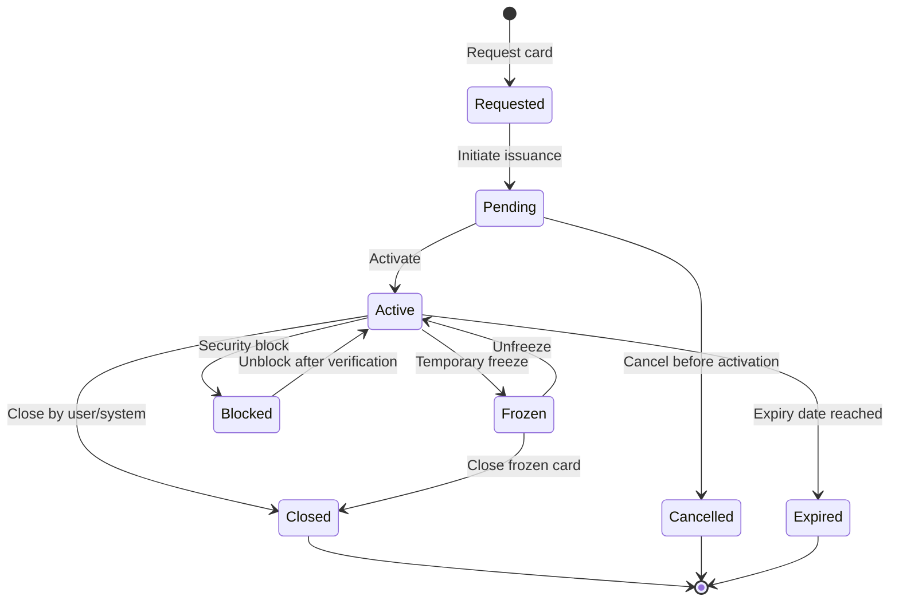
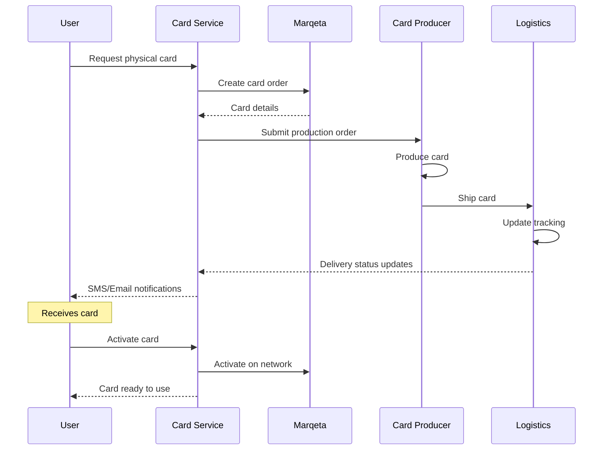
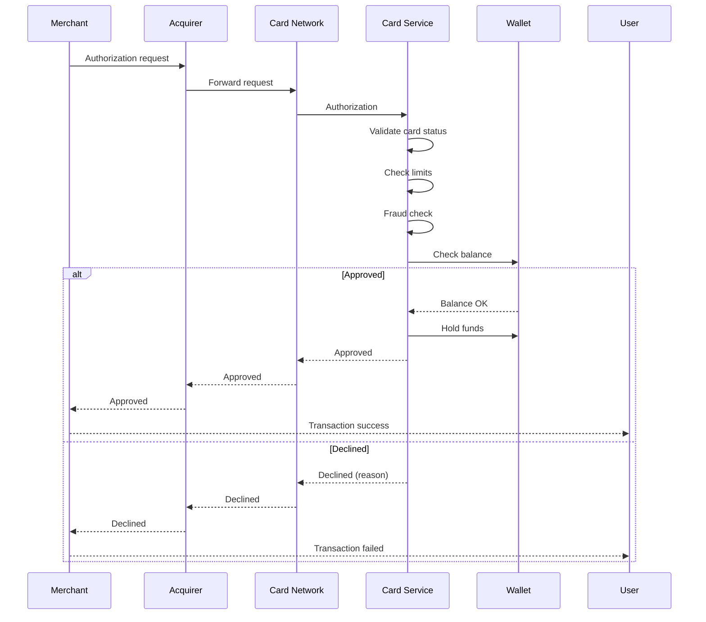

# VIII. Card Issuing & Processing - Phát hành và Xử lý Thẻ

## Tổng quan

Module Card Issuing & Processing cho phép phát hành thẻ thanh toán (ảo và vật lý), quản lý vòng đời thẻ, và xử lý giao dịch thẻ. Tích hợp với Marqeta và các card networks (Visa, Mastercard) để cung cấp giải pháp thẻ toàn diện.

## Card Types

```typescript
enum CardType {
  // Virtual cards
  VIRTUAL_SINGLE_USE = 'VIRTUAL_SINGLE_USE',     // Dùng 1 lần
  VIRTUAL_MULTI_USE = 'VIRTUAL_MULTI_USE',       // Dùng nhiều lần
  
  // Physical cards
  PHYSICAL_PLASTIC = 'PHYSICAL_PLASTIC',         // Thẻ nhựa thường
  PHYSICAL_METAL = 'PHYSICAL_METAL',             // Thẻ kim loại (premium)
  
  // Function
  DEBIT = 'DEBIT',                                // Thẻ ghi nợ
  PREPAID = 'PREPAID',                            // Thẻ trả trước
  CREDIT = 'CREDIT'                               // Thẻ tín dụng
}
```

## Card Lifecycle



## Card Issuance

### Virtual Card

```typescript
interface VirtualCardRequest {
  userId: string;
  cardType: 'VIRTUAL_SINGLE_USE' | 'VIRTUAL_MULTI_USE';
  
  // Limits
  limits: {
    single?: number;
    daily?: number;
    monthly?: number;
  };
  
  // Expiry (for single-use)
  expiryTime?: string;
  
  // Merchant restrictions
  restrictions?: {
    allowedMerchants?: string[];
    allowedMCCs?: string[];      // Merchant Category Codes
    blockedMerchants?: string[];
  };
}

async function issueVirtualCard(
  request: VirtualCardRequest
): Promise<VirtualCard> {
  // Generate card number (using Marqeta/BIN sponsor)
  const cardNumber = await generateCardNumber();
  
  // Generate CVV
  const cvv = generateCVV(cardNumber);
  
  // Set expiry (3 years for multi-use, custom for single-use)
  const expiry = request.cardType === 'VIRTUAL_SINGLE_USE'
    ? request.expiryTime
    : addYears(new Date(), 3);
  
  // Create card in database
  const card = await db.cards.create({
    cardId: generateUUID(),
    userId: request.userId,
    cardType: request.cardType,
    cardNumber: encrypt(cardNumber),
    cvv: encrypt(cvv),
    expiryDate: expiry,
    status: 'ACTIVE',
    limits: request.limits,
    restrictions: request.restrictions,
    issuedAt: new Date()
  });
  
  // Register with card network
  await cardNetwork.registerCard({
    cardNumber,
    cardHolder: await getUserName(request.userId),
    expiryDate: expiry
  });
  
  // Link to wallet
  await linkCardToWallet(request.userId, card.cardId);
  
  return {
    ...card,
    cardNumber: maskCardNumber(cardNumber),
    cvv: request.cardType === 'VIRTUAL_SINGLE_USE' ? cvv : '***'
  };
}
```

### Physical Card

```typescript
interface PhysicalCardRequest {
  userId: string;
  cardType: 'PHYSICAL_PLASTIC' | 'PHYSICAL_METAL';
  design: string;                     // Card design template
  
  // Delivery address
  deliveryAddress: {
    recipientName: string;
    addressLine1: string;
    addressLine2?: string;
    city: string;
    postalCode: string;
    country: string;
    phone: string;
  };
  
  // Express delivery
  expressDelivery: boolean;
}

interface PhysicalCardResponse {
  cardId: string;
  trackingNumber: string;
  estimatedDelivery: string;
  activationRequired: boolean;
}
```

### Card Production Flow



## Card Management

### Card Operations

```typescript
interface Card {
  cardId: string;
  userId: string;
  
  // Card details
  cardType: CardType;
  cardNumber: string;              // Encrypted
  cvv: string;                     // Encrypted
  expiryMonth: number;
  expiryYear: number;
  
  // Branding
  brand: 'VISA' | 'MASTERCARD';
  design: string;
  cardholderName: string;
  
  // Status
  status: 'PENDING' | 'ACTIVE' | 'FROZEN' | 'BLOCKED' | 'EXPIRED' | 'CLOSED';
  
  // Limits
  limits: {
    single: number;
    daily: number;
    monthly: number;
    atmDaily?: number;
  };
  
  // Restrictions
  restrictions: {
    allowedCountries?: string[];
    blockedCountries?: string[];
    allowedMCCs?: string[];
    blockedMCCs?: string[];
    onlineEnabled: boolean;
    contactlessEnabled: boolean;
    atmEnabled: boolean;
  };
  
  // Security
  pin?: string;                    // Encrypted
  pinSetAt?: string;
  failedPinAttempts: number;
  
  // Dates
  issuedAt: string;
  activatedAt?: string;
  lastUsedAt?: string;
}
```

### Freeze/Unfreeze Card

```typescript
async function freezeCard(
  cardId: string,
  reason: string
): Promise<void> {
  const card = await getCard(cardId);
  
  if (card.status !== 'ACTIVE') {
    throw new Error('Can only freeze active cards');
  }
  
  // Update status
  await db.cards.update(
    { cardId },
    { 
      status: 'FROZEN',
      frozenAt: new Date(),
      frozenReason: reason
    }
  );
  
  // Notify card network
  await cardNetwork.freezeCard(card.cardNumber);
  
  // Send notification
  await sendNotification({
    userId: card.userId,
    type: 'CARD_FROZEN',
    data: { cardId, reason }
  });
}

async function unfreezeCard(cardId: string): Promise<void> {
  const card = await getCard(cardId);
  
  if (card.status !== 'FROZEN') {
    throw new Error('Card is not frozen');
  }
  
  // Update status
  await db.cards.update(
    { cardId },
    { 
      status: 'ACTIVE',
      unfrozenAt: new Date()
    }
  );
  
  // Notify card network
  await cardNetwork.unfreezeCard(card.cardNumber);
  
  // Send notification
  await sendNotification({
    userId: card.userId,
    type: 'CARD_UNFROZEN',
    data: { cardId }
  });
}
```

### PIN Management

```typescript
async function setCardPIN(
  cardId: string,
  pin: string
): Promise<void> {
  // Validate PIN
  if (!/^\d{4,6}$/.test(pin)) {
    throw new Error('PIN must be 4-6 digits');
  }
  
  // Check weak PINs
  const weakPins = ['0000', '1111', '1234', '1122'];
  if (weakPins.includes(pin)) {
    throw new Error('PIN is too weak');
  }
  
  // Encrypt and store
  const encryptedPIN = await encryptPIN(pin);
  
  await db.cards.update(
    { cardId },
    { 
      pin: encryptedPIN,
      pinSetAt: new Date()
    }
  );
  
  // Update on card network
  await cardNetwork.setPIN(cardId, encryptedPIN);
}

async function verifyPIN(
  cardId: string,
  pin: string
): Promise<boolean> {
  const card = await getCard(cardId);
  
  // Check failed attempts
  if (card.failedPinAttempts >= 3) {
    await blockCard(cardId, 'Too many failed PIN attempts');
    throw new Error('Card blocked due to failed PIN attempts');
  }
  
  // Verify PIN
  const isValid = await comparePIN(pin, card.pin);
  
  if (!isValid) {
    // Increment failed attempts
    await db.cards.update(
      { cardId },
      { failedPinAttempts: card.failedPinAttempts + 1 }
    );
    return false;
  }
  
  // Reset failed attempts on success
  await db.cards.update(
    { cardId },
    { failedPinAttempts: 0 }
  );
  
  return true;
}
```

## Transaction Processing

### Authorization Flow



### Authorization Logic

```typescript
async function authorizeTransaction(
  request: AuthorizationRequest
): Promise<AuthorizationResponse> {
  // 1. Get card
  const card = await getCardByNumber(request.cardNumber);
  
  // 2. Validate card
  if (card.status !== 'ACTIVE') {
    return decline('CARD_NOT_ACTIVE');
  }
  
  if (isExpired(card)) {
    return decline('CARD_EXPIRED');
  }
  
  // 3. Verify CVV (for online transactions)
  if (request.cardNotPresent && !verifyCVV(request.cvv, card.cvv)) {
    return decline('INVALID_CVV');
  }
  
  // 4. Check limits
  const usage = await getCardUsage(card.cardId);
  
  if (request.amount > card.limits.single) {
    return decline('EXCEEDS_SINGLE_LIMIT');
  }
  
  if (usage.today + request.amount > card.limits.daily) {
    return decline('EXCEEDS_DAILY_LIMIT');
  }
  
  if (usage.thisMonth + request.amount > card.limits.monthly) {
    return decline('EXCEEDS_MONTHLY_LIMIT');
  }
  
  // 5. Check restrictions
  if (card.restrictions.blockedCountries?.includes(request.merchantCountry)) {
    return decline('COUNTRY_BLOCKED');
  }
  
  if (card.restrictions.blockedMCCs?.includes(request.merchantMCC)) {
    return decline('MCC_BLOCKED');
  }
  
  // 6. Check balance
  const wallet = await getWallet(card.userId);
  if (wallet.availableBalance < request.amount) {
    return decline('INSUFFICIENT_FUNDS');
  }
  
  // 7. Fraud check
  const fraudScore = await checkFraud(card, request);
  if (fraudScore > FRAUD_THRESHOLD) {
    await blockCard(card.cardId, 'Suspected fraud');
    return decline('SUSPECTED_FRAUD');
  }
  
  // 8. Hold funds
  const hold = await holdFunds(wallet.accountId, request.amount);
  
  // 9. Create authorization
  const authorization = await createAuthorization({
    cardId: card.cardId,
    amount: request.amount,
    merchant: request.merchant,
    holdId: hold.id,
    expiresAt: addDays(new Date(), 7)
  });
  
  return {
    approved: true,
    authCode: authorization.authCode,
    arn: authorization.arn
  };
}
```

### Settlement

```typescript
interface Settlement {
  settlementId: string;
  authorizationId: string;
  
  // Original authorization
  originalAmount: number;
  
  // Settlement amount (may differ)
  settledAmount: number;
  
  // Dates
  authDate: string;
  settlementDate: string;
  
  // Status
  status: 'PENDING' | 'COMPLETED' | 'FAILED';
}

async function settleTransaction(
  authorizationId: string,
  settledAmount: number
): Promise<void> {
  const auth = await getAuthorization(authorizationId);
  
  // Release hold
  await releaseFundsHold(auth.holdId);
  
  // Debit actual amount
  await debitAccount(auth.walletId, settledAmount);
  
  // Create settlement record
  await createSettlement({
    authorizationId,
    originalAmount: auth.amount,
    settledAmount,
    settlementDate: new Date()
  });
  
  // Update card usage stats
  await updateCardUsage(auth.cardId, settledAmount);
}
```

## 3D Secure

### 3DS 2.0 Flow

```typescript
async function initiate3DS(
  request: ThreeDSRequest
): Promise<ThreeDSResponse> {
  const card = await getCard(request.cardId);
  
  // Prepare authentication request
  const authRequest = {
    cardNumber: decrypt(card.cardNumber),
    expiryDate: `${card.expiryMonth}/${card.expiryYear}`,
    amount: request.amount,
    currency: request.currency,
    merchantInfo: request.merchant,
    
    // Browser/Device info (for risk assessment)
    deviceInfo: {
      userAgent: request.userAgent,
      ipAddress: request.ipAddress,
      screenResolution: request.screenResolution,
      timeZone: request.timeZone,
      language: request.language
    }
  };
  
  // Submit to 3DS server
  const response = await threeDSServer.authenticate(authRequest);
  
  if (response.frictionless) {
    // Low risk - no challenge required
    return {
      authenticated: true,
      cavv: response.cavv,
      eci: response.eci
    };
  }
  
  // Challenge required
  return {
    challengeRequired: true,
    challengeUrl: response.acsUrl,
    transactionId: response.transId
  };
}
```

## Tokenization

### Apple Pay / Google Pay

```typescript
interface TokenizationRequest {
  cardId: string;
  walletProvider: 'APPLE_PAY' | 'GOOGLE_PAY' | 'SAMSUNG_PAY';
  deviceId: string;
}

async function tokenizeForWallet(
  request: TokenizationRequest
): Promise<TokenizationResponse> {
  const card = await getCard(request.cardId);
  
  // Generate token
  const token = await generatePaymentToken({
    cardNumber: decrypt(card.cardNumber),
    deviceId: request.deviceId,
    walletProvider: request.walletProvider
  });
  
  // Store token mapping
  await storeTokenMapping({
    token: token.dpan,
    cardId: request.cardId,
    deviceId: request.deviceId,
    walletProvider: request.walletProvider,
    expiryDate: token.expiryDate
  });
  
  // Provision to wallet
  await provisionToWallet({
    token,
    walletProvider: request.walletProvider,
    cardArt: card.design
  });
  
  return {
    success: true,
    token: mask(token.dpan)
  };
}
```

## API Reference

```typescript
// Issue cards
POST /api/v1/cards/virtual
POST /api/v1/cards/physical

// Manage cards
GET /api/v1/cards/{cardId}
PATCH /api/v1/cards/{cardId}
DELETE /api/v1/cards/{cardId}

POST /api/v1/cards/{cardId}/freeze
POST /api/v1/cards/{cardId}/unfreeze
POST /api/v1/cards/{cardId}/block

// PIN
POST /api/v1/cards/{cardId}/pin
POST /api/v1/cards/{cardId}/pin/verify
POST /api/v1/cards/{cardId}/pin/reset

// Transactions
GET /api/v1/cards/{cardId}/transactions
POST /api/v1/cards/authorize

// Tokenization
POST /api/v1/cards/{cardId}/tokenize

// 3DS
POST /api/v1/cards/3ds/initiate
POST /api/v1/cards/3ds/complete
```

## Use Cases trong hệ thống Masan

### 1. Virtual card cho online shopping

```typescript
// Winlife member creates virtual card for safe online shopping
const virtualCard = await issueVirtualCard({
  userId: 'WINLIFE_123',
  cardType: 'VIRTUAL_MULTI_USE',
  limits: {
    single: 5_000_000,
    daily: 10_000_000,
    monthly: 50_000_000
  },
  restrictions: {
    allowedMCCs: ['5411', '5311'], // Grocery, department stores
    blockedCountries: ['CN', 'RU']
  }
});
```

### 2. Physical card cho NBL

```typescript
// Retailer gets physical card for business expenses
const physicalCard = await requestPhysicalCard({
  userId: 'RETAILER_456',
  cardType: 'PHYSICAL_PLASTIC',
  design: 'MASAN_BUSINESS',
  deliveryAddress: retailerAddress
});
```

## Best Practices

1. **Security**
   - Never store full PAN unencrypted
   - Use tokenization for recurring payments
   - Implement velocity checks
   - Monitor for suspicious patterns

2. **User Experience**
   - Instant virtual card issuance
   - Easy freeze/unfreeze
   - Real-time notifications
   - Clear decline reasons

3. **Compliance**
   - PCI-DSS Level 1
   - Strong Customer Authentication (SCA)
   - Data retention policies
   - Regular security audits

## Kết luận

Card Issuing & Processing cho phép hệ thống Masan cung cấp thẻ thanh toán hiện đại:

- ✅ Virtual cards tiện lợi và an toàn
- ✅ Physical cards cho nhu cầu thực tế
- ✅ Tích hợp Apple Pay / Google Pay
- ✅ Bảo mật cao với 3DS và tokenization
- ✅ Quản lý linh hoạt và real-time

