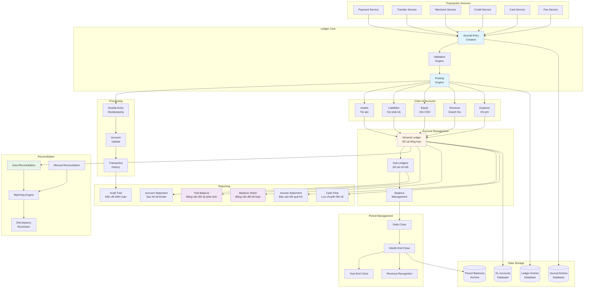
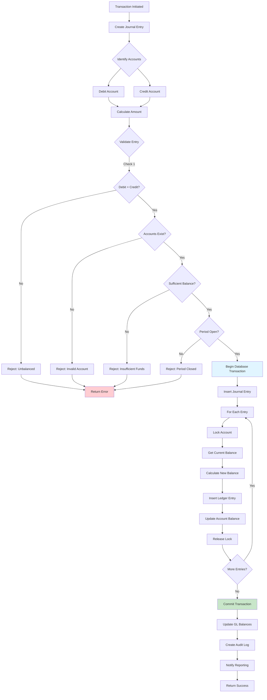
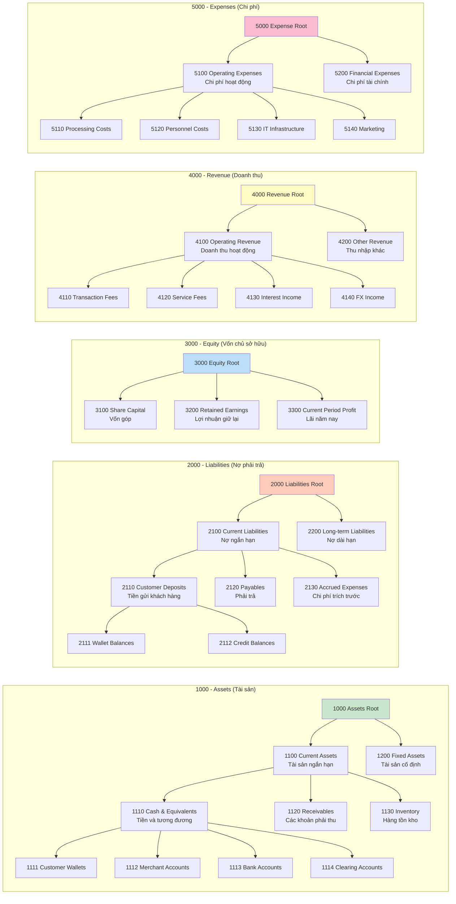
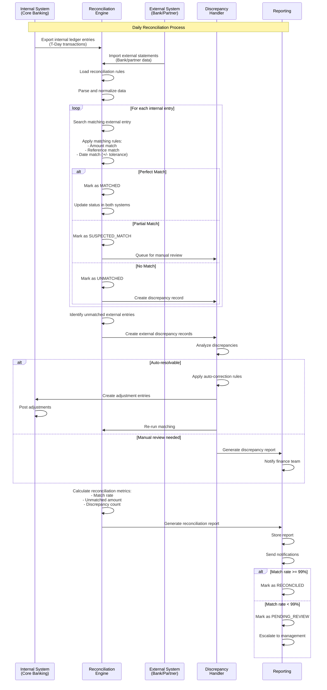
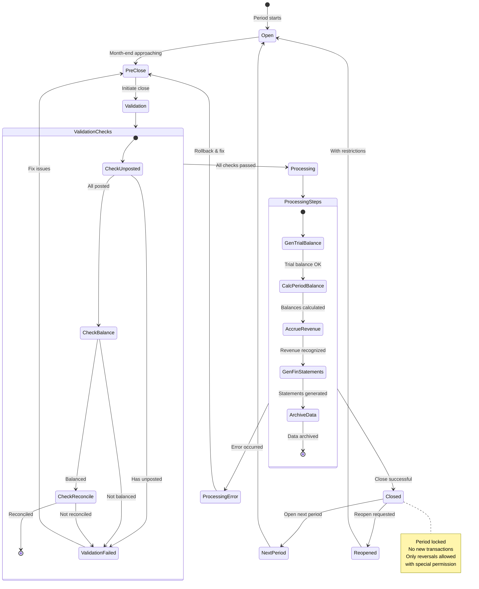
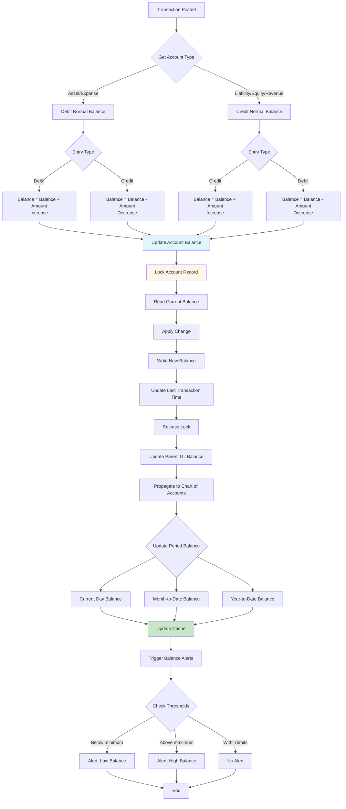
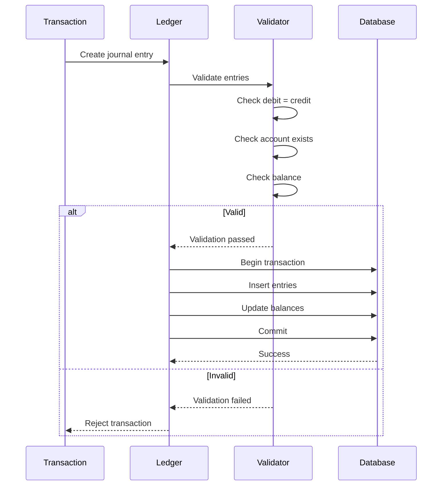

# IX. Ledger System - Hệ thống Sổ cái

## Tổng quan

Ledger System là trái tim kế toán của Core Banking, thực hiện ghi chép mọi giao dịch tài chính theo nguyên tắc Double-entry Bookkeeping. Đảm bảo tính chính xác tuyệt đối và khả năng audit đầy đủ.

## Sơ đồ Tổng quan

### 1. Kiến trúc tổng thể Ledger System



### 2. Luồng xử lý Double-Entry Bookkeeping



### 3. Cấu trúc Chart of Accounts (COA)



### 4. Quy trình Reconciliation (Đối soát)



### 5. Vòng đời Period Close (Đóng sổ kỳ kế toán)



### 6. Balance Calculation & Update Flow



## Double-Entry Bookkeeping

### Nguyên tắc cơ bản

Mỗi giao dịch tạo ra ít nhất 2 bút toán (entries) với tổng Debit = tổng Credit:

```
Debit (Nợ) = Credit (Có)
```

### Ví dụ Chuyển tiền

```typescript
// User A chuyển 1,000,000 VND cho User B
const entries = [
  {
    account: 'WALLET_A',
    type: 'DEBIT',
    amount: 1_000_000,
    description: 'Chuyen tien cho B'
  },
  {
    account: 'WALLET_B',
    type: 'CREDIT',
    amount: 1_000_000,
    description: 'Nhan tien tu A'
  }
];
```

## Cấu trúc Ledger

### Ledger Entry

```typescript
interface LedgerEntry {
  entryId: string;
  transactionId: string;
  
  // Account info
  accountId: string;
  accountNumber: string;
  accountType: string;
  
  // Entry type
  type: 'DEBIT' | 'CREDIT';
  amount: number;
  currency: string;
  
  // Balance after this entry
  balanceAfter: number;
  
  // Description
  description: string;
  referenceNumber?: string;
  
  // Timestamps
  valueDate: string;        // Effective date
  bookingDate: string;      // Actual recording date
  
  // Metadata
  metadata: Record<string, any>;
  
  // Reversal
  reversed: boolean;
  reversalEntryId?: string;
}
```

### Chart of Accounts (COA)

```typescript
interface ChartOfAccounts {
  accountCode: string;      // e.g., '1000', '2000'
  accountName: string;
  accountType: 'ASSET' | 'LIABILITY' | 'EQUITY' | 'REVENUE' | 'EXPENSE';
  
  // Hierarchy
  parentAccountCode?: string;
  level: number;
  
  // Normal balance
  normalBalance: 'DEBIT' | 'CREDIT';
  
  // Status
  active: boolean;
  
  // Metadata
  description: string;
  currency?: string;
}

// Example COA structure
const COA = {
  // Assets (Tài sản)
  '1000': { name: 'Cash and Cash Equivalents', type: 'ASSET' },
  '1001': { name: 'Customer Wallets', type: 'ASSET', parent: '1000' },
  '1002': { name: 'Merchant Accounts', type: 'ASSET', parent: '1000' },
  
  // Liabilities (Nợ phải trả)
  '2000': { name: 'Customer Deposits', type: 'LIABILITY' },
  '2001': { name: 'Pending Settlements', type: 'LIABILITY' },
  
  // Equity (Vốn chủ sở hữu)
  '3000': { name: 'Share Capital', type: 'EQUITY' },
  
  // Revenue (Doanh thu)
  '4000': { name: 'Transaction Fees', type: 'REVENUE' },
  '4001': { name: 'Service Fees', type: 'REVENUE' },
  
  // Expenses (Chi phí)
  '5000': { name: 'Operating Expenses', type: 'EXPENSE' },
  '5001': { name: 'Payment Processing Costs', type: 'EXPENSE' }
};
```

## Transaction Posting

### Posting Process



### Journal Entry

```typescript
interface JournalEntry {
  journalId: string;
  transactionId: string;
  
  // Entries (must balance)
  entries: LedgerEntry[];
  
  // Validation
  totalDebit: number;
  totalCredit: number;
  balanced: boolean;
  
  // Status
  status: 'DRAFT' | 'POSTED' | 'REVERSED';
  postedAt?: string;
  postedBy?: string;
  
  // Reversal
  reversalJournalId?: string;
  reversedAt?: string;
}

async function postJournalEntry(
  journal: JournalEntry
): Promise<void> {
  // 1. Validate entries balance
  const totalDebit = journal.entries
    .filter(e => e.type === 'DEBIT')
    .reduce((sum, e) => sum + e.amount, 0);
  
  const totalCredit = journal.entries
    .filter(e => e.type === 'CREDIT')
    .reduce((sum, e) => sum + e.amount, 0);
  
  if (totalDebit !== totalCredit) {
    throw new Error('Journal entries do not balance');
  }
  
  // 2. Start database transaction
  await db.transaction(async (trx) => {
    // 3. Insert journal entry
    await trx('journal_entries').insert({
      ...journal,
      status: 'POSTED',
      postedAt: new Date()
    });
    
    // 4. Insert ledger entries
    for (const entry of journal.entries) {
      // Get current balance
      const currentBalance = await trx('accounts')
        .where({ accountId: entry.accountId })
        .first()
        .then(a => a.balance);
      
      // Calculate new balance
      const newBalance = entry.type === 'DEBIT'
        ? currentBalance - entry.amount
        : currentBalance + entry.amount;
      
      // Insert entry with new balance
      await trx('ledger_entries').insert({
        ...entry,
        balanceAfter: newBalance
      });
      
      // Update account balance
      await trx('accounts')
        .where({ accountId: entry.accountId })
        .update({ balance: newBalance });
    }
  });
}
```

## General Ledger (GL)

### GL Account

```typescript
interface GLAccount {
  glAccountId: string;
  accountCode: string;
  accountName: string;
  accountType: AccountType;
  
  // Balances
  balance: {
    debit: number;
    credit: number;
    net: number;
  };
  
  // Currency
  currency: string;
  
  // Period balances
  periodBalances: Array<{
    period: string;          // YYYY-MM
    openingBalance: number;
    debit: number;
    credit: number;
    closingBalance: number;
  }>;
  
  // Status
  active: boolean;
  lastActivityDate: string;
}
```

### GL Report (Trial Balance)

```typescript
interface TrialBalance {
  asOfDate: string;
  accounts: Array<{
    accountCode: string;
    accountName: string;
    accountType: string;
    debit: number;
    credit: number;
  }>;
  
  totals: {
    totalDebit: number;
    totalCredit: number;
    balanced: boolean;
  };
}

async function generateTrialBalance(
  asOfDate: string
): Promise<TrialBalance> {
  const accounts = await db('ledger_entries')
    .select('accountCode', 'accountName', 'accountType')
    .sum('amount as total')
    .where('bookingDate', '<=', asOfDate)
    .groupBy('accountCode')
    .orderBy('accountCode');
  
  let totalDebit = 0;
  let totalCredit = 0;
  
  const formatted = accounts.map(acc => {
    const isDebitAccount = ['ASSET', 'EXPENSE'].includes(acc.accountType);
    const debit = isDebitAccount ? acc.total : 0;
    const credit = isDebitAccount ? 0 : acc.total;
    
    totalDebit += debit;
    totalCredit += credit;
    
    return {
      accountCode: acc.accountCode,
      accountName: acc.accountName,
      accountType: acc.accountType,
      debit,
      credit
    };
  });
  
  return {
    asOfDate,
    accounts: formatted,
    totals: {
      totalDebit,
      totalCredit,
      balanced: Math.abs(totalDebit - totalCredit) < 0.01
    }
  };
}
```

## Account Statement

### Statement Generation

```typescript
interface AccountStatement {
  accountId: string;
  accountNumber: string;
  accountHolder: string;
  
  // Period
  statementPeriod: {
    from: string;
    to: string;
  };
  
  // Balances
  openingBalance: number;
  closingBalance: number;
  
  // Transactions
  transactions: Array<{
    date: string;
    description: string;
    reference: string;
    debit: number;
    credit: number;
    balance: number;
  }>;
  
  // Summary
  summary: {
    totalDebits: number;
    totalCredits: number;
    transactionCount: number;
  };
}

async function generateStatement(
  accountId: string,
  from: string,
  to: string
): Promise<AccountStatement> {
  // Get opening balance
  const openingBalance = await getBalanceAsOf(accountId, from);
  
  // Get transactions
  const entries = await db('ledger_entries')
    .where({ accountId })
    .whereBetween('valueDate', [from, to])
    .orderBy('valueDate');
  
  const transactions = entries.map(entry => ({
    date: entry.valueDate,
    description: entry.description,
    reference: entry.referenceNumber,
    debit: entry.type === 'DEBIT' ? entry.amount : 0,
    credit: entry.type === 'CREDIT' ? entry.amount : 0,
    balance: entry.balanceAfter
  }));
  
  return {
    accountId,
    accountNumber: await getAccountNumber(accountId),
    accountHolder: await getAccountHolder(accountId),
    statementPeriod: { from, to },
    openingBalance,
    closingBalance: entries[entries.length - 1]?.balanceAfter || openingBalance,
    transactions,
    summary: {
      totalDebits: transactions.reduce((sum, t) => sum + t.debit, 0),
      totalCredits: transactions.reduce((sum, t) => sum + t.credit, 0),
      transactionCount: transactions.length
    }
  };
}
```

## Period Closing

### Month-End Close

```typescript
async function performMonthEndClose(
  year: number,
  month: number
): Promise<void> {
  const period = `${year}-${String(month).padStart(2, '0')}`;
  
  // 1. Verify all transactions are posted
  const unpostedCount = await db('journal_entries')
    .where('status', 'DRAFT')
    .whereRaw('DATE_FORMAT(createdAt, "%Y-%m") = ?', [period])
    .count();
  
  if (unpostedCount > 0) {
    throw new Error('Cannot close period with unposted transactions');
  }
  
  // 2. Generate trial balance
  const trialBalance = await generateTrialBalance(`${period}-31`);
  
  if (!trialBalance.totals.balanced) {
    throw new Error('Trial balance does not balance');
  }
  
  // 3. Calculate period balances for all accounts
  const accounts = await db('gl_accounts').where({ active: true });
  
  for (const account of accounts) {
    const periodBalance = await calculatePeriodBalance(account.glAccountId, period);
    
    await db('gl_period_balances').insert({
      glAccountId: account.glAccountId,
      period,
      openingBalance: periodBalance.openingBalance,
      debit: periodBalance.debit,
      credit: periodBalance.credit,
      closingBalance: periodBalance.closingBalance
    });
  }
  
  // 4. Mark period as closed
  await db('accounting_periods').insert({
    period,
    status: 'CLOSED',
    closedAt: new Date()
  });
  
  // 5. Generate reports
  await generateMonthEndReports(period);
}
```

## Reconciliation

### Auto-reconciliation

```typescript
interface ReconciliationRule {
  ruleId: string;
  name: string;
  
  // Match criteria
  matchOn: ('AMOUNT' | 'REFERENCE' | 'DATE')[];
  tolerance?: {
    amountDiff: number;
    dateDiff: number;      // days
  };
  
  // Account mapping
  sourceAccount: string;
  targetAccount: string;
}

async function autoReconcile(
  internalEntries: LedgerEntry[],
  externalTransactions: ExternalTransaction[]
): Promise<ReconciliationResult> {
  const matched = [];
  const unmatched = { internal: [], external: [] };
  
  for (const internal of internalEntries) {
    let found = false;
    
    for (const external of externalTransactions) {
      if (Math.abs(internal.amount - external.amount) < 0.01 &&
          internal.referenceNumber === external.reference) {
        matched.push({
          internal,
          external,
          status: 'MATCHED'
        });
        found = true;
        break;
      }
    }
    
    if (!found) {
      unmatched.internal.push(internal);
    }
  }
  
  // Find unmatched external
  externalTransactions.forEach(ext => {
    if (!matched.find(m => m.external === ext)) {
      unmatched.external.push(ext);
    }
  });
  
  return {
    matched,
    unmatched,
    matchRate: matched.length / (matched.length + unmatched.internal.length)
  };
}
```

## API Reference

```typescript
// Journal entries
POST /api/v1/ledger/journal-entries
GET /api/v1/ledger/journal-entries/{journalId}
POST /api/v1/ledger/journal-entries/{journalId}/reverse

// Ledger entries
GET /api/v1/ledger/entries
GET /api/v1/ledger/entries/{entryId}

// GL accounts
GET /api/v1/ledger/gl-accounts
GET /api/v1/ledger/gl-accounts/{accountCode}

// Statements
GET /api/v1/ledger/accounts/{accountId}/statement

// Reports
GET /api/v1/ledger/trial-balance
GET /api/v1/ledger/balance-sheet
GET /api/v1/ledger/income-statement

// Period closing
POST /api/v1/ledger/period-close
GET /api/v1/ledger/periods/{period}

// Reconciliation
POST /api/v1/ledger/reconcile
GET /api/v1/ledger/reconciliations
```

## Use Cases trong hệ thống Masan

### 1. Ghi nhận thanh toán của NBL

```typescript
// Customer pays at retailer
const journalEntry = {
  transactionId: 'TXN_001',
  entries: [
    {
      accountCode: '1001',  // Customer Wallet (Asset)
      type: 'CREDIT',
      amount: 100_000,
      description: 'Payment at retailer'
    },
    {
      accountCode: '1002',  // Merchant Account (Asset)
      type: 'DEBIT',
      amount: 100_000,
      description: 'Receive payment from customer'
    }
  ]
};
```

### 2. Ghi nhận phí giao dịch

```typescript
// Record transaction fee
const feeEntry = {
  transactionId: 'TXN_001',
  entries: [
    {
      accountCode: '1002',  // Merchant Account
      type: 'CREDIT',
      amount: 1_000,
      description: 'Transaction fee'
    },
    {
      accountCode: '4000',  // Fee Revenue
      type: 'DEBIT',
      amount: 1_000,
      description: 'Transaction fee revenue'
    }
  ]
};
```

## Best Practices

1. **Integrity**
   - Always balance debits and credits
   - Use database transactions
   - Implement audit trails
   - Never delete entries (reverse instead)

2. **Performance**
   - Index on accountId, valueDate
   - Partition large tables by period
   - Cache account balances
   - Use materialized views for reports

3. **Compliance**
   - Retain records per regulations
   - Implement maker-checker for critical operations
   - Regular reconciliation
   - Audit trail for all changes

## Kết luận

Ledger System đảm bảo tính chính xác và minh bạch của mọi giao dịch tài chính:

- ✅ Double-entry bookkeeping chuẩn
- ✅ Real-time balance updates
- ✅ Comprehensive audit trail
- ✅ Automated reconciliation
- ✅ Regulatory compliance

