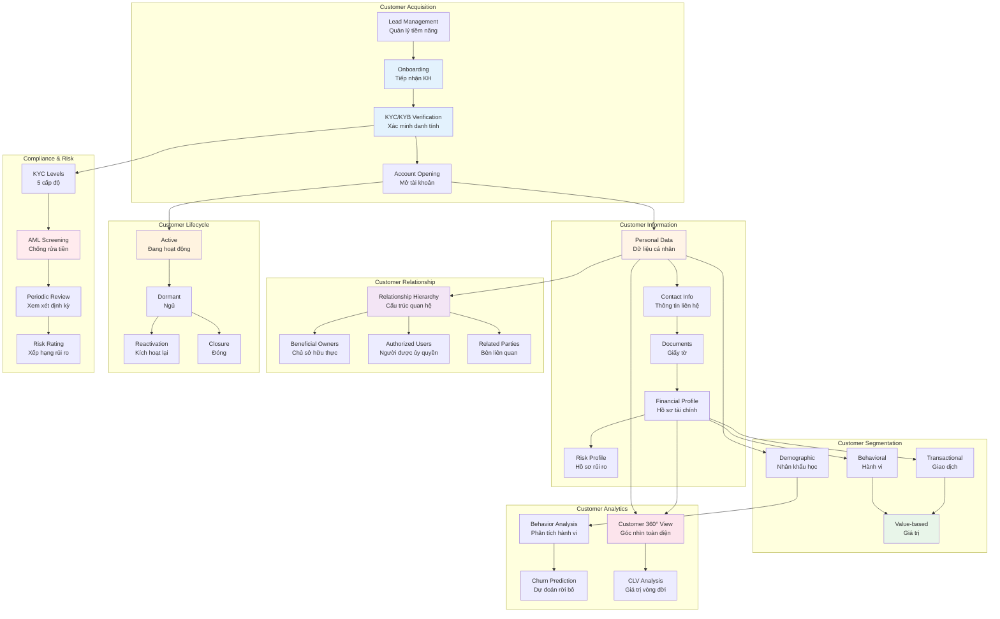
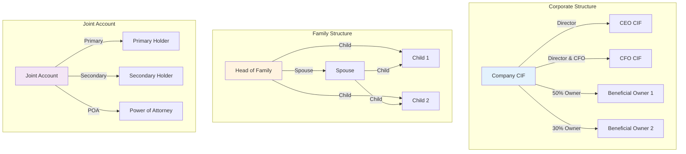
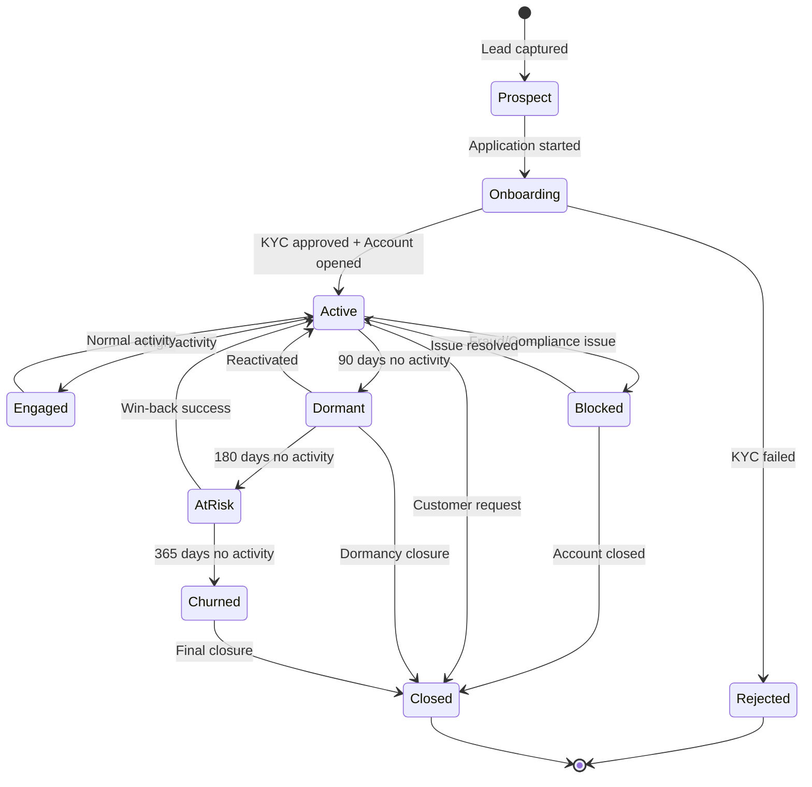
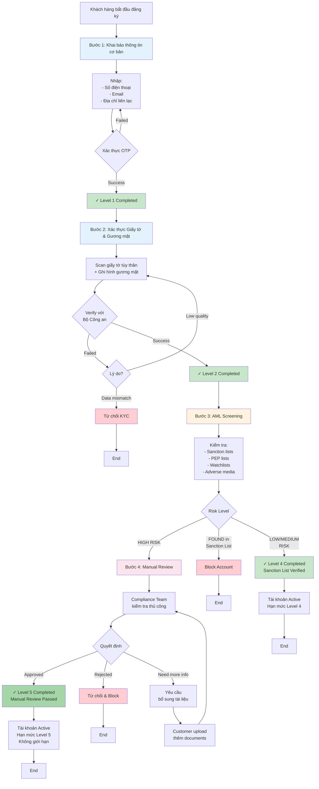
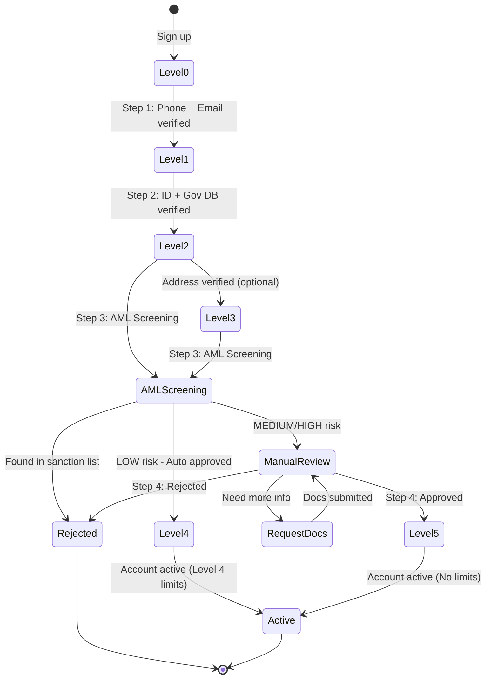
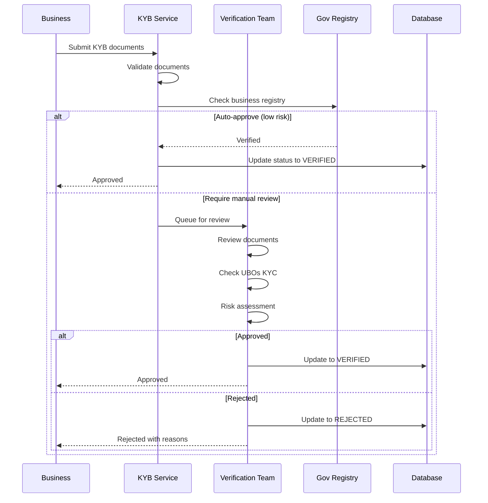

# X. CIF Management - Quản lý Hồ sơ Khách hàng

## Tổng quan

CIF (Customer Information File) Management là phân hệ quản lý toàn diện thông tin khách hàng trong Core Banking System. Module này quản lý vòng đời khách hàng từ onboarding, xác minh danh tính (KYC/KYB), duy trì thông tin, phân khúc khách hàng, đến quản lý mối quan hệ và chu kỳ khách hàng.

### Phạm vi CIF Management

CIF Management bao gồm các chức năng chính:

1. **Customer Onboarding** - Tiếp nhận khách hàng mới
2. **KYC/KYB** - Xác minh danh tính và tuân thủ AML
3. **Customer Profile Management** - Quản lý hồ sơ khách hàng
4. **Customer Relationship Management** - Quản lý mối quan hệ khách hàng
5. **Customer Segmentation** - Phân khúc khách hàng
6. **Customer Lifecycle Management** - Quản lý chu kỳ sống khách hàng
7. **Customer Analytics** - Phân tích hành vi khách hàng

## Sơ đồ Tổng quan CIF Management



## 1. Customer Profile Management

### CIF Structure

```typescript
interface CustomerInformationFile {
  cifId: string;                    // Unique CIF identifier
  cifNumber: string;                // Business CIF number
  
  // Customer Type
  customerType: 'INDIVIDUAL' | 'BUSINESS';
  customerCategory: 'RETAIL' | 'CORPORATE' | 'SME' | 'INSTITUTIONAL';
  
  // Personal Information (for Individual)
  personalInfo?: {
    prefix: string;                 // Mr, Mrs, Ms, Dr
    firstName: string;
    middleName?: string;
    lastName: string;
    fullName: string;
    nativeLanguageName?: string;
    dateOfBirth: string;
    placeOfBirth: string;
    gender: 'MALE' | 'FEMALE' | 'OTHER';
    nationality: string;
    countryOfResidence: string;
    maritalStatus: 'SINGLE' | 'MARRIED' | 'DIVORCED' | 'WIDOWED';
    education: string;
    occupation: string;
    employer?: string;
  };
  
  // Business Information (for Business)
  businessInfo?: {
    legalName: string;
    tradingName: string;
    registrationNumber: string;
    taxId: string;
    businessType: 'SOLE_PROPRIETOR' | 'PARTNERSHIP' | 'COMPANY' | 'CORPORATION';
    industryCategory: string;
    incorporationDate: string;
    numberOfEmployees: number;
    annualRevenue: number;
    website?: string;
  };
  
  // Contact Information
  contactInfo: {
    primaryPhone: string;
    secondaryPhone?: string;
    primaryEmail: string;
    secondaryEmail?: string;
    preferredLanguage: string;
    preferredChannel: 'EMAIL' | 'SMS' | 'PHONE' | 'APP';
  };
  
  // Addresses
  addresses: Array<{
    type: 'PERMANENT' | 'MAILING' | 'BUSINESS' | 'BILLING';
    street: string;
    ward: string;
    district: string;
    city: string;
    state: string;
    country: string;
    postalCode: string;
    isPrimary: boolean;
    isVerified: boolean;
  }>;
  
  // Identification Documents
  identifications: Array<{
    type: 'CCCD' | 'CMND' | 'PASSPORT' | 'DRIVING_LICENSE';
    number: string;
    issueDate: string;
    expiryDate: string;
    issuePlace: string;
    issueCountry: string;
    isPrimary: boolean;
    isVerified: boolean;
    documentImages?: string[];
  }>;
  
  // Financial Profile
  financialProfile: {
    employmentStatus: 'EMPLOYED' | 'SELF_EMPLOYED' | 'UNEMPLOYED' | 'RETIRED';
    monthlyIncome: number;
    sourceOfIncome: string[];
    netWorth: number;
    creditScore?: number;
    riskTolerance: 'LOW' | 'MEDIUM' | 'HIGH';
  };
  
  // KYC Information
  kycInfo: {
    kycLevel: KYCLevel;
    kycStatus: 'PENDING' | 'VERIFIED' | 'REJECTED' | 'EXPIRED';
    kycDate: string;
    nextKYCDate: string;
    kycDocuments: string[];
  };
  
  // AML/Risk Information
  amlRiskInfo: {
    riskRating: 'LOW' | 'MEDIUM' | 'HIGH' | 'VERY_HIGH';
    isPEP: boolean;
    inSanctionList: boolean;
    lastScreeningDate: string;
    nextScreeningDate: string;
  };
  
  // Customer Segmentation
  segmentation: {
    segment: string[];              // e.g., ['PREMIUM', 'ACTIVE_TRADER']
    tags: string[];
    lifetimeValue: number;
    acquisitionChannel: string;
    acquisitionDate: string;
  };
  
  // Customer Status
  status: {
    cifStatus: 'ACTIVE' | 'INACTIVE' | 'DORMANT' | 'BLOCKED' | 'CLOSED';
    statusReason?: string;
    lastActivityDate: string;
    createdAt: string;
    createdBy: string;
    updatedAt: string;
    updatedBy: string;
  };
  
  // Relationships
  relationships: Array<{
    relatedCifId: string;
    relationshipType: 'SPOUSE' | 'CHILD' | 'PARENT' | 'SIBLING' | 
                      'BUSINESS_PARTNER' | 'BENEFICIAL_OWNER' | 'AUTHORIZED_USER';
    isPrimary: boolean;
  }>;
  
  // Preferences
  preferences: {
    marketingConsent: boolean;
    dataProcessingConsent: boolean;
    thirdPartyDataSharing: boolean;
    notificationPreferences: {
      email: boolean;
      sms: boolean;
      push: boolean;
      inApp: boolean;
    };
  };
  
  // Metadata
  metadata: {
    branchCode?: string;
    relationshipManager?: string;
    referredBy?: string;
    externalReferences?: Record<string, string>;
  };
}
```

### Customer 360° View

```typescript
interface Customer360View {
  // Basic CIF Info
  cif: CustomerInformationFile;
  
  // Accounts
  accounts: Array<{
    accountId: string;
    accountNumber: string;
    accountType: string;
    currency: string;
    balance: number;
    status: string;
    openDate: string;
  }>;
  
  // Cards
  cards: Array<{
    cardId: string;
    cardNumber: string;
    cardType: string;
    status: string;
    expiryDate: string;
  }>;
  
  // Loans & Credit
  credits: Array<{
    facilityId: string;
    facilityType: string;
    limit: number;
    outstanding: number;
    status: string;
  }>;
  
  // Transaction Summary
  transactionSummary: {
    last30Days: {
      transactionCount: number;
      totalVolume: number;
      averageTicketSize: number;
    };
    last90Days: {
      transactionCount: number;
      totalVolume: number;
    };
    last365Days: {
      transactionCount: number;
      totalVolume: number;
    };
  };
  
  // Recent Activities
  recentActivities: Array<{
    activityDate: string;
    activityType: string;
    description: string;
    channel: string;
  }>;
  
  // Interactions
  interactions: Array<{
    interactionDate: string;
    channel: 'BRANCH' | 'CALL_CENTER' | 'EMAIL' | 'CHAT' | 'APP';
    type: string;
    subject: string;
    status: string;
  }>;
  
  // Complaints & Issues
  complaints: Array<{
    complaintId: string;
    date: string;
    category: string;
    status: string;
    resolution?: string;
  }>;
  
  // Marketing Campaigns
  campaigns: Array<{
    campaignId: string;
    campaignName: string;
    sentDate: string;
    opened: boolean;
    clicked: boolean;
    converted: boolean;
  }>;
  
  // Risk Indicators
  riskIndicators: {
    delinquencyStatus: string;
    overdraftFrequency: number;
    returnedPayments: number;
    fraudAlerts: number;
  };
}
```

## 2. Customer Relationship Management

### Relationship Types

```typescript
interface CustomerRelationship {
  relationshipId: string;
  
  // Primary customer
  primaryCifId: string;
  primaryRole: 'INDIVIDUAL' | 'BUSINESS_OWNER' | 'LEGAL_ENTITY';
  
  // Related customer
  relatedCifId: string;
  relatedRole: string;
  
  // Relationship
  relationshipType: 
    // Personal relationships
    | 'SPOUSE' | 'CHILD' | 'PARENT' | 'SIBLING' | 'GUARDIAN'
    // Business relationships
    | 'BENEFICIAL_OWNER' | 'DIRECTOR' | 'SHAREHOLDER' | 'AUTHORIZED_SIGNATORY'
    | 'BUSINESS_PARTNER' | 'EMPLOYEE'
    // Account relationships
    | 'JOINT_ACCOUNT_HOLDER' | 'POWER_OF_ATTORNEY' | 'NOMINEE';
  
  // Relationship details
  ownershipPercentage?: number;
  startDate: string;
  endDate?: string;
  isPrimary: boolean;
  
  // Documentation
  documentProof?: string[];
  
  // Status
  status: 'ACTIVE' | 'INACTIVE' | 'PENDING_VERIFICATION';
  verifiedAt?: string;
  verifiedBy?: string;
}
```

### Relationship Hierarchy



## 3. Customer Segmentation

### Segmentation Dimensions

```typescript
interface CustomerSegmentation {
  cifId: string;
  
  // Demographic Segmentation
  demographic: {
    ageGroup: '18-25' | '26-35' | '36-45' | '46-55' | '56-65' | '65+';
    incomeGroup: 'LOW' | 'MIDDLE' | 'UPPER_MIDDLE' | 'HIGH' | 'ULTRA_HIGH';
    location: 'URBAN' | 'SUBURBAN' | 'RURAL';
    occupation: string;
  };
  
  // Behavioral Segmentation
  behavioral: {
    digitalAdoption: 'LOW' | 'MEDIUM' | 'HIGH';
    productUsage: string[];
    channelPreference: 'BRANCH' | 'ONLINE' | 'MOBILE' | 'PHONE';
    transactionFrequency: 'RARE' | 'OCCASIONAL' | 'FREQUENT' | 'VERY_FREQUENT';
  };
  
  // Value-based Segmentation
  valueBased: {
    tier: 'BASIC' | 'SILVER' | 'GOLD' | 'PLATINUM' | 'DIAMOND';
    lifetimeValue: number;
    profitability: 'LOW' | 'MEDIUM' | 'HIGH';
    potentialValue: number;
  };
  
  // Lifecycle Stage
  lifecycle: {
    stage: 'PROSPECT' | 'NEW' | 'ACTIVE' | 'MATURE' | 'DORMANT' | 'AT_RISK' | 'CHURNED';
    tenure: number;                  // months
    lastActivityDate: string;
  };
  
  // Custom Segments
  customSegments: string[];
  
  // Computed at
  computedAt: string;
}
```

## 4. Customer Lifecycle Management

### Lifecycle States



### Lifecycle Triggers & Actions

```typescript
interface LifecycleRule {
  ruleId: string;
  name: string;
  
  // Trigger conditions
  trigger: {
    fromStage: string;
    toStage: string;
    conditions: Array<{
      field: string;
      operator: 'EQUALS' | 'GREATER_THAN' | 'LESS_THAN' | 'BETWEEN';
      value: any;
    }>;
  };
  
  // Actions to execute
  actions: Array<{
    type: 'NOTIFICATION' | 'WORKFLOW' | 'SEGMENT_UPDATE' | 'ALERT';
    config: Record<string, any>;
  }>;
}

// Example: Dormancy Detection
const dormancyRule: LifecycleRule = {
  ruleId: 'RULE_DORMANCY',
  name: 'Detect Dormant Customers',
  trigger: {
    fromStage: 'ACTIVE',
    toStage: 'DORMANT',
    conditions: [
      { field: 'daysSinceLastTransaction', operator: 'GREATER_THAN', value: 90 },
      { field: 'accountBalance', operator: 'GREATER_THAN', value: 0 }
    ]
  },
  actions: [
    {
      type: 'NOTIFICATION',
      config: {
        channel: 'EMAIL',
        template: 'DORMANCY_WARNING',
        recipients: ['customer', 'relationship_manager']
      }
    },
    {
      type: 'WORKFLOW',
      config: {
        workflow: 'REACTIVATION_CAMPAIGN'
      }
    }
  ]
};
```

## 5. KYC/KYB - Xác minh Danh tính

> **Lưu ý**: KYC/KYB là một phần quan trọng của CIF Management, được thực hiện trong giai đoạn onboarding và định kỳ xem xét lại.

## KYC Levels

```typescript
enum KYCLevel {
  LEVEL_0 = 0,  // Chưa xác thực - Giới hạn rất thấp
  LEVEL_1 = 1,  // Basic - Xác thực cơ bản (phone + email)
  LEVEL_2 = 2,  // Standard - Xác thực căn cước + selfie
  LEVEL_3 = 3,  // Advanced - Xác thực đầy đủ + proof of address
  LEVEL_4 = 4,  // Sanction List Verified - Đã kiểm tra danh sách trừng phạt
  LEVEL_5 = 5   // Manual Review Completed - Đã kiểm tra thủ công high risk
}

interface KYCLevelLimits {
  level: KYCLevel;
  limits: {
    maxBalance: number;
    dailyTransaction: number;
    monthlyTransaction: number;
  };
  features: string[];
}

const KYC_LIMITS = {
  [KYCLevel.LEVEL_0]: {
    maxBalance: 0,
    dailyTransaction: 0,
    monthlyTransaction: 0,
    features: ['view_only']
  },
  [KYCLevel.LEVEL_1]: {
    maxBalance: 10_000_000,      // 10 triệu
    dailyTransaction: 5_000_000,  // 5 triệu
    monthlyTransaction: 50_000_000, // 50 triệu
    features: ['transfer', 'payment']
  },
  [KYCLevel.LEVEL_2]: {
    maxBalance: 100_000_000,     // 100 triệu
    dailyTransaction: 50_000_000, // 50 triệu
    monthlyTransaction: 500_000_000, // 500 triệu
    features: ['transfer', 'payment', 'withdrawal', 'credit']
  },
  [KYCLevel.LEVEL_3]: {
    maxBalance: 500_000_000,     // 500 triệu
    dailyTransaction: 200_000_000, // 200 triệu
    monthlyTransaction: 2_000_000_000, // 2 tỷ
    features: ['all']
  },
  [KYCLevel.LEVEL_4]: {
    maxBalance: 2_000_000_000,   // 2 tỷ
    dailyTransaction: 500_000_000, // 500 triệu
    monthlyTransaction: 5_000_000_000, // 5 tỷ
    features: ['all', 'international_transfer', 'high_value_transactions']
  },
  [KYCLevel.LEVEL_5]: {
    maxBalance: Infinity,
    dailyTransaction: Infinity,
    monthlyTransaction: Infinity,
    features: ['all', 'international_transfer', 'high_value_transactions', 'institutional_services']
  }
};
```

## Hành trình Onboarding Khách hàng

### Tổng quan 4 bước Onboarding



### Chi tiết từng bước

#### Bước 1: Khai báo thông tin cơ bản

```typescript
interface Step1BasicInfo {
  // Contact information
  phoneNumber: string;          // Bắt buộc
  phoneCountryCode: string;     // e.g., +84
  phoneVerified: boolean;
  phoneOTP?: string;
  
  email: string;                // Bắt buộc
  emailVerified: boolean;
  emailOTP?: string;
  
  // Basic personal info
  fullName: string;
  dateOfBirth?: string;
  gender?: 'MALE' | 'FEMALE' | 'OTHER';
  
  // Contact address (không cần proof)
  contactAddress: {
    street?: string;
    ward?: string;
    district?: string;
    city: string;
    country: string;
  };
}

async function completeStep1(data: Step1BasicInfo): Promise<void> {
  // 1. Validate phone number format
  if (!isValidPhoneNumber(data.phoneNumber, data.phoneCountryCode)) {
    throw new Error('Invalid phone number');
  }
  
  // 2. Send OTP to phone
  await sendPhoneOTP(data.phoneNumber);
  
  // 3. Verify OTP
  const phoneVerified = await verifyPhoneOTP(data.phoneNumber, data.phoneOTP);
  if (!phoneVerified) {
    throw new Error('Phone OTP verification failed');
  }
  
  // 4. Send OTP to email
  await sendEmailOTP(data.email);
  
  // 5. Verify email OTP
  const emailVerified = await verifyEmailOTP(data.email, data.emailOTP);
  if (!emailVerified) {
    throw new Error('Email OTP verification failed');
  }
  
  // 6. Save basic info and upgrade to Level 1
  await saveUserData(data);
  await upgradeKYCLevel(data.userId, KYCLevel.LEVEL_1);
}
```

#### Bước 2: Scan giấy tờ & Verify với Bộ Công an

```typescript
interface Step2IDVerification {
  // ID Document
  idType: 'CCCD' | 'CMND' | 'PASSPORT';
  idFrontImage: string;         // Base64 or URL
  idBackImage?: string;         // For CCCD/CMND
  
  // Selfie
  selfieImage: string;
  selfieVideo?: string;         // Optional liveness check
  
  // Extracted from OCR
  ocrData?: {
    idNumber: string;
    fullName: string;
    dateOfBirth: string;
    gender: string;
    nationality: string;
    placeOfOrigin: string;
    placeOfResidence: string;
    issueDate: string;
    expiryDate: string;
  };
}

async function completeStep2(
  userId: string,
  data: Step2IDVerification
): Promise<void> {
  // 1. OCR - Extract data from ID card
  const ocrResult = await performOCR({
    frontImage: data.idFrontImage,
    backImage: data.idBackImage
  });
  
  if (ocrResult.confidence < 0.85) {
    throw new Error('Image quality too low. Please retake photos.');
  }
  
  // 2. Liveness check (if video provided)
  if (data.selfieVideo) {
    const isLive = await checkLiveness(data.selfieVideo);
    if (!isLive) {
      throw new Error('Liveness check failed');
    }
  }
  
  // 3. Face matching - Compare selfie with ID photo
  const faceMatchScore = await compareFaces({
    idPhoto: ocrResult.faceImage,
    selfie: data.selfieImage
  });
  
  if (faceMatchScore < 0.80) {
    throw new Error('Face does not match ID photo');
  }
  
  // 4. Verify with government database (Bộ Công an)
  const govVerification = await verifyWithPoliceDB({
    idNumber: ocrResult.idNumber,
    fullName: ocrResult.fullName,
    dateOfBirth: ocrResult.dateOfBirth
  });
  
  if (!govVerification.isValid) {
    throw new Error('ID not found in government database or data mismatch');
  }
  
  // 5. Check if ID already used by another account
  const isDuplicate = await checkDuplicateID(ocrResult.idNumber);
  if (isDuplicate) {
    throw new Error('This ID is already registered');
  }
  
  // 6. Save ID data and upgrade to Level 2
  await saveIDVerification(userId, {
    ...ocrResult,
    faceMatchScore,
    govVerified: true,
    govVerificationData: govVerification,
    verifiedAt: new Date()
  });
  
  await upgradeKYCLevel(userId, KYCLevel.LEVEL_2);
  
  // 7. Automatically proceed to Step 3 (AML Screening)
  await initiateStep3(userId);
}
```

#### Bước 3: AML Screening (Sanction List)

```typescript
interface Step3AMLScreening {
  userId: string;
  userData: {
    fullName: string;
    dateOfBirth: string;
    idNumber: string;
    nationality: string;
  };
  
  screeningResults: {
    // Sanction lists (UN, OFAC, EU, etc.)
    sanctionCheck: {
      found: boolean;
      matches: Array<{
        list: string;           // e.g., 'UN', 'OFAC', 'EU'
        matchScore: number;     // 0-100
        details: string;
      }>;
    };
    
    // PEP check
    pepCheck: {
      isPEP: boolean;
      level: 'DOMESTIC' | 'FOREIGN' | 'INTERNATIONAL_ORG';
      position?: string;
      details?: string;
    };
    
    // Watchlists
    watchlistCheck: {
      found: boolean;
      lists: string[];
    };
    
    // Adverse media
    adverseMediaCheck: {
      found: boolean;
      articles: Array<{
        title: string;
        source: string;
        date: string;
        severity: 'HIGH' | 'MEDIUM' | 'LOW';
      }>;
    };
  };
  
  riskScore: number;            // 0-100
  riskLevel: 'LOW' | 'MEDIUM' | 'HIGH';
  decision: 'AUTO_APPROVE' | 'MANUAL_REVIEW' | 'REJECT';
}

async function completeStep3(userId: string): Promise<Step3AMLScreening> {
  // Get user data from Step 2
  const userData = await getUserKYCData(userId);
  
  // 1. Check Sanction Lists
  const sanctionCheck = await checkSanctionLists({
    fullName: userData.fullName,
    dateOfBirth: userData.dateOfBirth,
    nationality: userData.nationality,
    idNumber: userData.idNumber
  });
  
  // If found in sanction list with high match score -> Immediate reject
  if (sanctionCheck.found) {
    const highConfidenceMatch = sanctionCheck.matches.some(m => m.matchScore > 90);
    if (highConfidenceMatch) {
      await blockAccount(userId, 'Found in sanction list');
      return {
        userId,
        userData,
        screeningResults: { sanctionCheck, ... },
        riskScore: 100,
        riskLevel: 'HIGH',
        decision: 'REJECT'
      };
    }
  }
  
  // 2. Check PEP
  const pepCheck = await checkPEP(userData);
  
  // 3. Check Watchlists
  const watchlistCheck = await checkWatchlists(userData);
  
  // 4. Check Adverse Media
  const adverseMediaCheck = await checkAdverseMedia(userData);
  
  // 5. Calculate risk score
  let riskScore = 0;
  
  if (sanctionCheck.found) {
    const avgMatchScore = sanctionCheck.matches.reduce((sum, m) => sum + m.matchScore, 0) / sanctionCheck.matches.length;
    riskScore += avgMatchScore * 0.5;  // Weight: 50%
  }
  
  if (pepCheck.isPEP) {
    riskScore += pepCheck.level === 'FOREIGN' ? 30 : 20;
  }
  
  if (watchlistCheck.found) {
    riskScore += 15;
  }
  
  if (adverseMediaCheck.found) {
    const highSeverityCount = adverseMediaCheck.articles.filter(a => a.severity === 'HIGH').length;
    riskScore += Math.min(highSeverityCount * 10, 30);
  }
  
  // 6. Determine risk level and decision
  let riskLevel: 'LOW' | 'MEDIUM' | 'HIGH';
  let decision: 'AUTO_APPROVE' | 'MANUAL_REVIEW' | 'REJECT';
  
  if (riskScore < 25) {
    riskLevel = 'LOW';
    decision = 'AUTO_APPROVE';
    // Upgrade to Level 4
    await upgradeKYCLevel(userId, KYCLevel.LEVEL_4);
  } else if (riskScore < 50) {
    riskLevel = 'MEDIUM';
    decision = 'MANUAL_REVIEW';
    // Queue for manual review (Step 4)
    await queueForManualReview(userId, 'MEDIUM_RISK');
  } else {
    riskLevel = 'HIGH';
    decision = 'MANUAL_REVIEW';
    // Queue for enhanced manual review (Step 4)
    await queueForManualReview(userId, 'HIGH_RISK');
  }
  
  // 7. Save screening results
  const screening: Step3AMLScreening = {
    userId,
    userData,
    screeningResults: {
      sanctionCheck,
      pepCheck,
      watchlistCheck,
      adverseMediaCheck
    },
    riskScore,
    riskLevel,
    decision
  };
  
  await saveAMLScreening(screening);
  
  return screening;
}
```

#### Bước 4: Manual Review (High Risk)

```typescript
interface Step4ManualReview {
  reviewId: string;
  userId: string;
  
  // Review context
  queuedAt: string;
  priority: 'HIGH' | 'MEDIUM' | 'LOW';
  riskLevel: 'HIGH' | 'MEDIUM';
  amlScreening: Step3AMLScreening;
  
  // Additional documents requested
  additionalDocuments?: Array<{
    type: 'PROOF_OF_FUNDS' | 'EMPLOYMENT_LETTER' | 'BANK_STATEMENT' | 'OTHER';
    description: string;
    fileUrl?: string;
    status: 'REQUESTED' | 'SUBMITTED' | 'APPROVED' | 'REJECTED';
  }>;
  
  // Reviewer actions
  assignedTo?: string;           // Reviewer user ID
  reviewedAt?: string;
  reviewNotes: string;
  reviewDecision?: 'APPROVE' | 'REJECT' | 'REQUEST_MORE_INFO';
  approvedBy?: string;           // Manager approval for high risk
  
  // Final status
  status: 'PENDING' | 'IN_REVIEW' | 'AWAITING_DOCS' | 'COMPLETED';
  finalDecision?: 'APPROVED' | 'REJECTED';
}

async function processManualReview(
  reviewId: string,
  decision: 'APPROVE' | 'REJECT' | 'REQUEST_MORE_INFO',
  notes: string,
  requestedDocs?: string[]
): Promise<void> {
  const review = await getManualReview(reviewId);
  
  if (decision === 'REQUEST_MORE_INFO') {
    // Request additional documents
    const docsToRequest = requestedDocs.map(type => ({
      type,
      description: getDocumentDescription(type),
      status: 'REQUESTED'
    }));
    
    await updateManualReview(reviewId, {
      status: 'AWAITING_DOCS',
      additionalDocuments: docsToRequest,
      reviewNotes: notes
    });
    
    // Notify customer
    await notifyCustomer(review.userId, {
      type: 'ADDITIONAL_DOCS_REQUIRED',
      documents: docsToRequest
    });
    
    return;
  }
  
  if (decision === 'APPROVE') {
    // For HIGH risk, requires manager approval
    if (review.riskLevel === 'HIGH') {
      await requestManagerApproval(reviewId, notes);
      return;
    }
    
    // Approve and upgrade to Level 5
    await updateManualReview(reviewId, {
      status: 'COMPLETED',
      finalDecision: 'APPROVED',
      reviewNotes: notes,
      reviewedAt: new Date()
    });
    
    await upgradeKYCLevel(review.userId, KYCLevel.LEVEL_5);
    
    // Notify customer
    await notifyCustomer(review.userId, {
      type: 'KYC_APPROVED',
      level: KYCLevel.LEVEL_5
    });
    
    return;
  }
  
  if (decision === 'REJECT') {
    // Reject and block account
    await updateManualReview(reviewId, {
      status: 'COMPLETED',
      finalDecision: 'REJECTED',
      reviewNotes: notes,
      reviewedAt: new Date()
    });
    
    await blockAccount(review.userId, `KYC rejected: ${notes}`);
    
    // Notify customer
    await notifyCustomer(review.userId, {
      type: 'KYC_REJECTED',
      reason: notes
    });
  }
}

// Manager approval for high-risk cases
async function managerApproveReview(
  reviewId: string,
  managerId: string,
  approved: boolean,
  notes: string
): Promise<void> {
  const review = await getManualReview(reviewId);
  
  if (approved) {
    await updateManualReview(reviewId, {
      status: 'COMPLETED',
      finalDecision: 'APPROVED',
      reviewNotes: `${review.reviewNotes}\n\nManager approval: ${notes}`,
      approvedBy: managerId,
      reviewedAt: new Date()
    });
    
    await upgradeKYCLevel(review.userId, KYCLevel.LEVEL_5);
    
    await notifyCustomer(review.userId, {
      type: 'KYC_APPROVED',
      level: KYCLevel.LEVEL_5
    });
  } else {
    await updateManualReview(reviewId, {
      status: 'COMPLETED',
      finalDecision: 'REJECTED',
      reviewNotes: `${review.reviewNotes}\n\nManager rejection: ${notes}`,
      approvedBy: managerId,
      reviewedAt: new Date()
    });
    
    await blockAccount(review.userId, `KYC rejected by manager: ${notes}`);
    
    await notifyCustomer(review.userId, {
      type: 'KYC_REJECTED',
      reason: notes
    });
  }
}
```

## KYC Flow (Cập nhật)



### Level 1: Basic Verification

```typescript
interface Level1KYC {
  phoneNumber: string;
  phoneVerified: boolean;
  phoneVerifiedAt?: string;
  
  email: string;
  emailVerified: boolean;
  emailVerifiedAt?: string;
  
  // Basic info
  fullName: string;
  dateOfBirth?: string;
}

async function verifyLevel1(userId: string): Promise<void> {
  const user = await getUser(userId);
  
  // Check phone verification
  if (!user.phoneVerified) {
    throw new Error('Phone not verified');
  }
  
  // Check email verification
  if (!user.emailVerified) {
    throw new Error('Email not verified');
  }
  
  // Upgrade to Level 1
  await updateUserKYCLevel(userId, KYCLevel.LEVEL_1);
}
```

### Level 2: ID Verification

```typescript
interface Level2KYC extends Level1KYC {
  // ID Document
  idType: 'NATIONAL_ID' | 'PASSPORT' | 'DRIVING_LICENSE';
  idNumber: string;
  idIssueDate: string;
  idExpiryDate: string;
  idIssuePlace: string;
  
  // Document images
  idFrontImage: string;
  idBackImage?: string;
  selfieImage: string;
  
  // OCR extracted data
  ocrData?: {
    idNumber: string;
    fullName: string;
    dateOfBirth: string;
    address: string;
    confidence: number;
  };
  
  // Face matching
  faceMatchScore?: number;
  
  // Verification result
  verificationStatus: 'PENDING' | 'VERIFIED' | 'REJECTED';
  verifiedAt?: string;
  rejectionReason?: string;
}
```

#### OCR & Face Matching

```typescript
async function verifyLevel2(
  userId: string,
  documents: Level2Documents
): Promise<VerificationResult> {
  // 1. OCR - Extract data from ID
  const ocrResult = await ocrService.extractIDData({
    frontImage: documents.idFrontImage,
    backImage: documents.idBackImage
  });
  
  if (ocrResult.confidence < 0.8) {
    return {
      status: 'REJECTED',
      reason: 'Low OCR confidence - unclear images'
    };
  }
  
  // 2. Face matching - Compare selfie with ID photo
  const faceMatchScore = await faceMatchingService.compare({
    idPhoto: ocrResult.faceImage,
    selfie: documents.selfieImage
  });
  
  if (faceMatchScore < 0.85) {
    return {
      status: 'REJECTED',
      reason: 'Face does not match ID photo'
    };
  }
  
  // 3. Check ID blacklist
  const isBlacklisted = await checkIDBlacklist(ocrResult.idNumber);
  if (isBlacklisted) {
    return {
      status: 'REJECTED',
      reason: 'ID number in blacklist'
    };
  }
  
  // 4. Verify with government database (if available)
  const govVerification = await verifyWithGovDB({
    idNumber: ocrResult.idNumber,
    fullName: ocrResult.fullName,
    dateOfBirth: ocrResult.dateOfBirth
  });
  
  if (!govVerification.matched) {
    return {
      status: 'REJECTED',
      reason: 'ID not found in government database'
    };
  }
  
  // 5. Update KYC data
  await updateKYCData(userId, {
    ...ocrResult,
    faceMatchScore,
    verificationStatus: 'VERIFIED',
    verifiedAt: new Date(),
    kycLevel: KYCLevel.LEVEL_2
  });
  
  return {
    status: 'VERIFIED',
    kycLevel: KYCLevel.LEVEL_2
  };
}
```

### Level 3: Address Verification

```typescript
interface Level3KYC extends Level2KYC {
  // Address
  address: {
    street: string;
    ward: string;
    district: string;
    city: string;
    country: string;
    postalCode?: string;
  };
  
  // Proof of address (upload one)
  proofOfAddress: {
    type: 'UTILITY_BILL' | 'BANK_STATEMENT' | 'TAX_DOCUMENT' | 'RESIDENCE_CERT';
    documentImage: string;
    issueDate: string;
    verificationStatus: 'PENDING' | 'VERIFIED' | 'REJECTED';
  };
}
```

## KYB (Know Your Business)

### Business Verification

```typescript
interface KYBData {
  businessId: string;
  
  // Company info
  companyInfo: {
    legalName: string;
    tradingName: string;
    registrationNumber: string;
    taxId: string;
    businessType: 'SOLE_PROPRIETOR' | 'PARTNERSHIP' | 'COMPANY';
    industryCategory: string;
    incorporationDate: string;
    country: string;
  };
  
  // Registered address
  registeredAddress: {
    street: string;
    city: string;
    state: string;
    postalCode: string;
    country: string;
  };
  
  // Operating address (if different)
  operatingAddress?: Address;
  
  // Documents
  documents: {
    businessLicense: {
      fileUrl: string;
      issueDate: string;
      expiryDate: string;
      status: DocumentStatus;
    };
    taxCertificate: {
      fileUrl: string;
      issueDate: string;
      status: DocumentStatus;
    };
    articleOfAssociation?: {
      fileUrl: string;
      status: DocumentStatus;
    };
    bankStatement: {
      fileUrl: string;
      period: string;        // Last 3 months
      status: DocumentStatus;
    };
  };
  
  // Beneficial owners (UBOs - Ultimate Beneficial Owners)
  beneficialOwners: Array<{
    userId: string;
    fullName: string;
    ownershipPercentage: number;
    role: string;
    kycStatus: KYCStatus;
  }>;
  
  // Authorized signatories
  authorizedSignatories: Array<{
    userId: string;
    fullName: string;
    role: string;
    kycStatus: KYCStatus;
    authorizationDocument?: string;
  }>;
  
  // Verification
  verificationStatus: 'PENDING' | 'IN_REVIEW' | 'VERIFIED' | 'REJECTED';
  verifiedAt?: string;
  verifiedBy?: string;
  rejectionReason?: string;
}
```

### KYB Verification Process



## AML Screening

### Screening Checks

```typescript
interface AMLScreening {
  userId: string;
  screeningType: 'KYC' | 'TRANSACTION' | 'PERIODIC';
  
  checks: {
    // Politically Exposed Person
    pepCheck: {
      isPEP: boolean;
      pepCategory?: 'DOMESTIC' | 'FOREIGN' | 'INTERNATIONAL_ORG';
      details?: string;
    };
    
    // Sanctions lists
    sanctionsCheck: {
      found: boolean;
      lists: string[];      // e.g., ['UN', 'OFAC', 'EU']
      matchScore: number;
    };
    
    // Adverse media
    adverseMediaCheck: {
      found: boolean;
      articles: Array<{
        title: string;
        source: string;
        date: string;
        category: string;
      }>;
    };
    
    // Watchlists
    watchlistCheck: {
      found: boolean;
      watchlists: string[];
    };
  };
  
  riskScore: number;         // 0-100
  riskLevel: 'LOW' | 'MEDIUM' | 'HIGH';
  requiresReview: boolean;
  screenedAt: string;
}

async function performAMLScreening(
  userId: string,
  userData: KYCData
): Promise<AMLScreening> {
  const screening: AMLScreening = {
    userId,
    screeningType: 'KYC',
    checks: {
      pepCheck: await checkPEP(userData),
      sanctionsCheck: await checkSanctions(userData),
      adverseMediaCheck: await checkAdverseMedia(userData),
      watchlistCheck: await checkWatchlists(userData)
    },
    riskScore: 0,
    riskLevel: 'LOW',
    requiresReview: false,
    screenedAt: new Date().toISOString()
  };
  
  // Calculate risk score
  let score = 0;
  
  if (screening.checks.pepCheck.isPEP) score += 30;
  if (screening.checks.sanctionsCheck.found) score += 50;
  if (screening.checks.adverseMediaCheck.found) score += 20;
  if (screening.checks.watchlistCheck.found) score += 25;
  
  screening.riskScore = score;
  
  // Determine risk level
  if (score >= 50) {
    screening.riskLevel = 'HIGH';
    screening.requiresReview = true;
  } else if (score >= 25) {
    screening.riskLevel = 'MEDIUM';
    screening.requiresReview = true;
  } else {
    screening.riskLevel = 'LOW';
  }
  
  // Save screening result
  await saveAMLScreening(screening);
  
  // If high risk, block account pending review
  if (screening.riskLevel === 'HIGH') {
    await blockAccount(userId, 'AML screening - high risk');
  }
  
  return screening;
}
```

## Periodic Review

### Re-KYC

```typescript
interface ReKYCSchedule {
  userId: string;
  currentKYCLevel: KYCLevel;
  lastKYCDate: string;
  nextKYCDate: string;
  
  reviewFrequency: 'ANNUAL' | 'BIENNIAL' | 'TRIENNIAL';
  
  triggers: Array<{
    type: 'TIME_BASED' | 'RISK_BASED' | 'REGULATORY';
    triggeredAt: string;
    reason: string;
  }>;
}

// Run daily
async function checkReKYCDue(): Promise<void> {
  const today = new Date();
  
  // Get users due for re-KYC
  const dueUsers = await db('users')
    .where('nextKYCDate', '<=', today)
    .where('kycStatus', 'VERIFIED');
  
  for (const user of dueUsers) {
    // Notify user
    await sendNotification({
      userId: user.userId,
      type: 'RE_KYC_REQUIRED',
      data: {
        dueDate: user.nextKYCDate,
        currentLevel: user.kycLevel
      }
    });
    
    // Downgrade after grace period (30 days)
    const gracePeriodEnd = addDays(user.nextKYCDate, 30);
    if (today > gracePeriodEnd) {
      await downgradeKYCLevel(user.userId);
    }
  }
}
```

## API Reference

```typescript
// KYC
POST /api/v1/kyc/level-1/verify
POST /api/v1/kyc/level-2/submit
POST /api/v1/kyc/level-3/submit
GET /api/v1/kyc/status

// KYB
POST /api/v1/kyb/submit
POST /api/v1/kyb/documents/upload
GET /api/v1/kyb/status

// AML
POST /api/v1/aml/screening
GET /api/v1/aml/screening/{userId}

// Admin
GET /api/v1/admin/kyc/pending-review
POST /api/v1/admin/kyc/{userId}/approve
POST /api/v1/admin/kyc/{userId}/reject
```

## Use Cases trong hệ thống Masan

### 1. NBL - Level 2 KYC

```typescript
// Retailer needs Level 2 for merchant account
const retailerKYC = {
  userId: 'RETAILER_123',
  idType: 'NATIONAL_ID',
  idNumber: '001234567890',
  idFrontImage: 'base64...',
  selfieImage: 'base64...'
};
```

### 2. Winlife Member - Level 2 KYC

```typescript
// Member wants higher limits
const memberKYC = {
  userId: 'WINLIFE_456',
  idType: 'NATIONAL_ID',
  idNumber: '009876543210',
  idFrontImage: 'base64...',
  selfieImage: 'base64...'
};
```

### 3. NPP - KYB

```typescript
// Distributor registers business account
const distributorKYB = {
  companyInfo: {
    legalName: 'Công ty TNHH NPP Miền Nam',
    registrationNumber: '0123456789',
    taxId: '0123456789-001'
  },
  documents: {
    businessLicense: {...},
    taxCertificate: {...}
  },
  beneficialOwners: [...],
  authorizedSignatories: [...]
};
```

## API Reference - CIF Management

```typescript
// CIF Management
POST /api/v1/cif/create                    // Create new CIF
GET /api/v1/cif/{cifId}                    // Get CIF details
PUT /api/v1/cif/{cifId}                    // Update CIF
DELETE /api/v1/cif/{cifId}                 // Delete/Close CIF
GET /api/v1/cif/{cifId}/360-view           // Get customer 360° view

// CIF Search
GET /api/v1/cif/search                     // Search CIF
POST /api/v1/cif/advanced-search           // Advanced search with filters

// KYC Management
POST /api/v1/cif/{cifId}/kyc/level-1       // Submit Level 1 KYC
POST /api/v1/cif/{cifId}/kyc/level-2       // Submit Level 2 KYC
POST /api/v1/cif/{cifId}/kyc/level-3       // Submit Level 3 KYC
GET /api/v1/cif/{cifId}/kyc/status         // Get KYC status

// AML Screening
POST /api/v1/cif/{cifId}/aml/screening     // Run AML screening
GET /api/v1/cif/{cifId}/aml/history        // Get screening history

// Relationships
POST /api/v1/cif/{cifId}/relationships     // Add relationship
GET /api/v1/cif/{cifId}/relationships      // Get relationships
PUT /api/v1/cif/relationships/{relId}      // Update relationship
DELETE /api/v1/cif/relationships/{relId}   // Remove relationship

// Segmentation
POST /api/v1/cif/segments/compute          // Compute segments
GET /api/v1/cif/segments                   // Get all segments
GET /api/v1/cif/segments/{segmentId}       // Get segment details
GET /api/v1/cif/segments/{segmentId}/members // Get segment members

// Lifecycle Management
POST /api/v1/cif/{cifId}/lifecycle/transition // Trigger lifecycle transition
GET /api/v1/cif/{cifId}/lifecycle/history     // Get lifecycle history
GET /api/v1/cif/lifecycle/rules               // Get lifecycle rules

// Documents
POST /api/v1/cif/{cifId}/documents         // Upload document
GET /api/v1/cif/{cifId}/documents          // List documents
DELETE /api/v1/cif/{cifId}/documents/{docId} // Delete document

// Analytics
GET /api/v1/cif/analytics/demographics     // Demographics report
GET /api/v1/cif/analytics/behavior         // Behavior analysis
GET /api/v1/cif/analytics/churn-prediction // Churn prediction
GET /api/v1/cif/analytics/clv              // Customer lifetime value

// Admin
GET /api/v1/admin/cif/pending-kyc          // Get pending KYC reviews
POST /api/v1/admin/cif/{cifId}/approve     // Approve CIF/KYC
POST /api/v1/admin/cif/{cifId}/reject      // Reject CIF/KYC
POST /api/v1/admin/cif/{cifId}/block       // Block CIF
POST /api/v1/admin/cif/{cifId}/unblock     // Unblock CIF
```

## Best Practices

### 1. Data Quality & Integrity

```typescript
// Data validation on CIF creation/update
const validateCIF = (cif: CustomerInformationFile): ValidationResult => {
  const errors = [];
  
  // Required fields
  if (!cif.contactInfo.primaryEmail) {
    errors.push('Primary email is required');
  }
  
  if (!cif.contactInfo.primaryPhone) {
    errors.push('Primary phone is required');
  }
  
  // Email format
  if (!isValidEmail(cif.contactInfo.primaryEmail)) {
    errors.push('Invalid email format');
  }
  
  // Phone format
  if (!isValidPhone(cif.contactInfo.primaryPhone)) {
    errors.push('Invalid phone format');
  }
  
  // Date validations
  if (cif.personalInfo?.dateOfBirth) {
    const age = calculateAge(cif.personalInfo.dateOfBirth);
    if (age < 18) {
      errors.push('Customer must be at least 18 years old');
    }
  }
  
  // Duplicate check
  const duplicate = checkDuplicate(cif);
  if (duplicate) {
    errors.push(`Duplicate CIF found: ${duplicate.cifId}`);
  }
  
  return {
    isValid: errors.length === 0,
    errors
  };
};
```

### 2. Privacy & Security

- **Data Encryption**
  - Encrypt PII (Personally Identifiable Information) at rest
  - Use TLS/SSL for data in transit
  - Tokenize sensitive fields (ID numbers, phone, email)

- **Access Control**
  - Role-based access control (RBAC) for CIF data
  - Field-level security for sensitive information
  - Audit all access to customer data
  - Implement data masking for non-authorized users

- **GDPR/Data Protection Compliance**
  - Right to be forgotten
  - Data portability
  - Consent management
  - Data retention policies

### 3. Customer Experience

- **Fast Onboarding**
  - Pre-fill data from previous sources
  - Real-time validation
  - Progress indicators
  - Save & resume functionality

- **Self-Service**
  - Customer portal for profile updates
  - Document upload
  - Status tracking
  - Request history

### 4. Data Accuracy & De-duplication

```typescript
// Fuzzy matching for duplicate detection
const findPotentialDuplicates = async (
  cif: CustomerInformationFile
): Promise<DuplicateMatch[]> => {
  const matches = [];
  
  // Exact match on ID number
  if (cif.identifications[0]?.number) {
    const exactMatch = await db('cif')
      .where('idNumber', cif.identifications[0].number)
      .first();
    
    if (exactMatch) {
      matches.push({
        cifId: exactMatch.cifId,
        matchScore: 100,
        matchType: 'ID_NUMBER'
      });
    }
  }
  
  // Fuzzy match on name + DOB
  const nameDobMatches = await fuzzySearch({
    name: cif.personalInfo?.fullName,
    dateOfBirth: cif.personalInfo?.dateOfBirth
  });
  
  matches.push(...nameDobMatches);
  
  // Phone number match
  const phoneMatches = await searchByPhone(cif.contactInfo.primaryPhone);
  matches.push(...phoneMatches);
  
  return matches.sort((a, b) => b.matchScore - a.matchScore);
};
```

### 5. Lifecycle Management

- **Proactive Monitoring**
  - Daily batch job for lifecycle state transitions
  - Real-time activity tracking
  - Automated alerts for at-risk customers

- **Reactivation Campaigns**
  - Targeted offers for dormant customers
  - Multi-channel outreach
  - Win-back incentives

### 6. Compliance

- **Regular KYC Reviews**
  - Annual review for high-risk customers
  - Biennial review for medium-risk
  - Triennial review for low-risk

- **AML Screening**
  - Real-time screening on onboarding
  - Periodic screening (monthly/quarterly)
  - Transaction monitoring integration

- **Audit Trail**
  - Log all CIF changes
  - Track user actions
  - Maintain immutable audit log
  - Retention per regulatory requirements

### 7. Performance & Scalability

```typescript
// Implement caching for frequently accessed CIFs
const getCIF = async (cifId: string): Promise<CustomerInformationFile> => {
  // Check cache first
  const cached = await cache.get(`cif:${cifId}`);
  if (cached) {
    return cached;
  }
  
  // Fetch from database
  const cif = await db('cif').where({ cifId }).first();
  
  // Cache for 15 minutes
  await cache.set(`cif:${cifId}`, cif, 900);
  
  return cif;
};

// Pagination for list queries
const searchCIF = async (
  filters: SearchFilters,
  page: number = 1,
  pageSize: number = 50
): Promise<PaginatedResult<CustomerInformationFile>> => {
  const offset = (page - 1) * pageSize;
  
  const [data, total] = await Promise.all([
    db('cif')
      .where(filters)
      .limit(pageSize)
      .offset(offset),
    db('cif')
      .where(filters)
      .count('* as count')
      .first()
  ]);
  
  return {
    data,
    pagination: {
      page,
      pageSize,
      totalPages: Math.ceil(total.count / pageSize),
      totalRecords: total.count
    }
  };
};
```

## Use Cases trong hệ thống Masan

### 1. NBL Retailer Onboarding

```typescript
// Retailer tạo tài khoản NBL
const retailerCIF: CustomerInformationFile = {
  cifId: 'CIF_NBL_001',
  cifNumber: 'NBL001234567',
  customerType: 'INDIVIDUAL',
  customerCategory: 'SME',
  
  personalInfo: {
    fullName: 'Nguyễn Văn A',
    dateOfBirth: '1985-05-15',
    occupation: 'Retailer',
    employer: 'Self-employed'
  },
  
  businessInfo: {
    tradingName: 'Cửa hàng Tạp hóa Văn A',
    businessType: 'SOLE_PROPRIETOR',
    industryCategory: 'RETAIL_GROCERY',
    annualRevenue: 500_000_000
  },
  
  contactInfo: {
    primaryPhone: '+84901234567',
    primaryEmail: 'nguyenvana@email.com',
    preferredChannel: 'SMS'
  },
  
  kycInfo: {
    kycLevel: 2,  // ID verified
    kycStatus: 'VERIFIED'
  },
  
  segmentation: {
    segment: ['NBL_RETAILER', 'ACTIVE'],
    acquisitionChannel: 'FIELD_SALES'
  }
};
```

### 2. Winlife Member

```typescript
// Thành viên Winlife
const winlifeMemberCIF: CustomerInformationFile = {
  cifId: 'CIF_WL_001',
  cifNumber: 'WL001234567',
  customerType: 'INDIVIDUAL',
  customerCategory: 'RETAIL',
  
  personalInfo: {
    fullName: 'Trần Thị B',
    dateOfBirth: '1990-08-20',
    occupation: 'Office Worker',
    employer: 'ABC Corporation'
  },
  
  financialProfile: {
    employmentStatus: 'EMPLOYED',
    monthlyIncome: 20_000_000,
    sourceOfIncome: ['SALARY'],
    netWorth: 500_000_000,
    riskTolerance: 'MEDIUM'
  },
  
  kycInfo: {
    kycLevel: 4,  // Sanction list verified
    kycStatus: 'VERIFIED'
  },
  
  segmentation: {
    segment: ['WINLIFE_MEMBER', 'ACTIVE_SPENDER'],
    lifetimeValue: 50_000_000,
    acquisitionChannel: 'ONLINE'
  }
};
```

### 3. NPP Distributor (Corporate)

```typescript
// Nhà phân phối NPP
const nppDistributorCIF: CustomerInformationFile = {
  cifId: 'CIF_NPP_001',
  cifNumber: 'NPP001234567',
  customerType: 'BUSINESS',
  customerCategory: 'CORPORATE',
  
  businessInfo: {
    legalName: 'Công ty TNHH NPP Miền Nam',
    tradingName: 'NPP Miền Nam',
    registrationNumber: '0123456789',
    taxId: '0123456789-001',
    businessType: 'COMPANY',
    industryCategory: 'WHOLESALE_DISTRIBUTION',
    incorporationDate: '2010-01-15',
    numberOfEmployees: 50,
    annualRevenue: 50_000_000_000
  },
  
  kycInfo: {
    kycLevel: 5,  // Manual review completed
    kycStatus: 'VERIFIED'
  },
  
  relationships: [
    {
      relatedCifId: 'CIF_IND_001',
      relationshipType: 'BENEFICIAL_OWNER',
      isPrimary: true
    },
    {
      relatedCifId: 'CIF_IND_002',
      relationshipType: 'DIRECTOR',
      isPrimary: false
    }
  ],
  
  segmentation: {
    segment: ['NPP_DISTRIBUTOR', 'HIGH_VALUE'],
    lifetimeValue: 5_000_000_000,
    acquisitionChannel: 'DIRECT_SALES'
  }
};
```

## Kết luận

CIF Management là phân hệ trung tâm của Core Banking System, cung cấp:

- ✅ **Quản lý toàn diện** thông tin khách hàng từ onboarding đến closure
- ✅ **Customer 360° View** cho cái nhìn tổng quan về khách hàng
- ✅ **KYC/KYB tích hợp** với 5 levels và AML screening
- ✅ **Phân khúc khách hàng** cho marketing và risk management
- ✅ **Lifecycle Management** tự động hóa chăm sóc khách hàng
- ✅ **Relationship Management** quản lý mối quan hệ phức tạp
- ✅ **Analytics & Insights** hỗ trợ ra quyết định kinh doanh
- ✅ **Compliance & Security** đảm bảo tuân thủ và bảo mật

CIF Management là nền tảng để xây dựng trải nghiệm khách hàng xuất sắc và tối ưu hóa giá trị khách hàng trong hệ thống Masan TTGT.

