# X. CIF Management - Quản lý Hồ sơ Khách hàng

## Tổng quan

CIF (Customer Information File) Management là phân hệ quản lý toàn diện thông tin khách hàng trong Core Banking System. Module này quản lý vòng đời khách hàng từ onboarding, xác minh danh tính (KYC/KYB), duy trì thông tin, phân khúc khách hàng, đến quản lý mối quan hệ và chu kỳ khách hàng.

### Phạm vi CIF Management

CIF Management bao gồm các chức năng chính:

1. **Customer Onboarding** - Tiếp nhận khách hàng mới
2. **KYC/KYB** - Xác minh danh tính và tuân thủ AML
3. **Customer Profile Management** - Quản lý hồ sơ khách hàng
4. **Customer Relationship Management** - Quản lý mối quan hệ khách hàng
5. **Customer Segmentation** - Phân khúc khách hàng
6. **Customer Lifecycle Management** - Quản lý chu kỳ sống khách hàng
7. **Customer Analytics** - Phân tích hành vi khách hàng

## Sơ đồ Tổng quan CIF Management

```mermaid
graph TB
    subgraph "Customer Acquisition"
        A1[Lead Management<br/>Quản lý tiềm năng]
        A2[Onboarding<br/>Tiếp nhận KH]
        A3[KYC/KYB Verification<br/>Xác minh danh tính]
        A4[Account Opening<br/>Mở tài khoản]
    end
    
    subgraph "Customer Information"
        B1[Personal Data<br/>Dữ liệu cá nhân]
        B2[Contact Info<br/>Thông tin liên hệ]
        B3[Documents<br/>Giấy tờ]
        B4[Financial Profile<br/>Hồ sơ tài chính]
        B5[Risk Profile<br/>Hồ sơ rủi ro]
    end
    
    subgraph "Customer Relationship"
        C1[Relationship Hierarchy<br/>Cấu trúc quan hệ]
        C2[Beneficial Owners<br/>Chủ sở hữu thực]
        C3[Authorized Users<br/>Người được ủy quyền]
        C4[Related Parties<br/>Bên liên quan]
    end
    
    subgraph "Customer Segmentation"
        D1[Demographic<br/>Nhân khẩu học]
        D2[Behavioral<br/>Hành vi]
        D3[Transactional<br/>Giao dịch]
        D4[Value-based<br/>Giá trị]
    end
    
    subgraph "Customer Lifecycle"
        E1[Active<br/>Đang hoạt động]
        E2[Dormant<br/>Ngủ]
        E3[Reactivation<br/>Kích hoạt lại]
        E4[Closure<br/>Đóng]
    end
    
    subgraph "Compliance & Risk"
        F1[KYC Levels<br/>5 cấp độ]
        F2[AML Screening<br/>Chống rửa tiền]
        F3[Periodic Review<br/>Xem xét định kỳ]
        F4[Risk Rating<br/>Xếp hạng rủi ro]
    end
    
    subgraph "Customer Analytics"
        G1[Customer 360° View<br/>Góc nhìn toàn diện]
        G2[Behavior Analysis<br/>Phân tích hành vi]
        G3[Churn Prediction<br/>Dự đoán rời bỏ]
        G4[CLV Analysis<br/>Giá trị vòng đời]
    end
    
    A1 --> A2
    A2 --> A3
    A3 --> A4
    
    A4 --> B1
    B1 --> B2
    B2 --> B3
    B3 --> B4
    B4 --> B5
    
    B1 --> C1
    C1 --> C2
    C1 --> C3
    C1 --> C4
    
    B1 --> D1
    B4 --> D2
    B4 --> D3
    D2 --> D4
    D3 --> D4
    
    A4 --> E1
    E1 --> E2
    E2 --> E3
    E2 --> E4
    
    A3 --> F1
    F1 --> F2
    F2 --> F3
    F3 --> F4
    
    B1 --> G1
    B4 --> G1
    D1 --> G2
    G2 --> G3
    G1 --> G4
    
    style A2 fill:#e3f2fd
    style A3 fill:#e3f2fd
    style B1 fill:#fff4e6
    style C1 fill:#f3e5f5
    style D4 fill:#e8f5e9
    style E1 fill:#fff3e0
    style F2 fill:#ffebee
    style G1 fill:#fce4ec
```



## 1. Customer Profile Management

### CIF Structure

```typescript
interface CustomerInformationFile {
  cifId: string;                    // Unique CIF identifier
  cifNumber: string;                // Business CIF number
  
  // Customer Type
  customerType: 'INDIVIDUAL' | 'BUSINESS';
  customerCategory: 'RETAIL' | 'CORPORATE' | 'SME' | 'INSTITUTIONAL';
  
  // Personal Information (for Individual)
  personalInfo?: {
    prefix: string;                 // Mr, Mrs, Ms, Dr
    firstName: string;
    middleName?: string;
    lastName: string;
    fullName: string;
    nativeLanguageName?: string;
    dateOfBirth: string;
    placeOfBirth: string;
    gender: 'MALE' | 'FEMALE' | 'OTHER';
    nationality: string;
    countryOfResidence: string;
    maritalStatus: 'SINGLE' | 'MARRIED' | 'DIVORCED' | 'WIDOWED';
    education: string;
    occupation: string;
    employer?: string;
  };
  
  // Business Information (for Business)
  businessInfo?: {
    legalName: string;
    tradingName: string;
    registrationNumber: string;
    taxId: string;
    businessType: 'SOLE_PROPRIETOR' | 'PARTNERSHIP' | 'COMPANY' | 'CORPORATION';
    industryCategory: string;
    incorporationDate: string;
    numberOfEmployees: number;
    annualRevenue: number;
    website?: string;
  };
  
  // Contact Information
  contactInfo: {
    primaryPhone: string;
    secondaryPhone?: string;
    primaryEmail: string;
    secondaryEmail?: string;
    preferredLanguage: string;
    preferredChannel: 'EMAIL' | 'SMS' | 'PHONE' | 'APP';
  };
  
  // Addresses
  addresses: Array<{
    type: 'PERMANENT' | 'MAILING' | 'BUSINESS' | 'BILLING';
    street: string;
    ward: string;
    district: string;
    city: string;
    state: string;
    country: string;
    postalCode: string;
    isPrimary: boolean;
    isVerified: boolean;
  }>;
  
  // Identification Documents
  identifications: Array<{
    type: 'CCCD' | 'CMND' | 'PASSPORT' | 'DRIVING_LICENSE';
    number: string;
    issueDate: string;
    expiryDate: string;
    issuePlace: string;
    issueCountry: string;
    isPrimary: boolean;
    isVerified: boolean;
    documentImages?: string[];
  }>;
  
  // Financial Profile
  financialProfile: {
    employmentStatus: 'EMPLOYED' | 'SELF_EMPLOYED' | 'UNEMPLOYED' | 'RETIRED';
    monthlyIncome: number;
    sourceOfIncome: string[];
    netWorth: number;
    creditScore?: number;
    riskTolerance: 'LOW' | 'MEDIUM' | 'HIGH';
  };
  
  // KYC Information
  kycInfo: {
    kycLevel: KYCLevel;
    kycStatus: 'PENDING' | 'VERIFIED' | 'REJECTED' | 'EXPIRED';
    kycDate: string;
    nextKYCDate: string;
    kycDocuments: string[];
  };
  
  // AML/Risk Information
  amlRiskInfo: {
    riskRating: 'LOW' | 'MEDIUM' | 'HIGH' | 'VERY_HIGH';
    isPEP: boolean;
    inSanctionList: boolean;
    lastScreeningDate: string;
    nextScreeningDate: string;
  };
  
  // Customer Segmentation
  segmentation: {
    segment: string[];              // e.g., ['PREMIUM', 'ACTIVE_TRADER']
    tags: string[];
    lifetimeValue: number;
    acquisitionChannel: string;
    acquisitionDate: string;
  };
  
  // Customer Status
  status: {
    cifStatus: 'ACTIVE' | 'INACTIVE' | 'DORMANT' | 'BLOCKED' | 'CLOSED';
    statusReason?: string;
    lastActivityDate: string;
    createdAt: string;
    createdBy: string;
    updatedAt: string;
    updatedBy: string;
  };
  
  // Relationships
  relationships: Array<{
    relatedCifId: string;
    relationshipType: 'SPOUSE' | 'CHILD' | 'PARENT' | 'SIBLING' | 
                      'BUSINESS_PARTNER' | 'BENEFICIAL_OWNER' | 'AUTHORIZED_USER';
    isPrimary: boolean;
  }>;
  
  // Preferences
  preferences: {
    marketingConsent: boolean;
    dataProcessingConsent: boolean;
    thirdPartyDataSharing: boolean;
    notificationPreferences: {
      email: boolean;
      sms: boolean;
      push: boolean;
      inApp: boolean;
    };
  };
  
  // Metadata
  metadata: {
    branchCode?: string;
    relationshipManager?: string;
    referredBy?: string;
    externalReferences?: Record<string, string>;
  };
}
```

### Customer 360° View

```typescript
interface Customer360View {
  // Basic CIF Info
  cif: CustomerInformationFile;
  
  // Accounts
  accounts: Array<{
    accountId: string;
    accountNumber: string;
    accountType: string;
    currency: string;
    balance: number;
    status: string;
    openDate: string;
  }>;
  
  // Cards
  cards: Array<{
    cardId: string;
    cardNumber: string;
    cardType: string;
    status: string;
    expiryDate: string;
  }>;
  
  // Loans & Credit
  credits: Array<{
    facilityId: string;
    facilityType: string;
    limit: number;
    outstanding: number;
    status: string;
  }>;
  
  // Transaction Summary
  transactionSummary: {
    last30Days: {
      transactionCount: number;
      totalVolume: number;
      averageTicketSize: number;
    };
    last90Days: {
      transactionCount: number;
      totalVolume: number;
    };
    last365Days: {
      transactionCount: number;
      totalVolume: number;
    };
  };
  
  // Recent Activities
  recentActivities: Array<{
    activityDate: string;
    activityType: string;
    description: string;
    channel: string;
  }>;
  
  // Interactions
  interactions: Array<{
    interactionDate: string;
    channel: 'BRANCH' | 'CALL_CENTER' | 'EMAIL' | 'CHAT' | 'APP';
    type: string;
    subject: string;
    status: string;
  }>;
  
  // Complaints & Issues
  complaints: Array<{
    complaintId: string;
    date: string;
    category: string;
    status: string;
    resolution?: string;
  }>;
  
  // Marketing Campaigns
  campaigns: Array<{
    campaignId: string;
    campaignName: string;
    sentDate: string;
    opened: boolean;
    clicked: boolean;
    converted: boolean;
  }>;
  
  // Risk Indicators
  riskIndicators: {
    delinquencyStatus: string;
    overdraftFrequency: number;
    returnedPayments: number;
    fraudAlerts: number;
  };
}
```

## 2. Customer Relationship Management

### Relationship Types

```typescript
interface CustomerRelationship {
  relationshipId: string;
  
  // Primary customer
  primaryCifId: string;
  primaryRole: 'INDIVIDUAL' | 'BUSINESS_OWNER' | 'LEGAL_ENTITY';
  
  // Related customer
  relatedCifId: string;
  relatedRole: string;
  
  // Relationship
  relationshipType: 
    // Personal relationships
    | 'SPOUSE' | 'CHILD' | 'PARENT' | 'SIBLING' | 'GUARDIAN'
    // Business relationships
    | 'BENEFICIAL_OWNER' | 'DIRECTOR' | 'SHAREHOLDER' | 'AUTHORIZED_SIGNATORY'
    | 'BUSINESS_PARTNER' | 'EMPLOYEE'
    // Account relationships
    | 'JOINT_ACCOUNT_HOLDER' | 'POWER_OF_ATTORNEY' | 'NOMINEE';
  
  // Relationship details
  ownershipPercentage?: number;
  startDate: string;
  endDate?: string;
  isPrimary: boolean;
  
  // Documentation
  documentProof?: string[];
  
  // Status
  status: 'ACTIVE' | 'INACTIVE' | 'PENDING_VERIFICATION';
  verifiedAt?: string;
  verifiedBy?: string;
}
```

### Relationship Hierarchy


## 3. Customer Segmentation

### Segmentation Dimensions

```typescript
interface CustomerSegmentation {
  cifId: string;
  
  // Demographic Segmentation
  demographic: {
    ageGroup: '18-25' | '26-35' | '36-45' | '46-55' | '56-65' | '65+';
    incomeGroup: 'LOW' | 'MIDDLE' | 'UPPER_MIDDLE' | 'HIGH' | 'ULTRA_HIGH';
    location: 'URBAN' | 'SUBURBAN' | 'RURAL';
    occupation: string;
  };
  
  // Behavioral Segmentation
  behavioral: {
    digitalAdoption: 'LOW' | 'MEDIUM' | 'HIGH';
    productUsage: string[];
    channelPreference: 'BRANCH' | 'ONLINE' | 'MOBILE' | 'PHONE';
    transactionFrequency: 'RARE' | 'OCCASIONAL' | 'FREQUENT' | 'VERY_FREQUENT';
  };
  
  // Value-based Segmentation
  valueBased: {
    tier: 'BASIC' | 'SILVER' | 'GOLD' | 'PLATINUM' | 'DIAMOND';
    lifetimeValue: number;
    profitability: 'LOW' | 'MEDIUM' | 'HIGH';
    potentialValue: number;
  };
  
  // Lifecycle Stage
  lifecycle: {
    stage: 'PROSPECT' | 'NEW' | 'ACTIVE' | 'MATURE' | 'DORMANT' | 'AT_RISK' | 'CHURNED';
    tenure: number;                  // months
    lastActivityDate: string;
  };
  
  // Custom Segments
  customSegments: string[];
  
  // Computed at
  computedAt: string;
}
```

## 4. Customer Lifecycle Management

### Lifecycle States


### Lifecycle Triggers & Actions

```typescript
interface LifecycleRule {
  ruleId: string;
  name: string;
  
  // Trigger conditions
  trigger: {
    fromStage: string;
    toStage: string;
    conditions: Array<{
      field: string;
      operator: 'EQUALS' | 'GREATER_THAN' | 'LESS_THAN' | 'BETWEEN';
      value: any;
    }>;
  };
  
  // Actions to execute
  actions: Array<{
    type: 'NOTIFICATION' | 'WORKFLOW' | 'SEGMENT_UPDATE' | 'ALERT';
    config: Record<string, any>;
  }>;
}

// Example: Dormancy Detection
const dormancyRule: LifecycleRule = {
  ruleId: 'RULE_DORMANCY',
  name: 'Detect Dormant Customers',
  trigger: {
    fromStage: 'ACTIVE',
    toStage: 'DORMANT',
    conditions: [
      { field: 'daysSinceLastTransaction', operator: 'GREATER_THAN', value: 90 },
      { field: 'accountBalance', operator: 'GREATER_THAN', value: 0 }
    ]
  },
  actions: [
    {
      type: 'NOTIFICATION',
      config: {
        channel: 'EMAIL',
        template: 'DORMANCY_WARNING',
        recipients: ['customer', 'relationship_manager']
      }
    },
    {
      type: 'WORKFLOW',
      config: {
        workflow: 'REACTIVATION_CAMPAIGN'
      }
    }
  ]
};
```

## 5. KYC/KYB - Xác minh Danh tính

> **Lưu ý**: KYC/KYB là một phần quan trọng của CIF Management, được thực hiện trong giai đoạn onboarding và định kỳ xem xét lại.

## KYC Levels

### Định nghĩa KYC Levels

```typescript
enum KYCLevel {
  LEVEL_1 = 1,  // User Account - Chỉ đăng ký SĐT + OTP (CHƯA TẠO CIF)
  LEVEL_2 = 2,  // eKYC Verified - Xác thực CCCD + Facial + Bộ Công an
  LEVEL_3 = 3,  // Sanction List Verified - Đã kiểm tra danh sách trừng phạt
  LEVEL_4 = 4,  // Manual Review Completed - Đã kiểm tra thủ công high risk
  LEVEL_5 = 5   // Enhanced Verification - Xác thực địa chỉ/thu nhập (Merchant)
}

interface KYCLevelLimits {
  level: KYCLevel;
  cifCreated: boolean;          // Đã tạo CIF chưa?
  description: string;
  limits: {
    maxBalance: number;
    dailyTransaction: number;
    monthlyTransaction: number;
  };
  features: string[];
  requirements: string[];
  applicableTo: string[];       // Đối tượng áp dụng
}

const KYC_LIMITS = {
  [KYCLevel.LEVEL_1]: {
    cifCreated: false,           // ❌ CHƯA TẠO CIF - Tránh CIF rác
    description: 'User Account - Đăng ký tài khoản người dùng',
    limits: {
      maxBalance: 0,             // Không có ví
      dailyTransaction: 0,
      monthlyTransaction: 0
    },
    features: [
      'view_app',                // Xem ứng dụng
      'browse_products',         // Xem sản phẩm
      'view_promotions'          // Xem khuyến mãi
    ],
    requirements: [
      'Số điện thoại',
      'Xác thực OTP'
    ],
    applicableTo: [
      'Tất cả người dùng muốn dùng app'
    ]
  },
  
  [KYCLevel.LEVEL_2]: {
    cifCreated: true,            // ✅ TẠO CIF KHI ĐẠT LEVEL 2
    description: 'eKYC Verified - Xác minh danh tính điện tử',
    limits: {
      maxBalance: 10_000_000,    // 10 triệu - Theo quy định ví điện tử
      dailyTransaction: 10_000_000,  // 10 triệu
      monthlyTransaction: 20_000_000 // 20 triệu
    },
    features: [
      'create_wallet',           // Tạo ví
      'bank_linking',            // ✅ Liên kết tài khoản ngân hàng
      'receive_money',           // Nhận tiền
      'transfer_money',          // Chuyển tiền
      'payment',                 // Thanh toán
      'top_up'                   // Nạp tiền
    ],
    requirements: [
      'Scan CCCD/CMND',
      'Facial Recognition',
      'Xác minh với Bộ Công an',
      'Liên kết tài khoản ngân hàng'
    ],
    applicableTo: [
      'Người tiêu dùng thông thường',
      'Winlife members'
    ]
  },
  
  [KYCLevel.LEVEL_3]: {
    cifCreated: true,
    description: 'Sanction List Verified - Đã kiểm tra danh sách trừng phạt',
    limits: {
      maxBalance: 100_000_000,   // 100 triệu - Theo quy định ví điện tử
      dailyTransaction: 100_000_000, // 100 triệu
      monthlyTransaction: 1_000_000_000 // 1 tỷ
    },
    features: [
      'all_level_2_features',
      'withdrawal',              // Rút tiền
      'international_payment',   // Thanh toán quốc tế
      'credit_access'            // Truy cập tín dụng
    ],
    requirements: [
      'Tất cả yêu cầu Level 2',
      'AML Screening - Kiểm tra Sanction Lists',
      'PEP Check',
      'Watchlist Check'
    ],
    applicableTo: [
      'Khách hàng đã qua AML screening',
      'Người dùng giao dịch cao'
    ]
  },
  
  [KYCLevel.LEVEL_4]: {
    cifCreated: true,
    description: 'Manual Review Completed - Đã kiểm tra thủ công high risk',
    limits: {
      maxBalance: 100_000_000,   // 100 triệu - Theo quy định ví điện tử
      dailyTransaction: 100_000_000, // 100 triệu
      monthlyTransaction: 1_000_000_000 // 1 tỷ
    },
    features: [
      'all_level_3_features',
      'high_value_transactions', // Giao dịch giá trị cao
      'business_transactions'    // Giao dịch kinh doanh
    ],
    requirements: [
      'Tất cả yêu cầu Level 3',
      'Manual review bởi Compliance Team',
      'Manager approval cho HIGH risk cases',
      'Có thể yêu cầu tài liệu bổ sung'
    ],
    applicableTo: [
      'Khách hàng HIGH risk đã qua review',
      'Khách hàng là PEP được chấp nhận'
    ]
  },
  
  [KYCLevel.LEVEL_5]: {
    cifCreated: true,
    description: 'Enhanced Verification - Xác thực nâng cao (Merchant)',
    limits: {
      maxBalance: Infinity,      // Không giới hạn
      dailyTransaction: Infinity, // > 100 triệu, tuỳ quy định Risk Management
      monthlyTransaction: Infinity
    },
    features: [
      'all_level_4_features',
      'merchant_services',       // Dịch vụ merchant
      'unlimited_transactions',  // Không giới hạn giao dịch
      'bulk_payments',           // Thanh toán hàng loạt
      'institutional_services'   // Dịch vụ tổ chức
    ],
    requirements: [
      'Tất cả yêu cầu Level 4',
      'Xác thực địa chỉ liên hệ (mailing address)',
      'HOẶC: Xác thực nơi làm việc',
      'HOẶC: Xác thực nguồn thu nhập',
      'Giấy phép kinh doanh (nếu là merchant)',
      'Giấy chứng nhận đăng ký kinh doanh'
    ],
    applicableTo: [
      'Nhà phân phối Masan (NPP)',
      'Nhà bán lẻ (NBL) chấp nhận thanh toán',
      'Merchant offline',
      'Doanh nghiệp SME'
    ],
    riskManagement: {
      note: 'Hạn mức giao dịch cụ thể do Bộ phận Quản lý Rủi ro quy định trong từng thời kỳ',
      minimumLimit: 100_000_000, // Tối thiểu > 100 triệu
      reviewFrequency: 'Định kỳ theo chính sách Risk Management'
    }
  }
};
```

### So sánh KYC Levels

| Level | CIF Created | Mô tả | Hạn mức số dư | Hạn mức GD/ngày | Đối tượng |
|-------|-------------|-------|---------------|-----------------|-----------|
| **1** | ❌ Chưa | User Account (SĐT + OTP) | 0 VND | 0 VND | Người dùng app |
| **2** | ✅ Tạo CIF | eKYC + Bộ Công an + Bank linking | 10 triệu | 10 triệu | Consumer |
| **3** | ✅ | Sanction List Verified | 100 triệu | 100 triệu | High-volume user |
| **4** | ✅ | Manual Review (High risk) | 100 triệu | 100 triệu | Approved high-risk |
| **5** | ✅ | Enhanced (Merchant) | Không giới hạn | > 100 triệu* | NPP, NBL, SME |

*\* Hạn mức cụ thể do Risk Management quy định*

## Hành trình Onboarding Khách hàng

### Tổng quan Onboarding với CIF Creation

> **Quan trọng**: CIF chỉ được tạo khi khách hàng đạt **Level 2** (sau khi eKYC thành công)

```mermaid
flowchart TD
    START[Khách hàng bắt đầu đăng ký] --> STEP1[Bước 1: Tạo User Account]
    
    STEP1 --> STEP1_INPUT[Nhập:<br/>- Số điện thoại]
    STEP1_INPUT --> STEP1_VERIFY{Xác thực OTP}
    
    STEP1_VERIFY -->|Failed| STEP1_INPUT
    STEP1_VERIFY -->|Success| LEVEL1[✓ Level 1: User Account<br/>❌ CHƯA TẠO CIF]
    
    LEVEL1 --> USER_CHOICE{Khách hàng<br/>muốn dùng ví?}
    USER_CHOICE -->|Không| BROWSE[Chỉ xem app<br/>Browse products]
    USER_CHOICE -->|Có| STEP2[Bước 2: eKYC - Xác thực Giấy tờ]
    
    STEP2 --> STEP2_SCAN[Scan giấy tờ tùy thân<br/>+ Ghi hình gương mặt]
    STEP2_SCAN --> STEP2_VERIFY{Verify với<br/>Bộ Công an}
    
    STEP2_VERIFY -->|Failed| STEP2_REASON{Lý do?}
    STEP2_REASON -->|Low quality| STEP2_SCAN
    STEP2_REASON -->|Data mismatch| REJECTED1[Từ chối eKYC]
    
    STEP2_VERIFY -->|Success| CREATE_CIF[✅ TẠO CIF<br/>Customer Information File]
    CREATE_CIF --> BANK_LINK[Liên kết<br/>tài khoản ngân hàng]
    BANK_LINK --> LEVEL2[✓ Level 2: eKYC Verified<br/>CIF Created<br/>Hạn mức: 10 triệu/ngày]
    
    LEVEL2 --> STEP3[Bước 3: AML Screening<br/>Tự động]
    
    STEP3 --> STEP3_CHECK[Kiểm tra:<br/>- Sanction lists<br/>- PEP lists<br/>- Watchlists<br/>- Adverse media]
    STEP3_CHECK --> STEP3_RESULT{Risk Score}
    
    STEP3_RESULT -->|LOW RISK<br/>Score < 25| LEVEL3[✓ Level 3: Sanction List Verified<br/>Hạn mức: 100 triệu/ngày]
    STEP3_RESULT -->|FOUND in<br/>Sanction List| REJECTED2[Block Account]
    STEP3_RESULT -->|MEDIUM/HIGH RISK<br/>Score >= 25| STEP4[Bước 4: Manual Review]
    
    STEP4 --> STEP4_REVIEW[Compliance Team<br/>kiểm tra thủ công]
    STEP4_REVIEW --> STEP4_DECISION{Quyết định}
    
    STEP4_DECISION -->|Approved| LEVEL4[✓ Level 4: Manual Review Passed<br/>Hạn mức: 100 triệu/ngày]
    STEP4_DECISION -->|Rejected| REJECTED3[Từ chối & Block]
    STEP4_DECISION -->|Need more info| STEP4_REQUEST[Yêu cầu<br/>bổ sung tài liệu]
    
    STEP4_REQUEST --> STEP4_UPLOAD[Customer upload<br/>thêm documents]
    STEP4_UPLOAD --> STEP4_REVIEW
    
    LEVEL3 --> CONSUMER_USE[Sử dụng ví<br/>Consumer]
    LEVEL4 --> CONSUMER_USE
    
    LEVEL4 --> MERCHANT_CHOICE{Merchant<br/>cần hạn mức cao?}
    MERCHANT_CHOICE -->|Không| CONSUMER_USE
    MERCHANT_CHOICE -->|Có| STEP5[Bước 5: Enhanced Verification]
    
    STEP5 --> STEP5_DOCS[Xác thực:<br/>- Địa chỉ liên hệ<br/>- Nơi làm việc<br/>- Nguồn thu nhập<br/>- Giấy phép KD]
    STEP5_DOCS --> STEP5_VERIFY{Xác minh<br/>thành công?}
    
    STEP5_VERIFY -->|Failed| STEP5_DOCS
    STEP5_VERIFY -->|Success| LEVEL5[✓ Level 5: Enhanced Merchant<br/>Hạn mức: > 100 triệu*<br/>Risk Management quyết định]
    
    LEVEL5 --> MERCHANT_USE[Sử dụng dịch vụ<br/>Merchant: NPP, NBL]
    
    BROWSE --> END0[End]
    REJECTED1 --> END1[End]
    REJECTED2 --> END2[End]
    REJECTED3 --> END3[End]
    CONSUMER_USE --> END4[End]
    MERCHANT_USE --> END5[End]
    
    style STEP1 fill:#e3f2fd
    style STEP2 fill:#e3f2fd
    style CREATE_CIF fill:#4caf50
    style BANK_LINK fill:#4caf50
    style STEP3 fill:#fff3e0
    style STEP4 fill:#fce4ec
    style STEP5 fill:#f3e5f5
    style LEVEL1 fill:#ffeb3b
    style LEVEL2 fill:#c8e6c9
    style LEVEL3 fill:#c8e6c9
    style LEVEL4 fill:#c8e6c9
    style LEVEL5 fill:#a5d6a7
    style REJECTED1 fill:#ffcdd2
    style REJECTED2 fill:#ffcdd2
    style REJECTED3 fill:#ffcdd2
```



### Chi tiết từng bước

#### Bước 1: Tạo User Account (Level 1) - CHƯA TẠO CIF

> **Quan trọng**: Ở bước này chỉ tạo **User Account** (không tạo CIF) để tránh CIF "rác"

```typescript
interface Step1UserAccount {
  // Chỉ cần thông tin tối thiểu
  userId: string;               // Generated user ID
  phoneNumber: string;          // Bắt buộc
  phoneCountryCode: string;     // e.g., +84
  phoneVerified: boolean;
  phoneOTP?: string;
  
  // Status
  userStatus: 'ACTIVE' | 'INACTIVE';
  kycLevel: 1;                  // Level 1 - User Account
  cifCreated: false;            // ❌ CHƯA TẠO CIF
  
  // Timestamps
  createdAt: string;
  lastLoginAt?: string;
}

async function completeStep1(phoneNumber: string, otp: string): Promise<Step1UserAccount> {
  // 1. Validate phone number format
  if (!isValidPhoneNumber(phoneNumber)) {
    throw new Error('Invalid phone number');
  }
  
  // 2. Verify OTP
  const phoneVerified = await verifyPhoneOTP(phoneNumber, otp);
  if (!phoneVerified) {
    throw new Error('Phone OTP verification failed');
  }
  
  // 3. Check if phone already registered
  const existingUser = await db('users').where({ phoneNumber }).first();
  if (existingUser) {
    throw new Error('Phone number already registered');
  }
  
  // 4. Create User Account (NO CIF yet)
  const userId = generateUserId();
  const user: Step1UserAccount = {
    userId,
    phoneNumber,
    phoneCountryCode: '+84',
    phoneVerified: true,
    userStatus: 'ACTIVE',
    kycLevel: 1,
    cifCreated: false,         // ❌ CHƯA TẠO CIF
    createdAt: new Date().toISOString()
  };
  
  await db('users').insert(user);
  
  // 5. User can now browse app (no wallet, no CIF)
  return user;
}
```

**Chức năng Level 1:**
- ✅ Đăng nhập vào app
- ✅ Xem sản phẩm
- ✅ Xem khuyến mãi
- ❌ Không có ví
- ❌ Không thể giao dịch
- ❌ Chưa có CIF

#### Bước 2: eKYC - Xác thực CCCD & TẠO CIF (Level 2)

> **Quan trọng**: CIF được tạo ở bước này sau khi eKYC thành công

```typescript
interface Step2eKYCVerification {
  userId: string;               // From Step 1
  
  // ID Document
  idType: 'CCCD' | 'CMND' | 'PASSPORT';
  idFrontImage: string;         // Base64 or URL
  idBackImage?: string;         // For CCCD/CMND
  
  // Selfie
  selfieImage: string;
  selfieVideo?: string;         // Liveness check
  
  // Extracted from OCR
  ocrData: {
    idNumber: string;
    fullName: string;
    dateOfBirth: string;
    gender: string;
    nationality: string;
    placeOfOrigin: string;
    placeOfResidence: string;
    issueDate: string;
    expiryDate: string;
  };
  
  // Government verification
  govVerified: boolean;
  govVerificationData: any;
  
  // Bank linking
  bankAccount?: {
    bankCode: string;
    accountNumber: string;
    accountName: string;
  };
}

async function completeStep2AndCreateCIF(
  userId: string,
  data: Step2eKYCVerification
): Promise<{ cifId: string; kycLevel: 2 }> {
  
  // 1. OCR - Extract data from ID card
  const ocrResult = await performOCR({
    frontImage: data.idFrontImage,
    backImage: data.idBackImage
  });
  
  if (ocrResult.confidence < 0.85) {
    throw new Error('Image quality too low. Please retake photos.');
  }
  
  // 2. Liveness check
  if (data.selfieVideo) {
    const isLive = await checkLiveness(data.selfieVideo);
    if (!isLive) {
      throw new Error('Liveness check failed');
    }
  }
  
  // 3. Face matching - Compare selfie with ID photo
  const faceMatchScore = await compareFaces({
    idPhoto: ocrResult.faceImage,
    selfie: data.selfieImage
  });
  
  if (faceMatchScore < 0.80) {
    throw new Error('Face does not match ID photo');
  }
  
  // 4. Verify with government database (Bộ Công an)
  const govVerification = await verifyWithPoliceDB({
    idNumber: ocrResult.idNumber,
    fullName: ocrResult.fullName,
    dateOfBirth: ocrResult.dateOfBirth
  });
  
  if (!govVerification.isValid) {
    throw new Error('ID not found in government database or data mismatch');
  }
  
  // 5. Check if ID already used by another CIF
  const existingCIF = await db('cif')
    .where('idNumber', ocrResult.idNumber)
    .first();
  
  if (existingCIF) {
    throw new Error('This ID is already registered with another account');
  }
  
  // 6. ✅ CREATE CIF - Customer Information File
  const cifId = generateCIFId();
  const cifNumber = generateCIFNumber();
  
  const cif: CustomerInformationFile = {
    cifId,
    cifNumber,
    customerType: 'INDIVIDUAL',
    customerCategory: 'RETAIL',
    
    personalInfo: {
      prefix: detectPrefix(ocrResult.gender),
      firstName: extractFirstName(ocrResult.fullName),
      lastName: extractLastName(ocrResult.fullName),
      fullName: ocrResult.fullName,
      dateOfBirth: ocrResult.dateOfBirth,
      placeOfBirth: ocrResult.placeOfOrigin,
      gender: ocrResult.gender,
      nationality: ocrResult.nationality,
      countryOfResidence: 'VN'
    },
    
    contactInfo: {
      primaryPhone: await getUserPhone(userId),
      primaryEmail: '',  // Can be updated later
      preferredLanguage: 'vi',
      preferredChannel: 'APP'
    },
    
    addresses: [{
      type: 'PERMANENT',
      ...parseAddress(ocrResult.placeOfResidence),
      isPrimary: true,
      isVerified: true
    }],
    
    identifications: [{
      type: data.idType,
      number: ocrResult.idNumber,
      issueDate: ocrResult.issueDate,
      expiryDate: ocrResult.expiryDate,
      issuePlace: extractIssuePlace(ocrResult),
      issueCountry: 'VN',
      isPrimary: true,
      isVerified: true,
      documentImages: [data.idFrontImage, data.idBackImage]
    }],
    
    kycInfo: {
      kycLevel: 2,
      kycStatus: 'VERIFIED',
      kycDate: new Date().toISOString(),
      nextKYCDate: calculateNextKYCDate(2), // 2 years for retail
      kycDocuments: [data.idFrontImage, data.idBackImage, data.selfieImage]
    },
    
    amlRiskInfo: {
      riskRating: 'LOW',  // Will be updated in Step 3
      isPEP: false,
      inSanctionList: false,
      lastScreeningDate: new Date().toISOString(),
      nextScreeningDate: calculateNextScreeningDate()
    },
    
    status: {
      cifStatus: 'ACTIVE',
      lastActivityDate: new Date().toISOString(),
      createdAt: new Date().toISOString(),
      createdBy: 'SYSTEM_eKYC',
      updatedAt: new Date().toISOString(),
      updatedBy: 'SYSTEM_eKYC'
    }
  };
  
  // 7. Save CIF to database
  await db('cif').insert(cif);
  
  // 8. Update user record with CIF reference
  await db('users').where({ userId }).update({
    cifId,
    cifCreated: true,
    kycLevel: 2,
    eKYCVerifiedAt: new Date()
  });
  
  // 9. Link bank account if provided
  if (data.bankAccount) {
    await linkBankAccount(cifId, data.bankAccount);
  }
  
  // 10. Create wallet account
  await createWalletAccount(cifId, 'VND');
  
  // 11. Automatically proceed to Step 3 (AML Screening)
  await initiateStep3AMLScreening(cifId);
  
  return {
    cifId,
    kycLevel: 2
  };
}
```

**Chức năng Level 2:**
- ✅ CIF đã được tạo
- ✅ Có tài khoản ví
- ✅ Liên kết tài khoản ngân hàng
- ✅ Nạp tiền
- ✅ Nhận tiền
- ✅ Chuyển tiền
- ✅ Thanh toán
- 📊 Hạn mức: 10 triệu/ngày, 20 triệu/tháng

#### Bước 3: AML Screening (Sanction List)

```typescript
interface Step3AMLScreening {
  userId: string;
  userData: {
    fullName: string;
    dateOfBirth: string;
    idNumber: string;
    nationality: string;
  };
  
  screeningResults: {
    // Sanction lists (UN, OFAC, EU, etc.)
    sanctionCheck: {
      found: boolean;
      matches: Array<{
        list: string;           // e.g., 'UN', 'OFAC', 'EU'
        matchScore: number;     // 0-100
        details: string;
      }>;
    };
    
    // PEP check
    pepCheck: {
      isPEP: boolean;
      level: 'DOMESTIC' | 'FOREIGN' | 'INTERNATIONAL_ORG';
      position?: string;
      details?: string;
    };
    
    // Watchlists
    watchlistCheck: {
      found: boolean;
      lists: string[];
    };
    
    // Adverse media
    adverseMediaCheck: {
      found: boolean;
      articles: Array<{
        title: string;
        source: string;
        date: string;
        severity: 'HIGH' | 'MEDIUM' | 'LOW';
      }>;
    };
  };
  
  riskScore: number;            // 0-100
  riskLevel: 'LOW' | 'MEDIUM' | 'HIGH';
  decision: 'AUTO_APPROVE' | 'MANUAL_REVIEW' | 'REJECT';
}

async function completeStep3(userId: string): Promise<Step3AMLScreening> {
  // Get user data from Step 2
  const userData = await getUserKYCData(userId);
  
  // 1. Check Sanction Lists
  const sanctionCheck = await checkSanctionLists({
    fullName: userData.fullName,
    dateOfBirth: userData.dateOfBirth,
    nationality: userData.nationality,
    idNumber: userData.idNumber
  });
  
  // If found in sanction list with high match score -> Immediate reject
  if (sanctionCheck.found) {
    const highConfidenceMatch = sanctionCheck.matches.some(m => m.matchScore > 90);
    if (highConfidenceMatch) {
      await blockAccount(userId, 'Found in sanction list');
      return {
        userId,
        userData,
        screeningResults: { sanctionCheck, ... },
        riskScore: 100,
        riskLevel: 'HIGH',
        decision: 'REJECT'
      };
    }
  }
  
  // 2. Check PEP
  const pepCheck = await checkPEP(userData);
  
  // 3. Check Watchlists
  const watchlistCheck = await checkWatchlists(userData);
  
  // 4. Check Adverse Media
  const adverseMediaCheck = await checkAdverseMedia(userData);
  
  // 5. Calculate risk score
  let riskScore = 0;
  
  if (sanctionCheck.found) {
    const avgMatchScore = sanctionCheck.matches.reduce((sum, m) => sum + m.matchScore, 0) / sanctionCheck.matches.length;
    riskScore += avgMatchScore * 0.5;  // Weight: 50%
  }
  
  if (pepCheck.isPEP) {
    riskScore += pepCheck.level === 'FOREIGN' ? 30 : 20;
  }
  
  if (watchlistCheck.found) {
    riskScore += 15;
  }
  
  if (adverseMediaCheck.found) {
    const highSeverityCount = adverseMediaCheck.articles.filter(a => a.severity === 'HIGH').length;
    riskScore += Math.min(highSeverityCount * 10, 30);
  }
  
  // 6. Determine risk level and decision
  let riskLevel: 'LOW' | 'MEDIUM' | 'HIGH';
  let decision: 'AUTO_APPROVE_LEVEL_3' | 'MANUAL_REVIEW' | 'REJECT';
  
  if (riskScore < 25) {
    riskLevel = 'LOW';
    decision = 'AUTO_APPROVE_LEVEL_3';
    // ✅ Automatically upgrade to Level 3
    await db('cif').where({ cifId }).update({
      'kycInfo.kycLevel': 3,
      'amlRiskInfo.riskRating': 'LOW'
    });
    await db('users').where({ cifId }).update({ kycLevel: 3 });
  } else if (riskScore < 50) {
    riskLevel = 'MEDIUM';
    decision = 'MANUAL_REVIEW';
    // Queue for manual review (Step 4) -> Level 4 if approved
    await queueForManualReview(cifId, 'MEDIUM_RISK');
  } else {
    riskLevel = 'HIGH';
    decision = 'MANUAL_REVIEW';
    // Queue for enhanced manual review (Step 4) -> Level 4 if approved
    await queueForManualReview(cifId, 'HIGH_RISK');
  }
  
  // 7. Save screening results
  const screening: Step3AMLScreening = {
    userId,
    userData,
    screeningResults: {
      sanctionCheck,
      pepCheck,
      watchlistCheck,
      adverseMediaCheck
    },
    riskScore,
    riskLevel,
    decision
  };
  
  await saveAMLScreening(screening);
  
  return screening;
}
```

#### Bước 4: Manual Review (High Risk)

```typescript
interface Step4ManualReview {
  reviewId: string;
  userId: string;
  
  // Review context
  queuedAt: string;
  priority: 'HIGH' | 'MEDIUM' | 'LOW';
  riskLevel: 'HIGH' | 'MEDIUM';
  amlScreening: Step3AMLScreening;
  
  // Additional documents requested
  additionalDocuments?: Array<{
    type: 'PROOF_OF_FUNDS' | 'EMPLOYMENT_LETTER' | 'BANK_STATEMENT' | 'OTHER';
    description: string;
    fileUrl?: string;
    status: 'REQUESTED' | 'SUBMITTED' | 'APPROVED' | 'REJECTED';
  }>;
  
  // Reviewer actions
  assignedTo?: string;           // Reviewer user ID
  reviewedAt?: string;
  reviewNotes: string;
  reviewDecision?: 'APPROVE' | 'REJECT' | 'REQUEST_MORE_INFO';
  approvedBy?: string;           // Manager approval for high risk
  
  // Final status
  status: 'PENDING' | 'IN_REVIEW' | 'AWAITING_DOCS' | 'COMPLETED';
  finalDecision?: 'APPROVED' | 'REJECTED';
}

async function processManualReview(
  reviewId: string,
  decision: 'APPROVE' | 'REJECT' | 'REQUEST_MORE_INFO',
  notes: string,
  requestedDocs?: string[]
): Promise<void> {
  const review = await getManualReview(reviewId);
  
  if (decision === 'REQUEST_MORE_INFO') {
    // Request additional documents
    const docsToRequest = requestedDocs.map(type => ({
      type,
      description: getDocumentDescription(type),
      status: 'REQUESTED'
    }));
    
    await updateManualReview(reviewId, {
      status: 'AWAITING_DOCS',
      additionalDocuments: docsToRequest,
      reviewNotes: notes
    });
    
    // Notify customer
    await notifyCustomer(review.userId, {
      type: 'ADDITIONAL_DOCS_REQUIRED',
      documents: docsToRequest
    });
    
    return;
  }
  
  if (decision === 'APPROVE') {
    // For HIGH risk, requires manager approval
    if (review.riskLevel === 'HIGH') {
      await requestManagerApproval(reviewId, notes);
      return;
    }
    
    // Approve and upgrade to Level 4
    await updateManualReview(reviewId, {
      status: 'COMPLETED',
      finalDecision: 'APPROVED',
      reviewNotes: notes,
      reviewedAt: new Date()
    });
    
    // ✅ Upgrade to Level 4 after manual review
    await db('cif').where({ cifId: review.cifId }).update({
      'kycInfo.kycLevel': 4,
      'amlRiskInfo.riskRating': review.riskLevel
    });
    await db('users').where({ cifId: review.cifId }).update({ kycLevel: 4 });
    
    // Notify customer
    await notifyCustomer(review.cifId, {
      type: 'KYC_APPROVED',
      level: 4,
      message: 'Your account has been approved. Transaction limit: 100 million VND/day'
    });
    
    return;
  }
  
  if (decision === 'REJECT') {
    // Reject and block account
    await updateManualReview(reviewId, {
      status: 'COMPLETED',
      finalDecision: 'REJECTED',
      reviewNotes: notes,
      reviewedAt: new Date()
    });
    
    await blockAccount(review.userId, `KYC rejected: ${notes}`);
    
    // Notify customer
    await notifyCustomer(review.userId, {
      type: 'KYC_REJECTED',
      reason: notes
    });
  }
}

// Manager approval for high-risk cases
async function managerApproveReview(
  reviewId: string,
  managerId: string,
  approved: boolean,
  notes: string
): Promise<void> {
  const review = await getManualReview(reviewId);
  
  if (approved) {
    await updateManualReview(reviewId, {
      status: 'COMPLETED',
      finalDecision: 'APPROVED',
      reviewNotes: `${review.reviewNotes}\n\nManager approval: ${notes}`,
      approvedBy: managerId,
      reviewedAt: new Date()
    });
    
    // ✅ Upgrade to Level 4 after manager approval
    await db('cif').where({ cifId: review.cifId }).update({
      'kycInfo.kycLevel': 4,
      'amlRiskInfo.riskRating': review.riskLevel
    });
    await db('users').where({ cifId: review.cifId }).update({ kycLevel: 4 });
    
    await notifyCustomer(review.cifId, {
      type: 'KYC_APPROVED',
      level: 4,
      message: 'Your high-risk account has been approved by manager. Transaction limit: 100 million VND/day'
    });
  } else {
    await updateManualReview(reviewId, {
      status: 'COMPLETED',
      finalDecision: 'REJECTED',
      reviewNotes: `${review.reviewNotes}\n\nManager rejection: ${notes}`,
      approvedBy: managerId,
      reviewedAt: new Date()
    });
    
    await blockAccount(review.cifId, `KYC rejected by manager: ${notes}`);
    
    await notifyCustomer(review.cifId, {
      type: 'KYC_REJECTED',
      reason: notes
    });
  }
}
```

**Chức năng Level 3 & 4:**
- ✅ Đã qua AML screening
- ✅ Hạn mức: 100 triệu/ngày, 1 tỷ/tháng
- ✅ Rút tiền
- ✅ Thanh toán quốc tế
- ✅ Truy cập tín dụng

#### Bước 5: Enhanced Verification (Level 5) - Dành cho Merchant

> **Level 5 dành riêng cho**: Merchant offline như NPP, NBL cần hạn mức giao dịch cao (> 100 triệu)

```typescript
interface Step5EnhancedVerification {
  cifId: string;                // From Level 4
  
  // Address verification (chọn 1 trong 3)
  addressVerification?: {
    type: 'MAILING_ADDRESS';
    address: string;
    proofDocument: string;      // Utility bill, bank statement
    verificationMethod: 'DOCUMENT' | 'VISIT';
    verifiedAt?: string;
  };
  
  // Employment verification (chọn 1 trong 3)
  employmentVerification?: {
    type: 'WORKPLACE';
    employer: string;
    position: string;
    employmentLetter: string;
    contactPerson: string;
    contactPhone: string;
    verifiedAt?: string;
  };
  
  // Income verification (chọn 1 trong 3)
  incomeVerification?: {
    type: 'INCOME_SOURCE';
    sourceType: 'BUSINESS' | 'SALARY' | 'INVESTMENT';
    monthlyIncome: number;
    proofDocuments: string[];   // Tax returns, pay slips, business license
    verifiedAt?: string;
  };
  
  // Business documents (bắt buộc cho merchant)
  businessDocuments: {
    businessLicense: {
      fileUrl: string;
      licenseNumber: string;
      issueDate: string;
      expiryDate: string;
    };
    businessRegistration: {
      fileUrl: string;
      registrationNumber: string;
      issueDate: string;
    };
    taxCertificate?: {
      fileUrl: string;
      taxId: string;
    };
  };
  
  // Merchant type
  merchantType: 'NPP_DISTRIBUTOR' | 'NBL_RETAILER' | 'SME_BUSINESS';
  
  // Risk management limits (set by Risk team)
  requestedDailyLimit: number;
  requestedMonthlyLimit: number;
}

async function completeStep5AndUpgradeToLevel5(
  cifId: string,
  data: Step5EnhancedVerification
): Promise<{ kycLevel: 5; approvedLimits: any }> {
  
  // 1. Verify at least one of: address, employment, or income
  const hasAddressVerification = !!data.addressVerification;
  const hasEmploymentVerification = !!data.employmentVerification;
  const hasIncomeVerification = !!data.incomeVerification;
  
  if (!hasAddressVerification && !hasEmploymentVerification && !hasIncomeVerification) {
    throw new Error('Must verify at least one: address, employment, or income source');
  }
  
  // 2. Verify business documents
  if (!data.businessDocuments.businessLicense) {
    throw new Error('Business license is required for Level 5');
  }
  
  if (!data.businessDocuments.businessRegistration) {
    throw new Error('Business registration is required for Level 5');
  }
  
  // 3. Update CIF with enhanced information
  await db('cif').where({ cifId }).update({
    'kycInfo.kycLevel': 5,
    'kycInfo.kycStatus': 'VERIFIED',
    'kycInfo.kycDate': new Date(),
    customerCategory: 'SME',  // Upgrade to SME/Corporate
    businessInfo: {
      tradingName: data.merchantType,
      // ... other business info
    }
  });
  
  // 4. Submit to Risk Management for limit approval
  const riskApproval = await submitToRiskManagement({
    cifId,
    merchantType: data.merchantType,
    requestedDailyLimit: data.requestedDailyLimit,
    requestedMonthlyLimit: data.requestedMonthlyLimit,
    businessDocuments: data.businessDocuments,
    verifications: {
      address: hasAddressVerification,
      employment: hasEmploymentVerification,
      income: hasIncomeVerification
    }
  });
  
  // 5. Wait for Risk Management approval (can be async)
  // Risk team will set specific limits based on business assessment
  
  return {
    kycLevel: 5,
    approvedLimits: {
      status: 'PENDING_RISK_APPROVAL',
      minimumDailyLimit: 100_000_000,  // Minimum > 100 million
      note: 'Specific limits will be set by Risk Management team within 24-48 hours'
    }
  };
}
```

**Chức năng Level 5:**
- ✅ Enhanced merchant verification
- ✅ Hạn mức giao dịch: > 100 triệu (cụ thể do Risk Management quyết định)
- ✅ Merchant services
- ✅ Bulk payments
- ✅ Không giới hạn số dư
- 🎯 **Đối tượng**: NPP Masan, NBL retailers, SME businesses

## KYC Flow State Diagram (Cập nhật)

```mermaid
stateDiagram-v2
    [*] --> Level1: Sign up (Phone + OTP)
    
    note right of Level1
        ❌ CHƯA TẠO CIF
        Chỉ tạo User Account
    end note
    
    Level1 --> BrowseOnly: User chỉ xem app
    Level1 --> Level2: User muốn dùng ví<br/>eKYC verification
    
    note right of Level2
        ✅ TẠO CIF TẠI ĐÂY
        eKYC + Bộ Công an
        + Bank linking
    end note
    
    Level2 --> AMLScreening: Automatic AML Screening
    
    AMLScreening --> Level3: LOW risk (Score < 25)<br/>Auto approved
    AMLScreening --> ManualReview: MEDIUM/HIGH risk<br/>(Score >= 25)
    AMLScreening --> Blocked: Found in sanction list
    
    ManualReview --> RequestDocs: Need more info
    RequestDocs --> ManualReview: Docs submitted
    
    ManualReview --> Level4: Approved by Compliance
    ManualReview --> Blocked: Rejected
    
    Level3 --> ConsumerActive: Consumer usage<br/>100M VND/day limit
    Level4 --> ConsumerActive: Consumer usage<br/>100M VND/day limit
    Level4 --> Level5: Merchant needs high limit<br/>Enhanced verification
    
    note right of Level5
        Merchant: NPP, NBL
        Verify: Address/Work/Income
        + Business documents
        Limit: > 100M (Risk approval)
    end note
    
    Level5 --> MerchantActive: Merchant usage<br/>High limits (Risk-approved)
    
    BrowseOnly --> [*]
    ConsumerActive --> [*]
    MerchantActive --> [*]
    Blocked --> [*]
```



### Level 1: Basic Verification

```typescript
interface Level1KYC {
  phoneNumber: string;
  phoneVerified: boolean;
  phoneVerifiedAt?: string;
  
  email: string;
  emailVerified: boolean;
  emailVerifiedAt?: string;
  
  // Basic info
  fullName: string;
  dateOfBirth?: string;
}

async function verifyLevel1(userId: string): Promise<void> {
  const user = await getUser(userId);
  
  // Check phone verification
  if (!user.phoneVerified) {
    throw new Error('Phone not verified');
  }
  
  // Check email verification
  if (!user.emailVerified) {
    throw new Error('Email not verified');
  }
  
  // Upgrade to Level 1
  await updateUserKYCLevel(userId, KYCLevel.LEVEL_1);
}
```

### Level 2: ID Verification

```typescript
interface Level2KYC extends Level1KYC {
  // ID Document
  idType: 'NATIONAL_ID' | 'PASSPORT' | 'DRIVING_LICENSE';
  idNumber: string;
  idIssueDate: string;
  idExpiryDate: string;
  idIssuePlace: string;
  
  // Document images
  idFrontImage: string;
  idBackImage?: string;
  selfieImage: string;
  
  // OCR extracted data
  ocrData?: {
    idNumber: string;
    fullName: string;
    dateOfBirth: string;
    address: string;
    confidence: number;
  };
  
  // Face matching
  faceMatchScore?: number;
  
  // Verification result
  verificationStatus: 'PENDING' | 'VERIFIED' | 'REJECTED';
  verifiedAt?: string;
  rejectionReason?: string;
}
```

#### OCR & Face Matching

```typescript
async function verifyLevel2(
  userId: string,
  documents: Level2Documents
): Promise<VerificationResult> {
  // 1. OCR - Extract data from ID
  const ocrResult = await ocrService.extractIDData({
    frontImage: documents.idFrontImage,
    backImage: documents.idBackImage
  });
  
  if (ocrResult.confidence < 0.8) {
    return {
      status: 'REJECTED',
      reason: 'Low OCR confidence - unclear images'
    };
  }
  
  // 2. Face matching - Compare selfie with ID photo
  const faceMatchScore = await faceMatchingService.compare({
    idPhoto: ocrResult.faceImage,
    selfie: documents.selfieImage
  });
  
  if (faceMatchScore < 0.85) {
    return {
      status: 'REJECTED',
      reason: 'Face does not match ID photo'
    };
  }
  
  // 3. Check ID blacklist
  const isBlacklisted = await checkIDBlacklist(ocrResult.idNumber);
  if (isBlacklisted) {
    return {
      status: 'REJECTED',
      reason: 'ID number in blacklist'
    };
  }
  
  // 4. Verify with government database (if available)
  const govVerification = await verifyWithGovDB({
    idNumber: ocrResult.idNumber,
    fullName: ocrResult.fullName,
    dateOfBirth: ocrResult.dateOfBirth
  });
  
  if (!govVerification.matched) {
    return {
      status: 'REJECTED',
      reason: 'ID not found in government database'
    };
  }
  
  // 5. Update KYC data
  await updateKYCData(userId, {
    ...ocrResult,
    faceMatchScore,
    verificationStatus: 'VERIFIED',
    verifiedAt: new Date(),
    kycLevel: KYCLevel.LEVEL_2
  });
  
  return {
    status: 'VERIFIED',
    kycLevel: KYCLevel.LEVEL_2
  };
}
```

### Level 3: Address Verification

```typescript
interface Level3KYC extends Level2KYC {
  // Address
  address: {
    street: string;
    ward: string;
    district: string;
    city: string;
    country: string;
    postalCode?: string;
  };
  
  // Proof of address (upload one)
  proofOfAddress: {
    type: 'UTILITY_BILL' | 'BANK_STATEMENT' | 'TAX_DOCUMENT' | 'RESIDENCE_CERT';
    documentImage: string;
    issueDate: string;
    verificationStatus: 'PENDING' | 'VERIFIED' | 'REJECTED';
  };
}
```

## KYB (Know Your Business)

### Business Verification

```typescript
interface KYBData {
  businessId: string;
  
  // Company info
  companyInfo: {
    legalName: string;
    tradingName: string;
    registrationNumber: string;
    taxId: string;
    businessType: 'SOLE_PROPRIETOR' | 'PARTNERSHIP' | 'COMPANY';
    industryCategory: string;
    incorporationDate: string;
    country: string;
  };
  
  // Registered address
  registeredAddress: {
    street: string;
    city: string;
    state: string;
    postalCode: string;
    country: string;
  };
  
  // Operating address (if different)
  operatingAddress?: Address;
  
  // Documents
  documents: {
    businessLicense: {
      fileUrl: string;
      issueDate: string;
      expiryDate: string;
      status: DocumentStatus;
    };
    taxCertificate: {
      fileUrl: string;
      issueDate: string;
      status: DocumentStatus;
    };
    articleOfAssociation?: {
      fileUrl: string;
      status: DocumentStatus;
    };
    bankStatement: {
      fileUrl: string;
      period: string;        // Last 3 months
      status: DocumentStatus;
    };
  };
  
  // Beneficial owners (UBOs - Ultimate Beneficial Owners)
  beneficialOwners: Array<{
    userId: string;
    fullName: string;
    ownershipPercentage: number;
    role: string;
    kycStatus: KYCStatus;
  }>;
  
  // Authorized signatories
  authorizedSignatories: Array<{
    userId: string;
    fullName: string;
    role: string;
    kycStatus: KYCStatus;
    authorizationDocument?: string;
  }>;
  
  // Verification
  verificationStatus: 'PENDING' | 'IN_REVIEW' | 'VERIFIED' | 'REJECTED';
  verifiedAt?: string;
  verifiedBy?: string;
  rejectionReason?: string;
}
```

### KYB Verification Process


## AML Screening

### Screening Checks

```typescript
interface AMLScreening {
  userId: string;
  screeningType: 'KYC' | 'TRANSACTION' | 'PERIODIC';
  
  checks: {
    // Politically Exposed Person
    pepCheck: {
      isPEP: boolean;
      pepCategory?: 'DOMESTIC' | 'FOREIGN' | 'INTERNATIONAL_ORG';
      details?: string;
    };
    
    // Sanctions lists
    sanctionsCheck: {
      found: boolean;
      lists: string[];      // e.g., ['UN', 'OFAC', 'EU']
      matchScore: number;
    };
    
    // Adverse media
    adverseMediaCheck: {
      found: boolean;
      articles: Array<{
        title: string;
        source: string;
        date: string;
        category: string;
      }>;
    };
    
    // Watchlists
    watchlistCheck: {
      found: boolean;
      watchlists: string[];
    };
  };
  
  riskScore: number;         // 0-100
  riskLevel: 'LOW' | 'MEDIUM' | 'HIGH';
  requiresReview: boolean;
  screenedAt: string;
}

async function performAMLScreening(
  userId: string,
  userData: KYCData
): Promise<AMLScreening> {
  const screening: AMLScreening = {
    userId,
    screeningType: 'KYC',
    checks: {
      pepCheck: await checkPEP(userData),
      sanctionsCheck: await checkSanctions(userData),
      adverseMediaCheck: await checkAdverseMedia(userData),
      watchlistCheck: await checkWatchlists(userData)
    },
    riskScore: 0,
    riskLevel: 'LOW',
    requiresReview: false,
    screenedAt: new Date().toISOString()
  };
  
  // Calculate risk score
  let score = 0;
  
  if (screening.checks.pepCheck.isPEP) score += 30;
  if (screening.checks.sanctionsCheck.found) score += 50;
  if (screening.checks.adverseMediaCheck.found) score += 20;
  if (screening.checks.watchlistCheck.found) score += 25;
  
  screening.riskScore = score;
  
  // Determine risk level
  if (score >= 50) {
    screening.riskLevel = 'HIGH';
    screening.requiresReview = true;
  } else if (score >= 25) {
    screening.riskLevel = 'MEDIUM';
    screening.requiresReview = true;
  } else {
    screening.riskLevel = 'LOW';
  }
  
  // Save screening result
  await saveAMLScreening(screening);
  
  // If high risk, block account pending review
  if (screening.riskLevel === 'HIGH') {
    await blockAccount(userId, 'AML screening - high risk');
  }
  
  return screening;
}
```

## Periodic Review

### Re-KYC

```typescript
interface ReKYCSchedule {
  userId: string;
  currentKYCLevel: KYCLevel;
  lastKYCDate: string;
  nextKYCDate: string;
  
  reviewFrequency: 'ANNUAL' | 'BIENNIAL' | 'TRIENNIAL';
  
  triggers: Array<{
    type: 'TIME_BASED' | 'RISK_BASED' | 'REGULATORY';
    triggeredAt: string;
    reason: string;
  }>;
}

// Run daily
async function checkReKYCDue(): Promise<void> {
  const today = new Date();
  
  // Get users due for re-KYC
  const dueUsers = await db('users')
    .where('nextKYCDate', '<=', today)
    .where('kycStatus', 'VERIFIED');
  
  for (const user of dueUsers) {
    // Notify user
    await sendNotification({
      userId: user.userId,
      type: 'RE_KYC_REQUIRED',
      data: {
        dueDate: user.nextKYCDate,
        currentLevel: user.kycLevel
      }
    });
    
    // Downgrade after grace period (30 days)
    const gracePeriodEnd = addDays(user.nextKYCDate, 30);
    if (today > gracePeriodEnd) {
      await downgradeKYCLevel(user.userId);
    }
  }
}
```

## API Reference

```typescript
// KYC
POST /api/v1/kyc/level-1/verify
POST /api/v1/kyc/level-2/submit
POST /api/v1/kyc/level-3/submit
GET /api/v1/kyc/status

// KYB
POST /api/v1/kyb/submit
POST /api/v1/kyb/documents/upload
GET /api/v1/kyb/status

// AML
POST /api/v1/aml/screening
GET /api/v1/aml/screening/{userId}

// Admin
GET /api/v1/admin/kyc/pending-review
POST /api/v1/admin/kyc/{userId}/approve
POST /api/v1/admin/kyc/{userId}/reject
```

## Use Cases trong hệ thống Masan

### 1. NBL - Level 2 KYC

```typescript
// Retailer needs Level 2 for merchant account
const retailerKYC = {
  userId: 'RETAILER_123',
  idType: 'NATIONAL_ID',
  idNumber: '001234567890',
  idFrontImage: 'base64...',
  selfieImage: 'base64...'
};
```

### 2. Winlife Member - Level 2 KYC

```typescript
// Member wants higher limits
const memberKYC = {
  userId: 'WINLIFE_456',
  idType: 'NATIONAL_ID',
  idNumber: '009876543210',
  idFrontImage: 'base64...',
  selfieImage: 'base64...'
};
```

### 3. NPP - KYB

```typescript
// Distributor registers business account
const distributorKYB = {
  companyInfo: {
    legalName: 'Công ty TNHH NPP Miền Nam',
    registrationNumber: '0123456789',
    taxId: '0123456789-001'
  },
  documents: {
    businessLicense: {...},
    taxCertificate: {...}
  },
  beneficialOwners: [...],
  authorizedSignatories: [...]
};
```

## API Reference - CIF Management

```typescript
// CIF Management
POST /api/v1/cif/create                    // Create new CIF
GET /api/v1/cif/{cifId}                    // Get CIF details
PUT /api/v1/cif/{cifId}                    // Update CIF
DELETE /api/v1/cif/{cifId}                 // Delete/Close CIF
GET /api/v1/cif/{cifId}/360-view           // Get customer 360° view

// CIF Search
GET /api/v1/cif/search                     // Search CIF
POST /api/v1/cif/advanced-search           // Advanced search with filters

// KYC Management
POST /api/v1/cif/{cifId}/kyc/level-1       // Submit Level 1 KYC
POST /api/v1/cif/{cifId}/kyc/level-2       // Submit Level 2 KYC
POST /api/v1/cif/{cifId}/kyc/level-3       // Submit Level 3 KYC
GET /api/v1/cif/{cifId}/kyc/status         // Get KYC status

// AML Screening
POST /api/v1/cif/{cifId}/aml/screening     // Run AML screening
GET /api/v1/cif/{cifId}/aml/history        // Get screening history

// Relationships
POST /api/v1/cif/{cifId}/relationships     // Add relationship
GET /api/v1/cif/{cifId}/relationships      // Get relationships
PUT /api/v1/cif/relationships/{relId}      // Update relationship
DELETE /api/v1/cif/relationships/{relId}   // Remove relationship

// Segmentation
POST /api/v1/cif/segments/compute          // Compute segments
GET /api/v1/cif/segments                   // Get all segments
GET /api/v1/cif/segments/{segmentId}       // Get segment details
GET /api/v1/cif/segments/{segmentId}/members // Get segment members

// Lifecycle Management
POST /api/v1/cif/{cifId}/lifecycle/transition // Trigger lifecycle transition
GET /api/v1/cif/{cifId}/lifecycle/history     // Get lifecycle history
GET /api/v1/cif/lifecycle/rules               // Get lifecycle rules

// Documents
POST /api/v1/cif/{cifId}/documents         // Upload document
GET /api/v1/cif/{cifId}/documents          // List documents
DELETE /api/v1/cif/{cifId}/documents/{docId} // Delete document

// Analytics
GET /api/v1/cif/analytics/demographics     // Demographics report
GET /api/v1/cif/analytics/behavior         // Behavior analysis
GET /api/v1/cif/analytics/churn-prediction // Churn prediction
GET /api/v1/cif/analytics/clv              // Customer lifetime value

// Admin
GET /api/v1/admin/cif/pending-kyc          // Get pending KYC reviews
POST /api/v1/admin/cif/{cifId}/approve     // Approve CIF/KYC
POST /api/v1/admin/cif/{cifId}/reject      // Reject CIF/KYC
POST /api/v1/admin/cif/{cifId}/block       // Block CIF
POST /api/v1/admin/cif/{cifId}/unblock     // Unblock CIF
```

## Best Practices

### 1. Data Quality & Integrity

```typescript
// Data validation on CIF creation/update
const validateCIF = (cif: CustomerInformationFile): ValidationResult => {
  const errors = [];
  
  // Required fields
  if (!cif.contactInfo.primaryEmail) {
    errors.push('Primary email is required');
  }
  
  if (!cif.contactInfo.primaryPhone) {
    errors.push('Primary phone is required');
  }
  
  // Email format
  if (!isValidEmail(cif.contactInfo.primaryEmail)) {
    errors.push('Invalid email format');
  }
  
  // Phone format
  if (!isValidPhone(cif.contactInfo.primaryPhone)) {
    errors.push('Invalid phone format');
  }
  
  // Date validations
  if (cif.personalInfo?.dateOfBirth) {
    const age = calculateAge(cif.personalInfo.dateOfBirth);
    if (age < 18) {
      errors.push('Customer must be at least 18 years old');
    }
  }
  
  // Duplicate check
  const duplicate = checkDuplicate(cif);
  if (duplicate) {
    errors.push(`Duplicate CIF found: ${duplicate.cifId}`);
  }
  
  return {
    isValid: errors.length === 0,
    errors
  };
};
```

### 2. Privacy & Security

- **Data Encryption**
  - Encrypt PII (Personally Identifiable Information) at rest
  - Use TLS/SSL for data in transit
  - Tokenize sensitive fields (ID numbers, phone, email)

- **Access Control**
  - Role-based access control (RBAC) for CIF data
  - Field-level security for sensitive information
  - Audit all access to customer data
  - Implement data masking for non-authorized users

- **GDPR/Data Protection Compliance**
  - Right to be forgotten
  - Data portability
  - Consent management
  - Data retention policies

### 3. Customer Experience

- **Fast Onboarding**
  - Pre-fill data from previous sources
  - Real-time validation
  - Progress indicators
  - Save & resume functionality

- **Self-Service**
  - Customer portal for profile updates
  - Document upload
  - Status tracking
  - Request history

### 4. Data Accuracy & De-duplication

```typescript
// Fuzzy matching for duplicate detection
const findPotentialDuplicates = async (
  cif: CustomerInformationFile
): Promise<DuplicateMatch[]> => {
  const matches = [];
  
  // Exact match on ID number
  if (cif.identifications[0]?.number) {
    const exactMatch = await db('cif')
      .where('idNumber', cif.identifications[0].number)
      .first();
    
    if (exactMatch) {
      matches.push({
        cifId: exactMatch.cifId,
        matchScore: 100,
        matchType: 'ID_NUMBER'
      });
    }
  }
  
  // Fuzzy match on name + DOB
  const nameDobMatches = await fuzzySearch({
    name: cif.personalInfo?.fullName,
    dateOfBirth: cif.personalInfo?.dateOfBirth
  });
  
  matches.push(...nameDobMatches);
  
  // Phone number match
  const phoneMatches = await searchByPhone(cif.contactInfo.primaryPhone);
  matches.push(...phoneMatches);
  
  return matches.sort((a, b) => b.matchScore - a.matchScore);
};
```

### 5. Lifecycle Management

- **Proactive Monitoring**
  - Daily batch job for lifecycle state transitions
  - Real-time activity tracking
  - Automated alerts for at-risk customers

- **Reactivation Campaigns**
  - Targeted offers for dormant customers
  - Multi-channel outreach
  - Win-back incentives

### 6. Compliance

- **Regular KYC Reviews**
  - Annual review for high-risk customers
  - Biennial review for medium-risk
  - Triennial review for low-risk

- **AML Screening**
  - Real-time screening on onboarding
  - Periodic screening (monthly/quarterly)
  - Transaction monitoring integration

- **Audit Trail**
  - Log all CIF changes
  - Track user actions
  - Maintain immutable audit log
  - Retention per regulatory requirements

### 7. Performance & Scalability

```typescript
// Implement caching for frequently accessed CIFs
const getCIF = async (cifId: string): Promise<CustomerInformationFile> => {
  // Check cache first
  const cached = await cache.get(`cif:${cifId}`);
  if (cached) {
    return cached;
  }
  
  // Fetch from database
  const cif = await db('cif').where({ cifId }).first();
  
  // Cache for 15 minutes
  await cache.set(`cif:${cifId}`, cif, 900);
  
  return cif;
};

// Pagination for list queries
const searchCIF = async (
  filters: SearchFilters,
  page: number = 1,
  pageSize: number = 50
): Promise<PaginatedResult<CustomerInformationFile>> => {
  const offset = (page - 1) * pageSize;
  
  const [data, total] = await Promise.all([
    db('cif')
      .where(filters)
      .limit(pageSize)
      .offset(offset),
    db('cif')
      .where(filters)
      .count('* as count')
      .first()
  ]);
  
  return {
    data,
    pagination: {
      page,
      pageSize,
      totalPages: Math.ceil(total.count / pageSize),
      totalRecords: total.count
    }
  };
};
```

## Use Cases trong hệ thống Masan

### 1. NBL Retailer Onboarding

```typescript
// Retailer tạo tài khoản NBL
const retailerCIF: CustomerInformationFile = {
  cifId: 'CIF_NBL_001',
  cifNumber: 'NBL001234567',
  customerType: 'INDIVIDUAL',
  customerCategory: 'SME',
  
  personalInfo: {
    fullName: 'Nguyễn Văn A',
    dateOfBirth: '1985-05-15',
    occupation: 'Retailer',
    employer: 'Self-employed'
  },
  
  businessInfo: {
    tradingName: 'Cửa hàng Tạp hóa Văn A',
    businessType: 'SOLE_PROPRIETOR',
    industryCategory: 'RETAIL_GROCERY',
    annualRevenue: 500_000_000
  },
  
  contactInfo: {
    primaryPhone: '+84901234567',
    primaryEmail: 'nguyenvana@email.com',
    preferredChannel: 'SMS'
  },
  
  kycInfo: {
    kycLevel: 2,  // ID verified
    kycStatus: 'VERIFIED'
  },
  
  segmentation: {
    segment: ['NBL_RETAILER', 'ACTIVE'],
    acquisitionChannel: 'FIELD_SALES'
  }
};
```

### 2. Winlife Member

```typescript
// Thành viên Winlife
const winlifeMemberCIF: CustomerInformationFile = {
  cifId: 'CIF_WL_001',
  cifNumber: 'WL001234567',
  customerType: 'INDIVIDUAL',
  customerCategory: 'RETAIL',
  
  personalInfo: {
    fullName: 'Trần Thị B',
    dateOfBirth: '1990-08-20',
    occupation: 'Office Worker',
    employer: 'ABC Corporation'
  },
  
  financialProfile: {
    employmentStatus: 'EMPLOYED',
    monthlyIncome: 20_000_000,
    sourceOfIncome: ['SALARY'],
    netWorth: 500_000_000,
    riskTolerance: 'MEDIUM'
  },
  
  kycInfo: {
    kycLevel: 4,  // Sanction list verified
    kycStatus: 'VERIFIED'
  },
  
  segmentation: {
    segment: ['WINLIFE_MEMBER', 'ACTIVE_SPENDER'],
    lifetimeValue: 50_000_000,
    acquisitionChannel: 'ONLINE'
  }
};
```

### 3. NPP Distributor (Corporate)

```typescript
// Nhà phân phối NPP
const nppDistributorCIF: CustomerInformationFile = {
  cifId: 'CIF_NPP_001',
  cifNumber: 'NPP001234567',
  customerType: 'BUSINESS',
  customerCategory: 'CORPORATE',
  
  businessInfo: {
    legalName: 'Công ty TNHH NPP Miền Nam',
    tradingName: 'NPP Miền Nam',
    registrationNumber: '0123456789',
    taxId: '0123456789-001',
    businessType: 'COMPANY',
    industryCategory: 'WHOLESALE_DISTRIBUTION',
    incorporationDate: '2010-01-15',
    numberOfEmployees: 50,
    annualRevenue: 50_000_000_000
  },
  
  kycInfo: {
    kycLevel: 5,  // Manual review completed
    kycStatus: 'VERIFIED'
  },
  
  relationships: [
    {
      relatedCifId: 'CIF_IND_001',
      relationshipType: 'BENEFICIAL_OWNER',
      isPrimary: true
    },
    {
      relatedCifId: 'CIF_IND_002',
      relationshipType: 'DIRECTOR',
      isPrimary: false
    }
  ],
  
  segmentation: {
    segment: ['NPP_DISTRIBUTOR', 'HIGH_VALUE'],
    lifetimeValue: 5_000_000_000,
    acquisitionChannel: 'DIRECT_SALES'
  }
};
```

## Kết luận

CIF Management là phân hệ trung tâm của Core Banking System, cung cấp:

- ✅ **Quản lý toàn diện** thông tin khách hàng từ onboarding đến closure
- ✅ **Customer 360° View** cho cái nhìn tổng quan về khách hàng
- ✅ **KYC/KYB tích hợp** với 5 levels và AML screening
- ✅ **Phân khúc khách hàng** cho marketing và risk management
- ✅ **Lifecycle Management** tự động hóa chăm sóc khách hàng
- ✅ **Relationship Management** quản lý mối quan hệ phức tạp
- ✅ **Analytics & Insights** hỗ trợ ra quyết định kinh doanh
- ✅ **Compliance & Security** đảm bảo tuân thủ và bảo mật

CIF Management là nền tảng để xây dựng trải nghiệm khách hàng xuất sắc và tối ưu hóa giá trị khách hàng trong hệ thống Masan TTGT.

