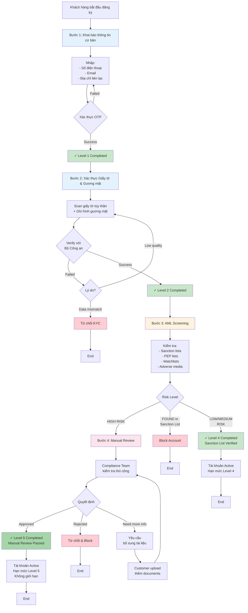
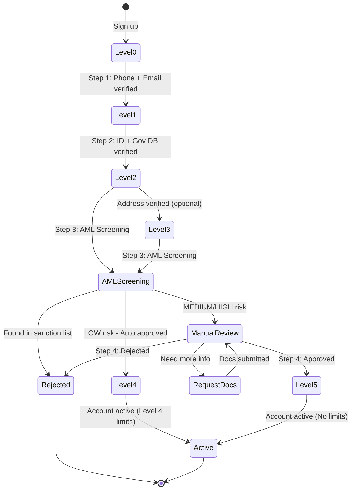
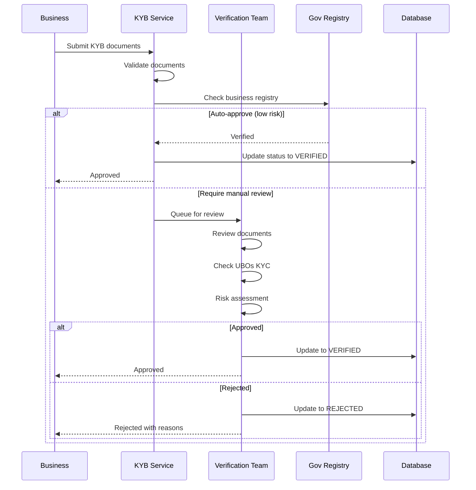

# X. KYC/KYB - Xác minh Danh tính Khách hàng

## Tổng quan

Module KYC (Know Your Customer) và KYB (Know Your Business) đảm bảo tuân thủ quy định chống rửa tiền (AML) và xác minh danh tính khách hàng trước khi cung cấp dịch vụ tài chính.

## KYC Levels

```typescript
enum KYCLevel {
  LEVEL_0 = 0,  // Chưa xác thực - Giới hạn rất thấp
  LEVEL_1 = 1,  // Basic - Xác thực cơ bản (phone + email)
  LEVEL_2 = 2,  // Standard - Xác thực căn cước + selfie
  LEVEL_3 = 3,  // Advanced - Xác thực đầy đủ + proof of address
  LEVEL_4 = 4,  // Sanction List Verified - Đã kiểm tra danh sách trừng phạt
  LEVEL_5 = 5   // Manual Review Completed - Đã kiểm tra thủ công high risk
}

interface KYCLevelLimits {
  level: KYCLevel;
  limits: {
    maxBalance: number;
    dailyTransaction: number;
    monthlyTransaction: number;
  };
  features: string[];
}

const KYC_LIMITS = {
  [KYCLevel.LEVEL_0]: {
    maxBalance: 0,
    dailyTransaction: 0,
    monthlyTransaction: 0,
    features: ['view_only']
  },
  [KYCLevel.LEVEL_1]: {
    maxBalance: 10_000_000,      // 10 triệu
    dailyTransaction: 5_000_000,  // 5 triệu
    monthlyTransaction: 50_000_000, // 50 triệu
    features: ['transfer', 'payment']
  },
  [KYCLevel.LEVEL_2]: {
    maxBalance: 100_000_000,     // 100 triệu
    dailyTransaction: 50_000_000, // 50 triệu
    monthlyTransaction: 500_000_000, // 500 triệu
    features: ['transfer', 'payment', 'withdrawal', 'credit']
  },
  [KYCLevel.LEVEL_3]: {
    maxBalance: 500_000_000,     // 500 triệu
    dailyTransaction: 200_000_000, // 200 triệu
    monthlyTransaction: 2_000_000_000, // 2 tỷ
    features: ['all']
  },
  [KYCLevel.LEVEL_4]: {
    maxBalance: 2_000_000_000,   // 2 tỷ
    dailyTransaction: 500_000_000, // 500 triệu
    monthlyTransaction: 5_000_000_000, // 5 tỷ
    features: ['all', 'international_transfer', 'high_value_transactions']
  },
  [KYCLevel.LEVEL_5]: {
    maxBalance: Infinity,
    dailyTransaction: Infinity,
    monthlyTransaction: Infinity,
    features: ['all', 'international_transfer', 'high_value_transactions', 'institutional_services']
  }
};
```

## Hành trình Onboarding Khách hàng

### Tổng quan 4 bước Onboarding



### Chi tiết từng bước

#### Bước 1: Khai báo thông tin cơ bản

```typescript
interface Step1BasicInfo {
  // Contact information
  phoneNumber: string;          // Bắt buộc
  phoneCountryCode: string;     // e.g., +84
  phoneVerified: boolean;
  phoneOTP?: string;
  
  email: string;                // Bắt buộc
  emailVerified: boolean;
  emailOTP?: string;
  
  // Basic personal info
  fullName: string;
  dateOfBirth?: string;
  gender?: 'MALE' | 'FEMALE' | 'OTHER';
  
  // Contact address (không cần proof)
  contactAddress: {
    street?: string;
    ward?: string;
    district?: string;
    city: string;
    country: string;
  };
}

async function completeStep1(data: Step1BasicInfo): Promise<void> {
  // 1. Validate phone number format
  if (!isValidPhoneNumber(data.phoneNumber, data.phoneCountryCode)) {
    throw new Error('Invalid phone number');
  }
  
  // 2. Send OTP to phone
  await sendPhoneOTP(data.phoneNumber);
  
  // 3. Verify OTP
  const phoneVerified = await verifyPhoneOTP(data.phoneNumber, data.phoneOTP);
  if (!phoneVerified) {
    throw new Error('Phone OTP verification failed');
  }
  
  // 4. Send OTP to email
  await sendEmailOTP(data.email);
  
  // 5. Verify email OTP
  const emailVerified = await verifyEmailOTP(data.email, data.emailOTP);
  if (!emailVerified) {
    throw new Error('Email OTP verification failed');
  }
  
  // 6. Save basic info and upgrade to Level 1
  await saveUserData(data);
  await upgradeKYCLevel(data.userId, KYCLevel.LEVEL_1);
}
```

#### Bước 2: Scan giấy tờ & Verify với Bộ Công an

```typescript
interface Step2IDVerification {
  // ID Document
  idType: 'CCCD' | 'CMND' | 'PASSPORT';
  idFrontImage: string;         // Base64 or URL
  idBackImage?: string;         // For CCCD/CMND
  
  // Selfie
  selfieImage: string;
  selfieVideo?: string;         // Optional liveness check
  
  // Extracted from OCR
  ocrData?: {
    idNumber: string;
    fullName: string;
    dateOfBirth: string;
    gender: string;
    nationality: string;
    placeOfOrigin: string;
    placeOfResidence: string;
    issueDate: string;
    expiryDate: string;
  };
}

async function completeStep2(
  userId: string,
  data: Step2IDVerification
): Promise<void> {
  // 1. OCR - Extract data from ID card
  const ocrResult = await performOCR({
    frontImage: data.idFrontImage,
    backImage: data.idBackImage
  });
  
  if (ocrResult.confidence < 0.85) {
    throw new Error('Image quality too low. Please retake photos.');
  }
  
  // 2. Liveness check (if video provided)
  if (data.selfieVideo) {
    const isLive = await checkLiveness(data.selfieVideo);
    if (!isLive) {
      throw new Error('Liveness check failed');
    }
  }
  
  // 3. Face matching - Compare selfie with ID photo
  const faceMatchScore = await compareFaces({
    idPhoto: ocrResult.faceImage,
    selfie: data.selfieImage
  });
  
  if (faceMatchScore < 0.80) {
    throw new Error('Face does not match ID photo');
  }
  
  // 4. Verify with government database (Bộ Công an)
  const govVerification = await verifyWithPoliceDB({
    idNumber: ocrResult.idNumber,
    fullName: ocrResult.fullName,
    dateOfBirth: ocrResult.dateOfBirth
  });
  
  if (!govVerification.isValid) {
    throw new Error('ID not found in government database or data mismatch');
  }
  
  // 5. Check if ID already used by another account
  const isDuplicate = await checkDuplicateID(ocrResult.idNumber);
  if (isDuplicate) {
    throw new Error('This ID is already registered');
  }
  
  // 6. Save ID data and upgrade to Level 2
  await saveIDVerification(userId, {
    ...ocrResult,
    faceMatchScore,
    govVerified: true,
    govVerificationData: govVerification,
    verifiedAt: new Date()
  });
  
  await upgradeKYCLevel(userId, KYCLevel.LEVEL_2);
  
  // 7. Automatically proceed to Step 3 (AML Screening)
  await initiateStep3(userId);
}
```

#### Bước 3: AML Screening (Sanction List)

```typescript
interface Step3AMLScreening {
  userId: string;
  userData: {
    fullName: string;
    dateOfBirth: string;
    idNumber: string;
    nationality: string;
  };
  
  screeningResults: {
    // Sanction lists (UN, OFAC, EU, etc.)
    sanctionCheck: {
      found: boolean;
      matches: Array<{
        list: string;           // e.g., 'UN', 'OFAC', 'EU'
        matchScore: number;     // 0-100
        details: string;
      }>;
    };
    
    // PEP check
    pepCheck: {
      isPEP: boolean;
      level: 'DOMESTIC' | 'FOREIGN' | 'INTERNATIONAL_ORG';
      position?: string;
      details?: string;
    };
    
    // Watchlists
    watchlistCheck: {
      found: boolean;
      lists: string[];
    };
    
    // Adverse media
    adverseMediaCheck: {
      found: boolean;
      articles: Array<{
        title: string;
        source: string;
        date: string;
        severity: 'HIGH' | 'MEDIUM' | 'LOW';
      }>;
    };
  };
  
  riskScore: number;            // 0-100
  riskLevel: 'LOW' | 'MEDIUM' | 'HIGH';
  decision: 'AUTO_APPROVE' | 'MANUAL_REVIEW' | 'REJECT';
}

async function completeStep3(userId: string): Promise<Step3AMLScreening> {
  // Get user data from Step 2
  const userData = await getUserKYCData(userId);
  
  // 1. Check Sanction Lists
  const sanctionCheck = await checkSanctionLists({
    fullName: userData.fullName,
    dateOfBirth: userData.dateOfBirth,
    nationality: userData.nationality,
    idNumber: userData.idNumber
  });
  
  // If found in sanction list with high match score -> Immediate reject
  if (sanctionCheck.found) {
    const highConfidenceMatch = sanctionCheck.matches.some(m => m.matchScore > 90);
    if (highConfidenceMatch) {
      await blockAccount(userId, 'Found in sanction list');
      return {
        userId,
        userData,
        screeningResults: { sanctionCheck, ... },
        riskScore: 100,
        riskLevel: 'HIGH',
        decision: 'REJECT'
      };
    }
  }
  
  // 2. Check PEP
  const pepCheck = await checkPEP(userData);
  
  // 3. Check Watchlists
  const watchlistCheck = await checkWatchlists(userData);
  
  // 4. Check Adverse Media
  const adverseMediaCheck = await checkAdverseMedia(userData);
  
  // 5. Calculate risk score
  let riskScore = 0;
  
  if (sanctionCheck.found) {
    const avgMatchScore = sanctionCheck.matches.reduce((sum, m) => sum + m.matchScore, 0) / sanctionCheck.matches.length;
    riskScore += avgMatchScore * 0.5;  // Weight: 50%
  }
  
  if (pepCheck.isPEP) {
    riskScore += pepCheck.level === 'FOREIGN' ? 30 : 20;
  }
  
  if (watchlistCheck.found) {
    riskScore += 15;
  }
  
  if (adverseMediaCheck.found) {
    const highSeverityCount = adverseMediaCheck.articles.filter(a => a.severity === 'HIGH').length;
    riskScore += Math.min(highSeverityCount * 10, 30);
  }
  
  // 6. Determine risk level and decision
  let riskLevel: 'LOW' | 'MEDIUM' | 'HIGH';
  let decision: 'AUTO_APPROVE' | 'MANUAL_REVIEW' | 'REJECT';
  
  if (riskScore < 25) {
    riskLevel = 'LOW';
    decision = 'AUTO_APPROVE';
    // Upgrade to Level 4
    await upgradeKYCLevel(userId, KYCLevel.LEVEL_4);
  } else if (riskScore < 50) {
    riskLevel = 'MEDIUM';
    decision = 'MANUAL_REVIEW';
    // Queue for manual review (Step 4)
    await queueForManualReview(userId, 'MEDIUM_RISK');
  } else {
    riskLevel = 'HIGH';
    decision = 'MANUAL_REVIEW';
    // Queue for enhanced manual review (Step 4)
    await queueForManualReview(userId, 'HIGH_RISK');
  }
  
  // 7. Save screening results
  const screening: Step3AMLScreening = {
    userId,
    userData,
    screeningResults: {
      sanctionCheck,
      pepCheck,
      watchlistCheck,
      adverseMediaCheck
    },
    riskScore,
    riskLevel,
    decision
  };
  
  await saveAMLScreening(screening);
  
  return screening;
}
```

#### Bước 4: Manual Review (High Risk)

```typescript
interface Step4ManualReview {
  reviewId: string;
  userId: string;
  
  // Review context
  queuedAt: string;
  priority: 'HIGH' | 'MEDIUM' | 'LOW';
  riskLevel: 'HIGH' | 'MEDIUM';
  amlScreening: Step3AMLScreening;
  
  // Additional documents requested
  additionalDocuments?: Array<{
    type: 'PROOF_OF_FUNDS' | 'EMPLOYMENT_LETTER' | 'BANK_STATEMENT' | 'OTHER';
    description: string;
    fileUrl?: string;
    status: 'REQUESTED' | 'SUBMITTED' | 'APPROVED' | 'REJECTED';
  }>;
  
  // Reviewer actions
  assignedTo?: string;           // Reviewer user ID
  reviewedAt?: string;
  reviewNotes: string;
  reviewDecision?: 'APPROVE' | 'REJECT' | 'REQUEST_MORE_INFO';
  approvedBy?: string;           // Manager approval for high risk
  
  // Final status
  status: 'PENDING' | 'IN_REVIEW' | 'AWAITING_DOCS' | 'COMPLETED';
  finalDecision?: 'APPROVED' | 'REJECTED';
}

async function processManualReview(
  reviewId: string,
  decision: 'APPROVE' | 'REJECT' | 'REQUEST_MORE_INFO',
  notes: string,
  requestedDocs?: string[]
): Promise<void> {
  const review = await getManualReview(reviewId);
  
  if (decision === 'REQUEST_MORE_INFO') {
    // Request additional documents
    const docsToRequest = requestedDocs.map(type => ({
      type,
      description: getDocumentDescription(type),
      status: 'REQUESTED'
    }));
    
    await updateManualReview(reviewId, {
      status: 'AWAITING_DOCS',
      additionalDocuments: docsToRequest,
      reviewNotes: notes
    });
    
    // Notify customer
    await notifyCustomer(review.userId, {
      type: 'ADDITIONAL_DOCS_REQUIRED',
      documents: docsToRequest
    });
    
    return;
  }
  
  if (decision === 'APPROVE') {
    // For HIGH risk, requires manager approval
    if (review.riskLevel === 'HIGH') {
      await requestManagerApproval(reviewId, notes);
      return;
    }
    
    // Approve and upgrade to Level 5
    await updateManualReview(reviewId, {
      status: 'COMPLETED',
      finalDecision: 'APPROVED',
      reviewNotes: notes,
      reviewedAt: new Date()
    });
    
    await upgradeKYCLevel(review.userId, KYCLevel.LEVEL_5);
    
    // Notify customer
    await notifyCustomer(review.userId, {
      type: 'KYC_APPROVED',
      level: KYCLevel.LEVEL_5
    });
    
    return;
  }
  
  if (decision === 'REJECT') {
    // Reject and block account
    await updateManualReview(reviewId, {
      status: 'COMPLETED',
      finalDecision: 'REJECTED',
      reviewNotes: notes,
      reviewedAt: new Date()
    });
    
    await blockAccount(review.userId, `KYC rejected: ${notes}`);
    
    // Notify customer
    await notifyCustomer(review.userId, {
      type: 'KYC_REJECTED',
      reason: notes
    });
  }
}

// Manager approval for high-risk cases
async function managerApproveReview(
  reviewId: string,
  managerId: string,
  approved: boolean,
  notes: string
): Promise<void> {
  const review = await getManualReview(reviewId);
  
  if (approved) {
    await updateManualReview(reviewId, {
      status: 'COMPLETED',
      finalDecision: 'APPROVED',
      reviewNotes: `${review.reviewNotes}\n\nManager approval: ${notes}`,
      approvedBy: managerId,
      reviewedAt: new Date()
    });
    
    await upgradeKYCLevel(review.userId, KYCLevel.LEVEL_5);
    
    await notifyCustomer(review.userId, {
      type: 'KYC_APPROVED',
      level: KYCLevel.LEVEL_5
    });
  } else {
    await updateManualReview(reviewId, {
      status: 'COMPLETED',
      finalDecision: 'REJECTED',
      reviewNotes: `${review.reviewNotes}\n\nManager rejection: ${notes}`,
      approvedBy: managerId,
      reviewedAt: new Date()
    });
    
    await blockAccount(review.userId, `KYC rejected by manager: ${notes}`);
    
    await notifyCustomer(review.userId, {
      type: 'KYC_REJECTED',
      reason: notes
    });
  }
}
```

## KYC Flow (Cập nhật)



### Level 1: Basic Verification

```typescript
interface Level1KYC {
  phoneNumber: string;
  phoneVerified: boolean;
  phoneVerifiedAt?: string;
  
  email: string;
  emailVerified: boolean;
  emailVerifiedAt?: string;
  
  // Basic info
  fullName: string;
  dateOfBirth?: string;
}

async function verifyLevel1(userId: string): Promise<void> {
  const user = await getUser(userId);
  
  // Check phone verification
  if (!user.phoneVerified) {
    throw new Error('Phone not verified');
  }
  
  // Check email verification
  if (!user.emailVerified) {
    throw new Error('Email not verified');
  }
  
  // Upgrade to Level 1
  await updateUserKYCLevel(userId, KYCLevel.LEVEL_1);
}
```

### Level 2: ID Verification

```typescript
interface Level2KYC extends Level1KYC {
  // ID Document
  idType: 'NATIONAL_ID' | 'PASSPORT' | 'DRIVING_LICENSE';
  idNumber: string;
  idIssueDate: string;
  idExpiryDate: string;
  idIssuePlace: string;
  
  // Document images
  idFrontImage: string;
  idBackImage?: string;
  selfieImage: string;
  
  // OCR extracted data
  ocrData?: {
    idNumber: string;
    fullName: string;
    dateOfBirth: string;
    address: string;
    confidence: number;
  };
  
  // Face matching
  faceMatchScore?: number;
  
  // Verification result
  verificationStatus: 'PENDING' | 'VERIFIED' | 'REJECTED';
  verifiedAt?: string;
  rejectionReason?: string;
}
```

#### OCR & Face Matching

```typescript
async function verifyLevel2(
  userId: string,
  documents: Level2Documents
): Promise<VerificationResult> {
  // 1. OCR - Extract data from ID
  const ocrResult = await ocrService.extractIDData({
    frontImage: documents.idFrontImage,
    backImage: documents.idBackImage
  });
  
  if (ocrResult.confidence < 0.8) {
    return {
      status: 'REJECTED',
      reason: 'Low OCR confidence - unclear images'
    };
  }
  
  // 2. Face matching - Compare selfie with ID photo
  const faceMatchScore = await faceMatchingService.compare({
    idPhoto: ocrResult.faceImage,
    selfie: documents.selfieImage
  });
  
  if (faceMatchScore < 0.85) {
    return {
      status: 'REJECTED',
      reason: 'Face does not match ID photo'
    };
  }
  
  // 3. Check ID blacklist
  const isBlacklisted = await checkIDBlacklist(ocrResult.idNumber);
  if (isBlacklisted) {
    return {
      status: 'REJECTED',
      reason: 'ID number in blacklist'
    };
  }
  
  // 4. Verify with government database (if available)
  const govVerification = await verifyWithGovDB({
    idNumber: ocrResult.idNumber,
    fullName: ocrResult.fullName,
    dateOfBirth: ocrResult.dateOfBirth
  });
  
  if (!govVerification.matched) {
    return {
      status: 'REJECTED',
      reason: 'ID not found in government database'
    };
  }
  
  // 5. Update KYC data
  await updateKYCData(userId, {
    ...ocrResult,
    faceMatchScore,
    verificationStatus: 'VERIFIED',
    verifiedAt: new Date(),
    kycLevel: KYCLevel.LEVEL_2
  });
  
  return {
    status: 'VERIFIED',
    kycLevel: KYCLevel.LEVEL_2
  };
}
```

### Level 3: Address Verification

```typescript
interface Level3KYC extends Level2KYC {
  // Address
  address: {
    street: string;
    ward: string;
    district: string;
    city: string;
    country: string;
    postalCode?: string;
  };
  
  // Proof of address (upload one)
  proofOfAddress: {
    type: 'UTILITY_BILL' | 'BANK_STATEMENT' | 'TAX_DOCUMENT' | 'RESIDENCE_CERT';
    documentImage: string;
    issueDate: string;
    verificationStatus: 'PENDING' | 'VERIFIED' | 'REJECTED';
  };
}
```

## KYB (Know Your Business)

### Business Verification

```typescript
interface KYBData {
  businessId: string;
  
  // Company info
  companyInfo: {
    legalName: string;
    tradingName: string;
    registrationNumber: string;
    taxId: string;
    businessType: 'SOLE_PROPRIETOR' | 'PARTNERSHIP' | 'COMPANY';
    industryCategory: string;
    incorporationDate: string;
    country: string;
  };
  
  // Registered address
  registeredAddress: {
    street: string;
    city: string;
    state: string;
    postalCode: string;
    country: string;
  };
  
  // Operating address (if different)
  operatingAddress?: Address;
  
  // Documents
  documents: {
    businessLicense: {
      fileUrl: string;
      issueDate: string;
      expiryDate: string;
      status: DocumentStatus;
    };
    taxCertificate: {
      fileUrl: string;
      issueDate: string;
      status: DocumentStatus;
    };
    articleOfAssociation?: {
      fileUrl: string;
      status: DocumentStatus;
    };
    bankStatement: {
      fileUrl: string;
      period: string;        // Last 3 months
      status: DocumentStatus;
    };
  };
  
  // Beneficial owners (UBOs - Ultimate Beneficial Owners)
  beneficialOwners: Array<{
    userId: string;
    fullName: string;
    ownershipPercentage: number;
    role: string;
    kycStatus: KYCStatus;
  }>;
  
  // Authorized signatories
  authorizedSignatories: Array<{
    userId: string;
    fullName: string;
    role: string;
    kycStatus: KYCStatus;
    authorizationDocument?: string;
  }>;
  
  // Verification
  verificationStatus: 'PENDING' | 'IN_REVIEW' | 'VERIFIED' | 'REJECTED';
  verifiedAt?: string;
  verifiedBy?: string;
  rejectionReason?: string;
}
```

### KYB Verification Process



## AML Screening

### Screening Checks

```typescript
interface AMLScreening {
  userId: string;
  screeningType: 'KYC' | 'TRANSACTION' | 'PERIODIC';
  
  checks: {
    // Politically Exposed Person
    pepCheck: {
      isPEP: boolean;
      pepCategory?: 'DOMESTIC' | 'FOREIGN' | 'INTERNATIONAL_ORG';
      details?: string;
    };
    
    // Sanctions lists
    sanctionsCheck: {
      found: boolean;
      lists: string[];      // e.g., ['UN', 'OFAC', 'EU']
      matchScore: number;
    };
    
    // Adverse media
    adverseMediaCheck: {
      found: boolean;
      articles: Array<{
        title: string;
        source: string;
        date: string;
        category: string;
      }>;
    };
    
    // Watchlists
    watchlistCheck: {
      found: boolean;
      watchlists: string[];
    };
  };
  
  riskScore: number;         // 0-100
  riskLevel: 'LOW' | 'MEDIUM' | 'HIGH';
  requiresReview: boolean;
  screenedAt: string;
}

async function performAMLScreening(
  userId: string,
  userData: KYCData
): Promise<AMLScreening> {
  const screening: AMLScreening = {
    userId,
    screeningType: 'KYC',
    checks: {
      pepCheck: await checkPEP(userData),
      sanctionsCheck: await checkSanctions(userData),
      adverseMediaCheck: await checkAdverseMedia(userData),
      watchlistCheck: await checkWatchlists(userData)
    },
    riskScore: 0,
    riskLevel: 'LOW',
    requiresReview: false,
    screenedAt: new Date().toISOString()
  };
  
  // Calculate risk score
  let score = 0;
  
  if (screening.checks.pepCheck.isPEP) score += 30;
  if (screening.checks.sanctionsCheck.found) score += 50;
  if (screening.checks.adverseMediaCheck.found) score += 20;
  if (screening.checks.watchlistCheck.found) score += 25;
  
  screening.riskScore = score;
  
  // Determine risk level
  if (score >= 50) {
    screening.riskLevel = 'HIGH';
    screening.requiresReview = true;
  } else if (score >= 25) {
    screening.riskLevel = 'MEDIUM';
    screening.requiresReview = true;
  } else {
    screening.riskLevel = 'LOW';
  }
  
  // Save screening result
  await saveAMLScreening(screening);
  
  // If high risk, block account pending review
  if (screening.riskLevel === 'HIGH') {
    await blockAccount(userId, 'AML screening - high risk');
  }
  
  return screening;
}
```

## Periodic Review

### Re-KYC

```typescript
interface ReKYCSchedule {
  userId: string;
  currentKYCLevel: KYCLevel;
  lastKYCDate: string;
  nextKYCDate: string;
  
  reviewFrequency: 'ANNUAL' | 'BIENNIAL' | 'TRIENNIAL';
  
  triggers: Array<{
    type: 'TIME_BASED' | 'RISK_BASED' | 'REGULATORY';
    triggeredAt: string;
    reason: string;
  }>;
}

// Run daily
async function checkReKYCDue(): Promise<void> {
  const today = new Date();
  
  // Get users due for re-KYC
  const dueUsers = await db('users')
    .where('nextKYCDate', '<=', today)
    .where('kycStatus', 'VERIFIED');
  
  for (const user of dueUsers) {
    // Notify user
    await sendNotification({
      userId: user.userId,
      type: 'RE_KYC_REQUIRED',
      data: {
        dueDate: user.nextKYCDate,
        currentLevel: user.kycLevel
      }
    });
    
    // Downgrade after grace period (30 days)
    const gracePeriodEnd = addDays(user.nextKYCDate, 30);
    if (today > gracePeriodEnd) {
      await downgradeKYCLevel(user.userId);
    }
  }
}
```

## API Reference

```typescript
// KYC
POST /api/v1/kyc/level-1/verify
POST /api/v1/kyc/level-2/submit
POST /api/v1/kyc/level-3/submit
GET /api/v1/kyc/status

// KYB
POST /api/v1/kyb/submit
POST /api/v1/kyb/documents/upload
GET /api/v1/kyb/status

// AML
POST /api/v1/aml/screening
GET /api/v1/aml/screening/{userId}

// Admin
GET /api/v1/admin/kyc/pending-review
POST /api/v1/admin/kyc/{userId}/approve
POST /api/v1/admin/kyc/{userId}/reject
```

## Use Cases trong hệ thống Masan

### 1. NBL - Level 2 KYC

```typescript
// Retailer needs Level 2 for merchant account
const retailerKYC = {
  userId: 'RETAILER_123',
  idType: 'NATIONAL_ID',
  idNumber: '001234567890',
  idFrontImage: 'base64...',
  selfieImage: 'base64...'
};
```

### 2. Winlife Member - Level 2 KYC

```typescript
// Member wants higher limits
const memberKYC = {
  userId: 'WINLIFE_456',
  idType: 'NATIONAL_ID',
  idNumber: '009876543210',
  idFrontImage: 'base64...',
  selfieImage: 'base64...'
};
```

### 3. NPP - KYB

```typescript
// Distributor registers business account
const distributorKYB = {
  companyInfo: {
    legalName: 'Công ty TNHH NPP Miền Nam',
    registrationNumber: '0123456789',
    taxId: '0123456789-001'
  },
  documents: {
    businessLicense: {...},
    taxCertificate: {...}
  },
  beneficialOwners: [...],
  authorizedSignatories: [...]
};
```

## Best Practices

1. **Privacy & Security**
   - Encrypt sensitive data (ID numbers, images)
   - Access control for PII
   - Secure storage and transmission
   - GDPR/data protection compliance

2. **User Experience**
   - Clear instructions
   - Real-time feedback
   - Multiple retry attempts
   - Support for failed verifications

3. **Compliance**
   - Regular AML screening
   - Periodic re-KYC
   - Audit trail for all verifications
   - Staff training on AML/CFT

## Kết luận

KYC/KYB đảm bảo hệ thống Masan tuân thủ quy định và an toàn:

- ✅ Tiered KYC cho flexibility
- ✅ Automated verification giảm manual work
- ✅ AML screening toàn diện
- ✅ Periodic review duy trì compliance
- ✅ Balance giữa security và UX

