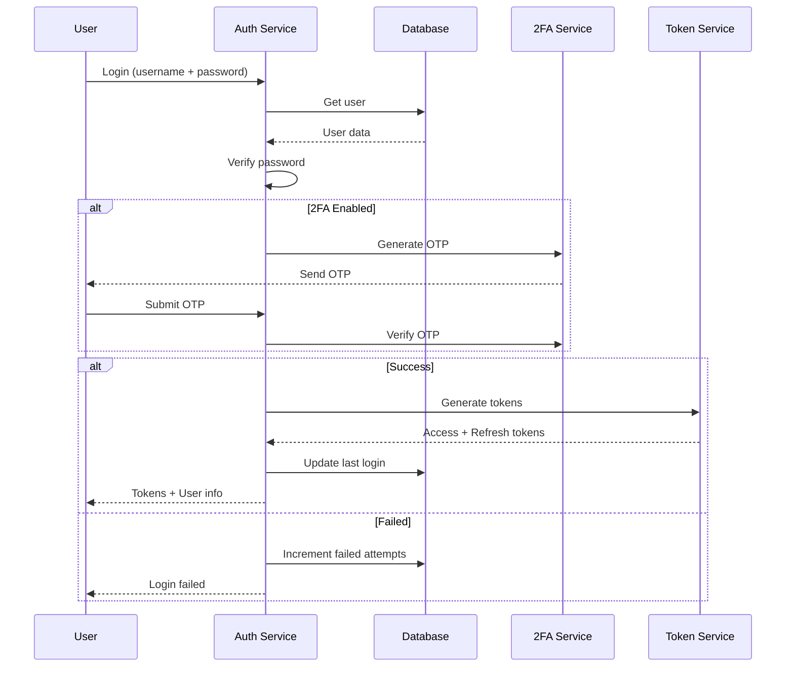

# XIV. User & Access Management - Quản lý Người dùng và Phân quyền

## Tổng quan

Module User & Access Management quản lý authentication, authorization, và access control cho toàn bộ hệ thống.

## User Model

```typescript
interface User {
  userId: string;
  username: string;
  email: string;
  phoneNumber: string;
  
  // Profile
  profile: {
    firstName: string;
    lastName: string;
    fullName: string;
    dateOfBirth: string;
    avatar?: string;
  };
  
  // Authentication
  passwordHash: string;
  passwordChangedAt: string;
  twoFactorEnabled: boolean;
  twoFactorSecret?: string;
  
  // Status
  status: 'ACTIVE' | 'INACTIVE' | 'SUSPENDED' | 'LOCKED';
  emailVerified: boolean;
  phoneVerified: boolean;
  
  // Security
  lastLoginAt?: string;
  lastLoginIP?: string;
  failedLoginAttempts: number;
  lockedUntil?: string;
  
  // KYC
  kycLevel: number;
  kycStatus: string;
  
  // Roles
  roles: string[];
  
  // Timestamps
  createdAt: string;
  updatedAt: string;
}
```

## Authentication

### Login Flow



### Password Authentication

```typescript
async function authenticateUser(
  username: string,
  password: string
): Promise<AuthResult> {
  // Get user
  const user = await getUserByUsername(username);
  
  if (!user) {
    return { success: false, reason: 'USER_NOT_FOUND' };
  }
  
  // Check if locked
  if (user.lockedUntil && new Date(user.lockedUntil) > new Date()) {
    return { success: false, reason: 'ACCOUNT_LOCKED' };
  }
  
  // Verify password
  const isValid = await bcrypt.compare(password, user.passwordHash);
  
  if (!isValid) {
    // Increment failed attempts
    await incrementFailedAttempts(user.userId);
    
    // Lock account after 5 failed attempts
    if (user.failedLoginAttempts >= 4) {
      await lockAccount(user.userId, 30); // 30 minutes
    }
    
    return { success: false, reason: 'INVALID_PASSWORD' };
  }
  
  // Reset failed attempts
  await resetFailedAttempts(user.userId);
  
  return { success: true, user };
}
```

### Two-Factor Authentication

```typescript
async function enable2FA(userId: string): Promise<{ secret: string; qrCode: string }> {
  const secret = speakeasy.generateSecret({
    name: `Masan (${await getUserEmail(userId)})`
  });
  
  await db('users').where({ userId }).update({
    twoFactorSecret: encrypt(secret.base32)
  });
  
  const qrCode = await QRCode.toDataURL(secret.otpauth_url);
  
  return {
    secret: secret.base32,
    qrCode
  };
}

async function verify2FA(userId: string, token: string): Promise<boolean> {
  const user = await getUser(userId);
  const secret = decrypt(user.twoFactorSecret);
  
  return speakeasy.totp.verify({
    secret,
    encoding: 'base32',
    token,
    window: 2
  });
}
```

## Authorization

### Role-Based Access Control (RBAC)

```typescript
interface Role {
  roleId: string;
  name: string;
  description: string;
  permissions: Permission[];
  inherits?: string[];  // Inherit from other roles
}

interface Permission {
  resource: string;     // e.g., 'transactions', 'users'
  actions: Action[];    // e.g., ['create', 'read', 'update', 'delete']
  conditions?: Record<string, any>;
}

// Predefined roles
const ROLES = {
  SUPER_ADMIN: {
    roleId: 'super_admin',
    name: 'Super Admin',
    permissions: [{ resource: '*', actions: ['*'] }]
  },
  
  ADMIN: {
    roleId: 'admin',
    name: 'Administrator',
    permissions: [
      { resource: 'users', actions: ['create', 'read', 'update'] },
      { resource: 'transactions', actions: ['read', 'update'] },
      { resource: 'reports', actions: ['read'] }
    ]
  },
  
  MERCHANT: {
    roleId: 'merchant',
    name: 'Merchant',
    permissions: [
      { resource: 'transactions', actions: ['read'], conditions: { ownerId: '${userId}' } },
      { resource: 'invoices', actions: ['create', 'read', 'update'] },
      { resource: 'reports', actions: ['read'], conditions: { ownerId: '${userId}' } }
    ]
  },
  
  CUSTOMER: {
    roleId: 'customer',
    name: 'Customer',
    permissions: [
      { resource: 'wallet', actions: ['read', 'update'], conditions: { ownerId: '${userId}' } },
      { resource: 'transactions', actions: ['create', 'read'], conditions: { ownerId: '${userId}' } }
    ]
  }
};
```

### Permission Check

```typescript
async function checkPermission(
  userId: string,
  resource: string,
  action: string,
  context?: Record<string, any>
): Promise<boolean> {
  const user = await getUser(userId);
  
  for (const roleId of user.roles) {
    const role = await getRole(roleId);
    
    for (const permission of role.permissions) {
      // Check resource match
      if (permission.resource !== '*' && permission.resource !== resource) {
        continue;
      }
      
      // Check action match
      if (!permission.actions.includes('*') && !permission.actions.includes(action)) {
        continue;
      }
      
      // Check conditions
      if (permission.conditions) {
        const conditionsMet = await evaluateConditions(
          permission.conditions,
          { userId, ...context }
        );
        if (!conditionsMet) {
          continue;
        }
      }
      
      return true;
    }
  }
  
  return false;
}
```

## Session Management

```typescript
interface Session {
  sessionId: string;
  userId: string;
  
  // Tokens
  accessToken: string;
  refreshToken: string;
  
  // Device info
  deviceId: string;
  deviceName: string;
  ipAddress: string;
  userAgent: string;
  
  // Timestamps
  createdAt: string;
  expiresAt: string;
  lastActivityAt: string;
  
  // Status
  active: boolean;
}

// JWT Token Structure
interface JWTPayload {
  sub: string;              // userId
  email: string;
  roles: string[];
  permissions: string[];
  
  iat: number;              // Issued at
  exp: number;              // Expires at
  jti: string;              // JWT ID
}
```

## API Reference

```typescript
// Authentication
POST /api/v1/auth/login
POST /api/v1/auth/logout
POST /api/v1/auth/refresh
POST /api/v1/auth/forgot-password
POST /api/v1/auth/reset-password

// 2FA
POST /api/v1/auth/2fa/enable
POST /api/v1/auth/2fa/verify
POST /api/v1/auth/2fa/disable

// Users
GET /api/v1/users
GET /api/v1/users/{userId}
POST /api/v1/users
PATCH /api/v1/users/{userId}
DELETE /api/v1/users/{userId}

// Roles & Permissions
GET /api/v1/roles
POST /api/v1/roles
GET /api/v1/users/{userId}/permissions
POST /api/v1/users/{userId}/roles
```

## Security Best Practices

1. **Password Policy**
   - Min 8 characters
   - Mix of upper, lower, numbers, symbols
   - No common passwords
   - Password history (don't reuse last 5)
   - Expire every 90 days

2. **Session Security**
   - Short-lived access tokens (15 minutes)
   - Long-lived refresh tokens (7 days)
   - Rotate refresh tokens
   - IP binding for sensitive operations

3. **Rate Limiting**
   - Max 5 login attempts per 15 minutes
   - Max 100 API calls per minute
   - Exponential backoff for failed attempts

## Kết luận

User & Access Management đảm bảo bảo mật hệ thống:
- ✅ Robust authentication
- ✅ Fine-grained authorization
- ✅ Multi-factor authentication
- ✅ Session management
- ✅ Audit logging

