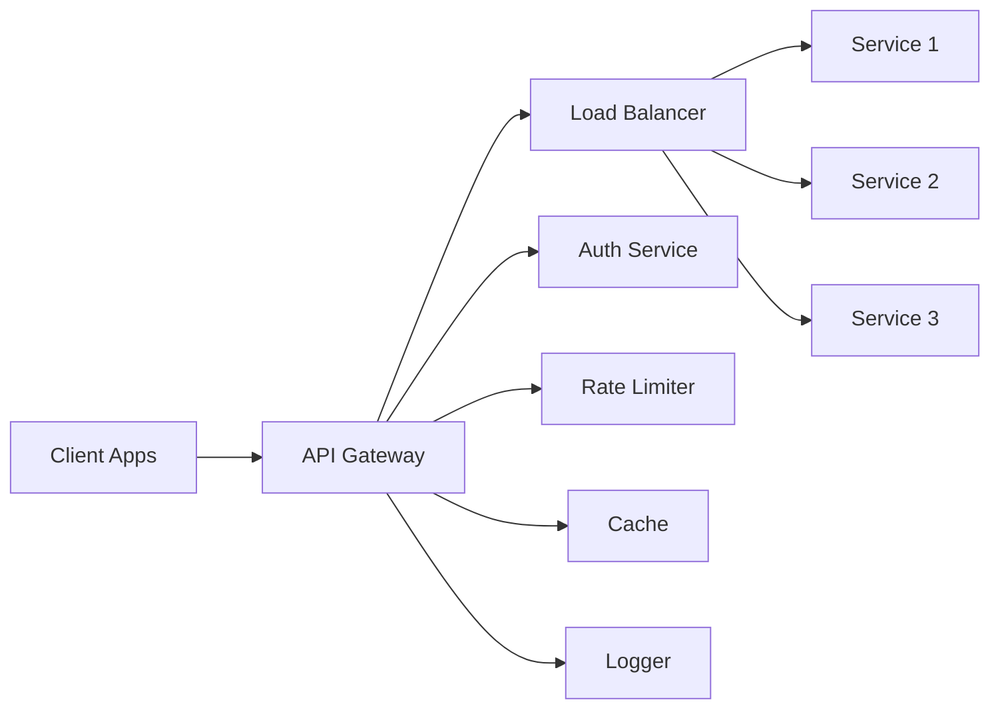

# XVI. API Gateway - Cổng API

## Tổng quan

API Gateway là điểm vào duy nhất (single entry point) cho tất cả các request đến hệ thống, cung cấp routing, security, rate limiting, và monitoring.

## Architecture



## Core Features

### 1. Request Routing

```typescript
interface Route {
  path: string;
  method: 'GET' | 'POST' | 'PUT' | 'DELETE' | 'PATCH';
  service: string;
  upstreamPath: string;
  
  // Authentication required?
  authRequired: boolean;
  
  // Required permissions
  permissions?: string[];
  
  // Rate limit
  rateLimit?: {
    requests: number;
    window: number;      // seconds
  };
  
  // Caching
  cache?: {
    enabled: boolean;
    ttl: number;         // seconds
  };
  
  // Timeout
  timeout: number;       // milliseconds
}

// Example routes
const ROUTES: Route[] = [
  {
    path: '/api/v1/transactions',
    method: 'POST',
    service: 'transaction-service',
    upstreamPath: '/transactions',
    authRequired: true,
    permissions: ['transactions:create'],
    rateLimit: { requests: 10, window: 60 },
    timeout: 30000
  },
  {
    path: '/api/v1/users/:id',
    method: 'GET',
    service: 'user-service',
    upstreamPath: '/users/:id',
    authRequired: true,
    cache: { enabled: true, ttl: 300 },
    timeout: 5000
  }
];
```

### 2. Authentication & Authorization

```typescript
async function authenticateRequest(req: Request): Promise<AuthResult> {
  // Extract token
  const token = req.headers.authorization?.replace('Bearer ', '');
  
  if (!token) {
    return { authenticated: false, reason: 'NO_TOKEN' };
  }
  
  // Verify JWT
  try {
    const payload = await verifyJWT(token);
    
    // Check if token is revoked
    const isRevoked = await checkTokenRevocation(payload.jti);
    if (isRevoked) {
      return { authenticated: false, reason: 'TOKEN_REVOKED' };
    }
    
    return {
      authenticated: true,
      userId: payload.sub,
      roles: payload.roles,
      permissions: payload.permissions
    };
  } catch (error) {
    return { authenticated: false, reason: 'INVALID_TOKEN' };
  }
}

async function authorizeRequest(
  user: User,
  route: Route
): Promise<boolean> {
  if (!route.permissions) {
    return true;
  }
  
  // Check if user has required permissions
  for (const permission of route.permissions) {
    if (!user.permissions.includes(permission)) {
      return false;
    }
  }
  
  return true;
}
```

### 3. Rate Limiting

```typescript
interface RateLimiter {
  key: string;              // User ID or IP
  limit: number;
  window: number;           // seconds
  
  async checkLimit(): Promise<RateLimitResult> {
    const key = `ratelimit:${this.key}`;
    
    // Get current count
    const current = await redis.get(key) || 0;
    
    if (current >= this.limit) {
      const ttl = await redis.ttl(key);
      return {
        allowed: false,
        limit: this.limit,
        remaining: 0,
        resetAt: Date.now() + (ttl * 1000)
      };
    }
    
    // Increment counter
    await redis.incr(key);
    
    // Set expiry on first request
    if (current === 0) {
      await redis.expire(key, this.window);
    }
    
    return {
      allowed: true,
      limit: this.limit,
      remaining: this.limit - current - 1,
      resetAt: Date.now() + (this.window * 1000)
    };
  }
}
```

### 4. Caching

```typescript
interface CacheConfig {
  enabled: boolean;
  ttl: number;
  keyPattern: string;
  
  // Cache invalidation
  invalidateOn?: string[];  // Event types that invalidate cache
}

async function checkCache(req: Request): Promise<Response | null> {
  const cacheKey = generateCacheKey(req);
  const cached = await redis.get(cacheKey);
  
  if (cached) {
    return {
      status: 200,
      body: JSON.parse(cached),
      headers: {
        'X-Cache': 'HIT'
      }
    };
  }
  
  return null;
}

async function saveToCache(
  req: Request,
  res: Response,
  ttl: number
): Promise<void> {
  const cacheKey = generateCacheKey(req);
  await redis.setex(cacheKey, ttl, JSON.stringify(res.body));
}
```

### 5. Request/Response Transformation

```typescript
interface Transformer {
  // Request transformation
  transformRequest?: (req: Request) => Request;
  
  // Response transformation
  transformResponse?: (res: Response) => Response;
}

// Example: Add correlation ID
function addCorrelationId(req: Request): Request {
  req.headers['X-Correlation-ID'] = req.headers['X-Correlation-ID'] || generateUUID();
  return req;
}

// Example: Standardize response format
function standardizeResponse(res: Response): Response {
  return {
    status: res.status,
    body: {
      success: res.status < 400,
      data: res.body,
      timestamp: new Date().toISOString(),
      requestId: res.headers['X-Request-ID']
    }
  };
}
```

### 6. Circuit Breaker

```typescript
class CircuitBreaker {
  private state: 'CLOSED' | 'OPEN' | 'HALF_OPEN' = 'CLOSED';
  private failureCount: number = 0;
  private lastFailureTime: number = 0;
  
  constructor(
    private threshold: number = 5,
    private timeout: number = 60000,  // 1 minute
    private resetTime: number = 30000  // 30 seconds
  ) {}
  
  async execute<T>(fn: () => Promise<T>): Promise<T> {
    if (this.state === 'OPEN') {
      if (Date.now() - this.lastFailureTime > this.resetTime) {
        this.state = 'HALF_OPEN';
      } else {
        throw new Error('Circuit breaker is OPEN');
      }
    }
    
    try {
      const result = await fn();
      
      if (this.state === 'HALF_OPEN') {
        this.state = 'CLOSED';
        this.failureCount = 0;
      }
      
      return result;
    } catch (error) {
      this.failureCount++;
      this.lastFailureTime = Date.now();
      
      if (this.failureCount >= this.threshold) {
        this.state = 'OPEN';
      }
      
      throw error;
    }
  }
}
```

## Load Balancing

```typescript
enum LoadBalancingStrategy {
  ROUND_ROBIN = 'ROUND_ROBIN',
  LEAST_CONNECTIONS = 'LEAST_CONNECTIONS',
  IP_HASH = 'IP_HASH',
  WEIGHTED = 'WEIGHTED'
}

interface ServiceInstance {
  host: string;
  port: number;
  weight: number;
  healthy: boolean;
  connections: number;
}

class LoadBalancer {
  private currentIndex: number = 0;
  
  constructor(
    private instances: ServiceInstance[],
    private strategy: LoadBalancingStrategy
  ) {}
  
  selectInstance(): ServiceInstance {
    const healthyInstances = this.instances.filter(i => i.healthy);
    
    switch (this.strategy) {
      case 'ROUND_ROBIN':
        const instance = healthyInstances[this.currentIndex];
        this.currentIndex = (this.currentIndex + 1) % healthyInstances.length;
        return instance;
      
      case 'LEAST_CONNECTIONS':
        return healthyInstances.reduce((prev, curr) => 
          curr.connections < prev.connections ? curr : prev
        );
      
      case 'WEIGHTED':
        // Weighted random selection
        const totalWeight = healthyInstances.reduce((sum, i) => sum + i.weight, 0);
        let random = Math.random() * totalWeight;
        
        for (const instance of healthyInstances) {
          random -= instance.weight;
          if (random <= 0) {
            return instance;
          }
        }
        
        return healthyInstances[0];
    }
  }
}
```

## Health Checks

```typescript
interface HealthCheck {
  serviceId: string;
  endpoint: string;
  interval: number;        // seconds
  timeout: number;         // milliseconds
  healthyThreshold: number;
  unhealthyThreshold: number;
}

async function performHealthCheck(check: HealthCheck): Promise<void> {
  let consecutiveFailures = 0;
  let consecutiveSuccesses = 0;
  
  setInterval(async () => {
    try {
      const response = await fetch(`${check.endpoint}/health`, {
        timeout: check.timeout
      });
      
      if (response.ok) {
        consecutiveSuccesses++;
        consecutiveFailures = 0;
        
        if (consecutiveSuccesses >= check.healthyThreshold) {
          await markServiceHealthy(check.serviceId);
        }
      } else {
        throw new Error('Unhealthy response');
      }
    } catch (error) {
      consecutiveFailures++;
      consecutiveSuccesses = 0;
      
      if (consecutiveFailures >= check.unhealthyThreshold) {
        await markServiceUnhealthy(check.serviceId);
      }
    }
  }, check.interval * 1000);
}
```

## Monitoring & Logging

```typescript
interface RequestLog {
  requestId: string;
  correlationId: string;
  
  // Request info
  method: string;
  path: string;
  headers: Record<string, string>;
  body?: any;
  
  // Client info
  clientIP: string;
  userAgent: string;
  userId?: string;
  
  // Routing
  service: string;
  upstreamPath: string;
  
  // Timing
  timestamp: string;
  duration: number;         // milliseconds
  
  // Response
  statusCode: number;
  responseSize: number;     // bytes
  
  // Errors
  error?: string;
}

async function logRequest(log: RequestLog): Promise<void> {
  // Send to logging service (e.g., ELK, Datadog)
  await loggingService.log({
    level: log.statusCode >= 500 ? 'ERROR' : log.statusCode >= 400 ? 'WARN' : 'INFO',
    message: `${log.method} ${log.path} ${log.statusCode} ${log.duration}ms`,
    ...log
  });
  
  // Send metrics
  await metricsService.increment('api.requests', {
    method: log.method,
    path: log.path,
    status: log.statusCode,
    service: log.service
  });
  
  await metricsService.timing('api.duration', log.duration, {
    service: log.service
  });
}
```

## API Versioning

```typescript
// URL versioning: /api/v1/users vs /api/v2/users
app.use('/api/v1', routerV1);
app.use('/api/v2', routerV2);

// Header versioning: API-Version: 1.0
app.use((req, res, next) => {
  const version = req.headers['api-version'] || '1.0';
  req.apiVersion = version;
  next();
});

// Deprecation warning
app.use((req, res, next) => {
  if (req.path.startsWith('/api/v1')) {
    res.setHeader('Deprecation', 'true');
    res.setHeader('Sunset', '2024-12-31');
    res.setHeader('Link', '<https://docs.api.com/v2>; rel="successor-version"');
  }
  next();
});
```

## Documentation

API Gateway tự động generate API documentation từ routes:

```typescript
// OpenAPI/Swagger specification
const openApiSpec = {
  openapi: '3.0.0',
  info: {
    title: 'Masan Core Banking API',
    version: '1.0.0',
    description: 'API documentation for Masan Core Banking System'
  },
  servers: [
    { url: 'https://api.masan.com', description: 'Production' },
    { url: 'https://api-staging.masan.com', description: 'Staging' }
  ],
  paths: {
    '/api/v1/transactions': {
      post: {
        summary: 'Create transaction',
        security: [{ bearerAuth: [] }],
        requestBody: {...},
        responses: {...}
      }
    }
  }
};

// Serve documentation at /docs
app.use('/docs', swaggerUi.serve, swaggerUi.setup(openApiSpec));
```

## Best Practices

1. **Security**
   - Always validate input
   - Sanitize sensitive data in logs
   - Implement CORS properly
   - Use HTTPS only

2. **Performance**
   - Enable caching for read-heavy endpoints
   - Use compression (gzip)
   - Implement timeouts
   - Connection pooling

3. **Reliability**
   - Circuit breaker for failing services
   - Retry with exponential backoff
   - Health checks
   - Graceful degradation

## Kết luận

API Gateway cung cấp single entry point với:
- ✅ Centralized security
- ✅ Traffic management
- ✅ Service discovery
- ✅ Monitoring & logging
- ✅ API versioning

