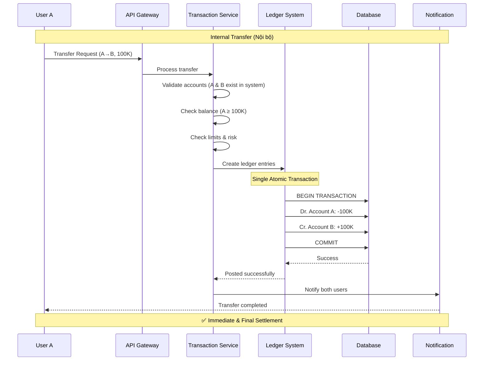
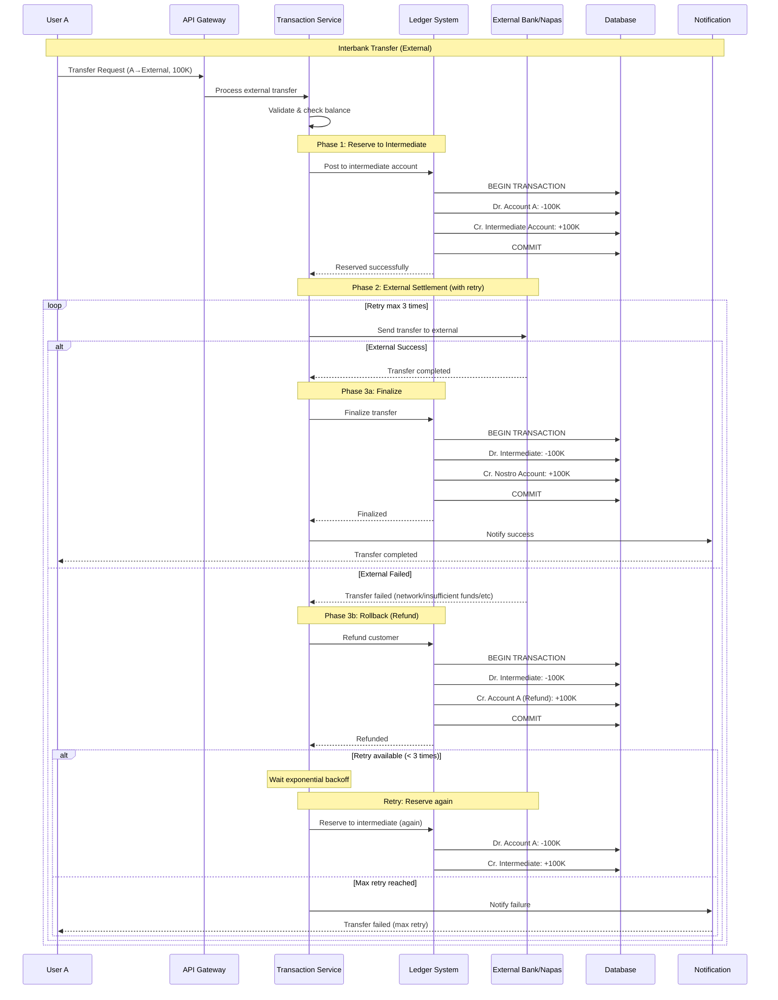

# Phân tích Quy trình Chuyển tiền - Internal vs Interbank Transfer

## Tóm tắt Executive Summary

Tài liệu này phân tích 2 quy trình chuyển tiền khác biệt trong Core Banking System:
1. **Internal Transfer** (Chuyển tiền nội bộ): Direct ledger posting
2. **Interbank Transfer** (Chuyển tiền liên ngân hàng): Intermediate account + External settlement

---

## 1. Chuyển tiền Nội bộ (Internal Transfer)

### 1.1. Định nghĩa

**Internal Transfer**: Chuyển tiền giữa các tài khoản trong cùng một hệ thống ví/ngân hàng

**Ví dụ:**
- User A (ví Masan) → User B (ví Masan)
- Account X (Bank A) → Account Y (Bank A)

### 1.2. Quy trình Hạch toán

**Accounting Entry (Single-step):**
```
Dr. Account A (Người chuyển)     -100,000 VND
Cr. Account B (Người nhận)       +100,000 VND
```

**Đặc điểm:**
- ✅ Atomic transaction (1 bước)
- ✅ Real-time settlement
- ✅ No intermediate account
- ✅ Immediate finality

### 1.3. Luồng Xử lý (Sequence Diagram)



### 1.4. Pseudo Code

```typescript
async function processInternalTransfer(transfer: Transfer): Promise<Result> {
  // 1. Validate
  await validateAccounts(transfer.fromAccount, transfer.toAccount);
  await checkBalance(transfer.fromAccount, transfer.amount);
  await checkLimits(transfer.fromAccount, transfer.amount);
  
  // 2. Create ledger entries (Atomic)
  const ledgerEntries = [
    {
      account: transfer.fromAccount,
      type: 'DEBIT',
      amount: transfer.amount,
      reference: transfer.id
    },
    {
      account: transfer.toAccount,
      type: 'CREDIT',
      amount: transfer.amount,
      reference: transfer.id
    }
  ];
  
  // 3. Post to ledger (Single transaction)
  await ledgerSystem.postEntries(ledgerEntries);
  
  // 4. Notify
  await notificationService.notifyTransfer(transfer);
  
  return { status: 'SUCCESS', finalBalance: await getBalance(transfer.fromAccount) };
}
```

---

## 2. Chuyển tiền Interbank (External Transfer)

### 2.1. Định nghĩa

**Interbank Transfer**: Chuyển tiền ra ngoài hệ thống, cần settlement với bên thứ 3

**Ví dụ:**
- User A (ví Masan) → User B (ví ViettelPay) - qua External Wallet API
- Account X (Bank A) → Account Y (Bank B) - qua Napas

### 2.2. Quy trình Hạch toán (3-Phase Commit Pattern)

**Phase 1: Reserve (Ghi có tạm vào Intermediate Account)**
```
Dr. Account A (Người chuyển)           -100,000 VND
Cr. Intermediate Account (Suspense)    +100,000 VND
```

**Phase 2: External Settlement**
```
Call External Bank API / Napas
  → If SUCCESS: Continue to Phase 3
  → If FAILED: Rollback (Phase 1 Reversal)
```

**Phase 3a: Finalize (Nếu External thành công)**
```
Dr. Intermediate Account (Suspense)    -100,000 VND
Cr. Nostro Account (External)          +100,000 VND
```

**Phase 3b: Rollback (Nếu External thất bại)**
```
Dr. Intermediate Account (Suspense)    -100,000 VND
Cr. Account A (Người chuyển - Refund)  +100,000 VND
```

### 2.3. Luồng Xử lý với Retry Mechanism



### 2.4. Pseudo Code với Retry Logic

```typescript
async function processExternalTransfer(transfer: Transfer): Promise<Result> {
  const MAX_RETRY = 3;
  let attempt = 0;
  
  while (attempt < MAX_RETRY) {
    attempt++;
    
    try {
      // Phase 1: Reserve to intermediate account
      await reserveToIntermediate(transfer);
      
      // Phase 2: External settlement
      const externalResult = await callExternalBank(transfer);
      
      if (externalResult.success) {
        // Phase 3a: Finalize
        await finalizeTransfer(transfer);
        
        await notificationService.notifySuccess(transfer);
        return { status: 'SUCCESS', attempt };
      } else {
        // External failed → Refund
        await refundCustomer(transfer);
        
        if (attempt < MAX_RETRY) {
          // Retry with exponential backoff
          await sleep(Math.pow(2, attempt) * 1000); // 2s, 4s, 8s
          continue; // Retry
        } else {
          // Max retry reached
          await notificationService.notifyFailure(transfer, 'MAX_RETRY_EXCEEDED');
          return { status: 'FAILED', reason: 'MAX_RETRY_EXCEEDED', attempt };
        }
      }
    } catch (error) {
      // System error (ledger, DB, etc)
      await handleSystemError(transfer, error);
      throw error;
    }
  }
}

// Helper functions
async function reserveToIntermediate(transfer: Transfer) {
  const entries = [
    { account: transfer.fromAccount, type: 'DEBIT', amount: transfer.amount },
    { account: 'INTERMEDIATE_SUSPENSE', type: 'CREDIT', amount: transfer.amount }
  ];
  await ledgerSystem.postEntries(entries);
}

async function refundCustomer(transfer: Transfer) {
  const entries = [
    { account: 'INTERMEDIATE_SUSPENSE', type: 'DEBIT', amount: transfer.amount },
    { account: transfer.fromAccount, type: 'CREDIT', amount: transfer.amount }
  ];
  await ledgerSystem.postEntries(entries);
}

async function finalizeTransfer(transfer: Transfer) {
  const entries = [
    { account: 'INTERMEDIATE_SUSPENSE', type: 'DEBIT', amount: transfer.amount },
    { account: 'NOSTRO_ACCOUNT', type: 'CREDIT', amount: transfer.amount }
  ];
  await ledgerSystem.postEntries(entries);
}

async function callExternalBank(transfer: Transfer): Promise<ExternalResult> {
  // Integration với External Bank API hoặc Napas
  return await externalBankAPI.transfer({
    toAccount: transfer.toAccount,
    amount: transfer.amount,
    reference: transfer.id
  });
}
```

---

## 3. So sánh 2 Quy trình

| Tiêu chí | Internal Transfer | Interbank Transfer |
|----------|-------------------|-------------------|
| **Số bước hạch toán** | 1 bước (atomic) | 3 bước (reserve → settle → finalize) |
| **Intermediate Account** | Không cần | ✅ Cần (Suspense Account) |
| **External API Call** | Không | ✅ Có (Bank API / Napas) |
| **Settlement Time** | Instant (< 1s) | Delayed (seconds to minutes) |
| **Finality** | Immediate | After external confirmation |
| **Rollback Complexity** | Simple (single txn rollback) | Complex (multi-phase rollback) |
| **Retry Logic** | Không cần | ✅ Cần (max 3 lần) |
| **Nostro/Vostro** | Không | ✅ Cần reconciliation |
| **Cost** | Miễn phí (nội bộ) | Có phí (Napas/Bank) |
| **Risk** | Low | Higher (settlement risk) |

---

## 4. Phân tích Ưu điểm và Nhược điểm

### 4.1. UƯU ĐIỂM của Quy trình Interbank với Intermediate Account

#### ✅ 1. **Accounting Integrity (Tính toàn vẹn kế toán)**

**Lợi ích:**
- Balance luôn đúng ở mọi thời điểm
- Không có "money in the air" (tiền đang bay giữa 2 hệ thống)
- Audit trail rõ ràng

**Giải thích:**
```
Thay vì:
  Dr. Account A
  ??? (Đợi external)
  Cr. ??? (Ở đâu?)

Ta có:
  Dr. Account A
  Cr. Intermediate (Clear & trackable)
```

---

#### ✅ 2. **Idempotency & Retry Safety (An toàn khi retry)**

**Lợi ích:**
- Có thể retry an toàn mà không bị double debit
- Mỗi lần retry có thể track được
- Không ảnh hưởng balance customer trong quá trình retry

**Cơ chế:**
```
Lần 1: Reserve → External fail → Refund → State clean
Lần 2: Reserve (lại) → External fail → Refund → State clean
Lần 3: Reserve (lại) → External success → Finalize ✅
```

Nếu không có intermediate account:
```
Lần 1: Dr. A → External fail → Phải Cr. A (refund)
Lần 2: Dr. A (lại) → External fail → Phải Cr. A (lại)
❌ Risk: Double debit nếu có race condition
```

---

#### ✅ 3. **Reconciliation Capability (Khả năng đối soát)**

**Lợi ích:**
- Dễ dàng đối soát với external bank
- Nostro account balance = tổng pending transfers
- Intermediate account làm buffer rõ ràng

**Reconciliation:**
```sql
-- Check pending transfers
SELECT SUM(amount) FROM intermediate_account 
WHERE status = 'PENDING'

-- Should match with Nostro pending
SELECT SUM(amount) FROM nostro_transactions
WHERE status = 'PENDING'
```

---

#### ✅ 4. **Customer Experience (Trải nghiệm khách hàng)**

**Lợi ích:**
- Balance customer cập nhật ngay lập tức (debit ngay)
- Không để customer nghĩ còn tiền và tiêu tiếp
- Clear về trạng thái transfer (pending/success/failed)

**Timeline:**
```
T0: Customer sees balance reduced immediately
    (Tiền đã trừ, không thể tiêu tiếp)
    
T0+5s: External processing...
    (Customer sees "Transfer pending")
    
T0+10s: Transfer completed
    (Customer sees "Transfer successful")
```

---

#### ✅ 5. **Transaction Ordering (Thứ tự giao dịch)**

**Lợi ích:**
- Đảm bảo FIFO order
- Không bị race condition giữa các transfers
- Serializable isolation level

---

#### ✅ 6. **Regulatory Compliance (Tuân thủ quy định)**

**Lợi ích:**
- Theo chuẩn banking practices (Basel, IFRS)
- Audit trail đầy đủ cho regulators
- Clear money flow tracking

---

### 4.2. NHƯỢC ĐIỂM của Quy trình

#### ❌ 1. **Complexity (Phức tạp)**

**Vấn đề:**
- 3-phase commit pattern phức tạp
- Nhiều bước xử lý hơn
- Code phức tạp hơn để maintain

**Impact:**
- Development time cao hơn
- Testing phức tạp (nhiều edge cases)
- Bug surface area lớn hơn

**Ví dụ edge cases:**
```
- External timeout (không success cũng không fail)
- Partial success (external OK nhưng finalize fail)
- Network split brain
- Race condition trong retry
```

---

#### ❌ 2. **Performance Overhead (Hiệu năng thấp hơn)**

**Vấn đề:**
- 3 lần write vào DB (thay vì 1 lần)
- Nhiều API calls hơn
- Latency cao hơn (do external call + retry)

**Comparison:**
```
Internal Transfer:
  1 DB write → Done (< 100ms)

Interbank Transfer:
  Reserve (DB write 1) → 50ms
  External call → 2-5s
  Finalize (DB write 2) → 50ms
  Total: 2-5+ seconds
  
  Nếu fail + retry:
  Total: 6-15+ seconds (3 retries)
```

---

#### ❌ 3. **Resource Consumption (Tiêu tốn tài nguyên)**

**Vấn đề:**
- Intermediate account cần maintain
- Nostro account cần reconciliation daily
- DB space cho audit trail

**Storage:**
```
Internal: 2 ledger entries per transfer
Interbank: 
  - Success: 4 entries (reserve + finalize)
  - Failed with retry: 2n entries (n = retry count)
  - Failed case: 6-8 entries (3 retries × 2)
```

---

#### ❌ 4. **Retry Risks (Rủi ro khi retry)**

**Vấn đề 1: External Duplicate Processing**
```
Lần 1: External nhận request → Process → Response timeout
Lần 2: Retry → External process lại ❌ (nếu không idempotent)
```

**Giải pháp:** External phải idempotent (dùng transfer.id làm key)

**Vấn đề 2: Zombie Transactions**
```
External success nhưng response timeout
→ System nghĩ fail → Retry
→ Finalize bị duplicate ❌
```

**Giải pháp:** Check status với external trước khi retry

---

#### ❌ 5. **Operational Overhead (Chi phí vận hành)**

**Vấn đề:**
- Cần monitor intermediate account daily
- Cần reconciliation với Napas/Banks
- Stuck transactions cần manual intervention

**Daily Operations:**
```
1. Check intermediate account balance
   → Should be ~0 EOD (end of day)
   → If not → investigate stuck transactions

2. Reconcile Nostro account with bank
   → Match our records với bank statement
   → Resolve discrepancies

3. Handle zombie transactions
   → Check transactions > 1 hour pending
   → Manual finalize hoặc refund
```

---

#### ❌ 6. **Limits on Retry Strategy (Giới hạn của retry)**

**Vấn đề 1: Max Retry = 3 có thể không đủ**
```
Scenario: External bank maintenance 30 minutes
→ 3 retries × 8s backoff = 24s
→ Still fail
→ Customer unhappy
```

**Vấn đề 2: Exponential Backoff có thể quá lâu**
```
Retry 1: 2s
Retry 2: 4s  
Retry 3: 8s
Total: 14s+ customer waiting
```

**Vấn đề 3: Fixed retry count không linh hoạt**
```
- Transient error (network blip): 1 retry đủ
- Bank maintenance: 3 retry không đủ
- Bank down: Retry vô nghĩa, nên fail ngay
```

---

#### ❌ 7. **Edge Cases (Trường hợp đặc biệt)**

**Case 1: Partial Success**
```
Reserve: ✅ Success
External: ✅ Success
Finalize: ❌ FAIL (DB down)

→ Money ở intermediate
→ External đã nhận tiền
→ Cần manual intervention
```

**Case 2: Refund Failure**
```
Reserve: ✅
External: ❌ Fail
Refund: ❌ FAIL (DB down)

→ Money stuck ở intermediate
→ Customer chưa nhận refund
→ Balance sai
```

**Case 3: Split Brain**
```
External: ✅ Success (but slow response)
System: Timeout → Think failed → Refund ❌

→ External đã transfer
→ System refund customer
→ Money duplicated ❌
```

---

## 5. Cải thiện Quy trình (Recommendations)

### 5.1. Short-term Improvements (Ngắn hạn)

#### ✅ 1. **Implement Idempotency Key**

```typescript
interface TransferRequest {
  idempotencyKey: string; // UUID của transfer
  fromAccount: string;
  toAccount: string;
  amount: number;
}

// External API check idempotency
async function callExternalBank(transfer: Transfer) {
  return await externalAPI.transfer({
    idempotencyKey: transfer.id, // ✅ Prevent duplicate
    toAccount: transfer.toAccount,
    amount: transfer.amount
  });
}
```

---

#### ✅ 2. **Add Status Check Before Retry**

```typescript
async function processExternalTransfer(transfer: Transfer) {
  for (let attempt = 1; attempt <= MAX_RETRY; attempt++) {
    await reserveToIntermediate(transfer);
    
    try {
      const result = await callExternalBank(transfer);
      // ... success handling
    } catch (error) {
      // ✅ Check status before refund
      const externalStatus = await checkExternalStatus(transfer.id);
      
      if (externalStatus === 'SUCCESS') {
        // External actually succeeded
        await finalizeTransfer(transfer);
        return { status: 'SUCCESS' };
      } else if (externalStatus === 'PENDING') {
        // Still processing, wait longer
        await sleep(5000);
        continue;
      } else {
        // Confirmed failed, safe to refund
        await refundCustomer(transfer);
        if (attempt < MAX_RETRY) continue;
      }
    }
  }
}
```

---

#### ✅ 3. **Implement Reconciliation Job**

```typescript
// Run every 5 minutes
async function reconcileStuckTransfers() {
  const stuckTransfers = await getTransfersInIntermediate({
    status: 'PENDING',
    createdAt: { $lt: Date.now() - 3600000 } // > 1 hour
  });
  
  for (const transfer of stuckTransfers) {
    const externalStatus = await checkExternalStatus(transfer.id);
    
    if (externalStatus === 'SUCCESS') {
      await finalizeTransfer(transfer);
    } else if (externalStatus === 'FAILED') {
      await refundCustomer(transfer);
    } else {
      // Still pending → Alert ops team
      await alertOpsTeam(transfer);
    }
  }
}
```

---

#### ✅ 4. **Improve Retry Strategy**

```typescript
interface RetryConfig {
  maxRetries: number;
  backoffStrategy: 'exponential' | 'linear' | 'adaptive';
  initialDelay: number;
  maxDelay: number;
}

async function adaptiveRetry(transfer: Transfer) {
  const errorType = await detectErrorType(lastError);
  
  const config: RetryConfig = {
    // Network error: retry nhiều, backoff ngắn
    'NETWORK_ERROR': { maxRetries: 5, backoffStrategy: 'exponential', initialDelay: 1000 },
    
    // Bank busy: retry ít, backoff dài
    'BANK_BUSY': { maxRetries: 3, backoffStrategy: 'linear', initialDelay: 5000 },
    
    // Bank down: không retry
    'BANK_DOWN': { maxRetries: 0 },
    
    // Default
    'UNKNOWN': { maxRetries: 3, backoffStrategy: 'exponential', initialDelay: 2000 }
  }[errorType];
  
  return config;
}
```

---

#### ✅ 5. **Add Circuit Breaker**

```typescript
class ExternalBankCircuitBreaker {
  private failureCount = 0;
  private state: 'CLOSED' | 'OPEN' | 'HALF_OPEN' = 'CLOSED';
  private lastFailureTime: number = 0;
  
  async call(fn: Function) {
    if (this.state === 'OPEN') {
      // Circuit open → fail fast
      if (Date.now() - this.lastFailureTime > 60000) {
        this.state = 'HALF_OPEN'; // Try again after 1 min
      } else {
        throw new Error('Circuit breaker is OPEN');
      }
    }
    
    try {
      const result = await fn();
      this.onSuccess();
      return result;
    } catch (error) {
      this.onFailure();
      throw error;
    }
  }
  
  private onSuccess() {
    this.failureCount = 0;
    this.state = 'CLOSED';
  }
  
  private onFailure() {
    this.failureCount++;
    this.lastFailureTime = Date.now();
    
    if (this.failureCount >= 5) {
      this.state = 'OPEN'; // Stop trying
      this.alertOpsTeam('Circuit breaker OPEN for external bank');
    }
  }
}
```

---

### 5.2. Long-term Improvements (Dài hạn)

#### ✅ 1. **Implement Saga Pattern**

```typescript
// Distributed transaction orchestration
class TransferSaga {
  async execute(transfer: Transfer) {
    const saga = new Saga();
    
    saga.addStep({
      name: 'reserve',
      forward: () => reserveToIntermediate(transfer),
      backward: () => refundCustomer(transfer) // Compensation
    });
    
    saga.addStep({
      name: 'external',
      forward: () => callExternalBank(transfer),
      backward: () => cancelExternalTransfer(transfer)
    });
    
    saga.addStep({
      name: 'finalize',
      forward: () => finalizeTransfer(transfer),
      backward: () => null // Cannot rollback finalize
    });
    
    return await saga.run();
  }
}
```

---

#### ✅ 2. **Implement Event Sourcing**

```typescript
// Store events instead of state
interface TransferEvent {
  type: 'RESERVED' | 'EXTERNAL_CALLED' | 'EXTERNAL_SUCCESS' | 'FINALIZED' | 'REFUNDED';
  timestamp: Date;
  data: any;
}

// Rebuild state from events
async function getTransferState(transferId: string) {
  const events = await getEvents(transferId);
  
  let state = { status: 'INITIATED' };
  for (const event of events) {
    state = applyEvent(state, event);
  }
  
  return state;
}

// Benefits: Complete audit trail, can replay, can fix errors
```

---

#### ✅ 3. **Async Processing with Queue**

```typescript
// Decouple external call from customer request
async function processExternalTransfer(transfer: Transfer) {
  // Phase 1: Reserve (synchronous)
  await reserveToIntermediate(transfer);
  
  // Response to customer immediately
  await respondToCustomer({ status: 'PENDING', transferId: transfer.id });
  
  // Phase 2 & 3: Process asynchronously
  await queue.publish('external-transfer', transfer);
}

// Worker processes queue
async function externalTransferWorker() {
  const transfer = await queue.consume('external-transfer');
  
  const result = await callExternalBank(transfer);
  
  if (result.success) {
    await finalizeTransfer(transfer);
    await notifyCustomer({ status: 'SUCCESS' });
  } else {
    await refundCustomer(transfer);
    await notifyCustomer({ status: 'FAILED' });
  }
}
```

Benefits:
- ✅ Customer không phải đợi (better UX)
- ✅ Retry không block customer
- ✅ Easier to scale (add more workers)

---

## 6. Best Practices Summary

### ✅ DO (Nên làm)

1. **Use Intermediate Account** cho interbank transfers
   - Clear accounting trail
   - Safe retry mechanism

2. **Implement Idempotency** ở cả client và server
   - Prevent duplicate transfers
   - Use UUID as idempotency key

3. **Check External Status** trước khi retry
   - Avoid split brain
   - Confirm failure before refund

4. **Monitor & Alert**
   - Track stuck transactions
   - Alert when intermediate balance > threshold
   - Daily reconciliation

5. **Implement Circuit Breaker**
   - Fail fast when external down
   - Protect system from cascade failure

6. **Adaptive Retry Strategy**
   - Different retry for different errors
   - Exponential backoff with jitter

7. **Async Processing**
   - Decouple external call from customer request
   - Better UX and scalability

---

### ❌ DON'T (Không nên)

1. **Không retry vô hạn**
   - Set max retry (3-5 times)
   - Alert ops team for manual intervention

2. **Không hard-code timeout**
   - Make configurable
   - Different timeout cho different external partners

3. **Không bỏ qua reconciliation**
   - Daily reconcile với external
   - Investigate discrepancies immediately

4. **Không để stuck transactions quá lâu**
   - Auto-refund after 24h
   - Manual review for large amounts

5. **Không skip logging**
   - Log mọi bước (reserve, external call, finalize, refund)
   - Include full request/response cho troubleshooting

---

## 7. Kết luận

### 7.1. Internal Transfer
- ✅ **Simple, fast, reliable**
- ✅ Use cho transfers trong cùng hệ thống
- ✅ Direct ledger posting

### 7.2. Interbank Transfer với Intermediate Account
- ✅ **Ưu điểm chính:**
  - Accounting integrity
  - Safe retry
  - Clear audit trail
  - Better reconciliation

- ❌ **Nhược điểm chính:**
  - Complex implementation
  - Performance overhead
  - Operational burden
  - Edge cases cần handle

### 7.3. Recommendation

**QUY TRÌNH HIỆN TẠI LÀ HỢP LÝ** với điều kiện:
1. ✅ Implement idempotency key
2. ✅ Check external status before retry
3. ✅ Add circuit breaker
4. ✅ Implement reconciliation job
5. ✅ Consider async processing cho better UX

**Không nên:**
- ❌ Remove intermediate account (sẽ mất accounting integrity)
- ❌ Skip retry mechanism (sẽ có nhiều failed transfers)
- ❌ Synchronous processing cho large volumes (performance issue)

**Long-term:**
- Consider Saga pattern cho distributed transactions
- Consider Event Sourcing cho complete audit trail
- Consider Async Queue processing cho better scalability

---

## 8. References

- **Accounting Standards**: IFRS, Basel III
- **Transaction Patterns**: Two-Phase Commit, Saga Pattern
- **Distributed Systems**: Idempotency, Circuit Breaker, Retry Strategies
- **Banking Best Practices**: Nostro/Vostro reconciliation, Suspense account management

---

**Tài liệu này được tạo để phân tích quy trình chuyển tiền và đưa ra recommendations cho Core Banking System của Masan eWallet.**

**Ngày tạo**: 2025-11-17  
**Người phân tích**: AI Architecture Assistant

