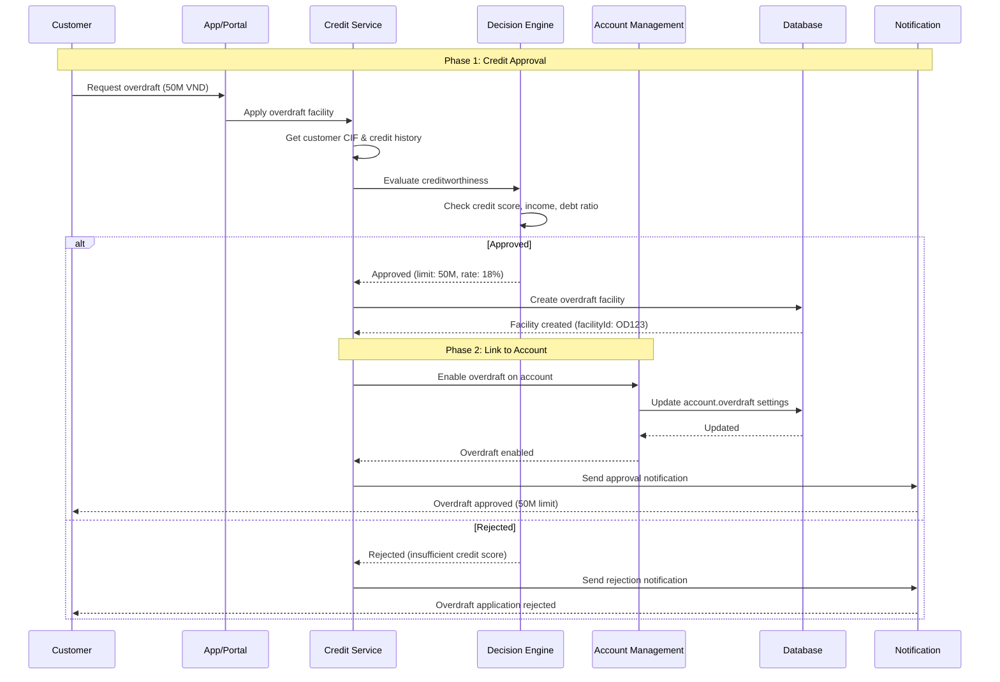
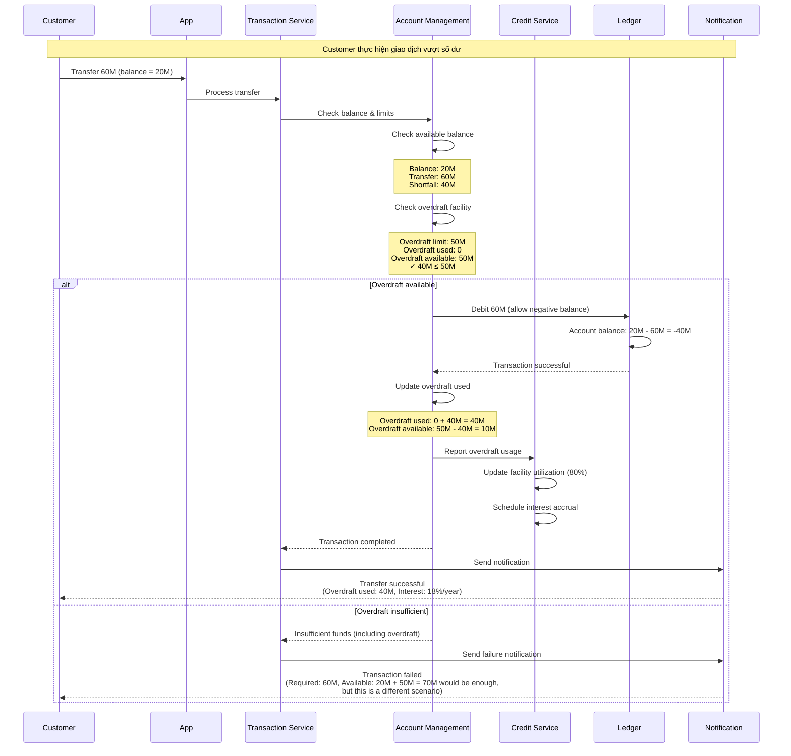
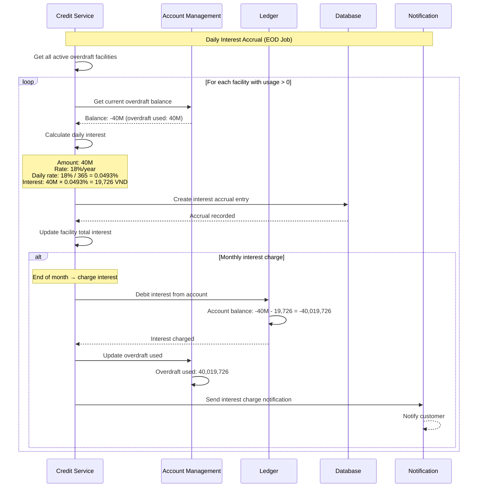
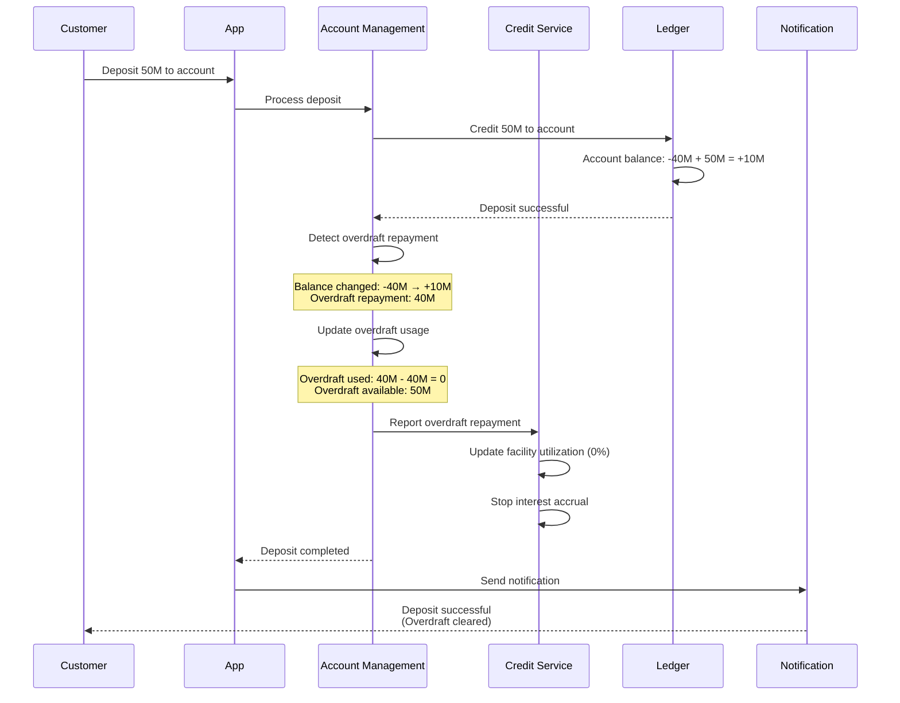

# Overdraft Integration: Account Management ↔️ Credit Service

## Tổng quan

**Overdraft (Thấu chi)** là một loại **credit facility** được gắn với **current account**, cho phép khách hàng chi tiêu vượt quá số dư hiện có.

### Câu hỏi quan trọng

**Q: Overdraft được quản lý ở đâu?**

**A: Được quản lý ở **CẢ HAI** modules với **separation of concerns**:**

- ✅ **Credit Service**: Approve, manage, monitor overdraft facility
- ✅ **Account Management**: Execute transactions, check limits

---

## Nguyên tắc Kiến trúc

### 1. Credit Service - "WHO CAN & HOW MUCH"

**Trách nhiệm:**
- ✅ Approve overdraft facility (Phê duyệt hạn mức)
- ✅ Set overdraft limit (Thiết lập hạn mức)
- ✅ Risk assessment (Đánh giá rủi ro)
- ✅ Calculate interest on overdraft (Tính lãi thấu chi)
- ✅ Monitor utilization & risk (Giám sát sử dụng)
- ✅ Renew/Review facility (Gia hạn/Xem xét)

**Quản lý:**
```typescript
interface OverdraftFacility {
  facilityId: string;
  accountId: string;              // Link to current account
  cifNumber: string;
  
  // Credit approval
  approvedLimit: number;          // Hạn mức được duyệt
  currentLimit: number;           // Hạn mức hiện tại (có thể thay đổi)
  
  // Interest
  interestRate: number;           // Lãi suất thấu chi (VD: 18%/năm)
  interestCalculationMethod: 'DAILY' | 'MONTHLY';
  
  // Risk
  creditScore: number;
  riskRating: 'LOW' | 'MEDIUM' | 'HIGH';
  
  // Lifecycle
  approvedDate: string;
  expiryDate: string;
  reviewDate: string;             // Ngày xem xét lại
  status: 'ACTIVE' | 'SUSPENDED' | 'EXPIRED' | 'CLOSED';
  
  // Monitoring
  utilizationPercentage: number;  // % hạn mức đang dùng
  lastUsedDate: string;
  totalInterestCharged: number;
}
```

---

### 2. Account Management - "EXECUTE & ENFORCE"

**Trách nhiệm:**
- ✅ Execute debit/credit transactions
- ✅ **CHECK** overdraft limit (KHÔNG approve)
- ✅ Track balance (including negative)
- ✅ Enforce transaction limits
- ✅ Report overdraft usage to Credit Service

**Quản lý:**
```typescript
interface CurrentAccount {
  accountId: string;
  accountNumber: string;
  
  // Balance
  balance: {
    available: number;            // Có thể < 0 nếu overdraft
    pending: number;
    reserved: number;
    total: number;
  };
  
  // Overdraft reference (READ-ONLY from Credit Service)
  overdraft: {
    enabled: boolean;             // ← Controlled by Credit Service
    facilityId: string;           // ← Link to Credit Service
    limit: number;                // ← Synced from Credit Service
    used: number;                 // Tracked by Account Management
    available: number;            // = limit - used
    
    // For transaction validation only
    lastSyncedAt: string;
  };
}
```

---

## Cơ chế Tích hợp (Integration)

### Flow 1: Khởi tạo Overdraft Facility



**API Calls:**

**Step 1: Customer applies (Credit Service)**
```typescript
POST /api/v1/credit/overdraft/apply
{
  cifNumber: "CIF123456",
  accountId: "ACC001",
  requestedLimit: 50_000_000,
  purpose: "Working capital"
}

Response:
{
  facilityId: "OD123",
  status: "APPROVED",
  approvedLimit: 50_000_000,
  interestRate: 18.0,
  expiryDate: "2026-01-17"
}
```

**Step 2: Credit Service enables overdraft (Account Management)**
```typescript
POST /api/v1/accounts/ACC001/enable-overdraft
{
  facilityId: "OD123",
  limit: 50_000_000,
  interestRate: 18.0
}

Response:
{
  accountId: "ACC001",
  overdraft: {
    enabled: true,
    facilityId: "OD123",
    limit: 50_000_000,
    used: 0,
    available: 50_000_000
  }
}
```

---

### Flow 2: Transaction với Overdraft



**Transaction Validation Logic:**

```typescript
async function validateTransaction(
  accountId: string, 
  amount: number, 
  type: 'DEBIT' | 'CREDIT'
): Promise<{ allowed: boolean; reason?: string }> {
  
  if (type === 'CREDIT') {
    return { allowed: true }; // Credits always allowed
  }
  
  // For DEBIT transactions
  const account = await getAccount(accountId);
  
  // Calculate total available funds
  const availableBalance = account.balance.available;
  const overdraftAvailable = account.overdraft.enabled 
    ? account.overdraft.available 
    : 0;
  
  const totalAvailable = availableBalance + overdraftAvailable;
  
  if (amount <= totalAvailable) {
    return { allowed: true };
  } else {
    return { 
      allowed: false, 
      reason: `Insufficient funds. Available: ${availableBalance}, Overdraft: ${overdraftAvailable}, Required: ${amount}`
    };
  }
}

async function executeDebit(accountId: string, amount: number): Promise<void> {
  const account = await getAccount(accountId);
  
  // Calculate new balance
  const newBalance = account.balance.available - amount;
  
  await db.transaction(async (trx) => {
    // Update account balance
    await trx('accounts')
      .where('accountId', accountId)
      .update({ 'balance.available': newBalance });
    
    // If balance goes negative, update overdraft usage
    if (newBalance < 0) {
      const overdraftUsed = Math.abs(newBalance);
      
      await trx('accounts')
        .where('accountId', accountId)
        .update({
          'overdraft.used': overdraftUsed,
          'overdraft.available': account.overdraft.limit - overdraftUsed,
          'overdraft.lastUsedDate': new Date()
        });
      
      // Report to Credit Service (async)
      await reportOverdraftUsage({
        facilityId: account.overdraft.facilityId,
        accountId: accountId,
        amountUsed: overdraftUsed,
        utilizationPercentage: (overdraftUsed / account.overdraft.limit) * 100
      });
    }
  });
}
```

---

### Flow 3: Tính lãi Overdraft (Credit Service)



**Interest Calculation:**

```typescript
// Credit Service - Daily EOD Job
async function accrueOverdraftInterest(): Promise<void> {
  const facilities = await getActiveOverdraftFacilities({
    status: 'ACTIVE',
    utilizationAmount: { $gt: 0 }
  });
  
  for (const facility of facilities) {
    try {
      // Get current overdraft balance from Account Management
      const account = await accountManagementAPI.getAccount(facility.accountId);
      const overdraftUsed = account.overdraft.used;
      
      if (overdraftUsed <= 0) continue;
      
      // Calculate daily interest
      const annualRate = facility.interestRate / 100;
      const dailyRate = annualRate / 365;
      const interestAmount = overdraftUsed * dailyRate;
      
      // Create accrual entry
      await createInterestAccrual({
        facilityId: facility.facilityId,
        accountId: facility.accountId,
        accrualDate: today(),
        principalAmount: overdraftUsed,
        annualRate: facility.interestRate,
        dailyRate: dailyRate,
        interestAmount: interestAmount
      });
      
      // Update facility
      await updateFacility(facility.facilityId, {
        totalInterestCharged: facility.totalInterestCharged + interestAmount,
        lastInterestAccrualDate: today()
      });
      
      console.log(`Accrued ${interestAmount} VND for facility ${facility.facilityId}`);
      
    } catch (error) {
      console.error(`Failed to accrue interest for ${facility.facilityId}:`, error);
    }
  }
}

// Monthly interest charge
async function chargeMonthlyOverdraftInterest(): Promise<void> {
  const facilities = await getActiveOverdraftFacilities();
  
  for (const facility of facilities) {
    // Get accumulated interest for the month
    const monthlyInterest = await getAccruedInterest({
      facilityId: facility.facilityId,
      period: 'THIS_MONTH'
    });
    
    if (monthlyInterest <= 0) continue;
    
    // Charge interest via Ledger
    await ledgerAPI.createTransaction({
      accountId: facility.accountId,
      type: 'DEBIT',
      amount: monthlyInterest,
      description: 'Overdraft interest charge',
      reference: `INT-${facility.facilityId}-${getMonthKey()}`
    });
    
    // Update overdraft usage in Account Management
    await accountManagementAPI.updateOverdraftUsage({
      accountId: facility.accountId,
      additionalUsage: monthlyInterest
    });
    
    // Send notification
    await sendNotification({
      customerId: facility.cifNumber,
      type: 'OVERDRAFT_INTEREST_CHARGED',
      data: {
        amount: monthlyInterest,
        period: getMonthKey(),
        rate: facility.interestRate
      }
    });
  }
}
```

---

### Flow 4: Repayment (Trả nợ Overdraft)



---

## Data Synchronization

### 1. Overdraft Limit Sync

**Scenario:** Credit Service thay đổi overdraft limit (increase/decrease)

```typescript
// Credit Service
async function updateOverdraftLimit(
  facilityId: string, 
  newLimit: number
): Promise<void> {
  
  // Update facility
  await updateFacility(facilityId, {
    currentLimit: newLimit,
    lastModifiedDate: new Date()
  });
  
  // Sync to Account Management
  const facility = await getFacility(facilityId);
  
  await accountManagementAPI.updateOverdraftLimit({
    accountId: facility.accountId,
    facilityId: facilityId,
    limit: newLimit
  });
  
  // Notify customer
  await sendNotification({
    customerId: facility.cifNumber,
    type: 'OVERDRAFT_LIMIT_CHANGED',
    data: {
      oldLimit: facility.approvedLimit,
      newLimit: newLimit
    }
  });
}
```

### 2. Overdraft Suspension

**Scenario:** Credit Service suspend overdraft (risk alert, delinquency)

```typescript
// Credit Service
async function suspendOverdraft(
  facilityId: string, 
  reason: string
): Promise<void> {
  
  // Update facility status
  await updateFacility(facilityId, {
    status: 'SUSPENDED',
    suspensionReason: reason,
    suspendedDate: new Date()
  });
  
  // Disable overdraft in Account Management
  const facility = await getFacility(facilityId);
  
  await accountManagementAPI.disableOverdraft({
    accountId: facility.accountId,
    facilityId: facilityId
  });
  
  // Account Management will now reject transactions requiring overdraft
}
```

---

## API Contracts

### Credit Service APIs (Manage Facility)

```typescript
// 1. Apply overdraft
POST /api/v1/credit/overdraft/apply
Body: { cifNumber, accountId, requestedLimit, purpose }

// 2. Approve overdraft
POST /api/v1/credit/overdraft/{facilityId}/approve
Body: { approvedLimit, interestRate, expiryDate }

// 3. Update overdraft limit
PATCH /api/v1/credit/overdraft/{facilityId}/limit
Body: { newLimit, reason }

// 4. Suspend overdraft
POST /api/v1/credit/overdraft/{facilityId}/suspend
Body: { reason }

// 5. Get facility details
GET /api/v1/credit/overdraft/{facilityId}

// 6. Get overdraft utilization
GET /api/v1/credit/overdraft/{facilityId}/utilization

// 7. Get interest accruals
GET /api/v1/credit/overdraft/{facilityId}/interest
```

### Account Management APIs (Execute & Report)

```typescript
// 1. Enable overdraft (called by Credit Service)
POST /api/v1/accounts/{accountId}/enable-overdraft
Body: { facilityId, limit, interestRate }

// 2. Update overdraft limit (called by Credit Service)
PATCH /api/v1/accounts/{accountId}/overdraft/limit
Body: { facilityId, limit }

// 3. Disable overdraft (called by Credit Service)
POST /api/v1/accounts/{accountId}/disable-overdraft
Body: { facilityId }

// 4. Get overdraft status
GET /api/v1/accounts/{accountId}/overdraft

// 5. Report overdraft usage (internal, called by Account Management → Credit Service)
POST /api/v1/credit/overdraft/report-usage
Body: { facilityId, accountId, amountUsed, utilizationPercentage }
```

---

## Database Schema

### Credit Service Database

```sql
-- Overdraft Facilities
CREATE TABLE overdraft_facilities (
    facility_id VARCHAR(50) PRIMARY KEY,
    account_id VARCHAR(50) NOT NULL,
    cif_number VARCHAR(20) NOT NULL,
    
    -- Limits
    approved_limit DECIMAL(18,2) NOT NULL,
    current_limit DECIMAL(18,2) NOT NULL,
    
    -- Interest
    interest_rate DECIMAL(5,2) NOT NULL,
    interest_calculation_method VARCHAR(20),
    total_interest_charged DECIMAL(18,2) DEFAULT 0,
    
    -- Risk
    credit_score INT,
    risk_rating VARCHAR(20),
    
    -- Lifecycle
    approved_date DATE NOT NULL,
    expiry_date DATE,
    review_date DATE,
    status VARCHAR(20) NOT NULL,
    
    -- Monitoring
    utilization_percentage DECIMAL(5,2) DEFAULT 0,
    last_used_date DATE,
    last_interest_accrual_date DATE,
    
    -- Audit
    created_at TIMESTAMP DEFAULT CURRENT_TIMESTAMP,
    updated_at TIMESTAMP DEFAULT CURRENT_TIMESTAMP ON UPDATE CURRENT_TIMESTAMP,
    
    INDEX idx_account (account_id),
    INDEX idx_cif (cif_number),
    INDEX idx_status (status)
);

-- Interest Accruals
CREATE TABLE overdraft_interest_accruals (
    accrual_id VARCHAR(50) PRIMARY KEY,
    facility_id VARCHAR(50) NOT NULL,
    account_id VARCHAR(50) NOT NULL,
    
    accrual_date DATE NOT NULL,
    principal_amount DECIMAL(18,2) NOT NULL,
    annual_rate DECIMAL(5,2) NOT NULL,
    daily_rate DECIMAL(10,8) NOT NULL,
    interest_amount DECIMAL(18,2) NOT NULL,
    
    charged BOOLEAN DEFAULT FALSE,
    charged_date DATE,
    
    created_at TIMESTAMP DEFAULT CURRENT_TIMESTAMP,
    
    INDEX idx_facility (facility_id),
    INDEX idx_date (accrual_date),
    FOREIGN KEY (facility_id) REFERENCES overdraft_facilities(facility_id)
);
```

### Account Management Database

```sql
-- Accounts table (add overdraft fields)
ALTER TABLE accounts ADD COLUMN overdraft_enabled BOOLEAN DEFAULT FALSE;
ALTER TABLE accounts ADD COLUMN overdraft_facility_id VARCHAR(50);
ALTER TABLE accounts ADD COLUMN overdraft_limit DECIMAL(18,2) DEFAULT 0;
ALTER TABLE accounts ADD COLUMN overdraft_used DECIMAL(18,2) DEFAULT 0;
ALTER TABLE accounts ADD COLUMN overdraft_available DECIMAL(18,2) DEFAULT 0;
ALTER TABLE accounts ADD COLUMN overdraft_last_synced_at TIMESTAMP;

-- Index
CREATE INDEX idx_overdraft_facility ON accounts(overdraft_facility_id);
```

---

## Monitoring & Alerts

### Credit Service Metrics

```typescript
interface OverdraftMetrics {
  // Portfolio
  totalFacilities: number;
  activeFacilities: number;
  totalApprovedLimit: number;
  totalUtilization: number;
  averageUtilizationPercentage: number;
  
  // Interest
  totalInterestAccrued: number;
  totalInterestCharged: number;
  averageInterestRate: number;
  
  // Risk
  facilitiesOver80Percent: number;  // High utilization
  facilitiesOver100Percent: number; // Exceeded limit
  totalOverdueInterest: number;
}
```

### Alert Rules

**Credit Service:**
- Overdraft utilization > 80%
- Overdraft utilization > 100% (exceeded)
- Customer has multiple overdrafts
- Overdraft not used for 90 days (review)
- Expiry approaching (30 days)

**Account Management:**
- Transaction rejected due to overdraft limit
- Negative balance without overdraft facility (error)
- Overdraft sync failed with Credit Service

---

## Best Practices

### 1. Clear Ownership

✅ **DO:**
- Credit Service owns approval & limits
- Account Management executes & enforces
- Use APIs for cross-module communication

❌ **DON'T:**
- Account Management shouldn't approve overdraft
- Credit Service shouldn't directly modify balance

### 2. Data Synchronization

✅ **DO:**
- Sync overdraft settings in real-time (API calls)
- Cache overdraft limit in Account Management for fast validation
- Re-sync periodically (e.g., hourly) for consistency

❌ **DON'T:**
- Rely on eventual consistency for limit enforcement
- Allow Account Management to modify overdraft limit

### 3. Interest Calculation

✅ **DO:**
- Credit Service calculates & accrues interest (daily EOD)
- Credit Service charges interest to account (monthly)
- Track all accruals for audit trail

❌ **DON'T:**
- Account Management shouldn't calculate interest
- Don't skip accrual days

### 4. Monitoring

✅ **DO:**
- Monitor utilization in real-time
- Alert on high utilization (>80%)
- Track interest income

❌ **DON'T:**
- Ignore exceeded limits
- Miss expiry dates

---

## Kết luận

### Separation of Concerns

| Aspect | Account Management | Credit Service |
|--------|-------------------|----------------|
| **Responsibility** | Execute & Enforce | Approve & Monitor |
| **Overdraft Limit** | READ-ONLY (sync from Credit) | WRITE (owns the limit) |
| **Balance** | WRITE (tracks actual balance) | READ (for interest calculation) |
| **Transaction** | EXECUTE (debit/credit) | MONITOR (utilization) |
| **Interest** | REPORT usage | CALCULATE & CHARGE |
| **Approval** | N/A | APPROVE facility |

### Integration Points

1. **Initiation**: Credit Service → Account Management (enable overdraft)
2. **Transaction**: Account Management checks limit (synced from Credit Service)
3. **Usage Reporting**: Account Management → Credit Service (async)
4. **Interest Charging**: Credit Service → Ledger → Account Management
5. **Limit Changes**: Credit Service → Account Management (sync)

### Key Principle

> **Credit Service** decides **WHO CAN** overdraft and **HOW MUCH**.
> 
> **Account Management** executes transactions and **ENFORCES** those limits.

Đây là kiến trúc chuẩn Core Banking, tách bạch rõ ràng giữa **credit policy** (Credit Service) và **transaction execution** (Account Management).

