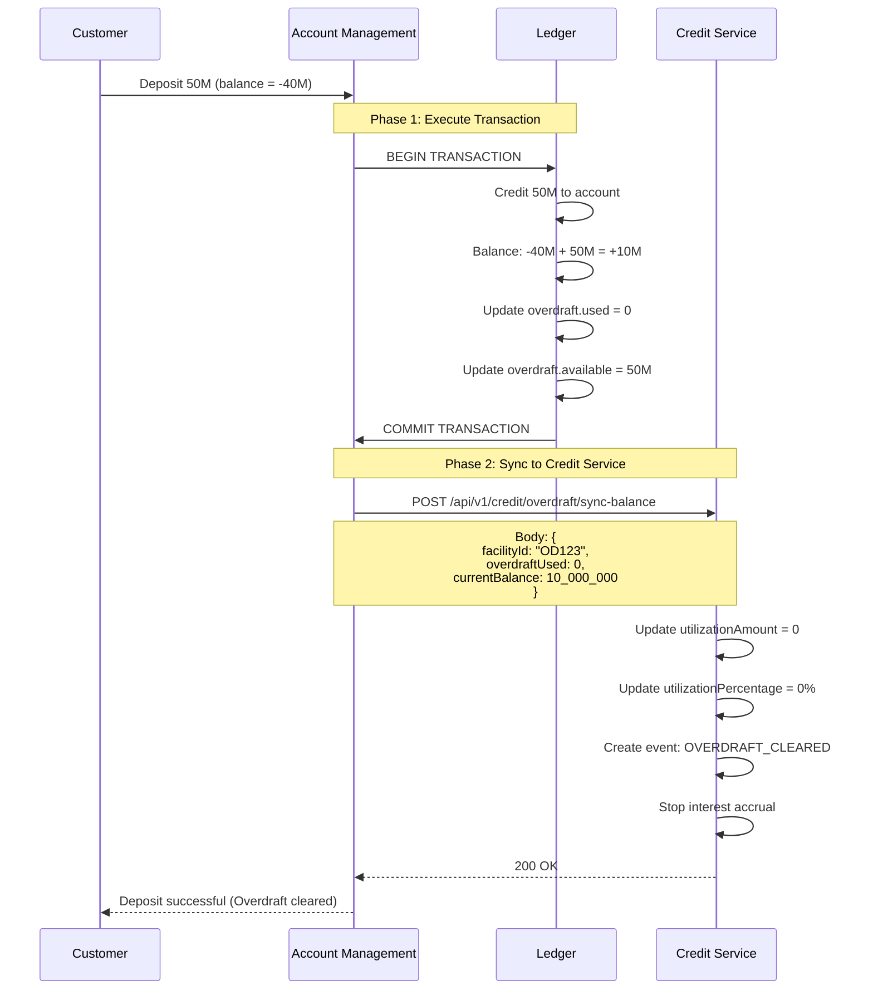
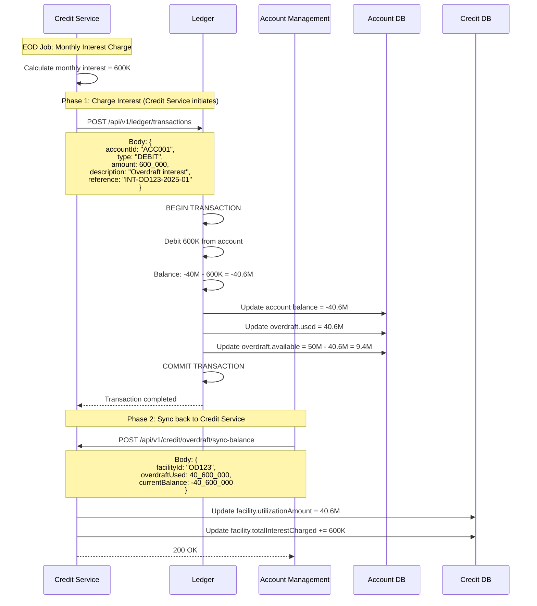

# Overdraft Integration: Account Management ↔️ Credit Service

## Tổng quan

**Overdraft (Thấu chi)** là một loại **credit facility** được gắn với **current account**, cho phép khách hàng chi tiêu vượt quá số dư hiện có.

### Câu hỏi quan trọng

**Q: Overdraft được quản lý ở đâu?**

**A: Được quản lý ở **CẢ HAI** modules với **separation of concerns**:**

- ✅ **Credit Service**: Approve, manage, monitor overdraft facility
- ✅ **Account Management**: Execute transactions, check limits

---

## Nguyên tắc Kiến trúc

### 1. Credit Service - "WHO CAN & HOW MUCH"

**Trách nhiệm:**
- ✅ Approve overdraft facility (Phê duyệt hạn mức)
- ✅ Set overdraft limit (Thiết lập hạn mức)
- ✅ Risk assessment (Đánh giá rủi ro)
- ✅ Calculate interest on overdraft (Tính lãi thấu chi)
- ✅ Monitor utilization & risk (Giám sát sử dụng)
- ✅ Renew/Review facility (Gia hạn/Xem xét)

**Quản lý:**
```typescript
interface OverdraftFacility {
  facilityId: string;
  accountId: string;              // Link to current account
  cifNumber: string;
  
  // Credit approval
  approvedLimit: number;          // Hạn mức được duyệt
  currentLimit: number;           // Hạn mức hiện tại (có thể thay đổi)
  
  // Interest
  interestRate: number;           // Lãi suất thấu chi (VD: 18%/năm)
  interestCalculationMethod: 'DAILY' | 'MONTHLY';
  
  // Risk
  creditScore: number;
  riskRating: 'LOW' | 'MEDIUM' | 'HIGH';
  
  // Lifecycle
  approvedDate: string;
  expiryDate: string;
  reviewDate: string;             // Ngày xem xét lại
  status: 'ACTIVE' | 'SUSPENDED' | 'EXPIRED' | 'CLOSED';
  
  // Monitoring
  utilizationPercentage: number;  // % hạn mức đang dùng
  lastUsedDate: string;
  totalInterestCharged: number;
}
```

---

### 2. Account Management - "EXECUTE & ENFORCE"

**Trách nhiệm:**
- ✅ Execute debit/credit transactions
- ✅ **CHECK** overdraft limit (KHÔNG approve)
- ✅ Track balance (including negative)
- ✅ Enforce transaction limits
- ✅ Report overdraft usage to Credit Service

**Quản lý:**
```typescript
interface CurrentAccount {
  accountId: string;
  accountNumber: string;
  
  // Balance
  balance: {
    available: number;            // Có thể < 0 nếu overdraft
    pending: number;
    reserved: number;
    total: number;
  };
  
  // Overdraft reference (READ-ONLY from Credit Service)
  overdraft: {
    enabled: boolean;             // ← Controlled by Credit Service
    facilityId: string;           // ← Link to Credit Service
    limit: number;                // ← Synced from Credit Service
    used: number;                 // Tracked by Account Management
    available: number;            // = limit - used
    
    // For transaction validation only
    lastSyncedAt: string;
  };
}
```

---

## Cơ chế Tích hợp (Integration)

### Flow 1: Khởi tạo Overdraft Facility


**API Calls:**

**Step 1: Customer applies (Credit Service)**
```typescript
POST /api/v1/credit/overdraft/apply
{
  cifNumber: "CIF123456",
  accountId: "ACC001",
  requestedLimit: 50_000_000,
  purpose: "Working capital"
}

Response:
{
  facilityId: "OD123",
  status: "APPROVED",
  approvedLimit: 50_000_000,
  interestRate: 18.0,
  expiryDate: "2026-01-17"
}
```

**Step 2: Credit Service enables overdraft (Account Management)**
```typescript
POST /api/v1/accounts/ACC001/enable-overdraft
{
  facilityId: "OD123",
  limit: 50_000_000,
  interestRate: 18.0
}

Response:
{
  accountId: "ACC001",
  overdraft: {
    enabled: true,
    facilityId: "OD123",
    limit: 50_000_000,
    used: 0,
    available: 50_000_000
  }
}
```

---

### Flow 2: Transaction với Overdraft

```mermaid
sequenceDiagram
    participant C as Customer
    participant APP as App
    participant TS as Transaction Service
    participant AM as Account Management
    participant CR as Credit Service
    participant LED as Ledger
    participant N as Notification
    
    Note over C,N: Customer thực hiện giao dịch vượt số dư
    
    C->>APP: Transfer 60M (balance = 20M)
    APP->>TS: Process transfer
    TS->>AM: Check balance & limits
    
    AM->>AM: Check available balance
    Note over AM: Balance: 20M<br/>Transfer: 60M<br/>Shortfall: 40M
    
    AM->>AM: Check overdraft facility
    Note over AM: Overdraft limit: 50M<br/>Overdraft used: 0<br/>Overdraft available: 50M<br/>✓ 40M ≤ 50M
    
    alt Overdraft available
        AM->>LED: Debit 60M (allow negative balance)
        LED->>LED: Account balance: 20M - 60M = -40M
        LED-->>AM: Transaction successful
        
        AM->>AM: Update overdraft used
        Note over AM: Overdraft used: 0 + 40M = 40M<br/>Overdraft available: 50M - 40M = 10M
        
        AM->>CR: Report overdraft usage
        CR->>CR: Update facility utilization (80%)
        CR->>CR: Schedule interest accrual
        
        AM-->>TS: Transaction completed
        TS->>N: Send notification
        N-->>C: Transfer successful<br/>(Overdraft used: 40M, Interest: 18%/year)
        
    else Overdraft insufficient
        AM-->>TS: Insufficient funds (including overdraft)
        TS->>N: Send failure notification
        N-->>C: Transaction failed<br/>(Required: 60M, Available: 20M + 50M = 70M would be enough,<br/>but this is a different scenario)
    end
```



**Transaction Validation Logic:**

```typescript
async function validateTransaction(
  accountId: string, 
  amount: number, 
  type: 'DEBIT' | 'CREDIT'
): Promise<{ allowed: boolean; reason?: string }> {
  
  if (type === 'CREDIT') {
    return { allowed: true }; // Credits always allowed
  }
  
  // For DEBIT transactions
  const account = await getAccount(accountId);
  
  // Calculate total available funds
  const availableBalance = account.balance.available;
  const overdraftAvailable = account.overdraft.enabled 
    ? account.overdraft.available 
    : 0;
  
  const totalAvailable = availableBalance + overdraftAvailable;
  
  if (amount <= totalAvailable) {
    return { allowed: true };
  } else {
    return { 
      allowed: false, 
      reason: `Insufficient funds. Available: ${availableBalance}, Overdraft: ${overdraftAvailable}, Required: ${amount}`
    };
  }
}

async function executeDebit(accountId: string, amount: number): Promise<void> {
  const account = await getAccount(accountId);
  
  // Calculate new balance
  const newBalance = account.balance.available - amount;
  
  await db.transaction(async (trx) => {
    // Update account balance
    await trx('accounts')
      .where('accountId', accountId)
      .update({ 'balance.available': newBalance });
    
    // If balance goes negative, update overdraft usage
    if (newBalance < 0) {
      const overdraftUsed = Math.abs(newBalance);
      
      await trx('accounts')
        .where('accountId', accountId)
        .update({
          'overdraft.used': overdraftUsed,
          'overdraft.available': account.overdraft.limit - overdraftUsed,
          'overdraft.lastUsedDate': new Date()
        });
      
      // Report to Credit Service (async)
      await reportOverdraftUsage({
        facilityId: account.overdraft.facilityId,
        accountId: accountId,
        amountUsed: overdraftUsed,
        utilizationPercentage: (overdraftUsed / account.overdraft.limit) * 100
      });
    }
  });
}
```

---

### Flow 3: Tính lãi Overdraft (Credit Service)


**Interest Calculation:**

```typescript
// Credit Service - Daily EOD Job
async function accrueOverdraftInterest(): Promise<void> {
  const facilities = await getActiveOverdraftFacilities({
    status: 'ACTIVE',
    utilizationAmount: { $gt: 0 }
  });
  
  for (const facility of facilities) {
    try {
      // Get current overdraft balance from Account Management
      const account = await accountManagementAPI.getAccount(facility.accountId);
      const overdraftUsed = account.overdraft.used;
      
      if (overdraftUsed <= 0) continue;
      
      // Calculate daily interest
      const annualRate = facility.interestRate / 100;
      const dailyRate = annualRate / 365;
      const interestAmount = overdraftUsed * dailyRate;
      
      // Create accrual entry
      await createInterestAccrual({
        facilityId: facility.facilityId,
        accountId: facility.accountId,
        accrualDate: today(),
        principalAmount: overdraftUsed,
        annualRate: facility.interestRate,
        dailyRate: dailyRate,
        interestAmount: interestAmount
      });
      
      // Update facility
      await updateFacility(facility.facilityId, {
        totalInterestCharged: facility.totalInterestCharged + interestAmount,
        lastInterestAccrualDate: today()
      });
      
      console.log(`Accrued ${interestAmount} VND for facility ${facility.facilityId}`);
      
    } catch (error) {
      console.error(`Failed to accrue interest for ${facility.facilityId}:`, error);
    }
  }
}

// Monthly interest charge
async function chargeMonthlyOverdraftInterest(): Promise<void> {
  const facilities = await getActiveOverdraftFacilities();
  
  for (const facility of facilities) {
    // Get accumulated interest for the month
    const monthlyInterest = await getAccruedInterest({
      facilityId: facility.facilityId,
      period: 'THIS_MONTH'
    });
    
    if (monthlyInterest <= 0) continue;
    
    // Charge interest via Ledger
    await ledgerAPI.createTransaction({
      accountId: facility.accountId,
      type: 'DEBIT',
      amount: monthlyInterest,
      description: 'Overdraft interest charge',
      reference: `INT-${facility.facilityId}-${getMonthKey()}`
    });
    
    // Update overdraft usage in Account Management
    await accountManagementAPI.updateOverdraftUsage({
      accountId: facility.accountId,
      additionalUsage: monthlyInterest
    });
    
    // Send notification
    await sendNotification({
      customerId: facility.cifNumber,
      type: 'OVERDRAFT_INTEREST_CHARGED',
      data: {
        amount: monthlyInterest,
        period: getMonthKey(),
        rate: facility.interestRate
      }
    });
  }
}
```

---

### Flow 4: Repayment (Trả nợ Overdraft)

```mermaid
sequenceDiagram
    participant C as Customer
    participant APP as App
    participant AM as Account Management
    participant CR as Credit Service
    participant LED as Ledger
    participant N as Notification
    
    C->>APP: Deposit 50M to account
    APP->>AM: Process deposit
    
    AM->>LED: Credit 50M to account
    LED->>LED: Account balance: -40M + 50M = +10M
    LED-->>AM: Deposit successful
    
    AM->>AM: Detect overdraft repayment
    Note over AM: Balance changed: -40M → +10M<br/>Overdraft repayment: 40M
    
    AM->>AM: Update overdraft usage
    Note over AM: Overdraft used: 40M - 40M = 0<br/>Overdraft available: 50M
    
    AM->>CR: Report overdraft repayment
    CR->>CR: Update facility utilization (0%)
    CR->>CR: Stop interest accrual
    
    AM-->>APP: Deposit completed
    APP->>N: Send notification
    N-->>C: Deposit successful<br/>(Overdraft cleared)
```



---

## Data Synchronization

### 1. Overdraft Limit Sync

**Scenario:** Credit Service thay đổi overdraft limit (increase/decrease)

```typescript
// Credit Service
async function updateOverdraftLimit(
  facilityId: string, 
  newLimit: number
): Promise<void> {
  
  // Update facility
  await updateFacility(facilityId, {
    currentLimit: newLimit,
    lastModifiedDate: new Date()
  });
  
  // Sync to Account Management
  const facility = await getFacility(facilityId);
  
  await accountManagementAPI.updateOverdraftLimit({
    accountId: facility.accountId,
    facilityId: facilityId,
    limit: newLimit
  });
  
  // Notify customer
  await sendNotification({
    customerId: facility.cifNumber,
    type: 'OVERDRAFT_LIMIT_CHANGED',
    data: {
      oldLimit: facility.approvedLimit,
      newLimit: newLimit
    }
  });
}
```

### 2. Overdraft Suspension

**Scenario:** Credit Service suspend overdraft (risk alert, delinquency)

```typescript
// Credit Service
async function suspendOverdraft(
  facilityId: string, 
  reason: string
): Promise<void> {
  
  // Update facility status
  await updateFacility(facilityId, {
    status: 'SUSPENDED',
    suspensionReason: reason,
    suspendedDate: new Date()
  });
  
  // Disable overdraft in Account Management
  const facility = await getFacility(facilityId);
  
  await accountManagementAPI.disableOverdraft({
    accountId: facility.accountId,
    facilityId: facilityId
  });
  
  // Account Management will now reject transactions requiring overdraft
}
```

### 3. Overdraft Balance Sync (Cập nhật Dư nợ Thấu chi)

**⚠️ QUAN TRỌNG:** Đây là cơ chế **QUAN TRỌNG NHẤT** để đảm bảo Credit Service luôn có thông tin chính xác về dư nợ thấu chi.

#### Nguyên tắc Ownership

```
┌─────────────────────────────────────────────────────────┐
│ BALANCE OWNERSHIP (Single Source of Truth)             │
├─────────────────────────────────────────────────────────┤
│                                                         │
│ Account Management (Master Data):                      │
│   ✅ OWNS current account balance (real-time)          │
│   ✅ OWNS overdraft.used (real-time)                   │
│   ✅ Calculates: overdraft.available = limit - used    │
│                                                         │
│ Credit Service (Monitoring & Interest):                │
│   🔄 RECEIVES balance updates from Account Mgmt        │
│   🔄 STORES utilizationAmount (snapshot for monitoring)│
│   ✅ USES for interest calculation                     │
│   ✅ USES for risk monitoring                          │
│                                                         │
└─────────────────────────────────────────────────────────┘
```

**Single Source of Truth:** Account Management owns balance, Credit Service monitors it.

---

#### Scenario A: Transaction Increases Overdraft (Debit)

**Example:** Customer transfers 60M, balance = 20M → overdraft usage increases by 40M

```mermaid
sequenceDiagram
    participant C as Customer
    participant AM as Account Management
    participant LED as Ledger
    participant CR as Credit Service
    participant DB_AM as Account DB
    participant DB_CR as Credit DB
    
    C->>AM: Transfer 60M (balance = 20M)
    
    Note over AM,LED: Phase 1: Execute Transaction (Atomic)
    
    AM->>AM: Validate: 20M + overdraft(50M) ≥ 60M ✓
    
    AM->>LED: BEGIN TRANSACTION
    LED->>LED: Debit 60M from account
    LED->>LED: Balance: 20M - 60M = -40M
    LED->>DB_AM: Update account balance = -40M
    LED->>DB_AM: Update overdraft.used = 40M
    LED->>DB_AM: Update overdraft.available = 50M - 40M = 10M
    LED->>AM: COMMIT TRANSACTION
    
    Note over AM,CR: Phase 2: Sync to Credit Service (Async, Non-blocking)
    
    AM->>CR: POST /api/v1/credit/overdraft/sync-balance
    Note over AM,CR: Body: {<br/>  facilityId: "OD123",<br/>  accountId: "ACC001",<br/>  currentBalance: -40_000_000,<br/>  overdraftUsed: 40_000_000,<br/>  transactionId: "TXN456",<br/>  timestamp: "2025-01-17T10:30:00Z"<br/>}
    
    CR->>DB_CR: Update facility.utilizationAmount = 40M
    CR->>DB_CR: Update facility.utilizationPercentage = 80%
    CR->>DB_CR: Update facility.lastUsedDate = today
    
    Note over CR: Monitor for alerts
    CR->>CR: Check if utilization > 80% → Alert
    
    CR-->>AM: 200 OK (sync successful)
    
    AM-->>C: Transfer completed
```



**Code Implementation:**

```typescript
// Account Management - After transaction execution
async function executeDebit(accountId: string, amount: number): Promise<void> {
  const account = await getAccount(accountId);
  
  await db.transaction(async (trx) => {
    // Calculate new balance
    const newBalance = account.balance.available - amount;
    
    // Update balance in Account Management (MASTER)
    await trx('accounts')
      .where('accountId', accountId)
      .update({ 
        'balance.available': newBalance,
        'balance.total': newBalance  // Assuming no pending/reserved for simplicity
      });
    
    // If balance goes negative, update overdraft tracking
    if (newBalance < 0) {
      const overdraftUsed = Math.abs(newBalance);
      const overdraftAvailable = account.overdraft.limit - overdraftUsed;
      
      await trx('accounts')
        .where('accountId', accountId)
        .update({
          'overdraft.used': overdraftUsed,
          'overdraft.available': overdraftAvailable,
          'overdraft.lastUsedDate': new Date()
        });
    } else {
      // Balance is positive, no overdraft used
      await trx('accounts')
        .where('accountId', accountId)
        .update({
          'overdraft.used': 0,
          'overdraft.available': account.overdraft.limit
        });
    }
    
    // Create transaction record
    await trx('transactions').insert({
      transactionId: generateTransactionId(),
      accountId: accountId,
      type: 'DEBIT',
      amount: amount,
      balanceAfter: newBalance,
      timestamp: new Date()
    });
  });
  
  // CRITICAL: Sync to Credit Service (async, non-blocking)
  // Don't wait for this - transaction already committed
  syncBalanceToCreditService(accountId).catch(error => {
    console.error('Failed to sync balance to Credit Service:', error);
    // Queue for retry
    queueBalanceSyncRetry(accountId);
  });
}

// Sync balance to Credit Service (async)
async function syncBalanceToCreditService(accountId: string): Promise<void> {
  const account = await getAccount(accountId);
  
  if (!account.overdraft.enabled) {
    return; // No overdraft facility
  }
  
  try {
    await creditServiceAPI.syncOverdraftBalance({
      facilityId: account.overdraft.facilityId,
      accountId: accountId,
      currentBalance: account.balance.available,
      overdraftUsed: account.overdraft.used,
      overdraftAvailable: account.overdraft.available,
      timestamp: new Date().toISOString()
    });
    
    // Update last synced time
    await updateAccount(accountId, {
      'overdraft.lastSyncedAt': new Date()
    });
    
  } catch (error) {
    console.error(`Failed to sync balance for account ${accountId}:`, error);
    throw error;
  }
}
```

```typescript
// Credit Service - Receive balance sync
POST /api/v1/credit/overdraft/sync-balance

interface SyncBalanceRequest {
  facilityId: string;
  accountId: string;
  currentBalance: number;        // Account balance (can be negative)
  overdraftUsed: number;         // Absolute value of overdraft usage
  overdraftAvailable: number;    // Remaining overdraft limit
  transactionId?: string;
  timestamp: string;
}

async function handleBalanceSync(request: SyncBalanceRequest): Promise<void> {
  const facility = await getFacility(request.facilityId);
  
  if (!facility) {
    throw new Error(`Facility ${request.facilityId} not found`);
  }
  
  // Validate
  if (request.overdraftUsed < 0) {
    throw new Error('Overdraft used cannot be negative');
  }
  
  // Calculate utilization percentage
  const utilizationPercentage = facility.currentLimit > 0
    ? (request.overdraftUsed / facility.currentLimit) * 100
    : 0;
  
  // Update facility (Credit Service data)
  await updateFacility(request.facilityId, {
    utilizationAmount: request.overdraftUsed,
    utilizationPercentage: utilizationPercentage,
    availableLimit: request.overdraftAvailable,
    lastUsedDate: request.overdraftUsed > 0 ? new Date() : facility.lastUsedDate,
    lastBalanceSyncAt: new Date()
  });
  
  // Create balance snapshot (for audit trail)
  await createBalanceSnapshot({
    facilityId: request.facilityId,
    accountId: request.accountId,
    accountBalance: request.currentBalance,
    overdraftUsed: request.overdraftUsed,
    overdraftAvailable: request.overdraftAvailable,
    utilizationPercentage: utilizationPercentage,
    transactionId: request.transactionId,
    timestamp: request.timestamp
  });
  
  // Risk monitoring
  await monitorUtilization(request.facilityId, utilizationPercentage);
}

async function monitorUtilization(
  facilityId: string, 
  utilizationPercentage: number
): Promise<void> {
  
  // High utilization alert (>80%)
  if (utilizationPercentage > 80 && utilizationPercentage <= 100) {
    await createRiskAlert({
      facilityId: facilityId,
      alertType: 'HIGH_UTILIZATION',
      severity: 'WARNING',
      utilizationPercentage: utilizationPercentage,
      message: `Overdraft utilization at ${utilizationPercentage.toFixed(2)}%`
    });
  }
  
  // Exceeded limit alert (>100%)
  if (utilizationPercentage > 100) {
    await createRiskAlert({
      facilityId: facilityId,
      alertType: 'LIMIT_EXCEEDED',
      severity: 'CRITICAL',
      utilizationPercentage: utilizationPercentage,
      message: `Overdraft exceeded limit by ${(utilizationPercentage - 100).toFixed(2)}%`
    });
    
    // Auto-suspend if exceeded by more than 10%
    if (utilizationPercentage > 110) {
      await suspendOverdraft(facilityId, 'LIMIT_EXCEEDED');
    }
  }
  
  // Cleared overdraft (utilization = 0%)
  if (utilizationPercentage === 0) {
    await createEvent({
      facilityId: facilityId,
      eventType: 'OVERDRAFT_CLEARED',
      message: 'Overdraft fully repaid'
    });
  }
}
```

---

#### Scenario B: Repayment Decreases Overdraft (Credit)

**Example:** Customer deposits 50M, balance = -40M → overdraft cleared



---

#### Scenario C: Interest Charge Increases Overdraft

**Example:** Monthly interest charge 600K → overdraft increases



**Code Implementation:**

```typescript
// Credit Service - Monthly interest charge
async function chargeMonthlyOverdraftInterest(): Promise<void> {
  const facilities = await getActiveOverdraftFacilities({
    status: 'ACTIVE',
    utilizationAmount: { $gt: 0 }
  });
  
  for (const facility of facilities) {
    try {
      // Get accumulated interest for the month
      const monthlyInterest = await getAccruedInterest({
        facilityId: facility.facilityId,
        period: 'THIS_MONTH'
      });
      
      if (monthlyInterest <= 0) continue;
      
      // Charge interest via Ledger
      const txnResult = await ledgerAPI.createTransaction({
        accountId: facility.accountId,
        type: 'DEBIT',
        amount: monthlyInterest,
        description: 'Overdraft interest charge',
        reference: `INT-${facility.facilityId}-${getMonthKey()}`,
        category: 'INTEREST_EXPENSE'
      });
      
      // Update facility (add interest to principal outstanding)
      await updateFacility(facility.facilityId, {
        totalInterestCharged: facility.totalInterestCharged + monthlyInterest
      });
      
      // IMPORTANT: Account Management will auto-sync balance back
      // Wait for sync (with timeout)
      await waitForBalanceSync(facility.facilityId, 5000); // 5 seconds timeout
      
      // Verify sync
      const updatedFacility = await getFacility(facility.facilityId);
      console.log(`Interest charged: ${monthlyInterest}, New outstanding: ${updatedFacility.utilizationAmount}`);
      
      // Send notification
      await sendNotification({
        customerId: facility.cifNumber,
        type: 'OVERDRAFT_INTEREST_CHARGED',
        data: {
          amount: monthlyInterest,
          period: getMonthKey(),
          rate: facility.interestRate,
          newOutstanding: updatedFacility.utilizationAmount
        }
      });
      
    } catch (error) {
      console.error(`Failed to charge interest for ${facility.facilityId}:`, error);
    }
  }
}

// Wait for balance sync (with timeout)
async function waitForBalanceSync(
  facilityId: string, 
  timeoutMs: number
): Promise<void> {
  const startTime = Date.now();
  const initialFacility = await getFacility(facilityId);
  
  while (Date.now() - startTime < timeoutMs) {
    const facility = await getFacility(facilityId);
    
    // Check if lastBalanceSyncAt is newer than start time
    if (facility.lastBalanceSyncAt > initialFacility.lastBalanceSyncAt) {
      return; // Sync completed
    }
    
    // Wait 100ms before retry
    await sleep(100);
  }
  
  // Timeout - log warning but don't fail
  console.warn(`Balance sync timeout for facility ${facilityId}`);
}
```

---

#### Scenario D: Reconciliation (Đối soát Định kỳ)

**Purpose:** Đảm bảo dữ liệu giữa Account Management và Credit Service luôn đồng bộ.

**Frequency:** Hourly hoặc End of Day (EOD)

```typescript
// Credit Service - Reconciliation Job
async function reconcileOverdraftBalances(): Promise<void> {
  console.log('Starting overdraft balance reconciliation...');
  
  const facilities = await getActiveOverdraftFacilities();
  let discrepancies = 0;
  
  for (const facility of facilities) {
    try {
      // Get balance from Account Management (MASTER)
      const account = await accountManagementAPI.getAccount(facility.accountId);
      
      // Compare with Credit Service data
      if (account.overdraft.used !== facility.utilizationAmount) {
        discrepancies++;
        
        console.warn(`Discrepancy found for facility ${facility.facilityId}:`);
        console.warn(`  Account Management: ${account.overdraft.used}`);
        console.warn(`  Credit Service: ${facility.utilizationAmount}`);
        
        // Account Management is MASTER - sync from there
        await updateFacility(facility.facilityId, {
          utilizationAmount: account.overdraft.used,
          availableLimit: account.overdraft.available,
          utilizationPercentage: (account.overdraft.used / facility.currentLimit) * 100,
          lastBalanceSyncAt: new Date()
        });
        
        // Create reconciliation log
        await createReconciliationLog({
          facilityId: facility.facilityId,
          accountId: facility.accountId,
          discrepancyType: 'BALANCE_MISMATCH',
          expectedValue: account.overdraft.used,
          actualValue: facility.utilizationAmount,
          difference: Math.abs(account.overdraft.used - facility.utilizationAmount),
          resolvedBy: 'SYNC_FROM_ACCOUNT_MANAGEMENT',
          timestamp: new Date()
        });
        
        console.log(`  ✓ Synced from Account Management`);
      }
      
    } catch (error) {
      console.error(`Failed to reconcile facility ${facility.facilityId}:`, error);
    }
  }
  
  console.log(`Reconciliation completed. Discrepancies found: ${discrepancies}`);
}

// Run reconciliation hourly
cron.schedule('0 * * * *', async () => {
  await reconcileOverdraftBalances();
});
```

---

#### Scenario E: Failed Sync & Retry Mechanism

**Problem:** Sync request to Credit Service fails (network issue, timeout, service down)

**Solution:** Retry queue với exponential backoff

```typescript
// Account Management - Retry Queue
interface BalanceSyncRetry {
  retryId: string;
  accountId: string;
  facilityId: string;
  attemptCount: number;
  maxAttempts: number;
  nextRetryAt: Date;
  lastError?: string;
  createdAt: Date;
}

// Queue for retry
async function queueBalanceSyncRetry(accountId: string): Promise<void> {
  const account = await getAccount(accountId);
  
  await db('balance_sync_retries').insert({
    retryId: generateRetryId(),
    accountId: accountId,
    facilityId: account.overdraft.facilityId,
    attemptCount: 0,
    maxAttempts: 5,
    nextRetryAt: new Date(Date.now() + 1000), // Retry in 1 second
    createdAt: new Date()
  });
}

// Retry worker (background job)
async function processBalanceSyncRetries(): Promise<void> {
  const retries = await db('balance_sync_retries')
    .where('nextRetryAt', '<=', new Date())
    .where('attemptCount', '<', db.raw('maxAttempts'))
    .limit(100);
  
  for (const retry of retries) {
    try {
      // Attempt sync
      await syncBalanceToCreditService(retry.accountId);
      
      // Success - remove from queue
      await db('balance_sync_retries')
        .where('retryId', retry.retryId)
        .delete();
      
      console.log(`✓ Balance sync retry successful for account ${retry.accountId}`);
      
    } catch (error) {
      // Failed - increment attempt and schedule next retry
      const attemptCount = retry.attemptCount + 1;
      const backoffSeconds = Math.pow(2, attemptCount); // Exponential backoff: 2, 4, 8, 16, 32 seconds
      
      await db('balance_sync_retries')
        .where('retryId', retry.retryId)
        .update({
          attemptCount: attemptCount,
          nextRetryAt: new Date(Date.now() + backoffSeconds * 1000),
          lastError: error.message
        });
      
      console.error(`✗ Balance sync retry ${attemptCount}/${retry.maxAttempts} failed for account ${retry.accountId}: ${error.message}`);
      
      // Max attempts reached - alert
      if (attemptCount >= retry.maxAttempts) {
        await createAlert({
          type: 'BALANCE_SYNC_FAILED',
          severity: 'CRITICAL',
          accountId: retry.accountId,
          facilityId: retry.facilityId,
          message: `Failed to sync balance after ${attemptCount} attempts`,
          requiresManualIntervention: true
        });
      }
    }
  }
}

// Run retry worker every 10 seconds
setInterval(processBalanceSyncRetries, 10000);
```

---

### Summary: Balance Sync Patterns

| Trigger | Who Initiates | Direction | Timing | Critical? |
|---------|--------------|-----------|--------|-----------|
| **Debit Transaction** | Account Management | AM → CR | Async (after commit) | ⚠️ High |
| **Credit Transaction** | Account Management | AM → CR | Async (after commit) | ⚠️ High |
| **Interest Charge** | Credit Service | CR → Ledger → AM → CR | Sync (EOD job) | ⚠️ High |
| **Reconciliation** | Credit Service | CR ← AM (query) | Scheduled (hourly) | ⚠️ Medium |
| **Retry** | Account Management | AM → CR | Background (queue) | ⚠️ High |

**Key Principles:**

1. **Account Management = MASTER** for current balance
2. **Credit Service = MONITOR** for risk & interest calculation
3. **Always sync async** (don't block customer transaction)
4. **Retry on failure** (with exponential backoff)
5. **Reconcile regularly** (hourly or EOD)
6. **Alert on persistent failure** (manual intervention)

---

## API Contracts

### Credit Service APIs (Manage Facility)

```typescript
// 1. Apply overdraft
POST /api/v1/credit/overdraft/apply
Body: { cifNumber, accountId, requestedLimit, purpose }

// 2. Approve overdraft
POST /api/v1/credit/overdraft/{facilityId}/approve
Body: { approvedLimit, interestRate, expiryDate }

// 3. Update overdraft limit
PATCH /api/v1/credit/overdraft/{facilityId}/limit
Body: { newLimit, reason }

// 4. Suspend overdraft
POST /api/v1/credit/overdraft/{facilityId}/suspend
Body: { reason }

// 5. Get facility details
GET /api/v1/credit/overdraft/{facilityId}

// 6. Get overdraft utilization
GET /api/v1/credit/overdraft/{facilityId}/utilization

// 7. Get interest accruals
GET /api/v1/credit/overdraft/{facilityId}/interest

// ⚠️ NEW: 8. Sync overdraft balance (called by Account Management)
POST /api/v1/credit/overdraft/sync-balance
Body: { 
  facilityId, 
  accountId, 
  currentBalance,      // Account balance (can be negative)
  overdraftUsed,       // Absolute overdraft usage
  overdraftAvailable,  // Remaining limit
  transactionId?,      // Optional transaction reference
  timestamp 
}
```

### Account Management APIs (Execute & Report)

```typescript
// 1. Enable overdraft (called by Credit Service)
POST /api/v1/accounts/{accountId}/enable-overdraft
Body: { facilityId, limit, interestRate }

// 2. Update overdraft limit (called by Credit Service)
PATCH /api/v1/accounts/{accountId}/overdraft/limit
Body: { facilityId, limit }

// 3. Disable overdraft (called by Credit Service)
POST /api/v1/accounts/{accountId}/disable-overdraft
Body: { facilityId }

// 4. Get overdraft status
GET /api/v1/accounts/{accountId}/overdraft

// ❌ DEPRECATED: 5. Report overdraft usage
// Replaced by: POST /api/v1/credit/overdraft/sync-balance (more comprehensive)
// POST /api/v1/credit/overdraft/report-usage
// Body: { facilityId, accountId, amountUsed, utilizationPercentage }
```

---

## Database Schema

### Credit Service Database

```sql
-- Overdraft Facilities
CREATE TABLE overdraft_facilities (
    facility_id VARCHAR(50) PRIMARY KEY,
    account_id VARCHAR(50) NOT NULL,
    cif_number VARCHAR(20) NOT NULL,
    
    -- Limits
    approved_limit DECIMAL(18,2) NOT NULL,
    current_limit DECIMAL(18,2) NOT NULL,
    
    -- Interest
    interest_rate DECIMAL(5,2) NOT NULL,
    interest_calculation_method VARCHAR(20),
    total_interest_charged DECIMAL(18,2) DEFAULT 0,
    
    -- Risk
    credit_score INT,
    risk_rating VARCHAR(20),
    
    -- Lifecycle
    approved_date DATE NOT NULL,
    expiry_date DATE,
    review_date DATE,
    status VARCHAR(20) NOT NULL,
    
    -- Monitoring (synced from Account Management)
    utilization_amount DECIMAL(18,2) DEFAULT 0,      -- ⚠️ NEW: Actual overdraft used
    available_limit DECIMAL(18,2) DEFAULT 0,         -- ⚠️ NEW: Remaining limit
    utilization_percentage DECIMAL(5,2) DEFAULT 0,
    last_used_date DATE,
    last_interest_accrual_date DATE,
    last_balance_sync_at TIMESTAMP,                  -- ⚠️ NEW: Last sync from Account Mgmt
    
    -- Audit
    created_at TIMESTAMP DEFAULT CURRENT_TIMESTAMP,
    updated_at TIMESTAMP DEFAULT CURRENT_TIMESTAMP ON UPDATE CURRENT_TIMESTAMP,
    
    INDEX idx_account (account_id),
    INDEX idx_cif (cif_number),
    INDEX idx_status (status)
);

-- Interest Accruals
CREATE TABLE overdraft_interest_accruals (
    accrual_id VARCHAR(50) PRIMARY KEY,
    facility_id VARCHAR(50) NOT NULL,
    account_id VARCHAR(50) NOT NULL,
    
    accrual_date DATE NOT NULL,
    principal_amount DECIMAL(18,2) NOT NULL,
    annual_rate DECIMAL(5,2) NOT NULL,
    daily_rate DECIMAL(10,8) NOT NULL,
    interest_amount DECIMAL(18,2) NOT NULL,
    
    charged BOOLEAN DEFAULT FALSE,
    charged_date DATE,
    
    created_at TIMESTAMP DEFAULT CURRENT_TIMESTAMP,
    
    INDEX idx_facility (facility_id),
    INDEX idx_date (accrual_date),
    FOREIGN KEY (facility_id) REFERENCES overdraft_facilities(facility_id)
);

-- ⚠️ NEW: Balance Snapshots (Audit Trail)
CREATE TABLE balance_snapshots (
    snapshot_id VARCHAR(50) PRIMARY KEY,
    facility_id VARCHAR(50) NOT NULL,
    account_id VARCHAR(50) NOT NULL,
    
    -- Balance data
    account_balance DECIMAL(18,2) NOT NULL,       -- Account balance (can be negative)
    overdraft_used DECIMAL(18,2) NOT NULL,        -- Overdraft usage
    overdraft_available DECIMAL(18,2) NOT NULL,   -- Remaining limit
    utilization_percentage DECIMAL(5,2) NOT NULL,
    
    -- Context
    transaction_id VARCHAR(50),                   -- Optional transaction reference
    event_type VARCHAR(50),                       -- TRANSACTION, INTEREST_CHARGE, REPAYMENT, etc.
    timestamp TIMESTAMP NOT NULL,
    
    created_at TIMESTAMP DEFAULT CURRENT_TIMESTAMP,
    
    INDEX idx_facility (facility_id),
    INDEX idx_account (account_id),
    INDEX idx_timestamp (timestamp),
    FOREIGN KEY (facility_id) REFERENCES overdraft_facilities(facility_id)
);

-- ⚠️ NEW: Reconciliation Logs
CREATE TABLE reconciliation_logs (
    log_id VARCHAR(50) PRIMARY KEY,
    facility_id VARCHAR(50) NOT NULL,
    account_id VARCHAR(50) NOT NULL,
    
    discrepancy_type VARCHAR(50) NOT NULL,        -- BALANCE_MISMATCH, LIMIT_MISMATCH, etc.
    expected_value DECIMAL(18,2) NOT NULL,        -- From Account Management (master)
    actual_value DECIMAL(18,2) NOT NULL,          -- From Credit Service
    difference DECIMAL(18,2) NOT NULL,            -- Absolute difference
    
    resolved_by VARCHAR(50) NOT NULL,             -- SYNC_FROM_ACCOUNT_MANAGEMENT, MANUAL, etc.
    resolution_notes TEXT,
    
    timestamp TIMESTAMP NOT NULL,
    
    INDEX idx_facility (facility_id),
    INDEX idx_type (discrepancy_type),
    INDEX idx_timestamp (timestamp),
    FOREIGN KEY (facility_id) REFERENCES overdraft_facilities(facility_id)
);
```

### Account Management Database

```sql
-- Accounts table (add overdraft fields)
ALTER TABLE accounts ADD COLUMN overdraft_enabled BOOLEAN DEFAULT FALSE;
ALTER TABLE accounts ADD COLUMN overdraft_facility_id VARCHAR(50);
ALTER TABLE accounts ADD COLUMN overdraft_limit DECIMAL(18,2) DEFAULT 0;
ALTER TABLE accounts ADD COLUMN overdraft_used DECIMAL(18,2) DEFAULT 0;
ALTER TABLE accounts ADD COLUMN overdraft_available DECIMAL(18,2) DEFAULT 0;
ALTER TABLE accounts ADD COLUMN overdraft_last_synced_at TIMESTAMP;

-- Index
CREATE INDEX idx_overdraft_facility ON accounts(overdraft_facility_id);

-- ⚠️ NEW: Balance Sync Retry Queue
CREATE TABLE balance_sync_retries (
    retry_id VARCHAR(50) PRIMARY KEY,
    account_id VARCHAR(50) NOT NULL,
    facility_id VARCHAR(50) NOT NULL,
    
    attempt_count INT DEFAULT 0,
    max_attempts INT DEFAULT 5,
    next_retry_at TIMESTAMP NOT NULL,
    last_error TEXT,
    
    created_at TIMESTAMP DEFAULT CURRENT_TIMESTAMP,
    
    INDEX idx_account (account_id),
    INDEX idx_next_retry (next_retry_at),
    INDEX idx_attempts (attempt_count, max_attempts)
);
```

---

## Monitoring & Alerts

### Credit Service Metrics

```typescript
interface OverdraftMetrics {
  // Portfolio
  totalFacilities: number;
  activeFacilities: number;
  totalApprovedLimit: number;
  totalUtilization: number;
  averageUtilizationPercentage: number;
  
  // Interest
  totalInterestAccrued: number;
  totalInterestCharged: number;
  averageInterestRate: number;
  
  // Risk
  facilitiesOver80Percent: number;  // High utilization
  facilitiesOver100Percent: number; // Exceeded limit
  totalOverdueInterest: number;
}
```

### Alert Rules

**Credit Service:**
- Overdraft utilization > 80%
- Overdraft utilization > 100% (exceeded)
- Customer has multiple overdrafts
- Overdraft not used for 90 days (review)
- Expiry approaching (30 days)

**Account Management:**
- Transaction rejected due to overdraft limit
- Negative balance without overdraft facility (error)
- Overdraft sync failed with Credit Service

---

## Best Practices

### 1. Clear Ownership

✅ **DO:**
- Credit Service owns approval & limits
- Account Management executes & enforces
- Use APIs for cross-module communication

❌ **DON'T:**
- Account Management shouldn't approve overdraft
- Credit Service shouldn't directly modify balance

### 2. Data Synchronization

✅ **DO:**
- Sync overdraft settings in real-time (API calls)
- Cache overdraft limit in Account Management for fast validation
- Re-sync periodically (e.g., hourly) for consistency

❌ **DON'T:**
- Rely on eventual consistency for limit enforcement
- Allow Account Management to modify overdraft limit

### 3. Interest Calculation

✅ **DO:**
- Credit Service calculates & accrues interest (daily EOD)
- Credit Service charges interest to account (monthly)
- Track all accruals for audit trail

❌ **DON'T:**
- Account Management shouldn't calculate interest
- Don't skip accrual days

### 4. Monitoring

✅ **DO:**
- Monitor utilization in real-time
- Alert on high utilization (>80%)
- Track interest income

❌ **DON'T:**
- Ignore exceeded limits
- Miss expiry dates

---

## Kết luận

### Separation of Concerns

| Aspect | Account Management | Credit Service |
|--------|-------------------|----------------|
| **Responsibility** | Execute & Enforce | Approve & Monitor |
| **Overdraft Limit** | READ-ONLY (sync from Credit) | WRITE (owns the limit) |
| **Balance** | WRITE (tracks actual balance) | READ (for interest calculation) |
| **Transaction** | EXECUTE (debit/credit) | MONITOR (utilization) |
| **Interest** | REPORT usage | CALCULATE & CHARGE |
| **Approval** | N/A | APPROVE facility |

### Integration Points

1. **Initiation**: Credit Service → Account Management (enable overdraft)
2. **Transaction**: Account Management checks limit (synced from Credit Service)
3. **Usage Reporting**: Account Management → Credit Service (async)
4. **Interest Charging**: Credit Service → Ledger → Account Management
5. **Limit Changes**: Credit Service → Account Management (sync)

### Key Principle

> **Credit Service** decides **WHO CAN** overdraft and **HOW MUCH**.
> 
> **Account Management** executes transactions and **ENFORCES** those limits.

Đây là kiến trúc chuẩn Core Banking, tách bạch rõ ràng giữa **credit policy** (Credit Service) và **transaction execution** (Account Management).

